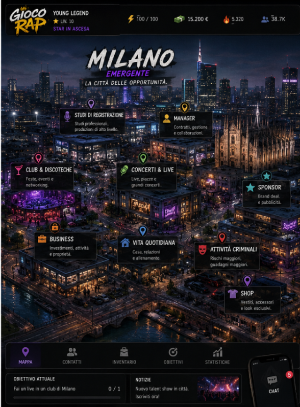
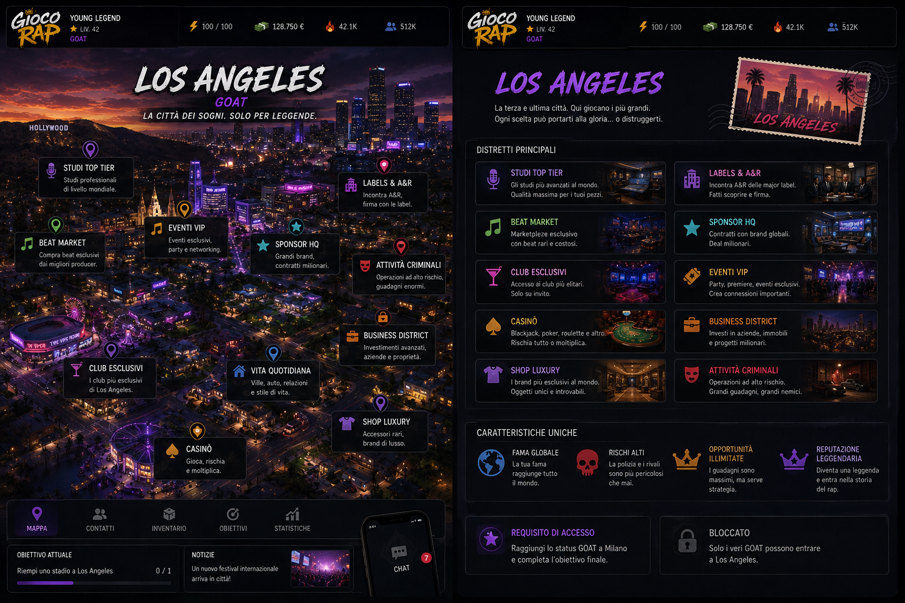

# Anni di Fame

Gioco di carriera rap in HTML, CSS e JavaScript. Nessuna dipendenza, nessun passaggio di build.

## Come si avvia

Serve un piccolo server locale, perché la pagina carica CSS e JS come file separati:

```bash
python -m http.server 8000
# oppure
npx serve .
```

Poi apri <http://localhost:8000>.

Gli script sono classici, non moduli ES, quindi non c'è il blocco CORS che i moduli
hanno su `file://`: il doppio clic su `index.html` dovrebbe funzionare comunque.
Il server locale resta la via consigliata (è quella verificata).

## Dove sta andando: l'hub è una mappa

**L'hub del gioco è una plancia con la mappa al centro** (punto 26 di
`implementazioni.md`, dettagli in `ROADMAP.md`). Non sblocchi funzioni sparse in un menu,
sblocchi un mondo più grande. La prima città c'è già: «Inizia la carriera» apre la plancia
— profilo a sinistra, città al centro, telefono a destra, eventi di oggi in basso — i
luoghi aprono la partita sulla sezione giusta e dalla partita si torna indietro col tasto
«Mappa».

Tre città, in quest'ordine:

| | città | come ci arrivi | cosa ci trovi |
| --- | --- | --- | --- |
|  | **Città di provincia** — il nome lo scrive il giocatore _(fatta)_ | si parte da qui | studio, beat maker, vita quotidiana, attività criminali |
|  | **Milano** | livello ≥ 10, fama ≥ 50, hype ≥ 40 | studi di registrazione, manager, club, concerti, sponsor, business, shop, criminalità grossa |
|  | **Los Angeles** | livello ≥ 30, fama ≥ 90, hype ≥ 85, reputazione ≥ 80 | studi top tier, label & A&R, eventi VIP, sponsor HQ, casinò, shop luxury, business district |

La schermata resta sempre la stessa — cambia il mondo in mezzo, non l'interfaccia:
testata con logo, nome, livello e le quattro risorse (energia, soldi, hype, seguito);
al centro la mappa con i punti cliccabili e quelli ancora chiusi che dicono cosa serve
per aprirli; in basso le linguette (Mappa, Contatti, Inventario, Obiettivi, Statistiche),
la riga dell'obiettivo attuale, le notizie della città e il telefono con la chat.

Due regole che vengono da lì e toccano tutto il resto:

- **Niente studio personale.** Per registrare devi andare negli studi degli altri, e ogni
  studio ha una qualità che entra nel calcolo del pezzo (provincia ~40, Milano ~75,
  leggendario ~95 su 100).
- **I contatti sono una risorsa.** Producer, rapper, fonici, manager, organizzatori, brand,
  gente di strada: ognuno ha un grado (conoscenza → contatto → amico → collaboratore →
  fidato → partner) e i migliori chiedono fama, hype e conoscenze in comune. Farmare la
  rete è gameplay, non un menu.

Le tre immagini stanno in `media/photo/` e sono il riferimento visivo del Main Hub. La
provincia è costruita (`js/game/hub.js` + `css/hub.css`); Milano e Los Angeles per adesso
sono ancora solo concept art.

**La mappa è la foto stessa.** `media/photo/mappa_citta.jpg` è il concept
(`schermata_di_gioco.png`) ritagliato sul riquadro della città, 830×677: spilli, targhette
e tasti «Entra» sono dentro all'immagine, e sopra ci stanno solo nove rettangoli
invisibili — le zone da toccare, in percentuale, così restano incollate ai cartelli.

Tutto il resto è vivo e legge la partita. La plancia è disegnata alla misura del concept
(1536×1024) e rimpicciolita tutta insieme per stare nello schermo: le proporzioni restano
quelle della foto ovunque. Dentro ci sono la fascia in alto (energia, soldi, hype, fama,
network, benessere, settimana, ora), il profilo a sinistra con le sue quattro linguette
(profilo, abilità, vestiti, disciplina), gli eventi di oggi — che fanno partire le azioni
vere della settimana — e il telefono a destra con messaggi, otto app e le notizie.

## Struttura

```
index.html            solo il markup + i collegamenti a CSS e JS
css/                  i fogli di stile, nell'ordine in cui vanno caricati
js/core.js            $ e pick, usati da tutto il resto
js/impostazioni.js    impostazioni e slot, caricato subito dopo core
js/lingua.js          vocabolario e traduttore dell'interfaccia
js/creator/           creazione dell'artista
js/game/              la partita
media/photo/          concept art delle città e avatar di riferimento
strumenti/            build-artifact.py: rifà il gioco in un file solo
dist/                 anni-di-fame.html, il file unico per l'artifact
```

### CSS — l'ordine dei `<link>` in `index.html` conta

| file | contenuto |
| --- | --- |
| `base.css` | variabili, reset, tipografia, fondale |
| `preview.css` | anteprima dell'artista (palco, ritratto, targhetta) |
| `shell.css` | schermate, barra in alto, menu principale |
| `game.css` | schermata di gioco: statistiche, azioni, liste, fase |
| `overlays.css` | piazza, foglio di scrittura, diario, modale |
| `effects.css` | notifiche, rapporto settimanale, lampo, animazioni |
| `hud.css` | testata artista, risorse, navigazione, lifestyle |
| `forms.css` | pannelli e campi del creatore |
| `creator.css` | sezione avatar: galleria degli otto, categorie, fondali |
| `actionbar.css` | barra fissa in basso e bottoni |
| `posto.css` | La Sala: la scena del posto e le schede della gente |
| `hub.css` | la plancia: testata, profilo, mappa, eventi, telefono |
| `impostazioni.css` | pannello impostazioni, temi, densità |

### JS — anche qui l'ordine dei `<script>` conta

I file sono script classici che condividono lo scope globale: ognuno dà per scontato
che quelli caricati prima abbiano già dichiarato le loro funzioni e costanti.

**Prima di tutto**

| file | contenuto |
| --- | --- |
| `js/core.js` | `$` e `pick` |
| `js/impostazioni.js` | stato `SET`, slot partita (`slotKey`), preset di difficoltà |
| `js/lingua.js` | italiano/inglese dell'interfaccia |

**Creatore** (`js/creator/`)

| file | contenuto |
| --- | --- |
| `data.js` | scene, generi, vestiti, colori, tratti del viso |
| `state.js` | stato `A`, default, salvataggio (`ART_KEY`) |
| `portrait.js` | ritratto parametrico 3/4 in SVG e silhouette |
| `avatar-presets.js` | gli otto avatar pronti e i fondali |
| `options.js` | barra delle categorie: ogni opzione è il tuo volto ritagliato |
| `render.js` | `renderArtista()` |
| `events.js` | campi, slider, chip, salvataggio, casuale |
| `nav.js` | navigazione, menu principale, `window.ARTIST_BODY` |

**Partita** (`js/game/`)

| file | contenuto |
| --- | --- |
| `state.js` | stato `G`, valori iniziali, `save()` (`SAVE_KEY` + slot) |
| `content.js` | titoli generati, attrezzatura, contratti, traguardi |
| `beats.js` | i generi dei beat: suono, nome, prezzo |
| `covers.js` | copertine generate da un seed |
| `rivals.js` | rivali: generazione, volto, crescita |
| `actions.js` | azioni della settimana e lavoretti |
| `events.js` | eventi casuali |
| `phases.js` | fasi della carriera e prove di passaggio |
| `sim.js` | chiusura settimana, stream, spese, classifica |
| `writer.js` | il foglio: rime, metrica, punteggio |
| `versi.js` | generatore di barre per completare una strofa |
| `piazza.js` | freestyle in piazza |
| `copertine.js` | copertina caricata dall'utente e titolo del pezzo |
| `modal.js` | finestra modale degli eventi |
| `scene-art.js` | illustrazioni SVG delle azioni |
| `beatplay.js` | ascolto dei beat: bpm, cassa, scala dal seme |
| `ui.js` | `renderGioco()`: HUD, pannelli, liste, comandi |
| `lifestyle.js` | spese fisse e livelli di lifestyle |
| `fx.js` | suono, notifiche, rapporto, avvio (`window.GAME`) |
| `skip.js` | salta un giorno, una settimana, un mese |
| `uscita.js` | uscire da un'azione (✕, ESC, clic fuori) rimettendo a posto il conto |
| `posto.js` | La Sala: la gente del giro, i rapporti che ci costruisci |
| `hub.js` | la plancia: testata, profilo, mappa, eventi di oggi, telefono |

**Per ultimo**

| file | contenuto |
| --- | --- |
| `js/impostazioni-ui.js` | il pannello delle impostazioni (tocca audio, stato e interfaccia) |

### Il ponte fra i due

Creatore e partita si parlano tramite poche cose su `window`:
`ARTIST`, `ARTIST_PORTRAIT`, `ARTIST_BODY`, `GO`, `GAME`, `__POSE`, `__MOOD`.

## Salvataggi

Tutto in `localStorage`, sul dispositivo di chi gioca:

- `anni-di-fame-artista` — l'aspetto e l'identità dell'artista
- `anni-di-fame-partita-v2` — la partita in corso
- `adf-impostazioni-v1` — impostazioni, lingua, slot scelto

Gli slot sono tre (impostazioni → Partite). Lo slot 1 usa le chiavi storiche qui sopra,
gli altri aggiungono il suffisso `-s2` / `-s3`: chi giocava prima ritrova la sua carriera
dov'era. Da lì si esporta e si importa una carriera come codice.

## Un file solo, per l'artifact

```bash
python3 strumenti/build-artifact.py
```

Rimette dentro `index.html` tutti i CSS e i JS nell'ordine in cui compaiono e scrive
`dist/anni-di-fame.html`, senza doctype/head/body: lo scheletro lo mette l'artifact.
Anche le immagini richiamate dai CSS finiscono dentro, come data URI: nell'artifact non
c'è nessuna cartella `media/` da cui pescarle.
