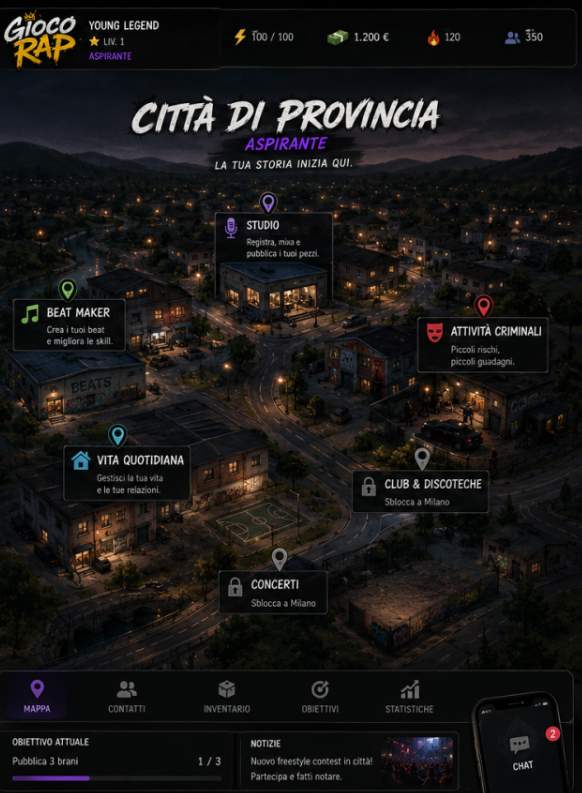

# Anni di Fame

Gioco di carriera rap, in uscita su **Steam** e sugli **store del telefono**.
Il progetto è diviso in due metà che non si mescolano:

| dove | cos'è | come si avvia |
| --- | --- | --- |
| [`frontend/`](frontend/README.md) | il gioco: HTML, CSS, JavaScript, dentro a un guscio nativo per gli store | `npm run dev` |
| [`backend/`](backend/README.md) | il server: classifica, account, salvataggi in cloud. Node + SQLite, nessuna dipendenza | `npm start` |
| [`backend/database/`](backend/database/README.md) | i dati: 18 tabelle, migrazioni, travaso (schema completo in `schema.md`) | — |

**Il gioco funziona da solo.** Il backend serve alla classifica multiplayer: se non è
acceso, la partita gira come ha sempre girato, con la classifica in locale.

```bash
# il gioco (la prima volta: npm install)
cd frontend && npm run dev                     # → http://localhost:8000, si ricarica da solo

# la classifica online, in un altro terminale (facoltativa)
cd backend && npm start                        # → http://localhost:8787
```

## Dove esce il gioco

**Steam** (Windows, macOS, Linux, Steam Deck) e gli **store del telefono** (App Store e
Google Play). Non è un gioco da browser: è un prodotto che si scarica, si installa e si
paga. Il codice resta HTML, CSS e JavaScript — è la tecnologia giusta per un gestionale a
schermate, e su Steam mezzo genere è fatto così — ma ci va intorno un guscio:
**Electron** per il desktop, **Capacitor** per il telefono.

Da qui discendono **cinque lavori** che prima non servivano. Sono i punti 33-37 di
`implementazioni.md`, e questo è dove siamo:

| | lavoro | stato |
| --- | --- | --- |
| 33 | **Il build**: bundle minificato con l'impronta nel nome, server di sviluppo con ricarica, controlli automatici | **fatto** (31/08/2026) |
| 34 | **I salvataggi**: file vero sul dispositivo + Steam Cloud + cloud nostro, al posto del `localStorage` | metà: **il cloud c'è** (01/09/2026) |
| 35 | **Gli account**: da ospite o con la mail, sessioni, cancellazione dell'account | **fatto** (01/09/2026) — Steam, Apple e Google quando c'è il guscio nativo |
| 36 | **L'interfaccia sul telefono**: verticale, a tocchi — il lavoro più lungo | da fare |
| 37 | **Il database vero**: SQLite adesso, PostgreSQL il giorno dell'uscita | **fatto** (01/09/2026) |

Più l'impacchettamento vero e proprio (Electron per Steam, Capacitor per il telefono) e i
requisiti degli store: informativa sulla privacy, classificazione per età, cancellazione
dell'account dentro al gioco. Il dettaglio di ognuno sta in
[`frontend/README.md`](frontend/README.md) e in [`backend/README.md`](backend/README.md).

Intanto il gioco si impacchetta già:

```bash
cd frontend
npm run build     # → dist/: la cartella che Electron e Capacitor sanno aprire
npm run demo      # → dist/anni-di-fame.html: il gioco in un file solo, da far provare
```

Il file unico non è il modo in cui il gioco esce: è lo strumento per una demo o un playtest
— si manda il file e la gente gioca, senza installare niente.

I documenti di progetto stanno qui in radice: `ROADMAP.md` (il disegno d'insieme),
`implementazioni.md` (i punti da fare, spuntati uno a uno),
`stili interfaccia schermata di gioco.md` (il riferimento visivo).

## Dove sta andando: l'hub è una mappa

**L'hub del gioco è una plancia con la mappa al centro** (punto 26 di
`implementazioni.md`, dettagli in `ROADMAP.md`). Non sblocchi funzioni sparse in un menu,
sblocchi un mondo più grande. La prima città c'è già: «Inizia la carriera» apre la plancia
— profilo a sinistra, città al centro, telefono a destra, eventi di oggi in basso — i
luoghi aprono la partita sulla sezione giusta e dalla partita si torna indietro col tasto
«Mappa».

Tre città, in quest'ordine:

| | città | come ci arrivi | cosa ci trovi |
| --- | --- | --- | --- |
|  | **Città di provincia** — il nome lo scrive il giocatore _(fatta)_ | si parte da qui | studio, beat maker, vita quotidiana, attività criminali |
|  | **Milano** | livello ≥ 10, fama ≥ 50, hype ≥ 40 | studi di registrazione, manager, club, concerti, sponsor, business, shop, criminalità grossa |
|  | **Los Angeles** | livello ≥ 30, fama ≥ 90, hype ≥ 85, reputazione ≥ 80 | studi top tier, label & A&R, eventi VIP, sponsor HQ, casinò, shop luxury, business district |

La schermata resta sempre la stessa — cambia il mondo in mezzo, non l'interfaccia:
testata con logo, nome, livello e le quattro risorse (energia, soldi, hype, seguito);
al centro la mappa con i punti cliccabili e quelli ancora chiusi; in basso le linguette
(Mappa, Contatti, Inventario, Obiettivi, Statistiche), la riga dell'obiettivo attuale, le
notizie della città e il telefono con la chat.

Due regole che vengono da lì e toccano tutto il resto:

- **Niente studio personale.** Per registrare devi andare negli studi degli altri, e ogni
  studio ha una qualità che entra nel calcolo del pezzo (provincia ~40, Milano ~75,
  leggendario ~95 su 100).
- **I contatti sono una risorsa.** Producer, rapper, fonici, manager, organizzatori, brand,
  gente di strada: ognuno ha un grado (conoscenza → contatto → amico → collaboratore →
  fidato → partner) e i migliori chiedono fama, hype e conoscenze in comune. Farmare la
  rete è gameplay, non un menu.

La provincia è costruita (`frontend/js/game/hub.js` + `frontend/css/hub.css`); **la mappa è
la foto stessa** (`frontend/media/photo/mappa_citta.jpg`, il concept ritagliato a 830×677:
spilli e targhette sono dentro all'immagine, sopra ci stanno solo le zone da toccare).
Milano e Los Angeles per adesso sono ancora solo concept art.

## Multiplayer: la classifica è una sola

**Punto 30 di `implementazioni.md`.** La classifica non è più una faccenda privata fra te
e i rivali generati sul tuo computer: ce n'è una sola, uguale per tutti, e ci stanno dentro
i giocatori veri. Finché i giocatori veri sono pochi il numero lo fanno i bot — e i bot
**non si riconoscono**: nomi da rapper veri (`Nino Vento`, `Marco T.`, `Young Ferro`), una
città, un genere, una storia, uscite che escono e contratti che firmano. Il server non dice
mai a nessuno chi è un bot: è una regola di gioco, non una dimenticanza.

La classifica si muove anche quando nessuno gioca: ogni 24 ore vere il server fa un giro di
settimana, e chi sparisce scende. Dal 01/09/2026 il server tiene anche **gli account** (da
ospite o con la mail, con la cancellazione che gli store pretendono) e **i salvataggi in
cloud**, che è quello che porta una carriera dal PC al telefono. Rotte, manopole e freni
contro l'imbroglio stanno in [`backend/README.md`](backend/README.md); i dati in
[`backend/database/README.md`](backend/database/README.md).

**La schermata classifica non è ancora agganciata**: il ponte c'è
(`frontend/js/net/online.js`), la lista in schermo disegna ancora i rivali locali. È il
prossimo pezzo, l'ordine di lavoro sta in `ROADMAP.md`.

## Team

Alessio (La Fame Studio), Claude, Carletto.
