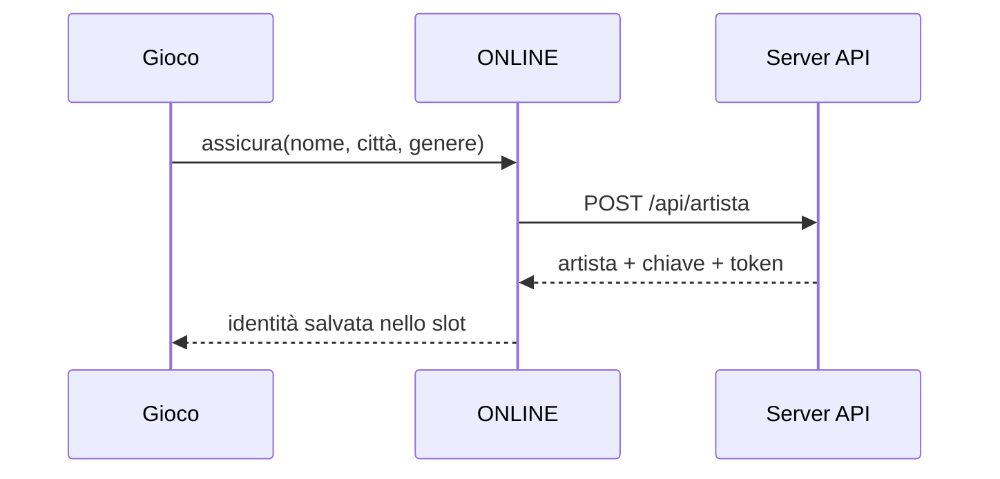

# Anni di Fame — API routes e chiamate frontend

Documentazione operativa dell'API HTTP di **Anni di Fame** e del bridge frontend
`ONLINE`.

> Verificata sulla repo `Carlomadella/gioco-rap`, branch `main`, commit
> `6f3f668` del 21 settembre 2026 (l'agente `backend-allineato`: rotte, risposte e
> migrazioni combaciano; la prima stesura era sul commit `024bf79` del 2 settembre).
>
> Fonti principali: `backend/server.js`, `backend/database/archivio.js`,
> `frontend/js/net/online.js` e `backend/postman/genera.js`.

## Indice

- [Avvio rapido](#avvio-rapido)
- [Regole comuni](#regole-comuni)
- [Autenticazione e permessi](#autenticazione-e-permessi)
- [Formato degli errori](#formato-degli-errori)
- [Modelli restituiti più spesso](#modelli-restituiti-più-spesso)
- [Indice completo delle 34 route](#indice-completo-delle-34-route)
- [Dettaglio delle route](#dettaglio-delle-route)
- [Bridge frontend `ONLINE`](#bridge-frontend-online)
- [Chiamate realmente collegate all'interfaccia](#chiamate-realmente-collegate-allinterfaccia)
- [Flussi completi](#flussi-completi)
- [Test con Postman](#test-con-postman)
- [Variabili d'ambiente](#variabili-dambiente)
- [Note e limiti attuali](#note-e-limiti-attuali)

## Avvio rapido

Richiede **Node.js 22.12 o successivo**.

```bash
cd backend
npm install
npm start
```

Base URL locale:

```text
http://localhost:8787
```

Controllo veloce:

```bash
curl http://localhost:8787/api/stato
```

Il server risponde esclusivamente in JSON. La radice `/` non serve pagine e risponde
`404 rotta-sconosciuta`.

## Regole comuni

### Header

| Header | Quando serve | Esempio |
| --- | --- | --- |
| `content-type: application/json` | richieste con body JSON | `content-type: application/json` |
| `x-sessione` | route dell'account e azioni sul proprio artista | `x-sessione: <token>` |
| `x-chiave` | compatibilità con i vecchi client, per azioni sul proprio artista | `x-chiave: <chiave-artista>` |
| `x-admin` | otto route di servizio | `x-admin: <ADF_ADMIN>` |

### Limiti globali

- 120 richieste al minuto per indirizzo IP; oltre il limite: `429 troppe-richieste`.
- Il parser HTTP accetta al massimo circa 3 MB di body.
- Lo stato di una carriera può pesare al massimo 2 MiB.
- Le risposte hanno `cache-control: no-store`.
- Una richiesta `OPTIONS` risponde `204` e consente `GET`, `POST`, `PUT`, `DELETE`,
  `OPTIONS` e gli header `content-type`, `x-chiave`, `x-sessione`, `x-admin`.
- Prima di gestire ogni route il server recupera, al massimo, 12 settimane rimaste
  arretrate.

### CORS

In sviluppo `ADF_ORIGINI` vale `*`. In produzione va impostato con le origini ammesse,
separate da virgola:

```env
ADF_ORIGINI=https://gioco.example.it,https://admin.example.it
```

## Autenticazione e permessi

| Livello | Significato |
| --- | --- |
| **Pubblica** | nessun header obbligatorio |
| **Sessione facoltativa** | funziona senza login, ma con `x-sessione` personalizza il risultato |
| **Artista proprio** | accetta una sessione proprietaria oppure la vecchia `x-chiave` |
| **Sessione** | richiede un token valido in `x-sessione` |
| **Admin** | richiede `x-admin` uguale a `ADF_ADMIN`; se `ADF_ADMIN` è vuota resta chiusa |

Il token di sessione viene restituito alla creazione o all'accesso e deve essere
conservato dal client. Nel database resta soltanto il suo hash.

## Formato degli errori

Ogni errore usa almeno questa forma:

```json
{
  "errore": "nome-errore"
}
```

Alcuni errori aggiungono `nota`, `motivo`, `salvata` o altri dettagli utili.

Un corpo che **non ha la forma giusta** (dal 16/09/2026, `backend/forme.js`: un campo che
manca, del tipo sbagliato, un valore fuori dall'elenco) è un `400` con la lista dei campi:

```json
{
  "errore": "dati-non-validi",
  "campi": [{ "campo": "id", "problema": "Input non valido: atteso string, ricevuto undefined" }]
}
```

Dove un nome esiste da prima — `email-non-valida`, `segreto-troppo-corto`,
`stato-mancante`, `serve-la-conferma`, `azione-sconosciuta` — `errore` resta quello, e
`campi` c'è dove è la forma a dirlo. Due nomi sono nuovi dal 16/09/2026:
`biglietto-mancante` (Steam, Apple o Google senza `biglietto`, prima era `403
biglietto-rifiutato`) e `artista-mancante` (sessione `legacy` senza `artistaId`, prima
era `403 chiave-sbagliata`). Un id che manca è un `400`, non più il `403 non-e-tuo` di
prima. `nome-non-valido` lo decide il server dopo la pulizia del nome, senza `campi`. Un
campo in più non è mai un errore.

| Stato | Significato tipico |
| --- | --- |
| `400` | JSON, URL o dati non validi |
| `403` | sessione scaduta, risorsa non propria, account sospeso o accesso admin negato |
| `404` | artista, slot, traguardo o route inesistente |
| `409` | conflitto: nome/email già usati, salvataggio cloud più avanti, traguardo server-side |
| `413` | carriera oltre 2 MiB |
| `429` | troppe richieste o punteggio inviato troppo presto |
| `500` | errore interno del server |
| `501` | accesso Steam, Apple o Google non ancora configurato |
| `503` | server fermo per manutenzione (`ADF_MANUTENZIONE=1`) |

Errori generali possibili:

```text
url-non-valido
json non valido
corpo troppo grande
troppe-richieste
rotta-sconosciuta
errore-del-server
```

### Lo stesso errore, due vestiti

Chi chiama dichiarando `Accept: application/json` — cioè il gioco, `curl`,
Postman — riceve **sempre** il JSON qui sopra: codice HTTP e campo `errore` non
cambiano mai, ed è il contratto su cui il client si regge.

Chi chiama con `Accept: text/html` — cioè una persona che ha aperto l'indirizzo
del server con il browser, e capita ogni volta che qualcuno controlla se è
acceso — riceve **la stessa risposta vestita da pagina**: stesso codice, testo
leggibile, nessun file esterno da caricare. Le pagine le scrive
`backend/risposte.js` per 400, 404, 429, 500 e 503; non sono file `.html` sul
disco apposta, perché una pagina che deve dire «il server ha un problema» non
può dipendere da un file che il server dovrebbe andare a leggere proprio in
quel momento.

Se `Accept` contiene tutti e due, vince JSON: chi lo nomina lo sta chiedendo.

### Manutenzione

Con `ADF_MANUTENZIONE=1` il server risponde `503 in-manutenzione` a tutto —
senza nemmeno toccare il database — tranne che a `/api/stato`, che resta acceso
perché è quello che dice se il server è vivo. La risposta porta
`Retry-After: 600`; con `ADF_MANUTENZIONE_FINO` si aggiunge quando si torna,
scritto a parole (`"verso le 22"`), che finisce sia nel JSON sia nella pagina.

La manopola si legge a ogni richiesta e non all'avvio: si accende e si spegne
senza riavviare niente.

**La partita non si ferma.** Il gioco si salva nel dispositivo: con il server
in manutenzione restano fermi classifica, account e salvataggio in cloud, e il
resto si gioca come sempre.

### Il giro di una richiesta

Gli strati, in ordine (`backend/risposte.js`, montati in `server.js`):

| # | Strato | Cosa fa |
| --- | --- | --- |
| 1 | `cors` | intestazioni CORS su ogni risposta, e il preflight `OPTIONS` finisce qui |
| 2 | `manutenzione` | se acceso, `503` a tutto tranne al battito |
| 3 | `freno` | `429` a chi bussa più di `ADF_BUSSATE` volte al minuto |
| 4 | `indirizzoValido` | l'URL si legge o è `400`; quello buono resta in `ctx.url` |
| 5 | settimana | fa avanzare la settimana di gioco se è ora |
| 6 | rotte | l'instradamento vero |

Se nessuno strato risponde, la catena chiude con `404 rotta-sconosciuta`. Se
uno strato scoppia, la catena risponde `500 errore-del-server` e lo stack
finisce nei log, mai nella risposta — tranne quando l'errore è di chi chiama
(JSON storto, corpo illeggibile), che è un `400` con il messaggio dentro.

## Modelli restituiti più spesso

### Artista pubblico

```json
{
  "id": "uuid",
  "pos": 42,
  "nome": "Young Legend",
  "citta": "Rovereto",
  "genere": "trap",
  "stream": 12000,
  "delta": 3,
  "uscite": 4,
  "deal": false,
  "ultima": "Il primo pezzo",
  "seed": 12345,
  "storia": "Comincia da zero.",
  "livello": 5,
  "fase": 2,
  "live": 12,
  "feat": 3,
  "difficolta": "anni-di-fame",
  "io": false
}
```

`delta` è positivo quando l'artista è salito, negativo quando è sceso e `null` se non
esiste ancora una fotografia precedente. Le risposte pubbliche non espongono mai `bot`,
`account_id`, `chiave_hash` o altri dati privati.

`live` e `feat` sono il **diario di bordo** del gioco (le serate fatte e i feat di
carriera, punto 14 di ALE): totali che crescono e non scendono mai, e che non entrano
nell'ordinamento della classifica. `livello`, `fase`, `live` e `feat` **ci sono per tutti,
sempre**: per i giocatori arrivano dal gioco, per i bot li calcola il server dai loro
numeri. Non è un dettaglio di comodo — è la regola del punto 30: se i bot uscissero coi
valori di partenza (livello 1, fase 0), chiunque legga questa risposta saprebbe dire in
un colpo d'occhio chi è finto.

### Account

```json
{
  "id": "uuid",
  "email": "nome@example.it",
  "stato": "attivo",
  "lingua": "it",
  "creato": 1788340000000,
  "visto": 1788340000000
}
```

### Riassunto di una carriera cloud

```json
{
  "slot": 1,
  "artistaId": "uuid",
  "settimana": 12,
  "anno": 1,
  "versioneGioco": "1.0.0",
  "byte": 15420,
  "aggiornato": 1788340000000
}
```

## Indice completo delle 34 route

### Mondo, feed e relazioni

| # | Metodo e route | Accesso | Funzione |
| ---: | --- | --- | --- |
| 1 | `GET /api/stato` | Pubblica | stato e salute del server |
| 2 | `GET /api/feed` | Sessione facoltativa | feed LaFamegram globale o personalizzato |
| 3 | `GET /api/opps` | Sessione facoltativa | artisti sopra di te e relazioni dichiarate |
| 4 | `POST /api/relazione` | Artista proprio | crea o rimuove una relazione |
| 5 | `GET /api/notizie` | Pubblica | ultime notizie del mondo |

### Account e sessioni

| # | Metodo e route | Accesso | Funzione |
| ---: | --- | --- | --- |
| 6 | `POST /api/account` | Pubblica | crea un account e apre una sessione |
| 7 | `POST /api/sessione` | Pubblica | accede a un account esistente |
| 8 | `DELETE /api/sessione` | Sessione | revoca la sessione corrente |
| 9 | `GET /api/io` | Sessione | restituisce tutto ciò che appartiene all'account |
| 10 | `DELETE /api/account` | Sessione | cancella account e dati personali |

### Artista e punteggio

| # | Metodo e route | Accesso | Funzione |
| ---: | --- | --- | --- |
| 11 | `POST /api/artista` | Sessione facoltativa | iscrive un artista |
| 12 | `GET /api/artista/:id` | Pubblica | scheda pubblica di un artista |
| 13 | `PUT /api/artista/:id` | Artista proprio | aggiorna nome, città e genere |
| 14 | `POST /api/punteggio` | Artista proprio | invia il risultato della settimana |

### Classifiche e stagioni

| # | Metodo e route | Accesso | Funzione |
| ---: | --- | --- | --- |
| 15 | `GET /api/classifica` | Pubblica | legge una fetta della classifica |
| 16 | `GET /api/classifiche` | Pubblica | elenca città e generi attualmente presenti |
| 17 | `GET /api/stagioni` | Pubblica | stagione corrente e storico |
| 18 | `GET /api/albo` | Pubblica | albo d'oro delle stagioni chiuse |
| 19 | `GET /api/classifica/intorno/:id` | Pubblica | righe sopra e sotto un artista |

### Carriere cloud

| # | Metodo e route | Accesso | Funzione |
| ---: | --- | --- | --- |
| 20 | `GET /api/carriere` | Sessione | riassunti dei tre slot |
| 21 | `GET /api/carriera/:slot` | Sessione | stato completo di uno slot |
| 22 | `PUT /api/carriera/:slot` | Sessione | crea o aggiorna uno slot |

### Traguardi e segnalazioni

| # | Metodo e route | Accesso | Funzione |
| ---: | --- | --- | --- |
| 23 | `GET /api/traguardi` | Pubblica | catalogo dei traguardi |
| 24 | `GET /api/traguardi/:artistaId` | Pubblica | traguardi ottenuti da un artista |
| 25 | `POST /api/traguardo` | Artista proprio | assegna un traguardo verificabile solo dal gioco |
| 26 | `POST /api/segnalazione` | Sessione | segnala un artista reale |

### Route di servizio

| # | Metodo e route | Accesso | Funzione |
| ---: | --- | --- | --- |
| 27 | `POST /api/giro` | Admin | forza un giro settimanale |
| 28 | `POST /api/stagione/chiudi` | Admin | chiude la stagione e apre la successiva |
| 29 | `GET /api/sospetti` | Admin | lista dei punteggi sospetti |
| 30 | `POST /api/sanzione` | Admin | applica una sanzione |
| 31 | `GET /api/da-guardare` | Admin | coda delle segnalazioni |
| 32 | `POST /api/moderazione` | Admin | rinomina d'ufficio o respinge segnalazioni |
| 33 | `GET /api/da-spingere` | Admin | traguardi da sincronizzare con gli store |
| 34 | `POST /api/spinto` | Admin | marca un traguardo come sincronizzato |

## Dettaglio delle route

### 1. `GET /api/stato`

Query: nessuna. Autenticazione: nessuna.

Risposta `200`:

```json
{
  "ok": true,
  "settimanaOre": 24,
  "accessi": { "steam": false, "apple": false, "google": false },
  "settimana": 3,
  "artisti": 141,
  "giocatori": 1,
  "account": 1,
  "carriere": 1,
  "prossimoGiro": 1788426400000,
  "stagione": { "id": 1, "nome": "Prima stagione" }
}
```

### 2. `GET /api/feed`

| Query | Limite | Default | Note |
| --- | ---: | ---: | --- |
| `quanti` | 1–60 | 20 | numero massimo di post |
| `io` | UUID | — | artista da usare senza sessione |

Se esiste una sessione valida, il server usa il primo artista attivo dell'account e
ignora di fatto `io`. La risposta è `{ settimana, post }`. Ogni post può contenere
`tipo`, `s`, `t`, `n`, `artistaId`, `citta`, `genere`, `like`, `quando`.

### 3. `GET /api/opps`

Query: `quanti` da 1 a 10, default 3; `io` UUID facoltativo. Una sessione valida ha la
precedenza su `io`.

Risposta `200`:

```json
{
  "io": { "id": "uuid", "pos": 42, "nome": "Young Legend" },
  "sopra": [
    { "id": "uuid", "pos": 41, "nome": "Nino Vento", "distanza": 450 }
  ],
  "dichiarati": []
}
```

Senza un artista valido risponde `404 artista-sconosciuto`.

### 4. `POST /api/relazione`

Accesso: artista proprio tramite `x-sessione` o `x-chiave`.

Creazione:

```json
{
  "artistaId": "uuid-mio",
  "altroId": "uuid-altro",
  "tipo": "rivale",
  "nota": "Se l'è cercata."
}
```

`tipo` può essere `rivale`, `feat`, `amico` o `crew`. `nota` viene ripulita e limitata
a 140 caratteri. Successo: `{ "ok": true, "tipo": "rivale", "con": "Nome" }`.
Se esiste già: `{ "gia": true }`.

Rimozione:

```json
{
  "artistaId": "uuid-mio",
  "altroId": "uuid-altro",
  "tipo": "rimuovi",
  "era": "rivale"
}
```

Errori: `403 non-e-tuo`, `400 relazione-non-valida`; più `400 dati-non-validi` (con `campi`) se manca un campo obbligatorio o ha il tipo sbagliato (`artistaId`).

### 5. `GET /api/notizie`

Query `quante`: 1–60, default 10. Risposta: `{ settimana, notizie }`.

```json
{
  "settimana": 3,
  "notizie": [
    {
      "t": 1788340000000,
      "s": 3,
      "tipo": "uscita",
      "testo": "Nino Vento è uscito con Fuori orario.",
      "artistaId": "uuid"
    }
  ]
}
```

### 6. `POST /api/account`

Tipi ammessi: `ospite`, `email`, `steam`, `apple`, `google`. Un tipo assente vale
`ospite`; uno non riconosciuto è un `400 dati-non-validi` (dal 16/09/2026: prima passava
per `ospite` in silenzio). `steam`, `apple` e `google` senza `biglietto` sono
`400 biglietto-mancante`.

Account email:

```json
{
  "tipo": "email",
  "email": "nome@example.it",
  "segreto": "almeno-8-caratteri",
  "dispositivo": {
    "piattaforma": "windows",
    "nome": "PC principale",
    "versione": "1.0.0"
  }
}
```

Account ospite:

```json
{
  "tipo": "ospite",
  "dispositivo": { "piattaforma": "android" }
}
```

Steam, Apple o Google:

```json
{
  "tipo": "apple",
  "biglietto": "token-firmato-dallo-store",
  "dispositivo": { "piattaforma": "ios" }
}
```

Nuovo account: `201 { account, identita, token }`. Per l'ospite
`identita.idEsterno` è il valore da conservare per accedere di nuovo. Un'identità store
già registrata risponde `200 { account, token }`.

Terzo esito, con `tipo: "email"`: se la richiesta porta una `x-sessione` valida di un
account **senza mail** (l'ospite creato dal gioco), il server **promuove quell'account**
invece di crearne un secondo — gli collega l'identità email e risponde
`200 { account, token }` con il token invariato. Artista, classifica e cloud restano
sotto la stessa identità (dal 12/09/2026, commit `cb502a7`).

Errori principali: `400 email-non-valida`, `400 segreto-troppo-corto`,
`400 biglietto-mancante`, `409 email-gia-usata`, `403 biglietto-rifiutato`,
`501 accesso-non-ancora-collegato`; più `400 dati-non-validi` (con `campi`) se manca un campo obbligatorio o ha il tipo sbagliato.

### 7. `POST /api/sessione`

Email:

```json
{
  "tipo": "email",
  "email": "nome@example.it",
  "segreto": "password",
  "dispositivo": { "piattaforma": "windows" }
}
```

Ospite:

```json
{
  "tipo": "ospite",
  "idEsterno": "uuid-ospite",
  "dispositivo": { "piattaforma": "android" }
}
```

Migrazione del vecchio accesso:

```json
{
  "tipo": "legacy",
  "artistaId": "uuid-artista",
  "chiave": "chiave-restituita-alla-creazione",
  "dispositivo": { "piattaforma": "web" }
}
```

Per `steam`, `apple` o `google` si inviano `tipo`, `biglietto` e `dispositivo`.
Successo: `200 { account, token }`.

Errori: `403 non-torna`, `403 chiave-sbagliata`, `400 artista-mancante` (legacy senza
`artistaId`), `400 biglietto-mancante`, `409 artista-senza-account`,
`404 account-sconosciuto`, errori `403/501` dei provider; più `400 dati-non-validi` (con `campi`) se manca un campo obbligatorio o ha il tipo sbagliato.

### 8. `DELETE /api/sessione`

Richiede `x-sessione`. Revoca soltanto il dispositivo corrente.

Risposta: `200 { "ok": true }`. Token assente, scaduto o già revocato:
`403 sessione-scaduta`.

### 9. `GET /api/io`

Richiede `x-sessione`. Risposta:

```json
{
  "account": {},
  "dispositivo": {},
  "artisti": [],
  "carriere": [],
  "traguardi": []
}
```

I traguardi restituiti sono quelli del primo artista attivo dell'account.
Errore: `403 sessione-scaduta`.

### 10. `DELETE /api/account`

Richiede `x-sessione` e una conferma esplicita:

```json
{ "conferma": "cancella" }
```

Risposta: `200 { "ok": true, "artistiRitirati": 1 }`.

L'operazione elimina identità, dispositivi e carriere; rende anonimi e ritira gli
artisti, preservando lo storico necessario alla classifica. Senza conferma:
`400 serve-la-conferma`.

### 11. `POST /api/artista`

La sessione è facoltativa. Senza sessione il server crea automaticamente un account
ospite e restituisce anche un token.

```json
{
  "nome": "Young Legend",
  "citta": "Rovereto",
  "genere": "trap",
  "storia": "Comincia da zero.",
  "seed": 12345,
  "difficolta": "anni-di-fame",
  "dispositivo": { "piattaforma": "windows", "nome": "Questo PC" }
}
```

Regole:

- `nome`: obbligatorio, da 2 a 22 caratteri dopo la pulizia, univoco e moderato;
- `citta`: fino a 22 caratteri; se assente viene scelta dal catalogo del server;
- `genere`: `trap`, `drill`, `hip hop`, `r&b`, `boom bap`, `urban pop`; se non valido
  viene scelto casualmente;
- `storia`: fino a 120 caratteri; se assente viene generata;
- `seed`: intero tra 0 e 2.000.000.000;
- `difficolta`: `strada-aperta`, `anni-di-fame` o `niente-sconti`; qualunque altro
  valore, o nessuno, vale `anni-di-fame`. La scrive l'iscrizione e la **riscrive ogni
  `POST /api/punteggio`** (una carriera si può ricominciare in un altro modo dentro allo
  stesso slot); se un invio non la manda resta quella che c'era. La legge
  `GET /api/artista/:id`;
- massimo tre artisti attivi per account.

Risposta `201`: modello pubblico dell'artista più `chiave` e, se è stato creato un
account ospite, `token`. La `chiave` viene mostrata soltanto in questa risposta.

Errori: `400 nome-non-valido`, errori del filtro come `nome-riservato`,
`409 nome-occupato`, `409 troppi-artisti`.

### 12. `GET /api/artista/:id`

Pubblica. `:id` deve essere un UUID minuscolo nel formato previsto dalla route.
Risposta: modello pubblico dell'artista. Errore: `404 artista-sconosciuto`.

### 13. `PUT /api/artista/:id`

Accesso: artista proprio tramite `x-sessione` o `x-chiave`.

```json
{
  "nome": "Nuovo Nome",
  "citta": "Milano",
  "genere": "drill"
}
```

Nell'implementazione attuale vengono aggiornati soltanto `nome`, `citta` e `genere`.
Un genere non ammesso viene ignorato. Errori: `403 non-e-tuo`, `400 nome-non-valido`,
errori del filtro e `409 nome-occupato`.

### 14. `POST /api/punteggio`

Accesso: artista proprio tramite `x-sessione` o `x-chiave`.

```json
{
  "id": "uuid-artista",
  "stream": 12000,
  "fan": 800,
  "livello": 5,
  "fase": 2,
  "uscite": 3,
  "deal": false,
  "ultima": "Il primo pezzo",
  "seed": 12345,
  "difficolta": "anni-di-fame",
  "live": 12,
  "feat": 3
}
```

Limiti applicati: `stream` massimo 50.000.000 prima del controllo di plausibilità,
`fan` 0–50.000.000, `livello` 1–60, `fase` 0–8, `uscite` 0–5.000, titolo fino a
60 caratteri, `seed` 0–2.000.000.000, `live` e `feat` 0–100.000. `difficolta` è uno
dei tre valori di §11 e **sostituisce** quella scritta accanto all'artista; se manca (client
vecchio) resta quella che c'era. Il modello di plausibilità può abbassare gli stream
richiesti e registrare un sospetto.

**`live` e `feat` sono facoltativi e si comportano diversamente dagli altri campi**: sono
totali di carriera, non numeri della settimana. Se non arrivano — un client vecchio non li
ha — il totale sul server **resta dov'è**, non si azzera. Se arrivano più bassi di quello
che c'è, vince quello che c'è. Se arrivano con un salto assurdo vengono limati al passo di
una settimana (al massimo +7 serate e +5 feat) **in silenzio**: non fanno classifica, non
c'è niente da rubare, e segnare un sospetto per una serata di troppo vorrebbe dire punire
chi ha ripreso un salvataggio vecchio.

Risposta:

```json
{
  "ok": true,
  "pos": 42,
  "delta": 3,
  "fuoriClassifica": false,
  "totale": 141,
  "settimana": 3,
  "limato": false,
  "tetto": 250000,
  "fuori": [],
  "traguardi": ["primo_pezzo", "primi_mille"]
}
```

Errori: `400 dati-non-validi` se manca `id` o un campo ha il tipo sbagliato (con `campi`),
`403 non-e-tuo`, `403 account-sospeso`, `429 troppo-in-fretta`,
`404 artista-sconosciuto`.

### 15. `GET /api/classifica`

| Query | Limite | Default | Note |
| --- | ---: | ---: | --- |
| `da` | 1–100.000 | 1 | posizione iniziale |
| `quanti` | 1–200 | 10 | righe da restituire |
| `io` | UUID | — | marca la propria riga e restituisce `io` |
| `citta` | testo fino a 40 caratteri | — | confronto senza distinzione maiuscole/minuscole |
| `genere` | genere ammesso | — | un valore sconosciuto disattiva il filtro |
| `difficolta` | `strada-aperta`, `anni-di-fame`, `niente-sconti` | — | chi corre con le stesse regole tue; un valore sconosciuto disattiva il filtro |

Risposta: `{ settimana, totale, filtro, prossimoGiro, righe, io }`. Con un filtro la
posizione viene ricalcolata dentro la città, il genere o la difficoltà selezionata. La
graduatoria resta **una sola per tutti**: il filtro è una vista, non tre classifiche.

Esempi:

```text
GET /api/classifica?da=1&quanti=100
GET /api/classifica?citta=Rovereto&quanti=20
GET /api/classifica?genere=trap&quanti=20
GET /api/classifica?io=<uuid>&da=1&quanti=10
```

### 16. `GET /api/classifiche`

Restituisce soltanto città e generi che hanno almeno un artista in classifica:

```json
{
  "citta": [{ "citta": "Milano", "quanti": 18, "meglio": 950000 }],
  "generi": [{ "genere": "trap", "quanti": 45 }]
}
```

### 17. `GET /api/stagioni`

Risposta: `{ corrente, tutte }`. `corrente` è la riga completa della stagione aperta;
`tutte` contiene `id`, `nome`, `inizio`, `fine`, `stato` in ordine decrescente.

### 18. `GET /api/albo`

Query facoltativa `stagione` tra 1 e 9.999. Senza filtro restituisce fino a 200 righe
delle stagioni chiuse. Risposta: `{ albo }`.

### 19. `GET /api/classifica/intorno/:id`

Query `raggio`: 1–25, default 4. Risposta: `{ settimana, totale, righe, io }`.
Errore: `404 artista-sconosciuto`.

### 20. `GET /api/carriere`

Richiede `x-sessione`. Restituisce `{ carriere: [...] }` con i riassunti degli slot
esistenti. Non inserisce righe fittizie per gli slot vuoti.

### 21. `GET /api/carriera/:slot`

Richiede `x-sessione`. `:slot` può essere soltanto `1`, `2` o `3`. Restituisce il
riassunto più `stato`, cioè l'oggetto di gioco salvato. Slot vuoto:
`404 slot-vuoto`; slot diverso da 1–3: `404 rotta-sconosciuta`.

### 22. `PUT /api/carriera/:slot`

Richiede `x-sessione`. Body:

```json
{
  "stato": { "week": 12, "year": 1, "money": 1200 },
  "settimana": 12,
  "anno": 1,
  "artistaId": "uuid",
  "versioneGioco": "1.0.0",
  "forza": false
}
```

`stato` è obbligatorio e deve essere un oggetto. `settimana` e `anno` hanno minimo 1.
Successo: `200 { salvata: <riassunto> }`.

Se il cloud contiene una partita più avanti:

```json
{
  "errore": "carriera-piu-avanti",
  "salvata": {},
  "nota": "in cloud c'è una partita più avanti: manda forza=true per sovrascriverla"
}
```

La risposta è `409`. Soltanto dopo una conferma dell'utente va ripetuta con
`"forza": true`. Altri errori: `400 stato-mancante`, `413 carriera-troppo-grande`,
`403 non-e-tuo` se nel corpo c'è un `artistaId` che non è un artista di questo account
(la carriera in cloud non si può legare all'artista di un altro).

### 23. `GET /api/traguardi`

Restituisce `{ traguardi }`. Ogni elemento contiene `codice`, `nome`, `descrizione`,
`nascosto`.

### 24. `GET /api/traguardi/:artistaId`

Pubblica. Restituisce `{ traguardi }` con `codice`, `nome`, `descrizione`, `ottenuto`,
`spinto`. Un UUID non associato ad alcun artista produce una lista vuota.

### 25. `POST /api/traguardo`

Accesso: artista proprio tramite `x-sessione` o `x-chiave`.

```json
{
  "artistaId": "uuid",
  "codice": "milano"
}
```

Codici che può assegnare il client perché il server non può verificarli da solo:
`dieci_amici`, `un_anno`, `milano`, `los_angeles`.

Codici assegnati automaticamente dal server e quindi non richiedibili dal client:
`primo_pezzo`, `primi_mille`, `in_classifica`, `top_100`, `top_10`, `primo_posto`,
`disco_oro`, `disco_platino`, `primo_contratto`.

Risposta: `{ nuovo: true, codice }` oppure `{ gia: true }`. Errori:
`403 non-e-tuo`, `404 traguardo-sconosciuto`, `409 questo-lo-da-il-server`; più `400 dati-non-validi` (con `campi`) se manca un campo obbligatorio o ha il tipo sbagliato
(`artistaId`, `codice`).

### 26. `POST /api/segnalazione`

Richiede `x-sessione`.

```json
{
  "artistaId": "uuid",
  "motivo": "nome",
  "nota": "Testo facoltativo"
}
```

`motivo`: `nome`, `storia`, `imbroglio` o `altro`. `nota`: massimo 300 caratteri.
Una segnalazione identica dello stesso account non viene duplicata e restituisce
`{ gia: true }`. I bot non possono essere segnalati e producono lo stesso
`404 artista-sconosciuto` usato per un artista inesistente. Senza `artistaId` è un
`400 dati-non-validi` (con `campi`), non più il `404`.

### 27. `POST /api/giro`

Admin. Nessun body obbligatorio. Forza una settimana:

```json
{ "ok": true, "settimana": 4, "notizie": 6 }
```

Non va chiamata contro il server di produzione per fare prove.

### 28. `POST /api/stagione/chiudi`

Admin. Body facoltativo:

```json
{ "quanti": 100 }
```

`quanti`: 1–1.000, default 100. Salva nell'albo le prime posizioni, porta gli stream
di tutti a un quarto, azzera lo slancio dei bot e apre la stagione successiva.

Risposta: `{ chiusa, nuova, inAlbo, primo }`. Errore:
`409 nessuna-stagione-aperta`.

### 29. `GET /api/sospetti`

Admin. Query `quanti`: 1–200, default 50. Risposta: `{ sospetti }`.
Ogni riga include `id`, `artista_id`, `nome`, `account_id`, `tipo`, `dettaglio`,
`peso`, `creato`.

### 30. `POST /api/sanzione`

Admin.

```json
{
  "accountId": "uuid",
  "tipo": "fuori_classifica",
  "motivo": "Numeri non plausibili",
  "giorni": 14
}
```

`tipo`: `avviso`, `fuori_classifica`, `sospensione`. `motivo`: massimo 200 caratteri.
`giorni`: 0–3.650; `0` significa senza scadenza. Risposta:
`{ ok, tipo, motivo, fino }`. Errori: `400 sanzione-non-valida`; più `400 dati-non-validi` (con `campi`) se manca un campo obbligatorio o ha il tipo sbagliato (`accountId`,
`tipo`).

### 31. `GET /api/da-guardare`

Admin. Query `quanti`: 1–100, default 30. Risposta: `{ artisti }` ordinata per numero
di segnalatori distinti e segnalazioni totali.

### 32. `POST /api/moderazione`

Admin. Rinomina d'ufficio:

```json
{ "artistaId": "uuid", "azione": "rinomina" }
```

Risposta: `{ nome, prima }`.

Respinge tutte le segnalazioni aperte:

```json
{ "artistaId": "uuid", "azione": "respingi" }
```

Risposta: `{ "ok": true }`. Errori: `404 artista-sconosciuto`,
`400 azione-sconosciuta`.

### 33. `GET /api/da-spingere`

Admin. Restituisce `{ traguardi }` con i traguardi non ancora sincronizzati verso
Steam, iOS o Android, fino a 200 righe.

### 34. `POST /api/spinto`

Admin.

```json
{ "artistaId": "uuid", "codice": "milano" }
```

Marca il traguardo come sincronizzato e restituisce `{ "ok": true }`. Errori:
`400 dati-non-validi` (con `campi`) se manca `artistaId` o `codice`.

## Bridge frontend `ONLINE`

Il file `frontend/js/net/online.js` espone `window.ONLINE`. Tutte le chiamate hanno
timeout di 8 secondi, tranne `stato()` che usa 3 secondi. Se il server non è raggiungibile
ritornano `null`; se risponde con un errore HTTP ritornano:

```js
{
  errore: "nome-errore",
  stato: 409,
  dati: { errore: "nome-errore", /* eventuali dettagli */ }
}
```

Il bridge parte da `http://localhost:8787`. Il metodo `ONLINE.collega(url)` cambia e
salva la base URL in `localStorage`.

### Mappatura completa

| Metodo frontend | Chiamata HTTP o comportamento |
| --- | --- |
| `ONLINE.identita()` | legge id, vecchia chiave e sessione dal `localStorage` dello slot |
| `ONLINE.registra(nome, citta, genere)` | `POST /api/artista`, senza inviare una sessione esistente |
| `ONLINE.assicura(nome, citta, genere)` | non chiama il server se esiste già un id locale; altrimenti usa `registra()` |
| `ONLINE.scambiaVecchiaChiave()` | `POST /api/sessione` con `tipo: "legacy"` |
| `ONLINE.registraConMail(email, segreto)` | `POST /api/account` con `tipo: "email"` |
| `ONLINE.entra(email, segreto)` | `POST /api/sessione` con `tipo: "email"` |
| `ONLINE.esci()` | `DELETE /api/sessione`, poi cancella la sessione locale |
| `ONLINE.io()` | `GET /api/io` |
| `ONLINE.cancellaAccount()` | `DELETE /api/account` con conferma e pulizia dell'identità locale |
| `ONLINE.piattaforma()` | rileva localmente `android`, `ios`, `mac`, `windows`, `linux` o `web` |
| `ONLINE.punteggioDaPartita()` | costruisce localmente il payload leggendo l'oggetto globale `G` (diario di bordo compreso: `live` e `feat` da `diarioBordo()`, `colpi` mai) |
| `ONLINE.invia(dati?)` | `POST /api/punteggio`; senza argomenti usa `punteggioDaPartita()` |
| `ONLINE.salvaCarriera(slot?, forza?)` | `PUT /api/carriera/:slot` con l'intero oggetto `G` |
| `ONLINE.carriera(slot?)` | `GET /api/carriera/:slot` |
| `ONLINE.carriere()` | `GET /api/carriere` |
| `ONLINE.traguardi()` | `GET /api/traguardi` |
| `ONLINE.daiTraguardo(codice)` | `POST /api/traguardo` per l'artista locale |
| `ONLINE.stato()` | `GET /api/stato`, timeout 3 secondi |
| `ONLINE.notizie(quante?)` | `GET /api/notizie?quante=...` |
| `ONLINE.classifica(da?, quanti?)` | `GET /api/classifica?da=...&quanti=...&io=...` |
| `ONLINE.intorno(raggio?)` | `GET /api/classifica/intorno/:id?raggio=...` |
| `ONLINE.feed(quanti?)` | `GET /api/feed?quanti=...&io=...` |
| `ONLINE.opps(quanti?)` | `GET /api/opps?io=...&quanti=...` |
| `ONLINE.collega(url)` | cambia la base URL e la salva |
| `ONLINE.scollega()` | cancella id, chiave e sessione locali; non chiama il server |
| `ONLINE.url` | getter della base URL corrente |
| `ONLINE.staccato` | getter: `true` dopo un errore di rete, `false` dopo una risposta HTTP |

### Route non ancora esposte dal bridge

Il server le implementa, ma `ONLINE` non offre ancora un metodo dedicato per:

- `GET /api/artista/:id` e `PUT /api/artista/:id`;
- filtri `citta` e `genere` di `GET /api/classifica`;
- `GET /api/classifiche`, `GET /api/stagioni`, `GET /api/albo`;
- `POST /api/relazione`;
- `GET /api/traguardi/:artistaId`;
- `POST /api/segnalazione`;
- accesso diretto con Steam, Apple o Google;
- tutte le route admin.

## Chiamate realmente collegate all'interfaccia

### LaFamegram

`frontend/js/game/telefono.js` chiama attualmente:

```js
ONLINE.feed(24)
```

Se il server non risponde o non restituisce post, il telefono ricade sul feed locale.

### Classifica

Il bridge ha `ONLINE.classifica()` e `ONLINE.intorno()`, ma la schermata della classifica
continua attualmente a usare i rivali locali. Il collegamento completo UI → server è
ancora da realizzare.

### Catalogo eventi

Esiste una seconda `fetch()` che non usa l'API del backend (`ADF_CATALOG_URL` è una
costante del gioco, in `frontend/js/game/eventi-v2.js` — non una variabile d'ambiente del
server, nonostante il prefisso):

```js
fetch(ADF_CATALOG_URL, { cache: "no-store" })
```

Carica `frontend/js/game/eventi-master-1000-v1.2.13.json` relativamente allo script
`eventi-v2.js`, verifica che contenga esattamente 1.000 elementi e abilita il motore
degli eventi. Questa è una lettura di un file statico, non una route `/api`.

## Flussi completi

### Primo ingresso senza modulo



Esempio JavaScript:

```js
const artista = await ONLINE.assicura("Young Legend", "Rovereto", "trap");

if (!artista) {
  console.log("Server non raggiungibile: il gioco continua offline");
} else if (artista.errore) {
  console.error(artista.errore);
}
```

### Chiusura della settimana

```js
const risultato = await ONLINE.invia();

if (risultato?.limato) {
  console.warn("Punteggio ridotto dal server", risultato.tetto);
}

for (const codice of risultato?.traguardi ?? []) {
  console.log("Nuovo traguardo:", codice);
}
```

### Salvataggio cloud con conflitto

```js
let risultato = await ONLINE.salvaCarriera(1);

if (risultato?.stato === 409 && risultato.errore === "carriera-piu-avanti") {
  // Mostrare prima all'utente i dati di risultato.dati.salvata.
  const confermato = window.confirm("Il cloud è più avanti. Vuoi sovrascriverlo?");
  if (confermato) risultato = await ONLINE.salvaCarriera(1, true);
}
```

### Chiamata manuale autenticata

```js
const risposta = await fetch("http://localhost:8787/api/io", {
  headers: {
    "x-sessione": token
  }
});

const dati = await risposta.json();
```

### Chiamata admin

```bash
curl "http://localhost:8787/api/sospetti?quanti=20" \
  -H "x-admin: $ADF_ADMIN"
```

Non inserire mai `ADF_ADMIN` nel frontend, nel repository o in una build distribuita.

## Test con Postman

La repo include una collezione con **91 richieste e 498 controlli** che copre tutte le
34 route.

```bash
cd backend
npm run postman
```

Altri test disponibili:

```bash
npm run prova      # controlli del comportamento interno
npm run carico     # prova con molti artisti
npm run prova-pg   # suite contro PostgreSQL
```

Per usare l'app Postman:

1. Avvia il server con `npm start`.
2. Importa `backend/postman/anni-di-fame.postman_collection.json`.
3. Imposta `base` a `http://127.0.0.1:8787`.
4. Imposta `admin` allo stesso valore di `ADF_ADMIN` soltanto in un ambiente di test.
5. Esegui le cartelle in ordine.

Non eseguire contro la produzione la cartella delle route di servizio: forza la
settimana e chiude la stagione.

## Variabili d'ambiente

Stanno **in un posto solo**: la tabella «Le manopole» di [`README.md`](README.md#le-manopole),
tutte e ventiquattro. È l'unica difesa da un controllo — `scripts/controlla-backend.js`
confronta le `ADF_` che il codice legge con quelle che quella tabella elenca, e si ferma se
ne manca una. Qui c'era una seconda copia, ed era rimasta a quattordici righe su
ventiquattro senza che nessuno se ne accorgesse: due tabelle della stessa cosa divergono
sempre, per questo ne è rimasta una.

Le due che contano per capire le rotte: `ADF_PG` (un URL PostgreSQL: se c'è, il server
gira su PostgreSQL con `database/migrazioni-pg/`; se no su SQLite, file `ADF_DATI`) e
`ADF_ADMIN` (la chiave delle route di servizio). Possono stare in `backend/.env.local`,
che non si committa.

## Note e limiti attuali

1. **Il gioco resta offline-first.** Un errore di rete nel bridge restituisce `null` e
   non deve bloccare la partita.
2. **`ONLINE.registra()` forza una richiesta senza sessione.** Anche se esiste già un
   token locale, il bridge non lo invia e il server crea un nuovo account ospite.
3. **`ONLINE.registraConMail()` converte l'account ospite corrente**, se il bridge manda
   la sua `x-sessione`: il server promuove l'ospite (vedi §6, terzo esito) e il token resta
   quello. Senza sessione, o con una sessione che ha già una mail, crea un nuovo account.
4. **Molte route esistono solo lato server.** In particolare relazioni, segnalazioni,
   stagioni e filtri classifica non hanno ancora un wrapper `ONLINE`.
5. **La schermata classifica non è ancora connessa al backend.** Il ponte è pronto, ma
   la UI legge ancora i rivali locali.
6. **`PUT /api/artista/:id` non aggiorna la storia.** Anche se un client invia `storia`,
   l'archivio modifica soltanto nome, città e genere.
7. **Le route `feed` e `opps` accettano `?io=` senza autenticazione.** È una
   personalizzazione di sola lettura, non una prova di identità.
8. **Steam, Apple e Google sono fail-closed.** Senza configurazione rispondono `501`;
   un biglietto non valido risponde `403`; non esiste un accesso non verificato.
