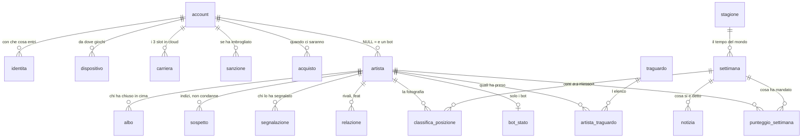

# Il database della classifica

Dove guardare, in quest'ordine:

- **[Lo schema, tabella per tabella](#lo-schema-tabella-per-tabella)**, qui sotto in
  questo file: tutte le colonne di tutte le tabelle, con che cosa vogliono dire. È in
  git, quindi lo vedono tutti e due.
- **`schema.md`** — il documento di disegno, con il ragionamento dietro a ogni scelta,
  il DDL per Postgres e come si cancella un account. **Non sta in git** (come
  `backend.md`): è il foglio su cui si lavora, non il riferimento.
- **`migrazioni/*.sql`** e **`migrazioni-pg/*.sql`** — lo schema come gira davvero, per
  SQLite e per PostgreSQL: stessi nomi di file, e `npm run prova` controlla che restino
  allineati.
- **`archivio.js`** — lo strato dati: l'unico file di tutto il server che parla col database.
- **`dati/`** — il database vero. **Non sta in git**: sono dati, non codice.

Questo file racconta com'è messo **adesso** e cosa manca per il giorno dell'uscita.

## Adesso: SQLite (e PostgreSQL quando servirà)

**Il database c'è** (punto 37, fatto il 01/09/2026): `dati/classifica.db`, SQLite dentro a
Node (`node:sqlite`) — nessuna dipendenza da installare, nessun servizio da mandare avanti,
un file solo sul disco. Lo schema è quello disegnato in `schema.md`, scritto in
`migrazioni/001_iniziale.sql`.

Perché adesso e non prima: con gli account, i salvataggi in cloud e lo storico settimana
per settimana, un file JSON riscritto per intero a ogni cambiamento non regge — e
soprattutto non regge la domanda «da dove riparto se si rompe qualcosa». Con SQLite le
scritture sono transazioni, il WAL tiene il file integro anche se il server muore a metà, e
le query che ci servono (ordina tutto, prendi la fetta, calcola le frecce) sono quelle per
cui un database è fatto.

### Le tabelle che ci sono

`account` · `identita` · `dispositivo` · `artista` · `bot_stato` · `carriera` · `stagione`
· `settimana` · `punteggio_settimana` · `classifica_posizione` · `albo` · `notizia` ·
`relazione` · `traguardo` · `artista_traguardo` · `sospetto` · `sanzione` ·
`segnalazione` · `acquisto` · `stato` (+ `migrazione`, che tiene il conto delle
migrazioni applicate).

Il perno del disegno, da tenere a mente prima di leggere il resto:

> **`artista.account_id` può essere NULL, e quelli sono i bot.** Tutto il resto pende
> dall'artista, non dall'account, così un bot ha esattamente la forma di un giocatore vero
> e nessuna query deve trattarli in modo diverso. È la regola del punto 30 scritta in SQL.

### Le migrazioni

File `.sql` numerati in `migrazioni/`, applicati in ordine e una volta sola, ognuno dentro
a una transazione; il conto lo tiene la tabella `migrazione`. Niente ORM, niente strumenti
da installare: si aggiunge `006_qualcosa.sql` e riparte il server.


---

## Lo schema, tabella per tabella

Venti tabelle, più `migrazione` che tiene il conto. Tre cose valgono per tutte, e se non
si sanno il resto sembra strano:

- **Gli `id` sono testo**, non numeri: sono UUID fatti da Node (`crypto.randomUUID`). Le
  tabelle che invece hanno un `id INTEGER` (`notizia`, `relazione`, `sospetto`,
  `sanzione`, `segnalazione`, `stagione`) sono cose che nascono e muoiono solo sul
  server, e lì un contatore va benissimo.
- **I tempi sono interi in millisecondi** (`Date.now()`), non date. In Beekeeper si
  leggono con `datetime(creato/1000,'unixepoch','localtime')` — vedi
  [più sotto](#i-tempi-sono-numeri-non-date).
- **I sì/no sono `INTEGER` 0/1**: SQLite non ha il booleano.

### Le relazioni, in un colpo d'occhio



### Chi sei

#### `account` — una persona

| colonna | tipo | cosa c'è dentro |
| --- | --- | --- |
| `id` | TEXT **PK** | UUID |
| `email` | TEXT | può mancare: si gioca anche da ospite |
| `email_confermata` | INTEGER | 0/1 |
| `stato` | TEXT | `attivo` · `sospeso` · `cancellato` |
| `lingua` | TEXT | `it` di default |
| `paese` | TEXT | |
| `creato` `visto` | INTEGER | millisecondi |
| `cancellato` | INTEGER | quando è stato cancellato; `NULL` = è vivo |

L'unicità della mail non guarda maiuscole e minuscole, e vale solo dove la mail c'è
(`CREATE UNIQUE INDEX … ON (lower(email)) WHERE email IS NOT NULL`).

#### `identita` — con che cosa entri

| colonna | tipo | cosa c'è dentro |
| --- | --- | --- |
| `id` | TEXT **PK** | |
| `account_id` | TEXT → `account` | cancella a cascata |
| `tipo` | TEXT | `steam` · `apple` · `google` · `email` · `ospite` |
| `id_esterno` | TEXT | l'id da loro, o la mail |
| `segreto_hash` | TEXT | **hash**, mai la password |
| `creato` `usato` | INTEGER | |

`UNIQUE (tipo, id_esterno)`: uno Steam solo per un account solo. Steam, Apple e Google
hanno già la colonna ma non ancora il codice che verifica il biglietto firmato da loro:
il server risponde `501` — porta chiusa, non porta finta.

#### `dispositivo` — da dove giochi

Una riga per sessione aperta. `token_hash` è l'**hash** del gettone: se qualcuno legge il
database non entra in nessun account. `revocato` non NULL = quella sessione è chiusa.

| colonna | tipo | cosa c'è dentro |
| --- | --- | --- |
| `id` | TEXT **PK** | |
| `account_id` | TEXT → `account` | |
| `piattaforma` | TEXT | `windows` · `mac` · `linux` · `ios` · `android` · `web` |
| `nome` `versione_gioco` | TEXT | |
| `token_hash` | TEXT | unico |
| `creato` `visto` `revocato` | INTEGER | |

### Chi c'è in classifica

#### `artista` — la tabella centrale

| colonna | tipo | cosa c'è dentro |
| --- | --- | --- |
| `id` | TEXT **PK** | |
| `account_id` | TEXT → `account` | **`NULL` = è un bot** |
| `bot` | INTEGER | 0/1, e un `CHECK` dice che se `bot=1` l'account è `NULL` |
| `nome` | TEXT | fra 2 e 22 caratteri, unico fra i non ritirati senza guardare maiuscole |
| `citta` `genere` `storia` | TEXT | |
| `seed` | INTEGER | il seme con cui si ridisegna sempre uguale |
| `stream` `fan` | INTEGER | i due numeri della classifica, mai negativi |
| `livello` `fase` `uscite` `deal` | INTEGER | a che punto è della carriera |
| `ultima_titolo` `ultima_seed` | TEXT, INTEGER | l'ultima uscita |
| `chiave_hash` | TEXT | solo per i client vecchi, quelli di prima degli account |
| `creato` | INTEGER | |
| `punteggio` | INTEGER | quando ha mandato l'ultimo punteggio; `NULL` = mai |
| `ritirato` | INTEGER | `NULL` = è in classifica |
| `nome_prima` | TEXT | com'era chiamato, se il nome è stato cambiato d'ufficio (mig. 002) |
| `fuori` | INTEGER | 0/1, sanzionato: fuori dalla classifica (mig. 004) |

`fuori` è la sola colonna **ricavata** di tutto lo schema: è il riassunto di `sanzione`,
aggiornato a mano quando una sanzione si mette o scade. È nata perché un `NOT EXISTS`
sulle sanzioni non si può leggere da un indice, e a ventimila artisti la classifica
costava 110 ms invece di 1,5 (mig. 004).

#### `bot_stato` — le rotelle dei soli bot

`artista_id` **PK** → `artista` · `slancio` REAL · `caldo` INTEGER ·
`carattere` (`normale` · `costante` · `esplosivo` · `meteora`).
Sta fuori da `artista` perché un giocatore vero queste cose non le ha.

### Il salvataggio in cloud

#### `carriera` — tre slot per account

| colonna | tipo | cosa c'è dentro |
| --- | --- | --- |
| `id` | TEXT **PK** | |
| `account_id` | TEXT → `account` | |
| `artista_id` | TEXT → `artista` | |
| `slot` | INTEGER | 1, 2 o 3 — `UNIQUE (account_id, slot)` |
| `stato` | TEXT | **il salvataggio intero, JSON in una colonna** |
| `versione_stato` | INTEGER | la forma del JSON, per leggere anche i salvataggi vecchi |
| `versione_gioco` | TEXT | |
| `settimana_gioco` `anno_gioco` | INTEGER | per mostrare la carriera senza aprire il JSON |
| `byte` | INTEGER | quanto pesa: serve a metterci un tetto |
| `creato` `aggiornato` | INTEGER | |

### Il tempo del mondo

#### `stagione`

`id` INTEGER **PK** · `nome` · `inizio` · `fine` · `stato` (`corrente` · `chiusa`).

#### `settimana`

`numero` INTEGER **PK** — è il numero della settimana, non un id · `stagione_id` ·
`iniziata` · `chiusa` · `artisti` · `giocatori` (quanti c'erano a quel giro).

### Lo storico

#### `punteggio_settimana` — quello che ha mandato ognuno, ogni settimana

**PK `(artista_id, settimana)`**: un punteggio a testa a settimana. Il secondo invio della
stessa settimana **aggiorna**, non aggiunge.

| colonna | cosa c'è dentro |
| --- | --- |
| `stream` `fan` `livello` `fase` `uscite` `deal` | quello che ha dichiarato |
| `limato` | 0/1: `plausibilita.js` ha tagliato il numero perché era troppo alto |
| `origine` | `client` · `server` · `rettifica` |
| `ip_hash` | **hash**, non l'IP |
| `inviato` | quando |

#### `classifica_posizione` — la fotografia del «prima»

**PK `(settimana, artista_id)`** · `pos` · `stream` · `delta`.
Da qui escono le frecce ▲▼. **Si scrive solo nel giro di settimana**: se la si tocca
fuori da lì, le frecce si azzerano e nessuno capisce più chi sta salendo.

#### `albo` — chi ha chiuso una stagione in cima (mig. 003)

**PK `(stagione_id, pos)`** · `artista_id` · `nome` `citta` `genere` — **com'erano
allora**: se poi cambia nome, l'albo non cambia · `stream` · `chiusa`.

### Quello che gira

#### `notizia`

`id` · `settimana` · `artista_id` (può mancare) · `tipo` (`uscita` · `firma` ·
`sparizione` · `ingresso` · `ritiro` · `rivalita` · `traguardo`) · `testo` · `creato`.
È quello che il telefono legge con `GET /api/feed`.

#### `relazione`

`artista_id` + `altro_id` + `tipo` (`rivale` · `feat` · `amico` · `crew`), unici insieme ·
`grado` da 1 a 6 · `da_settimana` · `nota`. Un artista non può essere in relazione con sé
stesso: c'è un `CHECK`.

### I traguardi

#### `traguardo` — l'elenco

`codice` TEXT **PK** · `nome` · `descrizione` · `nascosto` ·
`codice_steam` `codice_ios` `codice_android`: come si chiama lo stesso traguardo da loro.

#### `artista_traguardo` — chi l'ha preso

**PK `(artista_id, codice)`** · `settimana` · `ottenuto` · `spinto` (quando è stato
mandato allo store; `NULL` = ancora da mandare, e c'è un indice apposta per trovarli).

### L'anti-imbroglio e la moderazione

#### `sospetto`

`artista_id` · `tipo` (`salto` · `frequenza` · `impossibile` · `doppione`) · `dettaglio`
(JSON) · `peso` · `creato`. Li segna `plausibilita.js`: sono indizi, non condanne.

#### `sanzione`

`account_id` · `tipo` (`avviso` · `fuori_classifica` · `sospensione`) · `motivo` · `da` ·
`a` (`NULL` = per sempre) · `deciso_da` (`automatico`, o chi l'ha decisa).
Quando si mette o scade, va aggiornata anche `artista.fuori`.

#### `segnalazione` (mig. 002)

`artista_id` · `account_id` (chi ha segnalato) · `motivo` (`nome` · `storia` ·
`imbroglio` · `altro`) · `nota` · `stato` (`aperta` · `accolta` · `respinta`) · `creato` ·
`chiusa`. `UNIQUE (artista_id, account_id, motivo)`: una segnalazione a testa, non dieci.
Esiste perché sugli store un nome d'arte è contenuto scritto da un utente e mostrato ad
altri utenti, e Apple e Google chiedono che ci sia un modo per segnalarlo.

### Il resto

#### `acquisto`

`account_id` · `negozio` (`steam` · `apple` · `google`) · `id_esterno` (unico insieme al
negozio) · `prodotto` · `centesimi` · `valuta` · `stato` (`pagato` · `rimborsato` ·
`contestato`) · `ricevuta`. C'è per quando servirà; adesso è vuota.

#### `stato` — due colonne, `chiave` e `valore`

Le manopole del mondo. Adesso dentro c'è `prossimo_giro`: quando scatta il prossimo giro
di settimana, in millisecondi.

#### `migrazione`

`nome` **PK** · `applicata`. La tiene `db.js`: se un file `.sql` è qui dentro, non si
riapplica. **Non toccarla a mano**: togliere una riga vuol dire far girare due volte una
migrazione, e la seconda volta fallisce a metà.

---

## Guardarlo con Beekeeper Studio

Beekeeper apre SQLite senza installare niente d'altro: non c'è un server a cui
collegarsi, si sceglie **il file** e basta.

> **Se sotto hai acceso PostgreSQL** (`ADF_PG`), qui non c'è nessun file da aprire: in
> Beekeeper scegli **PostgreSQL** invece di SQLite e gli dai host, porta, database, utente
> e password — gli stessi che stanno in `ADF_PG`. Tutto il resto di questa pagina (le
> query, i tempi in millisecondi, cosa non toccare a mano) vale identico: lo schema è lo
> stesso. Cambia solo che le chiavi esterne, di là, **sono sempre accese** — quella
> trappola è di SQLite.

Il resto di questa sezione parla del caso normale, il file.

### Collegarsi, la prima volta

1. **New Connection** (o il `+` in alto a sinistra).
2. Nel menù del tipo di connessione scegli **SQLite**.
3. In **Database File** premi **Choose file** e prendi:

   ```
   C:\Users\madel\gioco-rap\backend\database\dati\classifica.db
   ```

   Dalla cartella del progetto è `backend/database/dati/classifica.db`.
4. **Connect**. Per ritrovarla domani, prima **Save**, e chiamala
   «Anni di Fame — classifica»: resta nell'elenco a sinistra.

**Se il file non c'è**: la cartella `dati/` sta fuori da git, quindi su una macchina nuova
non esiste. Fai partire il server una volta (`npm start` dentro a `backend/`) e se lo crea
da sé, migrazioni comprese.

### Tre cose da sapere prima di toccare qualcosa

**Il file non è uno solo.** Accanto a `classifica.db` ci sono `classifica.db-wal` e
`classifica.db-shm`: è il WAL, e **le scritture più recenti stanno lì dentro**, non ancora
nel `.db`. Beekeeper li legge insieme senza che tu faccia niente — ma se copi il database
per portartelo via, **copiare solo il `.db` ti dà dati vecchi**. Per una copia giusta:

```bash
npm run copia      # → dati/copie/classifica-2026-09-01.db: un file solo, coerente
```

Quella copia si apre in Beekeeper come l'originale, e si fa **a server acceso**.

**A server acceso si legge tranquillamente**, si scrive con giudizio. SQLite in WAL regge
un solo scrittore alla volta: se il server sta scrivendo mentre premi Save su una riga,
Beekeeper dice `database is locked`. Non è rotto niente, si riprova. Se devi frugare per
bene, o provare una `UPDATE`, fai prima `npm run copia` e apri **la copia**.

<a name="le-chiavi-esterne"></a>
**Le chiavi esterne, in SQLite, sono spente su ogni connessione nuova.** Il server le
accende da sé (`PRAGMA foreign_keys = ON`, in `db.js`), ma la connessione di Beekeeper è
un'altra: se cancelli un `account` dalla tabella senza averle accese, **le righe attaccate
non se ne vanno** e ti resta un database mezzo rotto. Prima di modificare qualcosa a mano,
apri una scheda query e lancia:

```sql
PRAGMA foreign_keys = ON;
```

Va rifatto a ogni riconnessione. In generale: **per cancellare un account usa la rotta del
server**, che fa la cosa completa dentro a una transazione. Beekeeper serve per guardare.

<a name="i-tempi-sono-numeri-non-date"></a>
### I tempi sono numeri, non date

Tutte le colonne `creato`, `visto`, `inviato`, `ottenuto`… sono millisecondi
(`Date.now()`), e in Beekeeper appaiono come `1788214583393`. Per leggerli:

```sql
SELECT nome,
       datetime(creato / 1000, 'unixepoch', 'localtime') AS quando
FROM artista
ORDER BY creato DESC
LIMIT 20;
```

E al contrario, per chiedere «da ieri in poi»:

```sql
SELECT * FROM notizia
WHERE creato > (strftime('%s','now','-1 day') * 1000);
```

### Quattro query da incollare

**Chi comanda.** La posizione non è una colonna — si calcola, così non può mentire:

```sql
SELECT row_number() OVER (ORDER BY stream DESC, creato) AS pos,
       nome, citta, genere, stream, fan,
       CASE bot WHEN 1 THEN 'bot' ELSE 'giocatore' END AS chi
FROM artista
WHERE ritirato IS NULL AND fuori = 0
ORDER BY stream DESC, creato
LIMIT 30;
```

**Solo le persone vere.** Sono poche, ed è quello che di solito interessa guardare:

```sql
SELECT a.nome, a.citta, a.stream, a.fan,
       datetime(a.punteggio / 1000,'unixepoch','localtime') AS ultimo_invio
FROM artista a
WHERE a.bot = 0 AND a.ritirato IS NULL
ORDER BY a.stream DESC;
```

**Com'è andata l'ultima settimana.** `delta` è di quante posizioni si è mosso rispetto
alla fotografia di prima:

```sql
SELECT c.pos, a.nome, c.stream, c.delta
FROM classifica_posizione c
JOIN artista a ON a.id = c.artista_id
WHERE c.settimana = (SELECT max(numero) FROM settimana)
ORDER BY c.pos
LIMIT 40;
```

**Le segnalazioni da guardare**:

```sql
SELECT s.id, a.nome, s.motivo, s.nota,
       datetime(s.creato/1000,'unixepoch','localtime') AS quando
FROM segnalazione s
JOIN artista a ON a.id = s.artista_id
WHERE s.stato = 'aperta'
ORDER BY s.creato DESC;
```

### Quello che da Beekeeper è meglio **non** modificare a mano

1. **`migrazione`** — togliere una riga fa rigirare una migrazione già fatta, e la seconda
   volta si rompe a metà.
2. **`classifica_posizione`** — è la fotografia del «prima»: se la tocchi, le frecce ▲▼
   smettono di dire la verità (è la regola 4 qui sotto).
3. **`artista.fuori`** senza toccare anche `sanzione`, o viceversa — sono la stessa cosa
   scritta due volte per andare veloci: se si scollano, uno è sanzionato e l'altro no.
4. **Le colonne `*_hash`** (`token_hash`, `segreto_hash`, `chiave_hash`, `ip_hash`) — sono
   hash, non testo: riscriverle a mano non «cambia la password», butta fuori la persona.
5. **Cancellare un `account`** — usa la rotta del server. Da Beekeeper, senza
   [`PRAGMA foreign_keys = ON`](#le-chiavi-esterne), lasci in giro artisti, carriere e
   dispositivi orfani.

### Se preferisci la riga di comando

```bash
sqlite3 dati/classifica.db "SELECT nome, stream, bot FROM artista ORDER BY stream DESC LIMIT 10;"
sqlite3 dati/classifica.db ".backup copia.db"     # la copia si fa anche a server acceso
```

## Il travaso dal vecchio archivio JSON

```bash
npm run travaso
```

Legge `dati/classifica.json` (l'archivio di prima) e riempie il database: artisti, bot con
il loro slancio, notizie, e la fotografia della classifica della settimana scorsa — così le
frecce non ripartono da zero. Per ogni giocatore vero apre **un account da ospite** con
l'artista attaccato e gli tiene la chiave che ha già nel browser: nessuno perde niente, il
client vecchio continua a funzionare, e quando vuole la scambia con una sessione vera.
Il file JSON non viene toccato: tienilo da parte finché non sei sicuro.

## Le regole che devono restare vere

1. `artista.bot` e `artista.account_id` **non escono mai** da una rotta, e le chiavi
   nemmeno. Il primo fa cadere l'illusione, gli altri sono dati personali. Passa tutto da
   `riga()` in `archivio.js`: ogni campo nuovo si aggiunge lì, di proposito.
2. Gli `id` sono **casuali e uguali per tutti**: niente prefissi tipo `bot-`, o si capisce
   subito chi è la macchina.
3. La posizione non si tiene in una colonna: si calcola con `row_number()` sull'ordine per
   `stream`, così non può mentire.
4. `classifica_posizione` si scrive **solo** nel giro di settimana. È la fotografia del
   «prima»: se la tocchi fuori dal giro, le frecce ▲▼ si azzerano e nessuno capisce più chi
   sta salendo.
5. Il nome è unico fra chi non è ritirato, senza guardare maiuscole e minuscole.
6. Un punteggio per artista per settimana: è la chiave primaria di `punteggio_settimana`.
   Il secondo invio della stessa settimana aggiorna, non aggiunge.

## Come si scrive su disco

Ci pensa SQLite, e meglio di come ci pensavamo noi: **WAL** (si legge mentre si scrive, e
un'interruzione non lascia il file a metà), **foreign_keys accese** (le chiavi esterne
valgono davvero), transazioni per le cose che devono essere tutto-o-niente — il giro di
settimana e la cancellazione di un account.

Se il file non c'è, il server se lo crea e applica le migrazioni. Se c'è ma è di una
versione più vecchia, le migrazioni mancanti si applicano da sole all'avvio.

## Copie di sicurezza

```bash
npm run copia          # → dati/copie/classifica-2026-09-01.db
```

Si dà **a server acceso**: dentro c'è `VACUUM INTO`, che fa una copia coerente da sé e non
si porta dietro il `-wal`. Tiene le ultime trenta (`ADF_COPIE`) e prima di dire che ha
finito riapre la copia e conta cosa c'è dentro. Copiare il file a mano mentre il server
scrive **non** è sicuro.

Online: una copia ogni notte, tenute trenta, su un disco diverso da quello del server. Per
rimettere a posto: si ferma il server, si copia indietro il file, si riavvia.

**Cosa si perde se sparisce tutto**: adesso che i salvataggi stanno anche in cloud, si
perdono le carriere della gente. Non è più «si perde la classifica»: è il danno vero. Da
qui in poi il backup è la cosa più importante di tutto il server, e il ripristino va
provato, non solo fatto.

## I due motori: SQLite e PostgreSQL

Sotto ci possono stare tutti e due, e il resto del server non sa quale. Si sceglie con una
variabile:

```bash
npm start                                                          # SQLite, il file
ADF_PG=postgresql://utente:pw@127.0.0.1:5432/anni_di_fame npm start # PostgreSQL
```

La stessa riga si può mettere in `backend/.env.local`, che è fuori da git ed è il posto
giusto per una password (la riga di comando finisce nella cronologia della shell).

**Quando si passa.** Non adesso. SQLite regge benissimo un server solo e decine di
migliaia di righe — i numeri sono qui sotto, misurati. Il passo serve il giorno che i
server diventano **più di uno**, perché un file non lo si condivide fra due macchine; e
quel giorno la strada è già aperta invece che da aprire.

### Com'è fatto dentro

| file | cosa fa |
| --- | --- |
| `db.js` | sceglie il motore e applica le migrazioni |
| `sqlite.js` | SQLite (`node:sqlite`) |
| `postgres.js` | PostgreSQL (la libreria `pg`) |
| `migrazioni/*.sql` | lo schema per SQLite |
| `migrazioni-pg/*.sql` | lo stesso schema per PostgreSQL, **stessi nomi di file** |

I nomi dei file combaciano apposta, e `npm run prova` lo controlla: se qualcuno aggiunge
una migrazione di qua e si scorda di là, se ne accorge subito e non fra sei mesi.

### Le quattro cose che i due database scrivono diverse

Sono poche, ma una fa male sul serio:

1. **`BIGINT` per i tempi, e non `INTEGER`.** In SQLite `INTEGER` è a 64 bit; in PostgreSQL
   è a 32 e arriva a 2.147.483.647. I nostri tempi sono millisecondi (`Date.now()`, oggi
   **1.788.261.519.572**): in un `INTEGER` di PostgreSQL non ci starebbero, e ogni
   salvataggio schianterebbe. Stesso motivo per `stream`. È il genere di cosa che si scopre
   in produzione se non la si cerca apposta.
2. **Le chiavi che si contano da sole**: `INTEGER PRIMARY KEY AUTOINCREMENT` è di SQLite,
   di là è `GENERATED BY DEFAULT AS IDENTITY`.
3. **`REAL` è a 32 bit** in PostgreSQL: lo slancio dei bot vuole `DOUBLE PRECISION`.
4. **`rowid` non esiste** fuori da SQLite. `catalogo()` ci ordinava sopra i traguardi;
   adesso c'è una colonna `ordine` (migrazione 006), che è anche più onesta: un ordine che
   dipende da come il database tiene le righe non è un ordine, è una coincidenza.

Gli indici parziali (`WHERE ritirato IS NULL`) e quelli su un'espressione (`lower(citta)`)
li sanno fare tutti e due, e si copiano tali e quali.

### Due cose che l'adattatore deve fare sul serio

**I segnaposto.** Il resto del server scrive `?` come SQLite, PostgreSQL vuole `$1, $2`. La
traduzione salta quello che sta dentro alle stringhe — se no un punto interrogativo dentro
a un testo diventerebbe un parametro e la query chiederebbe un'altra cosa, senza dare
errore. Ci sono sei controlli apposta in `prova.js`, apici raddoppiati compresi.

**Le transazioni sul pool.** `archivio.js`, dentro a `insieme()`, chiama `A.fai(...)` come
sempre, senza passarsi dietro nessuna maniglia. Su un pool ogni chiamata potrebbe pescare
una connessione diversa, e allora la transazione non coprirebbe niente: il giro di
settimana si scriverebbe a pezzi. `AsyncLocalStorage` tiene la connessione presa dalla
transazione e la fa ritrovare a chi sta dentro, senza cambiare una riga di `archivio.js`.

### Perché una dipendenza, in un server che non ne ha

`pg` è l'unica, ed è una scelta, non una resa. Il protocollo di PostgreSQL si potrebbe
scrivere a mano — è quello che abbiamo fatto per il server di sviluppo e per il build. Ma
questo è il file che tiene le carriere della gente, e l'autenticazione SCRAM-SHA-256, il
TLS, la decodifica dei tipi e le riconnessioni sono quattro posti dove un errore sottile
non si vede subito e si paga sui dati veri. `pg` è la libreria più collaudata di Node: qui
«zero dipendenze» conviene cederla, e questo è l'unico posto dove la cediamo.

### La copia di sicurezza cambia mestiere

`npm run copia` è `VACUUM INTO`, che è di SQLite. Con PostgreSQL sotto si tira indietro e
dice come si fa davvero, invece di far finta di aver copiato qualcosa:

```bash
pg_dump --format=custom --file=classifica.dump "$ADF_PG"
```

---

## Cosa manca ancora

Gli account, i salvataggi in cloud, lo storico, la cancellazione e tutti e due i motori ci
sono. Restano **le chiavi**, e non sono codice da scrivere: si prendono quando l'app è
registrata sugli store.

**Steam, Apple e Google** dentro a `identita`: il pezzo che verifica il biglietto firmato
**c'è** (`accessi.js`), ed è provato — `prova.js` si fa una coppia di chiavi sua, mette in
piedi un finto «appleid.apple.com» e controlla che un biglietto buono entri e che uno
firmato da un altro, scaduto, senza scadenza o fatto per un altro gioco venga buttato.
Quello che manca sono `ADF_STEAM_CHIAVE`, `ADF_STEAM_APPID`, `ADF_APPLE_AUD` e
`ADF_GOOGLE_CLIENT`. Finché non ci sono, quel canale risponde `501` e dice quale manca —
porta chiusa, non porta finta.

**Il piano, e dove siamo:**

| quando | dove stanno i dati | stato |
| --- | --- | --- |
| all'inizio | file JSON | superato |
| da quando ci sono gli account | **SQLite** (`node:sqlite`) | **è qui che siamo** |
| dal primo giorno di store | **PostgreSQL**, con copie automatiche e ripristino provato | la strada c'è, si cambia con una variabile |

**La soglia è misurata**, non stimata (`npm run carico`, numeri per esteso in
`../README.md`): a **20.000 artisti** tutto sta sotto i dieci millisecondi; a **100.000**
cominciano a sentirsi «dove sono in classifica» (perché bisogna contare quanti stanno
davanti) e il giro di settimana, che intanto blocca il processo.

Quindi, in ordine, il giorno che i giocatori diventano tanti: prima si sposta il giro di
settimana fuori dalla richiesta, poi si accende `ADF_PG`. Non il contrario: il primo è
mezza giornata di lavoro, il secondo adesso è una variabile.

## Le cartelle

```
database/
  README.md            questo file
  copia.js             la copia di sicurezza (SQLite; con PostgreSQL si tira indietro)
  schema.md            il foglio di disegno, commentato (fuori da git)
  db.js                sceglie il motore e applica le migrazioni
  sqlite.js            il motore SQLite
  postgres.js          il motore PostgreSQL
  migrazioni/*.sql     lo schema per SQLite, in file numerati
  migrazioni-pg/*.sql  lo stesso schema per PostgreSQL, stessi nomi
  archivio.js          lo strato dati: l'unico che parla col database
  travaso.js           dal vecchio JSON al database
  dati/                il database vero (fuori da git: sono dati, non codice)
```
