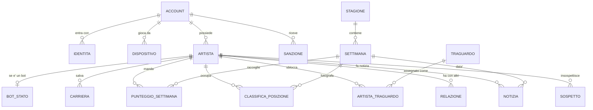

# Lo schema del database

**Questo file sta in git** (dal 13/09/2026: prima no, ed e' il motivo per cui era andato
alla deriva — un documento che non passa da nessun diff non lo rilegge nessuno). È la mappa completa
dei dati: tabelle, colonne, tipi, vincoli, relazioni, indici e le query che
contano davvero. Il README qui accanto racconta com'è messo il backend; questo racconta
**com'è fatto il database e perché è fatto così**, ed è la cosa da avere sott'occhio quando
si scrive codice nuovo.

**Stato: implementato** (01/09/2026, riallineato il 13/09/2026 alla migrazione **008**).
Lo schema qui sotto **non è un disegno: è copiato dalle migrazioni che girano**
(`migrazioni-pg/001_iniziale.sql` più le sette che seguono). Le colonne arrivate dopo sono
rimesse dentro alla tabella a cui appartengono, con scritto di fianco da quale migrazione
vengono: una tabella si legge per com'è adesso, non ricostruendosela a mente da otto file.
Le tabelle usate dal codice oggi sono tutte tranne `relazione` e `acquisto`, che esistono
vuote e aspettano il loro turno.

Le venti tabelle ci sono tutte: `segnalazione`, `albo` e `stato` (§ 2.15–2.17) giravano da
giorni senza stare scritte qui, ed è esattamente la cosa che `scripts/controlla-backend.js`
sta lì a non far succedere. La ventunesima, `migrazione`, non sta in nessun file `.sql`
perché è quella che tiene il conto dei file `.sql`: sta al § 8.

**Perché il DDL qui sotto è quello di PostgreSQL.** Perché è il database del giorno
dell'uscita, ed è l'unico dei due che non perdona: quello che passa di là passa anche su
SQLite, il contrario no. Le differenze per SQLite sono tre parole e stanno al § 7.

Scritto il 31/08/2026, dopo la decisione di uscire su **Steam e sugli store del telefono**.
È quella decisione che rende obbligatorio un database vero: un gioco su uno store ha
account, salvataggi in cloud, traguardi, e gente che pretende — giustamente — di ritrovare
la propria carriera dopo aver cambiato telefono.

- **Oggi: SQLite** (`node:sqlite`, dentro Node, niente da installare) —
  `migrazioni/001_iniziale.sql`. Le differenze rispetto al DDL qui sotto sono al § 7.
- **In produzione, il giorno dell'uscita: PostgreSQL.** Il DDL qui sotto è quello.
- **Prima c'era un file JSON.** Il travaso è scritto e provato: `travaso.js` (§ 8).

---

## 1. Il disegno in una figura



In parole, le tre catene che reggono tutto:

```
account ─┬─ identita        (con cosa entri: Steam, Apple, Google, email, ospite)
         ├─ dispositivo     (da dove giochi: il PC, il telefono)
         └─ artista ─┬─ carriera            (il salvataggio in cloud, max 3 slot)
                     ├─ punteggio_settimana (lo storico: una riga per settimana)
                     ├─ classifica_posizione(la fotografia della classifica)
                     ├─ artista_traguardo   (i traguardi, quelli che vanno su Steam)
                     └─ relazione           (rivalita', feat, amicizie)

stagione ── settimana ── (punteggi, posizioni, notizie di quella settimana)
```

**La regola che decide il disegno**: un `artista` può non avere un `account` — quelli sono
i bot. Tutto il resto pende dall'artista, non dall'account, così un bot ha esattamente la
stessa forma di un giocatore vero e nessuna query deve trattarli in modo diverso. È la
stessa regola del punto 30, scritta in SQL.

---

## 2. Le tabelle

Tre cose valgono per tutte le tabelle, e stanno scritte qui una volta sola invece che
diciassette. **Sono scelte prese, non mancanze**: chi legge questo file il giorno del
passaggio a PostgreSQL non deve pensare che manchi qualcosa da mettere a posto.

- **Gli id sono `TEXT`, non `uuid`.** Il valore *è* un UUID vero e casuale — lo genera
  Node con `crypto.randomUUID()` (`archivio.js`) — ma la colonna è di testo. L'id lo fa
  chi scrive, non il database: così la stessa riga di codice vale su tutti e due i motori,
  l'id esiste **prima** dell'`INSERT` (e serve, per scrivere le righe figlie dentro alla
  stessa transazione senza rileggersi niente) e il travaso ha potuto tenersi gli id vecchi
  senza convertirli. `gen_random_uuid()` farebbe una cosa in più: legare il codice a un
  motore solo.
- **I tempi sono `BIGINT`, millisecondi dal 1970**, non `timestamptz`. È `Date.now()`
  scritto com'è: il gioco ragiona in millisecondi, il client manda millisecondi, e un
  formato solo dal telefono al database è un posto in meno dove sbagliare un fuso orario.
  `BIGINT` e non `INTEGER` perché l'`integer` di PostgreSQL è a 32 bit e si ferma a
  2.147.483.647, mentre un millisecondo di oggi è già 1.788.261.519.572: ci sta solo in 64
  bit. **È la differenza che fa più male**, perché su SQLite `INTEGER` è già a 64 bit e
  quindi non si vede finché non si accende PostgreSQL.
- **I booleani sono `INTEGER` 0/1** (`bot`, `deal`, `limato`, `nascosto`, `fuori`,
  `email_confermata`): SQLite un `boolean` non ce l'ha, e due tipi diversi nelle due serie
  di migrazioni vorrebbero dire due `archivio.js`.

E una quarta che vale quasi dappertutto: **la lunghezza sta in un `CHECK`, non in un
`VARCHAR(n)`**, così la regola è scritta una volta sola e uguale sui due motori.

### 2.1 `account` — chi sei

Nasce quando entri la prima volta, anche da ospite. Un account non è un artista: è la
persona. Gli artisti ci pendono sotto (tre slot di carriera, tre artisti).

```sql
CREATE TABLE account (
  id               TEXT    PRIMARY KEY,
  email            TEXT,                       -- NULL se entra solo da Steam/Apple/ospite
  email_confermata INTEGER NOT NULL DEFAULT 0,
  stato            TEXT    NOT NULL DEFAULT 'attivo'
                           CHECK (stato IN ('attivo','sospeso','cancellato')),
  lingua           TEXT    NOT NULL DEFAULT 'it',
  paese            TEXT,
  creato           BIGINT  NOT NULL,
  visto            BIGINT  NOT NULL,
  cancellato       BIGINT                      -- GDPR: si cancella cosi', non con DELETE
);
CREATE UNIQUE INDEX account_email ON account (lower(email)) WHERE email IS NOT NULL;
CREATE INDEX account_visto ON account (visto DESC) WHERE cancellato IS NULL;
```

`cancellato` non è pigrizia: quando qualcuno chiede la cancellazione dobbiamo togliere i
suoi dati **senza sfondare la classifica storica**. Come si fa esattamente sta al § 6.

**L'email è unica senza guardare le maiuscole, ma non con `citext`**: quello è un tipo che
arriva da un'estensione di PostgreSQL e su SQLite non esiste. L'indice unico su
`lower(email)` fa la stessa identica cosa e lo sanno fare tutti e due. Ed è **parziale**
(`WHERE email IS NOT NULL`) per un motivo pratico: di gente che entra da Steam o da ospite
e l'email non la dà ce n'è quanta se ne vuole, e un unico normale su una colonna piena di
`NULL` è il tipo di cosa che si comporta diverso da un database all'altro.

`lingua` e `paese` non hanno nessun `CHECK` sulla lunghezza: la regola «due lettere» oggi
sta nel server, non nel database. Se un giorno ci si vuole mettere un vincolo, va messo
**in tutte e due** le serie di migrazioni nello stesso commit, se no PostgreSQL rifiuta
righe che SQLite ha accettato per mesi.

### 2.2 `identita` — con che cosa entri

Uno stesso account può avere più modi di entrare: Steam sul PC, Apple sul telefono, la
mail come rete di salvataggio. È la tabella che rende possibile «ho cambiato telefono e ho
ritrovato tutto».

```sql
CREATE TABLE identita (
  id           TEXT    PRIMARY KEY,
  account_id   TEXT    NOT NULL REFERENCES account(id) ON DELETE CASCADE,
  tipo         TEXT    NOT NULL CHECK (tipo IN ('steam','apple','google','email','ospite')),
  id_esterno   TEXT    NOT NULL,        -- SteamID64, sub di Apple/Google, l'email, o un uuid per l'ospite
  segreto_hash TEXT,                    -- solo per 'email' (password) e 'ospite' (chiave del dispositivo)
  creato       BIGINT  NOT NULL,
  usato        BIGINT,
  UNIQUE (tipo, id_esterno)
);
CREATE INDEX identita_account ON identita (account_id);
```

Il `segreto_hash` non è mai la password in chiaro né la chiave in chiaro: è **scrypt con un
sale suo per ogni segreto**, scritto come `scrypt$<sale>$<hash>` (`impasta()` e `combacia()`
in `archivio.js`, con `timingSafeEqual` al confronto, così il tempo di risposta non dice
quante lettere erano giuste). Due account con la stessa password hanno hash diversi.
Scrypt e non argon2id perché argon2 vuol dire una dipendenza con del C dentro da compilare
su ogni macchina, mentre scrypt sta già dentro a Node; il prefisso `scrypt$` sta lì apposta
per il giorno che si cambiasse idea, perché permette ai due algoritmi di convivere nella
stessa colonna durante il passaggio. Per Steam/Apple/Google non c'è nessun segreto da
tenere: la verifica la fa il loro ticket.

### 2.3 `dispositivo` — da dove giochi

Serve a due cose concrete: dire «sei entrato da un dispositivo nuovo» e far ripartire una
sessione senza rifare il login a ogni avvio.

```sql
CREATE TABLE dispositivo (
  id             TEXT    PRIMARY KEY,
  account_id     TEXT    NOT NULL REFERENCES account(id) ON DELETE CASCADE,
  piattaforma    TEXT    NOT NULL DEFAULT 'web'
                         CHECK (piattaforma IN ('windows','mac','linux','ios','android','web')),
  nome           TEXT,                    -- «PC di casa», «iPhone» — lo scrive il giocatore
  token_hash     TEXT    NOT NULL,        -- il gettone di sessione, solo hash
  versione_gioco TEXT,
  creato         BIGINT  NOT NULL,
  visto          BIGINT  NOT NULL,
  revocato       BIGINT
);
CREATE UNIQUE INDEX dispositivo_token ON dispositivo (token_hash);
CREATE INDEX dispositivo_account ON dispositivo (account_id) WHERE revocato IS NULL;
```

`dispositivo_token` è **unico e non parziale**, e i due motivi sono buoni tutti e due: a
ogni richiesta con un gettone si arriva qui, e ci si arriva cercando l'hash — quindi è la
strada per cui passa tutto il traffico autenticato; e un gettone che salta fuori due volte,
anche su una riga già revocata, è un guaio che si vuole scoprire dall'`INSERT`, non da un
giocatore che si ritrova dentro all'account di un altro.

### 2.4 `artista` — chi c'è in classifica

Il cuore. Una riga per ogni nome che compare in graduatoria: giocatori veri e bot, stessa
tabella, stessa forma.

```sql
CREATE TABLE artista (
  id            TEXT    PRIMARY KEY,
  account_id    TEXT    REFERENCES account(id) ON DELETE SET NULL,   -- NULL = e' un bot
  bot           INTEGER NOT NULL DEFAULT 0,
  nome          TEXT    NOT NULL CHECK (length(nome) BETWEEN 2 AND 22),
  citta         TEXT    NOT NULL,
  genere        TEXT    NOT NULL,
  storia        TEXT    NOT NULL DEFAULT '',
  seed          BIGINT  NOT NULL DEFAULT 0,          -- da qui esce la copertina disegnata dal gioco
  stream        BIGINT  NOT NULL DEFAULT 0 CHECK (stream >= 0),   -- gli stream di adesso: si ordina su questo
  fan           BIGINT  NOT NULL DEFAULT 0 CHECK (fan >= 0),
  livello       INTEGER NOT NULL DEFAULT 1,
  fase          INTEGER NOT NULL DEFAULT 0,
  uscite        INTEGER NOT NULL DEFAULT 0,
  deal          INTEGER NOT NULL DEFAULT 0,
  ultima_titolo TEXT,
  ultima_seed   BIGINT  NOT NULL DEFAULT 0,
  chiave_hash   TEXT,                                -- solo per i client vecchi, prima degli account
  creato        BIGINT  NOT NULL,
  punteggio     BIGINT,                              -- ultimo punteggio ricevuto. NULL = mai
  ritirato      BIGINT,                              -- fuori dalla classifica (cancellazione o abbandono)
  nome_prima    TEXT,                                -- 002: com'era chiamato prima del cambio d'ufficio
  fuori         INTEGER NOT NULL DEFAULT 0,          -- 004: ha una sanzione attiva, e' fuori graduatoria
  difficolta    TEXT    NOT NULL DEFAULT 'anni-di-fame',       -- 007
  live          INTEGER NOT NULL DEFAULT 0 CHECK (live >= 0),  -- 008: serate fatte
  feat          INTEGER NOT NULL DEFAULT 0 CHECK (feat >= 0),  -- 008: feat fatti
  CHECK ( (bot = 1 AND account_id IS NULL) OR (bot = 0) )
);

-- il nome e' unico senza guardare le maiuscole, fra quelli non ritirati
CREATE UNIQUE INDEX artista_nome ON artista (lower(nome)) WHERE ritirato IS NULL;
CREATE INDEX artista_account ON artista (account_id);

-- la graduatoria e' un ORDER BY su questo (004: rifatto, con `fuori` dentro)
CREATE INDEX artista_classifica ON artista (stream DESC, creato)
  WHERE ritirato IS NULL AND fuori = 0;
-- le stesse graduatorie guardate da vicino (003, rifatte dalla 005 sull'espressione
-- `lower(citta)`, perche' il confronto e' `lower(citta) = lower(?)`)
CREATE INDEX artista_citta ON artista (lower(citta), stream DESC, creato)
  WHERE ritirato IS NULL AND fuori = 0;
CREATE INDEX artista_genere ON artista (genere, stream DESC, creato)
  WHERE ritirato IS NULL AND fuori = 0;
-- 007: la difficolta' si filtra, non si ordina
CREATE INDEX artista_difficolta ON artista (difficolta) WHERE ritirato IS NULL;
```

**`bot` non esce mai da un'API.** È l'unica colonna di tutto lo schema con questa regola
scritta sopra: chi aggiunge un campo alla risposta della classifica deve saltare questa e
`account_id`. (`riga()` in `archivio.js` la legge e poi la butta: le serve per sapere se
livello, fase e diario vanno presi dalla colonna o calcolati, non per farla uscire.)

**Il vincolo `CHECK` in fondo è più largo di come uno se lo aspetterebbe, ed è apposta.**
Dice «o sei un bot senza account, oppure non sei un bot» — e nel secondo caso l'account
può ancora essere `NULL`. Il motivo ha un nome ed è `chiave_hash`: i client di prima degli
account hanno un artista legato a una chiave nel `localStorage` e nessun account dietro, e
il vincolo stretto (`NOT bot AND account_id IS NOT NULL`) li butterebbe fuori tutti al
primo avvio. Quando l'ultimo di quei client sarà passato a una sessione vera, il vincolo si
stringe con una migrazione sua — in tutte e due le serie, e con `chiave_hash` che se ne va
nello stesso commit.

**`fuori` è una colonna, non una sottoquery** (migrazione 004), e «chi è in classifica» è
`ritirato IS NULL AND fuori = 0`, scritto in un posto solo (`IN_CLASSIFICA`, in
`archivio.js`). Prima era un `NOT EXISTS` sulle sanzioni, e una condizione così il database
non la legge da un indice: si rileggeva e si riordinava tutta la tabella a ogni classifica
— 50-110 ms a ventimila artisti, misurati con `npm run carico`, contro 1,5 ms di adesso.
La colonna la aggiorna chi mette o toglie una sanzione, e l'indice torna a servire.

**`nome_prima`** (migrazione 002) tiene com'era chiamato uno prima che la moderazione gli
cambiasse il nome d'ufficio: serve a rispondere a «perché mi avete cambiato il nome» senza
andare a memoria.

**Quello che nel database non è scritto come vincolo**: i generi, i livelli 1-60, le fasi
0-8 e i tre valori di `difficolta` sono controllati dal server, non da un `CHECK`. Non è
una dimenticanza da tappare di corsa — un `CHECK` su un elenco di generi è una migrazione
ogni volta che il gioco ne aggiunge uno — ma è una cosa da sapere prima di scrivere una
query che dà per scontato di trovarci dentro solo quei valori.

**`difficolta`, `live` e `feat` le scrive solo un giocatore vero.** Sono le tre colonne che
il gioco manda a ogni punteggio: con quali regole sta correndo (007) e il diario di bordo
del telefono, cioè le serate fatte e i feat di carriera (008, punto 14 di ALE). Per i bot
restano al valore di suo e **non si leggono**: livello, fase, serate e feat di un bot si
calcolano al volo da quello che ha (`bot.js`, `ritratto()`), perché un numero derivato non
si disallinea, e uno finto scritto nel database sì — è la lezione di `livello`, che per i
bot è rimasto a 1 finché la classifica non ha cominciato a mostrarlo.

Il terzo contatore del diario (`colpi`, i colpi messi a segno) **non sta qui apposta**: in
partita è roba tua, in una classifica pubblica sarebbe una denuncia firmata.

### 2.5 `bot_stato` — le rotelle dei soli bot

Fuori da `artista` perché sono cose che un giocatore vero non ha, e sporcherebbero la
tabella principale con colonne sempre NULL.

```sql
CREATE TABLE bot_stato (
  artista_id TEXT             PRIMARY KEY REFERENCES artista(id) ON DELETE CASCADE,
  slancio    DOUBLE PRECISION NOT NULL DEFAULT 0,  -- «mom»: quanto sta correndo adesso
  caldo      INTEGER          NOT NULL DEFAULT 0,  -- «hot»: per quante settimane resta caldo
  carattere  TEXT             NOT NULL DEFAULT 'normale'
                              CHECK (carattere IN ('normale','costante','esplosivo','meteora'))
);
```

`slancio` è `DOUBLE PRECISION` e non `real` perché **`real` non vuol dire la stessa cosa
nei due database**: su SQLite è a 64 bit, su PostgreSQL a 32. Scriverlo `real` di là
sarebbe passato senza un errore e avrebbe solo arrotondato lo slancio dei bot un po' di
più a ogni giro — il tipo di differenza che non si trova mai, perché non rompe niente: fa
solo muovere la classifica in un altro modo.

`carattere` è roba nuova rispetto a oggi, e vale la pena averlo: un bot «meteora» esplode e
sparisce, uno «costante» sale piano per un anno. È quello che fa sembrare la classifica
abitata da persone diverse invece che da centoquaranta copie della stessa formula.

### 2.6 `carriera` — il salvataggio in cloud

Quella che oggi vive nel `localStorage`. Su uno store non può restare lì: chi reinstalla o
cambia telefono deve ritrovare la sua roba, e su Steam c'è Steam Cloud che si aspetta di
avere qualcosa da sincronizzare.

```sql
CREATE TABLE carriera (
  id              TEXT    PRIMARY KEY,
  account_id      TEXT    NOT NULL REFERENCES account(id) ON DELETE CASCADE,
  artista_id      TEXT    REFERENCES artista(id) ON DELETE SET NULL,
  slot            INTEGER NOT NULL CHECK (slot BETWEEN 1 AND 3),
  stato           TEXT    NOT NULL,          -- l'oggetto G intero, in JSON
  versione_stato  INTEGER NOT NULL DEFAULT 2,-- la versione del formato del salvataggio
  versione_gioco  TEXT    NOT NULL DEFAULT '',  -- quale build l'ha scritto
  settimana_gioco INTEGER NOT NULL DEFAULT 1,
  anno_gioco      INTEGER NOT NULL DEFAULT 1,
  byte            BIGINT  NOT NULL DEFAULT 0,
  creato          BIGINT  NOT NULL,
  aggiornato      BIGINT  NOT NULL,
  UNIQUE (account_id, slot)
);
CREATE INDEX carriera_artista ON carriera (artista_id);
```

**`stato` è il JSON dentro a una colonna di testo, e va bene così**: è lo stato di gioco,
lo legge solo il gioco, e spacchettarlo in trenta tabelle vorrebbe dire riscrivere il
database ogni volta che il gioco aggiunge una statistica. Le poche cose su cui vogliamo
interrogare (settimana, anno, artista, quanto pesa) sono copiate fuori in colonne vere.
`text` e non `jsonb` perché `jsonb` su SQLite non esiste, e qui non serve a niente: non
cerchiamo mai **dentro** al salvataggio, lo prendiamo e lo ridiamo intero. Se un giorno
servisse cercarci dentro, quello è il momento di passare a `jsonb` di là e a
`json_extract` di qua, non prima.

**Il tetto di 2 MB per salvataggio c'è, ma non è un `CHECK`**: è `TETTO_CARRIERA` in
`archivio.js`, e chi sfora si sente rispondere `carriera-troppo-grande` invece di far
scoppiare una transazione. `byte` è la misura vera di quello che è stato scritto, e serve
a due cose: accorgersi che i salvataggi stanno crescendo, e rispondere a «quanto occupo».

**Il conflitto** — due dispositivi che salvano la stessa carriera — si risolve col numero
di settimana: vince chi è più avanti, e all'altro si dice cos'è successo. Mai fondere due
salvataggi in automatico: si perde roba e il giocatore non capisce perché.

### 2.7 `stagione` e `settimana` — il tempo del mondo

```sql
CREATE TABLE stagione (
  id     INTEGER GENERATED BY DEFAULT AS IDENTITY PRIMARY KEY,
  nome   TEXT    NOT NULL,
  inizio BIGINT  NOT NULL,
  fine   BIGINT,
  stato  TEXT    NOT NULL DEFAULT 'corrente' CHECK (stato IN ('corrente','chiusa'))
);

CREATE TABLE settimana (
  numero      INTEGER PRIMARY KEY,          -- cresce e non si azzera mai
  stagione_id INTEGER NOT NULL REFERENCES stagione(id),
  iniziata    BIGINT  NOT NULL,
  chiusa      BIGINT,
  artisti     INTEGER NOT NULL DEFAULT 0,   -- quanti erano in pista quando si e' chiusa
  giocatori   INTEGER NOT NULL DEFAULT 0
);
CREATE INDEX settimana_stagione ON settimana (stagione_id, numero DESC);
```

Le stagioni non servono adesso, ma la colonna sì: aggiungerla dopo, con la tabella piena,
è il tipo di lavoro che nessuno ha voglia di fare.

`stagione.id` è l'unica chiave che si conta da sola in tutto lo schema insieme a quelle di
`notizia`, `relazione`, `sospetto`, `sanzione` e `segnalazione`. Qui è
`GENERATED BY DEFAULT AS IDENTITY`, che è il modo standard; `bigserial` e `smallserial`
sono la scorciatoia vecchia di PostgreSQL e fanno una sequenza che non si porta dietro
bene. Su SQLite la stessa riga è `INTEGER PRIMARY KEY AUTOINCREMENT` (§ 7).

### 2.8 `punteggio_settimana` — lo storico, una riga per settimana

Oggi teniamo solo «adesso» e «prima». Con lo storico si fanno i grafici della carriera, i
premi di fine stagione, e — non ultimo — si becca chi bara guardando la forma della curva.

```sql
CREATE TABLE punteggio_settimana (
  artista_id TEXT    NOT NULL REFERENCES artista(id) ON DELETE CASCADE,
  settimana  INTEGER NOT NULL REFERENCES settimana(numero) ON DELETE CASCADE,
  stream     BIGINT  NOT NULL CHECK (stream >= 0),
  fan        BIGINT  NOT NULL DEFAULT 0,
  livello    INTEGER NOT NULL DEFAULT 1,
  fase       INTEGER NOT NULL DEFAULT 0,
  uscite     INTEGER NOT NULL DEFAULT 0,
  deal       INTEGER NOT NULL DEFAULT 0,
  limato     INTEGER NOT NULL DEFAULT 0,   -- il tetto anti-imbroglio ha tagliato
  origine    TEXT    NOT NULL DEFAULT 'client' CHECK (origine IN ('client','server','rettifica')),
  ip_hash    TEXT,                         -- hash con sale, per i freni: mai l'IP in chiaro
  inviato    BIGINT  NOT NULL,
  PRIMARY KEY (artista_id, settimana)
);
CREATE INDEX punteggio_settimana_idx ON punteggio_settimana (settimana);
```

`origine` è la porta aperta per il futuro: quando la settimana la simulerà il server
(§ `backend.md`), quelle righe diranno `server` e varranno di più di quelle mandate dal
client. Le vecchie restano lì a dire com'erano.

### 2.9 `classifica_posizione` — la fotografia settimanale

Da qui escono le frecce ▲▼ e la frase «eri 428°, adesso sei 391°».

```sql
CREATE TABLE classifica_posizione (
  settimana  INTEGER NOT NULL REFERENCES settimana(numero) ON DELETE CASCADE,
  artista_id TEXT    NOT NULL REFERENCES artista(id) ON DELETE CASCADE,
  pos        INTEGER NOT NULL CHECK (pos > 0),
  stream     BIGINT  NOT NULL,
  delta      INTEGER,                    -- pos della settimana prima meno questa. NULL = e' entrato adesso
  PRIMARY KEY (settimana, artista_id)
);
CREATE INDEX classifica_pos ON classifica_posizione (settimana, pos);
CREATE INDEX classifica_artista ON classifica_posizione (artista_id, settimana DESC);
```

È ridondante rispetto a `punteggio_settimana` — la posizione si potrebbe ricalcolare — ed è
ridondante **apposta**: ricalcolare la posizione storica di centomila artisti a ogni
richiesta è il modo migliore per avere una classifica lenta.

### 2.10 `notizia` — quello che gira

```sql
CREATE TABLE notizia (
  id         BIGINT  GENERATED BY DEFAULT AS IDENTITY PRIMARY KEY,
  settimana  INTEGER NOT NULL REFERENCES settimana(numero) ON DELETE CASCADE,
  artista_id TEXT    REFERENCES artista(id) ON DELETE CASCADE,
  tipo       TEXT    NOT NULL CHECK (tipo IN ('uscita','firma','sparizione','ingresso','ritiro','rivalita','traguardo')),
  testo      TEXT    NOT NULL,
  creato     BIGINT  NOT NULL
);
CREATE INDEX notizia_settimana ON notizia (settimana DESC, id DESC);
```

`tipo` c'è perché il telefono del gioco (LaFamegram, fase 6) vorrà mostrarne solo certe, e
perché una notizia con un tipo si può ritradurre in un'altra lingua; una notizia già
scritta in italiano dentro `testo`, no. Per adesso teniamo tutti e due.

### 2.11 `relazione` — rivalità, feat, amicizie

Gli opps (punto 7) e i feat (fase 9), quando smetteranno di essere gente generata in casa.

```sql
CREATE TABLE relazione (
  id           BIGINT  GENERATED BY DEFAULT AS IDENTITY PRIMARY KEY,
  artista_id   TEXT    NOT NULL REFERENCES artista(id) ON DELETE CASCADE,
  altro_id     TEXT    NOT NULL REFERENCES artista(id) ON DELETE CASCADE,
  tipo         TEXT    NOT NULL CHECK (tipo IN ('rivale','feat','amico','crew')),
  grado        INTEGER NOT NULL DEFAULT 1 CHECK (grado BETWEEN 1 AND 6),
  da_settimana INTEGER NOT NULL REFERENCES settimana(numero),
  nota         TEXT,
  creato       BIGINT  NOT NULL,
  CHECK (artista_id <> altro_id),
  UNIQUE (artista_id, altro_id, tipo)
);
CREATE INDEX relazione_altro ON relazione (altro_id);
```

La relazione è **orientata**: che tu consideri uno un rivale non vuol dire che lui consideri
te. È giusto così — metà delle rivalità vere funzionano esattamente in questo modo.

### 2.12 `traguardo` e `artista_traguardo` — i risultati, anche quelli di Steam

```sql
CREATE TABLE traguardo (
  codice         TEXT    PRIMARY KEY,        -- 'primo_pezzo', 'top10', 'disco_oro'
  nome           TEXT    NOT NULL,
  descrizione    TEXT    NOT NULL,
  nascosto       INTEGER NOT NULL DEFAULT 0,
  codice_steam   TEXT,                       -- l'API name su Steamworks
  codice_ios     TEXT,                       -- Game Center
  codice_android TEXT,                       -- Play Games
  ordine         INTEGER NOT NULL DEFAULT 0  -- 006: l'ordine in cui si mostrano
);

CREATE TABLE artista_traguardo (
  artista_id TEXT    NOT NULL REFERENCES artista(id) ON DELETE CASCADE,
  codice     TEXT    NOT NULL REFERENCES traguardo(codice) ON DELETE CASCADE,
  settimana  INTEGER REFERENCES settimana(numero),
  ottenuto   BIGINT  NOT NULL,
  spinto     BIGINT,                         -- quando l'abbiamo passato allo store
  PRIMARY KEY (artista_id, codice)
);
CREATE INDEX traguardo_da_spingere ON artista_traguardo (spinto) WHERE spinto IS NULL;
```

`spinto` serve perché lo store può non rispondere: il traguardo lo diamo subito al
giocatore e lo mandiamo a Steam quando si può, riprovando. Un traguardo che non arriva è
una recensione negativa.

**`ordine` (migrazione 006) esiste per colpa di `rowid`.** `catalogo()` leggeva
`ORDER BY rowid`, cioè l'ordine in cui le righe erano state inserite: funzionava, ma
`rowid` è una cosa di SQLite e su PostgreSQL non esiste — e un ordine che dipende da come
il database tiene le righe non è un ordine, è una coincidenza. Adesso è una colonna, la
riempie `seminaTraguardi()` con la posizione nell'elenco scritto in `archivio.js`, ed è la
stessa sui due motori. È l'unica delle otto migrazioni che nelle due serie **fa due cose
diverse apposta**: quella SQLite ha in più un `UPDATE traguardo SET ordine = rowid` per
recuperare i database che esistevano già, quella PostgreSQL no, perché di là la tabella a
quel punto è appena nata e vuota.

### 2.13 `sospetto` e `sanzione` — l'anti-imbroglio

```sql
CREATE TABLE sospetto (
  id         BIGINT  GENERATED BY DEFAULT AS IDENTITY PRIMARY KEY,
  artista_id TEXT    NOT NULL REFERENCES artista(id) ON DELETE CASCADE,
  tipo       TEXT    NOT NULL CHECK (tipo IN ('salto','frequenza','impossibile','doppione')),
  dettaglio  TEXT    NOT NULL DEFAULT '{}',   -- JSON dentro a una colonna di testo
  peso       INTEGER NOT NULL DEFAULT 1,
  creato     BIGINT  NOT NULL
);
CREATE INDEX sospetto_artista ON sospetto (artista_id, creato DESC);

CREATE TABLE sanzione (
  id         BIGINT  GENERATED BY DEFAULT AS IDENTITY PRIMARY KEY,
  account_id TEXT    NOT NULL REFERENCES account(id) ON DELETE CASCADE,
  tipo       TEXT    NOT NULL CHECK (tipo IN ('avviso','fuori_classifica','sospensione')),
  motivo     TEXT    NOT NULL,
  da         BIGINT  NOT NULL,
  a          BIGINT,                          -- NULL = per sempre
  deciso_da  TEXT    NOT NULL DEFAULT 'automatico'
);
CREATE INDEX sanzione_account ON sanzione (account_id, a);
```

La sanzione si mette qui, ma **chi è fuori dalla classifica si legge da
`artista.fuori`** (§ 2.4): questa tabella dice perché e fino a quando, quella colonna dice
sì o no ed è quella che entra nelle query. Chi tocca una sanzione deve aggiornare tutte e
due — è l'unico posto dello schema dove lo stesso fatto sta scritto in due punti, e sta
scritto in due punti apposta, per non pagarlo a ogni classifica.

**`fuori_classifica` prima di `sospensione`**: chi bara sparisce dalla graduatoria pubblica
ma continua a giocare la sua partita. Nel dubbio è la punizione giusta — se ci siamo
sbagliati non abbiamo tolto il gioco a un cliente che l'ha pagato.

### 2.14 `acquisto` — se e quando ci saranno acquisti

Non serve adesso. Sta qui perché sugli store arriva sempre, e perché la ricevuta va tenuta
per forza da qualche parte: senza, non si riesce a rispondere a «ho pagato e non mi è
arrivato niente».

```sql
CREATE TABLE acquisto (
  id         TEXT    PRIMARY KEY,
  account_id TEXT    NOT NULL REFERENCES account(id) ON DELETE CASCADE,
  negozio    TEXT    NOT NULL CHECK (negozio IN ('steam','apple','google')),
  id_esterno TEXT    NOT NULL,           -- l'id della transazione dello store
  prodotto   TEXT    NOT NULL,
  centesimi  BIGINT  NOT NULL,
  valuta     TEXT    NOT NULL DEFAULT 'EUR',
  stato      TEXT    NOT NULL DEFAULT 'pagato' CHECK (stato IN ('pagato','rimborsato','contestato')),
  ricevuta   TEXT,                       -- la ricevuta dello store, com'e' arrivata
  creato     BIGINT  NOT NULL,
  UNIQUE (negozio, id_esterno)
);
```

### 2.15 `segnalazione` — quando è il giocatore a dirlo

Le tre tabelle di questo paragrafo e dei due che seguono **esistono e girano da un pezzo**
(`segnalazione` dalla 002, `albo` dalla 003, `stato` dalla 001): erano solo rimaste fuori
da questo file, e il controllo automatico del backend le segnalava a ogni avvio. Sono qui
adesso.

`sospetto` e `sanzione` (§ 2.13) partono da quello che vede il server. Questa parte da
quello che vede chi gioca: un nome fuori posto, una storia scritta per provocare, uno con
numeri impossibili. Una segnalazione a testa per motivo — se no si organizzano in tre e
cancellano chi gli sta antipatico.

```sql
CREATE TABLE segnalazione (
  id         BIGINT  GENERATED BY DEFAULT AS IDENTITY PRIMARY KEY,
  artista_id TEXT    NOT NULL REFERENCES artista(id) ON DELETE CASCADE,
  account_id TEXT    REFERENCES account(id) ON DELETE SET NULL,   -- chi ha segnalato
  motivo     TEXT    NOT NULL CHECK (motivo IN ('nome','storia','imbroglio','altro')),
  nota       TEXT,
  stato      TEXT    NOT NULL DEFAULT 'aperta'
                     CHECK (stato IN ('aperta','accolta','respinta')),
  creato     BIGINT  NOT NULL,
  chiusa     BIGINT,
  UNIQUE (artista_id, account_id, motivo)      -- una segnalazione a testa, non dieci
);

CREATE INDEX segnalazione_aperte ON segnalazione (creato DESC) WHERE stato = 'aperta';
CREATE INDEX segnalazione_artista ON segnalazione (artista_id);
```

Le rotte sono `POST /api/segnalazione` (chiunque abbia una sessione), `GET /api/da-guardare`
e `POST /api/moderazione` (solo con la chiave di servizio).

Dalla stessa migrazione 002 arriva anche `artista.nome_prima` (§ 2.4): quando un nome viene
cambiato d'ufficio si tiene com'era. Le due cose stanno insieme perché sono la stessa
storia — uno segnala, qualcuno guarda, e se il nome cambia si deve poter dire da cosa.

### 2.16 `albo` — chi ha vinto le stagioni

Quando una stagione si chiude, la classifica di quel momento non si può più ricostruire:
gli artisti continuano a muoversi. Qui la top di fine stagione resta **congelata**, col
nome che uno aveva **allora** — se poi cambia nome, l'albo dice ancora com'era chiamato
quando ha vinto. È il motivo per cui nome, città e genere sono copiati dentro invece che
letti da `artista`.

```sql
CREATE TABLE albo (
  stagione_id INTEGER NOT NULL REFERENCES stagione(id) ON DELETE CASCADE,
  pos         INTEGER NOT NULL CHECK (pos > 0),
  artista_id  TEXT    NOT NULL REFERENCES artista(id) ON DELETE CASCADE,
  nome        TEXT    NOT NULL,          -- com'era chiamato allora
  citta       TEXT    NOT NULL,
  genere      TEXT    NOT NULL,
  stream      BIGINT  NOT NULL,
  chiusa      BIGINT  NOT NULL,
  PRIMARY KEY (stagione_id, pos)
);

CREATE INDEX albo_artista ON albo (artista_id);
```

La legge da `GET /api/albo`; la scrive `POST /api/stagione/chiudi`.

### 2.17 `stato` — le due righe di servizio

Una tabella chiave/valore per le cose che il server deve ricordarsi fra un avvio e
l'altro e che non sono dati di nessuno: a che punto è il giro di settimana, quando è stato
fatto l'ultimo. Sta scritta qui per non tenerla in un file accanto al database, che poi si
perde nel travaso.

```sql
CREATE TABLE stato (
  chiave TEXT PRIMARY KEY,
  valore TEXT NOT NULL
);
```

Piccola apposta: se un giorno ci finisce dentro qualcosa che somiglia a un dato vero, non
è più questa tabella — è una tabella nuova.

---

## 3. Le query che contano

Tre. Se restano veloci queste, il resto non è un problema.

Tutte e tre cominciano dalla stessa condizione, e **quella condizione è scritta in un posto
solo**: `IN_CLASSIFICA` in `archivio.js`, cioè `a.ritirato IS NULL AND a.fuori = 0`. Se
una query la riscrive a mano e ne dimentica un pezzo, si ottiene una classifica che conta
gli artisti in un modo e li elenca in un altro — numeri che non tornano e nessun errore da
nessuna parte.

**La top N di adesso** — e non usa `row_number()`, apposta:

```sql
SELECT a.id, a.nome, a.citta, a.genere, a.stream, a.uscite, a.deal,
       a.ultima_titolo, a.ultima_seed, a.livello, a.fase, a.difficolta, a.live, a.feat,
       p.pos AS pos_prec
FROM artista a
LEFT JOIN classifica_posizione p ON p.artista_id = a.id AND p.settimana = $1
WHERE a.ritirato IS NULL AND a.fuori = 0
ORDER BY a.stream DESC, a.creato
LIMIT $2 OFFSET $3;
```

Numerare le righe con `row_number()` vorrebbe dire calcolare la posizione di **tutti** per
darne dieci. Così invece l'indice `artista_classifica` è già nell'ordine giusto: il
database legge le righe che servono e si ferma, e la posizione la conta chi chiama
(`da + i`, in `fetta()`), perché a quel punto è una somma. Il `LEFT JOIN` sull'ultima
settimana chiusa è quello che fa uscire le frecce senza una seconda interrogazione.

**Chi ho davanti e chi ho dietro** («sei 428°») — qui `row_number()` serve davvero, perché
la posizione di uno in mezzo alla classifica non si sa se non si contano quelli prima:

```sql
WITH grad AS (
  SELECT a.id, row_number() OVER (ORDER BY a.stream DESC, a.creato) AS pos
  FROM artista a WHERE a.ritirato IS NULL AND a.fuori = 0
)
SELECT pos FROM grad WHERE id = $1;
```

La stessa `WITH` vale dentro a un sottoinsieme — la città, il genere, la difficoltà — e la
posizione si conta **dentro al filtro**: «sei 3° a Rovereto» è l'unica cosa che una
classifica di città può voler dire. Il filtro entra come parametro, mai incollato nella
query (`graduatoriaFiltrata()`).

**Le frecce ▲▼ della settimana**: non si calcolano, si leggono da
`classifica_posizione.delta`. Il calcolo lo fa una volta il giro di settimana:

```sql
INSERT INTO classifica_posizione (settimana, artista_id, pos, stream, delta)
SELECT $1, g.id, g.pos, g.stream, prec.pos - g.pos
FROM (
  SELECT a.id, a.stream, row_number() OVER (ORDER BY a.stream DESC, a.creato) AS pos
  FROM artista a WHERE a.ritirato IS NULL AND a.fuori = 0
) g
LEFT JOIN classifica_posizione prec
       ON prec.artista_id = g.id AND prec.settimana = $1 - 1;
```

Oltre le centomila righe, la top N diventa una **vista materializzata** rinfrescata a ogni
giro di settimana (`REFRESH MATERIALIZED VIEW CONCURRENTLY`), e le query di sopra leggono
quella. Non prima: una vista materializzata su diecimila righe è complicazione gratis.

---

## 4. Cosa non c'è dentro, e perché

- **Le password degli account Steam/Apple/Google.** Non le vediamo mai: arriva un ticket
  firmato da loro, lo verifichiamo, teniamo solo l'id.
- **L'IP in chiaro.** Solo `ip_hash` (con un sale che sta nella configurazione, non nel
  codice), e solo dentro `punteggio_settimana`, per i freni.
- **Le barre scritte dai giocatori.** Stanno dentro `carriera.stato`, che è roba loro: non
  le indicizziamo, non le leggiamo, non le mostriamo a nessun altro. Se un domani si
  vorranno condividere i pezzi, quella è una tabella nuova con un consenso esplicito.
- **La posta elettronica di chi non la dà.** L'email è `NULL` finché non serve.

---

## 5. Le regole che devono restare vere

Sono le stesse di adesso, tradotte in SQL. Chi tocca il database le rilegge.

1. **`artista.bot` e `artista.account_id` non escono mai da un'API.** Il primo fa cadere
   l'illusione, il secondo è un dato personale.
2. **Gli id sono uuid casuali per tutti**, bot compresi: niente prefissi, niente contatori
   che si possono scorrere. La colonna è `TEXT` (il perché in cima al § 2), ma il valore
   che ci finisce dentro è sempre un `crypto.randomUUID()`: guardando un id non si deve
   capire né chi è arrivato prima né chi è finto.
3. **«Chi è in classifica» è `ritirato IS NULL AND fuori = 0`**, e si scrive una volta
   sola (`IN_CLASSIFICA`). Una query che se ne dimentica metà non dà errore: dà numeri.
4. **`classifica_posizione` si scrive solo nel giro di settimana.** Se si tocca fuori, le
   frecce si azzerano e nessuno capisce più chi sta salendo.
5. **Un nome, un artista**: `UNIQUE (lower(nome))` fra quelli non ritirati.
6. **Un punteggio per artista per settimana**: è la chiave primaria di
   `punteggio_settimana`. Il secondo invio della stessa settimana aggiorna, non aggiunge.
7. **Le carriere non si fondono da sole.** In conflitto vince la settimana più alta e si
   avvisa il giocatore.
8. **Una migrazione non si tocca dopo che è girata, e non si scrive da sola**: ogni file
   in `migrazioni/` ha la sua gemella in `migrazioni-pg/`, stesso numero e stesso nome
   (§ 8).
9. **Una migrazione tocca tre file, nello stesso commit**: le due gemelle e questo
   documento. È la regola che nasce dal 13/09/2026, quando si è scoperto che qui dentro
   c'erano venticinque nomi di colonna che il database non ha, un indice unico mancante e
   due capitoli che descrivevano un PostgreSQL che nessuno costruisce. Le migrazioni, che
   stanno in git, erano rimaste allineate fra loro alla perfezione: a divergere è stato
   solo il file che nessuno vedeva.

---

## 6. Cancellare un account (GDPR, e anche gli store lo chiedono)

Apple e Google **pretendono** che dentro al gioco ci sia un modo per cancellare l'account.
Farlo con un `DELETE` a cascata romperebbe lo storico della classifica di tutti gli altri.
Quindi si fa così — ed è quello che fa `cancellaAccount()` in `archivio.js`, dentro a una
transazione sola (`A.insieme()`):

```sql
BEGIN;
  -- 1. l'artista resta in classifica, ma diventa nessuno.
  --    Il nome nuovo lo compone Node ('Artista ritirato ' + i primi 4 caratteri
  --    dell'id) e arriva come parametro: niente `id::text`, che e' sintassi di
  --    PostgreSQL e su SQLite non passerebbe.
  UPDATE artista SET
    nome = ?, citta = '—', storia = '', account_id = NULL,
    chiave_hash = NULL,                 -- se no il client vecchio rientrerebbe lo stesso
    ritirato = ?                        -- Date.now(), non now()
  WHERE id = ?;                         -- un artista alla volta, per tutti i suoi

  -- 2. spariscono le cose personali
  DELETE FROM carriera     WHERE account_id = ?;   -- i salvataggi
  DELETE FROM identita     WHERE account_id = ?;   -- i modi di entrare
  DELETE FROM dispositivo  WHERE account_id = ?;
  UPDATE punteggio_settimana SET ip_hash = NULL WHERE artista_id = ?;

  -- 3. l'account resta come lapide, senza niente dentro
  UPDATE account SET email = NULL, email_confermata = 0,
                     stato = 'cancellato', cancellato = ?
  WHERE id = ?;
COMMIT;
```

**`chiave_hash = NULL` è il pezzo che si dimentica**: senza quello, un client vecchio con
la chiave ancora nel `localStorage` rientrerebbe sull'artista appena cancellato come se
niente fosse, e la cancellazione non sarebbe una cancellazione.

Restano `punteggio_settimana` e `classifica_posizione`, che a quel punto sono numeri
attaccati a un artista senza nome e senza padrone: la storia della classifica regge, e di
quella persona non c'è più niente. **Trenta giorni** fra la richiesta e l'esecuzione, per
i ripensamenti e per i rimborsi.

---

## 7. Le differenze su SQLite (sviluppo)

Lo stesso schema, riga per riga, gira su SQLite cambiando **tre parole**. Sono queste, e
non ce ne sono altre: le due serie di migrazioni sono state confrontate una contro l'altra
e fuori da questa tabella non c'è nessuna differenza.

| PostgreSQL (`migrazioni-pg/`) | SQLite (`migrazioni/`) | perché |
| --- | --- | --- |
| `BIGINT` | `INTEGER` | l'`INTEGER` di SQLite è già a 64 bit; quello di PostgreSQL è a 32 e si ferma a 2,1 miliardi, mentre un millisecondo di oggi è 1.788 miliardi |
| `DOUBLE PRECISION` | `REAL` | `REAL` in PostgreSQL è a 32 bit, in SQLite a 64: lo stesso nome per due precisioni diverse |
| `INTEGER GENERATED BY DEFAULT AS IDENTITY` | `INTEGER PRIMARY KEY AUTOINCREMENT` | le chiavi che si contano da sole, ognuno con la sua sintassi |

E due punti dove le gemelle **fanno apposta cose diverse**, tutti e due scritti nei
commenti dei file:

- **004** — «adesso, in millisecondi» si scrive `strftime('%s','now') * 1000` di qua e
  `EXTRACT(EPOCH FROM now())::bigint * 1000` di là. È l'unico posto dove il tempo lo
  chiede il database invece di riceverlo da Node, e c'è perché quell'`UPDATE` gira una
  volta sola, dentro alla migrazione.
- **006** — la versione SQLite ha in più un `UPDATE traguardo SET ordine = rowid` per
  rimettere in fila i database che esistevano già; quella PostgreSQL no, perché a quel
  punto la tabella di là è appena nata e vuota.

Quello che **non** cambia, e che vale la pena sapere perché di solito è dove si rinuncia:
vincoli `CHECK`, chiavi esterne, **indici parziali** (`WHERE ...`), **indici su
un'espressione** (`lower(nome)`, `lower(citta)`), `row_number()` e `ON CONFLICT ... DO
UPDATE`. SQLite li fa tutti. `TEXT` senza lunghezza va bene a tutti e due, e la lunghezza
del nome resta un `CHECK` invece che un `VARCHAR(22)`, così la regola è scritta una volta
sola.

Su SQLite si accendono quattro `PRAGMA` (`sqlite.js`), e le prime due non sono facoltative:
`foreign_keys = ON` (di suo SQLite **non** fa rispettare le chiavi esterne, e senza quella
riga metà dei `REFERENCES` qui sopra sarebbero decorazione), `journal_mode = WAL` (chi
legge non aspetta chi scrive), più `synchronous = NORMAL` e `busy_timeout = 5000`.

---

## 8. Come ci si è arrivati, e come si va avanti

**Questa parte è storia, non piano.** L'archivio JSON con dentro gli artisti e le notizie
non c'è più: il travaso è scritto, provato e passato (`travaso.js`, `npm run travaso`). Sta
qui perché lo si può ancora dare — a una copia vecchia, alla macchina di qualcuno che il
passaggio non l'ha fatto — e perché il pezzo che conta va ricordato: **nessuno ha perso
l'artista**. Per ogni giocatore vero del vecchio archivio si è aperto un `account` da
ospite con una `identita` di tipo `ospite` che tiene l'hash della chiave che quel client
aveva già nel `localStorage`. È da lì che viene `artista.chiave_hash`, ed è per quello che
il `CHECK` di `artista` è largo (§ 2.4). Lo script si può dare due volte senza fare danni:
se trova già degli artisti si ferma e lo dice.

**Le migrazioni, da lì in avanti.** File `.sql` numerati, applicati in ordine di nome, una
volta sola, ognuno dentro alla sua transazione. Le regole sono quattro e le tiene `db.js`:

1. **Due cartelle, gli stessi nomi.** `migrazioni/` per SQLite, `migrazioni-pg/` per
   PostgreSQL. Il motore lo sceglie `ADF_PG`: se c'è, si va di PostgreSQL, se no SQLite.
   Numero e nome dei file **devono combaciare** fra le due cartelle — è così che si vede a
   colpo d'occhio se i due schemi sono allineati, e lo controllano sia `prova.js` sia
   `scripts/controlla-backend.js`.
2. **Il conto lo tiene una tabella**, `migrazione (nome TEXT PRIMARY KEY, applicata
   BIGINT NOT NULL)`, che non sta in nessun file `.sql` perché la crea `db.js` prima di
   cominciare. È la ventunesima tabella del database e l'unica che non è al § 2: non
   contiene dati di nessuno, contiene il segnaposto.
3. **Una migrazione girata non si tocca più.** Chi l'ha già applicata non la riapplica, e
   modificarla vuol dire avere due database diversi che si credono uguali. Se una cosa è
   sbagliata, si scrive la migrazione dopo.
4. **Si scrivono a coppie, nello stesso commit.** Una colonna aggiunta solo di qua è un
   errore che si scopre il giorno dell'uscita, e allora costa tutto quello che può costare.

Niente strumenti, niente ORM: sono file SQL, si leggono, e si vede cosa fanno.

**Le copie di sicurezza** stanno accanto: `npm run copia` (`copia.js`) usa `VACUUM INTO`,
che fa una copia coerente **a server acceso** e senza portarsi dietro il `-wal`. Copiare il
file a mano mentre il server scrive è il modo migliore per ritrovarsi una copia rotta il
giorno che serve. E il ripristino va **provato**: una copia che nessuno ha mai rimesso a
posto non è una copia.
