## Cosa resta aperto al 16/09/2026

Smistato leggendo ogni voce contro il codice: sotto a ciascuna c'è scritto se e quando è
stata chiusa. Qui solo quelle **ancora aperte**, nello stesso ordine di «Da fare adesso» in
[`implementazioni/implementazioni.md`](../implementazioni/implementazioni.md), che mette
insieme i due fogli: prima il telefono, poi quello che pesa nel pacchetto, poi le cose
piccole, poi i lavori lunghi, in fondo le decisioni. Riordinato il 15/09 dopo il giro di
fine task su quel foglio.

1. **Fra i 980 e i 1180 punti la barra della plancia trabocca** (15/09, trovato facendo il
   telefono che si alza): 1100 punti di contenuto in 1000, il Menu esce a destra. Il tasto
   del telefono lì galleggia in basso a destra, quindi si raggiunge; la barra resta da
   disegnare. E sotto i 980 la barra è alta 307 su 844: un terzo dello schermo.
2. Le tre del Marketing (14/09): **«In spinta» esce come una seconda riga bianca**, **una
   riga di pezzo senza seed è un bottone che non fa niente**, **il pezzo scelto può sparire
   dall'elenco, ma resta quello che si spinge**; più **sul telefono il motivo per cui
   l'anteprima è spenta viene tagliato**.
3. ~~**Sul telefono i colori del «passaggio del mouse» restano accesi dopo il tocco** (08/09):
   il giro unico su tutti i CSS.~~ **RISOLTO (08/09/2026, riconosciuto il 15/09)** — era
   chiuso lo stesso giorno e la riga sotto alla voce mancava: vedi il giro del 15/09 in fondo.
4. **L'avvio rapido ci mette quasi due minuti, e nessuno lo dice al giocatore** (13/09).
5. **`jose` e `zod` stanno fra le `dependencies`** (13/09), aperta per decisione: `jose` va
   usata in `backend/accessi.js`, non tolta.
6. **Lo Shop promette tre reparti a schede, ce ne sono due** (10/09).
7. **L'uscita di venerdì non costa niente, quella a mano sì** (08/09): risolto in parte per
   scelta — il vantaggio di venerdì è quello di aspettare, non uno sconto. Sparisce del tutto
   con «togli il parametro lucidità» (CARLO), che nell'altro foglio è fra i lavori lunghi.
8. Le code dello Studio a cinque linguette (15/09): **un rapper della classifica con lo
   stesso nome di uno della Sala non si può chiamare**, **chi accetta dalla classifica occupa
   un posto della Sala**; e dal 14/09 **la copertina proposta e non confermata resta nel
   salvataggio, foto compresa**.
9. **Di traverso** (844 × 390) il telefono alzato si usa, ma resta da **decidere se il gioco
   sugli store gira anche in orizzontale**: nel repo non c'è un manifest né un
   `orientation`. Nell'altro foglio sta fra «le decisioni tue».
10. Aperti di proposito (14/09, prova sul telefono): la copertina «grande» e quella «di
   adesso» quasi uguali; nel Marketing la risposta compare in cima. Nell'altro foglio
   restano fuori dall'ordine.
11. ~~**Esc durante il video dello Studio apre il menu di pausa invece di saltare il filmato**
   (16/09, prima transizione video).~~ **RISOLTO (16/09/2026)** — la copertura sta nella
   lista delle finestre che il menu di sistema rispetta; provato: Esc salta, niente menu.
12. ~~**Nel secondo e mezzo prima che il video parta la mappa risponde ancora** (16/09).~~
   **RISOLTO (16/09/2026)** — nell'attesa una copertura trasparente prende i tocchi, e il
   tocco salta l'attesa.
13. ~~**Sul telefono l'orologio della plancia resta sopra al video** (16/09), più il video che
   ignora «riduci movimento» del sistema.~~ **RISOLTO (16/09/2026)** — la copertura è salita
   a 150, sopra all'orologio (142); `prefers-reduced-motion` spegne il video come le
   animazioni. Restano le **due scelte**: il taglio in verticale (si vede un quarto
   dell'inquadratura) e il filmato che a freddo sul telefono può non partire in tempo — da
   provare sullo store, dove i file stanno sul telefono.

Tutto il resto, da qui in giù, è chiuso: le voci restano perché raccontano cosa è successo.

---

Una cosa che ho notato ma non ho toccato, perché è una scelta tua e non un bug:
js/game/crime-caption.js contiene 118 citazioni testuali di brani rap con autore e titolo. Se il gioco esce su Steam e sugli store, quelle sono liriche protette da copyright e vanno valutate prima della pubblicazione.

**RISOLTO (05/09/2026)** — branch `task/problemi-riscontrati`. Le 118 citazioni
sono uscite tutte: una frase di una canzone non diventa libera perché è corta e
perché citi chi l'ha scritta, e quella era la strada più corta per una
segnalazione a Steam e per doverle togliere di corsa il giorno dell'uscita. Al
loro posto ci sono **64 modi di dire nostri**, scritti per la provincia di Anni
di Fame. La firma sotto non è più un artista con un disco: è il posto da cui la
frase arriva — il muro del sottopasso, il vecchio del bar, uno appena uscito.
Il motore è lo stesso di prima (tag, pesi, cooldown): cambiano solo le frasi e
il campo `by`/`track`, diventato `da`.

DA RIVEDERE

fix: togliere che quando sei in carcere ti vengono fuori le notifiche di lafamegram

**RISOLTO (05/09/2026)** — branch `task/problemi-riscontrati`. Il catalogo già
sapeva di doversi fermare in carcere (`showCatalog`, `emitHook`, `tryNormal`),
ma un post poteva nascere **dalla scelta che ti ci ha portato**: l'evento si
apre da libero, la scelta ti fa arrestare, e la notifica di LaFamegram arriva
addosso a uno che sta già in cella. Peggio: quella fascia conta come finestra
aperta per `tempo-controlli.js`, quindi restava lì a bloccare i comandi del
tempo mentre scontavi la pena — e il tempo è l'unica cosa che ti fa uscire.
Adesso `adfRenderSocialBanner()` non disegna niente se sei dentro, e se la
fascia era già a schermo quando ti prendono se ne va all'apertura del carcere.
Il post **resta nel feed**: il mondo fuori continua a parlare di te, lo trovi
quando esci. È solo la notifica che non arriva, perché il telefono non ce l'hai.

---

DA RIVEDERE

fix: `renderNegozio` non è mai esistita — il guardaroba e la vetrina non si
riaggiornavano quando passa il tempo

**RISOLTO (06/09/2026)** — branch `task/fix-render-e-agenti`, recuperato da
`task/simulazione-carriera`, che era rimasto fuori da `main`. Dentro a
`refreshOtherViews()` (`frontend/js/game/tempo-controlli.js`) — la funzione che
quando il tempo avanza ridisegna le schermate aperte perché non mostrino numeri
vecchi — c'era scritto `renderNegozio()`. **Quella funzione non esiste**: si
chiamano `renderArmadio` (il guardaroba) e `renderAbbigliamento` (la vetrina
dentro allo Shop). Il `typeof` davanti teneva nascosto lo sbaglio: la chiamata
non esplodeva, semplicemente non faceva niente. Controllato nel browser —
`typeof renderNegozio` risponde `undefined` — quindi da sempre quelle due viste
non si sono mai riaggiornate col tempo. Nello stesso elenco **mancava anche lo
Studio**, che in testata dice energia, soldi e lucidità: le tre cose che il tempo
cambia. Adesso ci sono tutte e tre.

Insieme è uscita `.telslot`, che stava **dichiarata in due fogli** (`css/game.css`
e `css/telefono.css`). Nessun danno — le due righe erano identiche — ma è
esattamente la forma del guaio che qui è già costato caro una volta: due classi
con lo stesso nome in due fogli diversi si rompono in silenzio. Tolta da
`game.css`, dove il resto della vestizione dello slot non c'è.

---

DA RIVEDERE

`strada-crimine` non è l'id di niente: due guardie saltano la pagina delle
Attività criminali

**RISOLTO (07/09/2026)** — branch `task/id-strada-morto`. Venuto fuori mentre si contavano
i posti in cui va iscritta una schermata nuova (il conto sta in
[`pagine-azioni/README.md`](pagine-azioni/README.md)). Due elenchi scritti a mano
nominano l'elemento **`strada-crimine`**:

- `frontend/js/game/eventi-v2.js:195` — cosa chiudere prima di far uscire un evento
- `frontend/js/game/trasferte.js:705` — cosa impedisce di partire per un'altra città

**Quell'id non esiste in nessun file**: l'elemento vero è `id="strada"`
(`frontend/pagine/gioco.html:430`). `getElementById("strada-crimine")` risponde
`null`, quindi tutt'e due le guardie **saltano la pagina delle Attività criminali**
da sempre. Cosa vuol dire giocando: con la Strada aperta un evento può uscirti
sopra, e una trasferta può partire.

Le due righe adesso dicono `"strada"`, che è l'id vero. Non è una scelta a caso:
`strada` è già il nome che usano il registro delle uscite (`uscita.js`, la lista
`USCITE` da cui dipendono ESC e il clic fuori) e il widget del tempo
(`tempo-controlli.js`, che si aggancia a `#strada.on`). Le due guardie erano le
uniche due copie rimaste indietro.

**Cosa cambia giocando**, e va detto perché è un cambio di comportamento vero, non
solo una riga più pulita: con le Attività criminali aperte adesso un evento della
settimana **aspetta** invece di uscirti sopra, e una trasferta **non parte**. È
quello che le due guardie volevano fare dal primo giorno — semplicemente non lo
facevano. Chi giocava prima poteva vedersi arrivare un evento in mezzo a un colpo:
non succede più.

Era il **terzo** guaio della stessa famiglia: la stessa lista di schermate scritta a
mano in posti diversi, e una copia che resta indietro. Gli altri due erano la ✕
dello Studio (punto 15) e `renderNegozio` qui sopra. Il guaio è chiuso, ma **la
famiglia no**: la cura vera, invece delle pezze, resta il registro unico proposto in
[`pagine-azioni/README.md`](pagine-azioni/README.md). Finché una pagina va iscritta a
mano in sette elenchi, il quarto caso è solo questione di tempo.

Cercati tutti gli altri id morti prima di chiudere, con una passata su ogni
`getElementById` e `querySelector("#…")` del frontend confrontato con gli id
davvero dichiarati (nelle pagine e in quelli creati a runtime dal JS). Ne restano
tre, e **nessuno dei tre è un guaio**: `g-meta` (`tempo.js`) è dichiarato morto in
un commento — la riga della testata del quaderno non c'è più e la funzione esce
subito; `labCaption` (`crime-caption.js`) e `adf-build-badge` (`eventi-v2.js`) sono
agganci facoltativi a elementi che non esistono più, tutti e due dietro a un
`if(...)` che regge. Sono codice morto, non guardie che saltano: la differenza è
che questi non fanno niente, quello di sopra faceva la cosa sbagliata.

---

DA RIVEDERE

il dataset degli avatar finiva nel pacchetto per gli store: 2,8 GB che nessuno
carica

**RISOLTO (07/09/2026)** — branch `task/id-strada-morto`. Non l'ha segnalato
nessuno: è saltato fuori facendo girare `npm run verifica` su `main`, che era
**rosso** e non se n'era accorto nessuno. La prova che cadeva era «in media/ non
restano immagini che nessuna riga di codice carica», con **1.717 immagini
orfane** — tutte dentro a `frontend/media/makehuman-editor-v1`, arrivate col
commit `34aa515` («feat(makehuman): aggiunge dataset e asset validati»).

Le 1.717 immagini non sono un errore: sono il dataset da cui si pescano i pezzi
dell'avatar, e i loro nomi stanno nei cataloghi JSON del dataset, non nel codice
del gioco — quindi una prova che cerca in `js/css/html` non poteva che chiamarle
orfane tutte quante.

**Il guaio vero era l'altro, e la prova rossa lo stava indicando davvero.**
`media/` la copia intera `strumenti/build.js` dentro al pacchetto per gli store.
Quel dataset pesa **2,8 GB** — più di tutto il resto del gioco messo insieme — e
**nessuna riga di codice lo nomina**. Sarebbe finito addosso a chi installa il
gioco senza che nessuno l'avesse chiesto: esattamente la cosa che quella prova è
lì per impedire.

Cosa si è fatto. Il dataset non parte col pacchetto — lo salta `build.js`
(`FUORI_DAL_PACCHETTO`), e l'audit smette di guardarci dentro _perché_ il build lo
salta. Le due cose sono legate da una prova apposta («il dataset degli avatar
resta fuori dal pacchetto per gli store»): se un giorno qualcuno toglie il salto
dal build, l'audit se ne accorge invece di lasciar tornare 2,8 GB nel pacchetto in
silenzio. Il pacchetto per gli store è passato da **3,0 GB a 194 MB**.

Restava però una cosa fuori posto, ed era una scelta rimandata: quei 2,8 GB
stavano anche nella **storia di git**, e ogni `git clone` se li portava dietro.

---

e stavano pure nella storia di git: ogni clone si portava dietro 2,8 GB

**RISOLTO (07/09/2026)** — Mycol, history riscritta e `main` force-pushed. Il
dataset è uscito anche da lì. Nel repo restano i cataloghi JSON, il manifest e i
crediti; il dataset vero sta nella release GitHub **`makehuman-v29`**, spezzato in
35 pezzi da 64 MB, e se lo tira giù chi gli serve con:

```
cd frontend && npm run setup:makehuman
```

Lo script (`frontend/strumenti/setup-makehuman.js`) controlla lo sha256 di ogni
pezzo, poi dell'archivio ricostruito, poi di `targets.bin` estratto, e mette da
parte il vecchio `data/` prima di sostituirlo: se qualcosa non torna si ferma
senza aver toccato niente. `.gitignore` tiene fuori
`frontend/media/makehuman-editor-v1/data/`, così non ci ricasca nessuno.

**Attenzione a due cose.** La prima: su una macchina appena clonata il dataset
**non c'è**, e finché non lanci il setup l'editor degli avatar non ha da dove
pescare. La seconda: un branch nato prima della riscrittura può ancora portarsi
dentro i 2,8 GB — prima di mergiarlo o pusharlo si controlla con
`git ls-tree -r <branch> -- frontend/media/makehuman-editor-v1/data`.

---

## Giro del 08/09/2026

Giro di fine task sul lavoro degli **elementi HTML delle otto sezioni dello Studio**
(branch `task/studio-elementi-html`, commit `83ab4c5`, nel frattempo già finito in
`main` col merge `1196778`).

Prima le cose che ho fatto girare e che sono **a posto**: `npm run prova` (79 su 79),
`node strumenti/audit-regressioni.js` (280 su 280) e `npm run verifica:build` (33 su 33) passano tutti e tre. Poi ho provato a mano, fuori dal browser, le cose nuove:
i tre cursori del banco lasciati al centro valgono **esattamente zero** (il mix resta
quello di prima, 6 punti su una partita nuova) e in tutte le 125 posizioni non danno
mai più di tre punti in su o in giù; un pezzo messo in cassaforte **non esce** né da
solo né dalla plancia; un pezzo messo in coda per venerdì esce **una volta sola**, il
giorno giusto, e poi il segno della coda sparisce; comprare un beat funziona uguale
dalla Sala e dallo Studio; una partita vecchia senza le voci nuove nel salvataggio non
fa esplodere nessuna delle otto sezioni. Gli attributi `data-` nuovi dello Studio non
si pestano i piedi con nessun altro pezzo del gioco: ho guardato tutti e quindici, uno
per uno, e anche i quattro ascoltatori che stanno su tutto il documento.

Quello che non va è qui sotto.

### Il gioco si spegne appena arrivi a 1500 fan senza contratto

- **dove** — `frontend/js/game/ui.js:482`
- **cosa succede** — la riga che stima quanto rende il primo anno di contratto usa un
  numero, `my`, che in quel punto **non esiste** (esiste solo dentro a un'altra
  funzione, più in basso). Appena arrivi a 1500 fan e non hai firmato con nessuno, la
  prima offerta compare e quella riga esplode: si ferma tutto il disegno della
  plancia, non solo il riquadro dei contratti. Non c'entra con lo Studio: era identico
  su `main` da prima.
- **come si vede** — porta i fan a 1500 senza firmare un contratto e fai passare un
  giorno.
- **quanto pesa** — blocca la partita.

**RISOLTO (08/09/2026)** — sistemato mentre facevo il giro, sul branch
`task/my-non-definito` e già in `main` col merge `6ecd52f`: al posto di `my` adesso
c'è `streamSettimana()`, che il conto se lo fa da sé.

### La take che paghi in cabina può finire sul pezzo sbagliato

- **dove** — `frontend/js/game/studio-elementi.js:364` (`studioTakePresa`), e la
  targhetta che dovrebbe legarla al pezzo giusto sta a riga 279 (`studioTakeChiave`).
- **cosa succede** — ogni take si porta dietro una targhetta che dice a quale strofa e
  a quale beat appartiene, e finché stai dentro alla cabina funziona: cambi strofa e
  le take si buttano da sole. Ma **al momento di registrare quella targhetta non la
  guarda nessuno**: si prende quello che c'è e basta. Così se paghi le take con la
  strofa che hai adesso, poi vai a scriverne una migliore e registri dalla plancia
  senza ripassare dalla cabina, sul pezzo nuovo finisce la take pagata sul vecchio —
  in regalo se era buona, in faccia se era venuta male. C'è anche una seconda strada
  per lo stesso guaio: la targhetta è fatta col tema e la qualità della strofa, quindi
  **due strofe sullo stesso tema e con la stessa qualità sono la stessa cosa** per
  lei, e le take pagate su una valgono anche sull'altra.
- **come si vede** — in cabina paga due o tre take finché ne esce una buona, non
  registrare, vai nel Testo e scrivi una strofa migliore, poi registra dalla plancia:
  il pezzo esce con il punteggio della take di prima.
- **quanto pesa** — si vede ma si gira intorno.

**RISOLTO (08/09/2026)** — la targhetta adesso la guarda anche `studioTakePresa()`, non
solo la cabina: se non combacia la take si butta e si tira il dado di sempre. Ed è
fatta con i **numeri di serie** della strofa e del beat, non col tema e il voto, così
due strofe gemelle non sono più la stessa cosa.

### I cursori del banco si spostano di una tacca sola per volta

- **dove** — `frontend/js/game/studio-elementi.js:456` (`studioBancoMuovi`) con
  `frontend/js/game/studio.js:1152`
- **cosa succede** — appena il cursore si muove di una tacca, il gioco ridisegna tutto
  il pannello di mezzo: il cursore che stavi trascinando **viene buttato via e rifatto
  da capo**, e il dito resta a trascinare una cosa che non c'è più. Per spostarlo di
  due tacche devi staccare il dito e ripartire. Con la tastiera è peggio: dopo una
  freccia il cursore perde il fuoco e le altre frecce non fanno più niente — e alla
  tastiera il gioco ci tiene, tanto che sotto c'è una riga apposta per far vedere il
  cursore a chi ci arriva col tab.
- **come si vede** — apri lo Studio, sezione del banco, e prova a trascinare «Voce» da
  un capo all'altro con un dito solo.
- **quanto pesa** — si vede ma si gira intorno.

**RISOLTO (08/09/2026)** — muovere un cursore non ridisegna più il pannello: cambiano a
mano solo la parte piena, il nodo, la frase sotto e il riquadro del risultato, e
l'`input` che ha il dito sopra resta lo stesso. Il fuoco della tastiera resta dov'è.
Per strada è saltato fuori un secondo buco nella stessa riga: il riquadro guardava
`studioDaMixare()`, che torna `null` finché non scegli un provino a mano, quindi non
si aggiornava mai — adesso ripiega sul migliore come fa la sezione
(`studioProvino()`).

### Dopo che metti un pezzo nel cassetto, il tasto grande resta «Tienilo da parte»

- **dove** — `frontend/js/game/studio-elementi.js:564` (`studioMandaFuori`) e
  `frontend/js/game/studio.js:1013`
- **cosa succede** — la scelta del «quando» non torna su «stanotte» dopo che l'hai
  usata. Metti un pezzo in cassaforte e la schermata passa da sola al pezzo dopo, ma
  il tasto d'oro in mezzo allo schermo continua a dire «Tienilo da parte»: un secondo
  tocco nello stesso punto mette via anche quello, e poi il terzo, senza che niente
  cambi a schermo tranne il titolo. Provato: tre pezzi pronti, due tocchi sullo stesso
  tasto, due pezzi in cassaforte. Si rimedia — dalla cassaforte si ritirano — ma è la
  faccia del tasto che non dice quello che sta per fare.
- **come si vede** — sezione Fuori con due o più pezzi pronti: scegli «tienilo nel
  cassetto», premi, e premi di nuovo senza toccare altro.
- **quanto pesa** — si vede ma si gira intorno.

**RISOLTO (08/09/2026)** — dopo il cassetto la scelta torna su «stanotte», e il tasto
d'oro torna a dire «Mandalo fuori».

### Un pezzo di una partita vecchissima, messo in cassaforte, non si ritira più

- **dove** — `frontend/js/game/studio-elementi.js:594` (`studioRiprendi`)
- **cosa succede** — la cassaforte riconosce i pezzi dal loro numero di serie. I pezzi
  registrati da quando il gioco si è diviso in `frontend/` e `backend/` ce l'hanno
  tutti; un salvataggio più vecchio di così può avere pezzi senza. Quel pezzo lo puoi
  mettere in cassaforte, si vede nell'elenco, ma il tasto «ritira» non risponde — e
  intanto è sparito da quelli che possono uscire, quindi non lo pubblichi più né dallo
  Studio né dalla plancia. Provato: il pezzo resta segnato «tenuto» anche dopo aver
  premuto. Stessa storia per «cambia copertina» sullo stesso pezzo.
- **come si vede** — solo con un salvataggio molto vecchio: pezzo in cassaforte, poi
  «ritira».
- **quanto pesa** — da sistemare con calma.

**RISOLTO (08/09/2026)** — `studioPezzoSeme()` gliene dà uno la prima volta che serve,
come si fa da sempre con i beat e adesso anche con le strofe. Vale per «ritira» e per
«cambia copertina».

### Il tasto tondo per ascoltare è più piccolo di un dito

- **dove** — `frontend/css/studio-elementi.css:42` (e `:169` per «cambia copertina»)
- **cosa succede** — il tondo con il triangolo è 34 punti, e «cambia copertina» pure:
  la regola del progetto, quella scritta in `css/tocco.css`, dice **44** perché sotto
  quella misura il dito sbaglia bersaglio. Qui conta più del solito, perché il tondo
  sta dentro alla riga della take e la riga fa un'altra cosa: se lo manchi non è che
  non succede niente, è che **scegli quella take** invece di ascoltarla. Il commento
  nel codice dice che il bersaglio buono è la riga, ma la riga è di un altro tasto.
  `tocco.css` non lo tira su perché queste classi sono nuove e lì dentro non ci sono.
- **come si vede** — sul telefono, in cabina, prova ad ascoltare le take una dopo
  l'altra.
- **quanto pesa** — da sistemare con calma.

**RISOLTO (08/09/2026)** — il cerchio **si vede** ancora da 34 punti, come nella foto, ma
quello che si tocca è 44: un `::before` che sborda. «Cambia copertina» è passato a
`min-height:44px`.

### L'uscita di venerdì non costa niente, quella a mano sì

- **dove** — `frontend/js/game/studio-elementi.js:608` (`studioUscitePronte`) contro
  `frontend/js/game/actions.js:356` (la mossa «Pubblica il pezzo»)
- **cosa succede** — se mandi fuori un pezzo a mano spendi una mossa della giornata e
  un punto di lucidità; se lo metti in coda per venerdì esce **da solo** e non paghi
  né l'una né l'altro, più i 4 punti di hype in più. Il commento nel codice dice che
  l'hype «lo paghi aspettando», ma nel conto vero l'attesa ti fa anche risparmiare:
  così aspettare non è mai una scelta, è sempre la scelta giusta. Non è rotto, è un
  bilanciamento da guardare: o venerdì costa anche lui, o il vantaggio è doppio.
- **come si vede** — metti un pezzo in coda per venerdì e guarda la lucidità prima e
  dopo che esce.
- **quanto pesa** — da sistemare con calma.

**RISOLTO in parte (08/09/2026)** — l'uscita in coda adesso costa il punto di lucidità
come quella a mano. La **mossa della giornata** no, e quella resta com'era: il pezzo
esce di notte mentre dormi, e far pagare una mossa a chi non è sveglio non si può
scrivere in modo onesto. Quindi un piccolo vantaggio venerdì ce l'ha ancora — ma
adesso è il vantaggio di aspettare, non uno sconto.

### La stima degli stream promette più di quello che arriva

- **dove** — `frontend/js/game/studio-elementi.js:538` (`studioStreamStima`) con
  `frontend/js/game/sim.js:65`
- **cosa succede** — il «~ 1.200 – 2.900 stream» della sezione Fuori è la formula vera
  di `sim.js`, presa ai due capi dei suoi tiri di dado: fin qui giusto. Solo che il
  lunedì, prima di darti i numeri, la simulazione passa il totale sotto a un **tetto**
  che dipende dalla fase della carriera, e sopra a quel tetto tiene solo un quinto di
  quello che avanza. La stima quel tetto non lo guarda, quindi più il tuo catalogo
  tira, più il numero scritto sta sopra a quello che poi leggi davvero.
- **come si vede** — con parecchi pezzi già fuori, segnati la stima di venerdì e
  confrontala col lunedì.
- **quanto pesa** — da sistemare con calma.

**RISOLTO (08/09/2026)** — la stima applica lo stesso tetto di `advanceWeek()`, contando
anche quello che il resto del catalogo ha già occupato.

### La scheda del beat che scegli si perde se ricarichi

- **dove** — `frontend/js/game/studio-elementi.js:207` (`studioBeatSegna`)
- **cosa succede** — tutte le altre scelte dello Studio (la strofa, il beat su cui
  incidi, il tema, il quando, i cursori) vengono salvate appena le fai. La scheda del
  beat sul banco no: si ridisegna e basta. Chiudi e riapri il gioco e ti ritrovi
  segnata la prima delle tre, che non è quella che stavi per comprare.
- **come si vede** — sezione Beat, scegli la terza scheda, ricarica la pagina.
- **quanto pesa** — da sistemare con calma.

**RISOLTO (08/09/2026)** — `studioBeatSegna()` salva, come tutte le altre scelte dello
Studio.

### Chi compra un beat dallo Studio o dalla Sala non lo racconta al motore degli eventi

- **dove** — `frontend/js/game/studio-elementi.js:141` (`prendiBeatDalBanco`),
  `frontend/js/game/eventi-v2.js:2567`, `frontend/js/game/ui.js:380`
- **cosa succede** — il motore degli eventi si accorge che hai comprato un beat solo
  se lo compri **dallo Shop**: sta in ascolto su quel tasto lì e su nessun altro.
  Comprarlo dalla Sala non ha mai fatto scattare niente, e adesso che si compra anche
  dalla schermata dei beat dello Studio i posti muti sono due su tre. Non si rompe
  niente: semplicemente gli eventi che dovrebbero venirti dietro dopo un acquisto non
  arrivano. Nella stessa fila ci sono «ascolta» e «lascialo lì», che il motore ascolta
  con dei nomi che nella Sala non si usano. Non è di questa task, ma questa task la
  allarga.
- **come si vede** — si vede solo dai file: sono tre tasti che fanno la stessa cosa e
  uno solo parla col motore.
- **quanto pesa** — da sistemare con calma.

**LASCIATO (08/09/2026)** — non è di questa task e non si sistema in una riga: vuol dire
decidere che nomi deve ascoltare `eventi-v2.js` per i tre tasti, ed è una cosa che
tocca il motore degli eventi, non lo Studio. Segnato qui perché adesso i posti muti
sono due su tre invece di uno su due.


**RISOLTO (13/09/2026)** — l'hook è lo stesso per lo Shop e per la sezione Beat dello Studio,
perché è la stessa transazione, e parte solo se l'acquisto è andato in porto; l'ascolto
(`data-bplay`) idem, solo per un beat ancora sul banco. Il racconto sta in
`implementazioni/06-mondo-e-personaggi.md`, «Il motore degli eventi e i beat comprati fuori
dallo Shop».
### Sul telefono i colori del «passaggio del mouse» restano accesi dopo il tocco

- **dove** — `frontend/css/studio-elementi.css:46, 65, 99, 173` (e in tutto il resto
  del gioco: **nessun** foglio di stile fa la distinzione)
- **cosa succede** — le schede dei beat, le righe delle take, il tondo di ascolto e
  «cambia copertina» si schiariscono quando ci passi sopra col mouse. Sul telefono il
  passaggio del mouse non esiste, e quello che succede è che il colore si accende al
  tocco e **ci resta**, come se quella cosa fosse ancora scelta, finché non tocchi
  altrove. Non è roba di questa task — è così in tutto il gioco, ed è già fra le cose
  lasciate indietro sulla responsività — ma qui si aggiungono altre quattro righe alla
  lista.
- **come si vede** — su un telefono vero, tocca una scheda di beat e guarda dove
  rimane il chiarore.
- **quanto pesa** — da sistemare con calma.

**LASCIATO (08/09/2026)** — è così in tutto il gioco, nessun foglio di stile fa la
distinzione, ed è già nell'elenco delle cose lasciate indietro sulla responsività.
Va fatto in un giro solo su tutti i CSS: farlo qui e basta vorrebbe dire quattro
righe diverse dalle altre trecento.

**RISOLTO (08/09/2026, scritto il 15/09/2026)** — il giro unico è stato fatto lo stesso
giorno, sul branch `task/responsivita`: lo dice il secondo giro dell'08/09 qui sotto («la
passata degli `:hover` file per file … nessuna regola `:hover` rimasta fuori») e lo dice
`implementazioni/02-interfaccia-e-telefono.md:1383` (**FATTO (08/09/2026)**). Nel codice
torna: tutte le 161 regole `:hover` dei 27 fogli in `frontend/css/` stanno dentro alla
gabbia `@media (hover:hover)`, e il controllo automatico «nessun :hover fuori da
@media (hover:hover)» in `audit-regressioni.js` è verde anche sui pezzi di grafica scritti
dentro al JavaScript. Questa riga mancava, ed è per questo che la voce è rimasta negli
elenchi degli aperti: vedi il giro del 15/09 in fondo.

### Nota, non è un errore: in cabina il tasto d'oro è quello che spende

- **dove** — `frontend/js/game/studio.js:726`
- Nelle altre schermate dello Studio il tasto d'oro — quello grosso, uno per pagina —
  è la mossa che fa succedere la cosa. In cabina l'oro ce l'ha **«Un'altra take · 12
  energia»**, e «Tieni questa e chiudi», che è la mossa vera, è il tasto di contorno.
  Chi va di fretta preme l'oro e spende energia senza volerlo. Funziona tutto: è una
  scelta su come sono messi i tasti, non un guasto, e cambiarla o no lo decidi tu.

  **LASCIATA COM'È (08/09/2026), ma è una domanda aperta.** Nella foto di riferimento
  `registrazione_pezzo` l'oro ce l'ha «UN'ALTRA TAKE», ed è quella la foto a cui la task
  doveva arrivare uguale. La regola scritta in `css/studio.css` dice però che l'oro va alla
  mossa che fa succedere la cosa, ed è per quella regola che nella sezione Beat «Compralo»
  è d'oro e «Fattelo fare» no. Le due cose qui non vanno d'accordo: ha vinto la foto,
  perché era la richiesta. Basta dirlo e si gira.

---

## Giro del 08/09/2026 (secondo giro: responsività)

Controllato: `npm run prova` e `node strumenti/audit-regressioni.js` (294 ok, 0
falliti), le graffe di tutti e 27 i fogli di stile in `frontend/css/` (tutte in
pari), la passata degli `:hover` file per file, la riga muta dello Studio in
`tempo-controlli.js`, e i blocchi nuovi in fondo a `strada-crimine-v2.css` e
`effects.css` selettore per selettore contro il vero markup (`frontend/pagine/gioco.html`).

Il grosso è a posto: nessuna graffa storta, nessuna gabbia annidata male,
nessuna regola `:hover` rimasta fuori e nessun pezzo non-hover finito dentro
alla gabbia per sbaglio. La riga muta dello Studio pulisce bene: quando lo
Studio si apre il gioco chiude il pannello, rimette a posto i vecchi orologi
che aveva nascosto e sparisce la pastiglia; quando si chiude, torna da sola
sull'hub. Sotto ci sono cinque cose che restano.

### La passata degli hover ha saltato quello che è scritto dentro al JavaScript

- **dove** — `frontend/js/game/tempo-controlli.js:303, 347, 348`,
  `frontend/js/game/eventi-v2.js:2612, 2805`,
  `frontend/js/game/strada-crimine-ui.js:195`
- **cosa succede** — sei pezzi di grafica non stanno nei fogli di stile ma sono
  scritti dentro al codice, e la passata non li ha toccati: la pastiglia del
  tempo, i tasti «+» e «−» e i tasti del pannello del tempo, i tasti del
  calendario, i tasti dei post di LaFamegram e i tasti del carcere. Su quelli,
  sul telefono, il colore si accende al tocco e ci resta — che è esattamente la
  cosa che questo giro doveva togliere. Peggio: il controllo automatico nuovo
  guarda solo dentro a `frontend/css/`, quindi dice «tutto a posto» e continuerà
  a dirlo anche se se ne aggiungono altri lì dentro.
- **come si vede** — su un telefono vero: tocca la pastiglia dell'ora e guarda
  dove rimane il chiarore; stessa cosa sui tasti di un post di LaFamegram.
- **quanto pesa** — si vede ma si gira intorno.

**RISOLTO (08/09/2026)** — branch `task/responsivita`. I sei pezzi adesso stanno
nella gabbia come quelli dei fogli di stile. E il controllo in
`audit-regressioni.js` non guarda più solo `frontend/css/`: legge anche i file
di codice che si portano dentro un foglio di stile, quindi da adesso se ne
sfugge uno lì dentro la prova diventa rossa. Provato togliendo apposta una
gabbia: la prova fallisce.

### Nella Strada c'è una riga nuova che non tocca niente: quei pannelli si

### chiamano in un altro modo

- **dove** — `frontend/css/strada-crimine-v2.css:2448`
- **cosa succede** — la riga dice «i pannelli non si tagliano più il contenuto»
  e li chiama `panel`. Nella pagina vera (`frontend/pagine/gioco.html:497, 520, 530`)
  quei tre pannelli si chiamano `stpan`, non `panel`: la riga non trova nessuno
  e non fa niente. Il taglio del contenuto continua ad arrivare da
  `frontend/css/strada-crimine.css:115`, che è rimasto com'era. Non è colpa di
  questo giro: lo stesso nome sbagliato era già lì tre volte da prima
  (righe 69, 307, 434 dello stesso file), adesso sono quattro.
- **come si vede** — si vede solo dai file: quel nome non esiste nella pagina.
- **quanto pesa** — da sistemare con calma.

**RISOLTO (08/09/2026)** — la riga adesso dice `stpan`, che è il nome vero, ed è
in `frontend/css/stretto.css`. Le altre tre occorrenze sbagliate erano già lì
da prima e non sono state toccate: non è roba di questo giro.

### Sul telefono la pastiglia del tempo si tiene 222 punti anche quando si è

### rimpicciolita

- **dove** — `frontend/js/game/tempo-controlli.js:290` contro `:351`
- **cosa succede** — c'è una riga che dice «sotto i 620 punti la pastiglia si
  stringe a 176», e ce n'è un'altra, scritta più precisa, che per la Strada (e
  per l'hub, il carcere, il Posto e il negozio) dice 222. Vince la più precisa,
  sempre, anche sul telefono: quindi l'orologio disegnato si rimpicciolisce
  davvero ma la casella che se lo tiene resta larga come su un monitor. Su uno
  schermo da 360 punti quella casella più la crocetta per chiudere si mangiano
  quasi tutta la seconda riga della fascia, e al titolo della schermata
  restano una sessantina di punti. Non è di questo giro — quelle righe non sono
  state toccate — ma è proprio la riga che il blocco nuovo a 620 doveva far
  entrare.
- **come si vede** — apri la Strada su uno schermo stretto e guarda quanto
  spazio vuoto c'è intorno all'orologio, e quanto ne resta al titolo.
- **quanto pesa** — si vede ma si gira intorno.

**RISOLTO (08/09/2026)** — le due righe responsive adesso dicono
`#adf-time-dock[data-host]`: stessa precisione delle righe per singolo posto, e
vengono dopo, quindi sul telefono vince la misura stretta.

### Nella Strada stretta il menu in alto e il titolo sotto non partono

### dallo stesso punto

- **dove** — `frontend/css/strada-crimine-v2.css:2456` e `:2472`, contro
  `frontend/css/menu-sistema.css:447`
- **cosa succede** — i blocchi nuovi portano il margine sinistro della fascia
  della Strada da 30 punti a 12. Il menu in alto (quello con la corona e
  «MAPPA») però è inchiodato a 30 punti da un'altra regola, scritta con la
  parola che vince su tutto, e per la Strada non c'è nessuna eccezione per gli
  schermi stretti. Risultato: su un telefono il menu parte 18 punti più a
  destra del titolo e della riga sotto. Non rompe niente, si vede e basta.
- **come si vede** — apri la Strada su uno schermo da 360 punti e guarda il
  bordo sinistro: il menu è rientrato, quello che c'è sotto no.
- **quanto pesa** — da sistemare con calma.

**RISOLTO (08/09/2026)** — in `frontend/css/menu-sistema.css`, sotto i 620 punti
il menu della Strada rientra a 12 come la fascia, e scende a 52 di altezza.

### Nota, non è un errore: adesso sul telefono toccare un tasto non fa più

### vedere niente

- **dove** — tutto `frontend/css/`, per esempio `.stbcard` e `.sttakeriga` in
  `studio-elementi.css:71, 105`, `#strada .crime` in `strada-crimine-v2.css:119`,
  `.ptab` e `.pev` in `hub.css:545, 909`
- Chiudere gli `:hover` nella gabbia era giusto e toglie il chiarore che
  rimaneva acceso dopo il tocco. Il rovescio della medaglia è che su 138 cose
  che si accendevano col mouse, **123 non hanno nessun'altra risposta al
  tocco**: né un colore che si abbassa mentre premi, né altro. Prima almeno
  lampeggiavano storto; adesso premi e, finché la schermata non cambia, non
  succede niente a vedersi. Dove il tocco sceglie qualcosa (le schede dei beat,
  le linguette) il colore da «scelto» arriva lo stesso, quindi lì si capisce;
  dove il tocco fa partire un'azione — un colpo nella Strada, un evento
  sull'hub — no. Funziona tutto: è una scelta su quanto risponde il gioco al
  dito, e va decisa, non è un guasto. Se si vuole si mette una risposta al
  «mentre premo» in un giro solo, come è stato fatto per la gabbia.

### Nota, non è un errore: nello Studio i due blocchi per gli schermi stretti

### sono scritti in ordine inverso

- **dove** — `frontend/css/studio.css:354` e `:364`
- Il blocco «sotto i 480» sta **prima** del blocco «sotto i 520». Su un telefono
  da 360 valgono tutti e due, e a parità di regola vince quello scritto dopo —
  cioè il più largo, che è il contrario di quello che ci si aspetta. Oggi non
  fa danni perché i due blocchi non si contendono niente: uno sposta la fascia
  in alto, l'altro le linguette in basso. Ma è una trappola: chi domani
  aggiunge una riga a quello da 480 può vedersela mangiare da quello da 520
  senza capire perché. Basta scambiarli di posto, e non è urgente.

**RISOLTO (08/09/2026)** — scambiati. Adesso stanno in `frontend/css/stretto.css`,
nella sezione STUDIO, in ordine dal più largo al più stretto: 900, 620, 520, 480.

## Giro del 08/09/2026

Giro di fine task sul branch `task/beat-e-tasto-oro`, commit `7dc2d70`: il tasto d'oro
in cabina e il motore degli eventi che adesso sente i beat comprati dallo Studio.

**Quello che ho controllato e che è a posto.** I controlli automatici: l'audit delle
regressioni dà 296 a posto e 0 falliti, il build ne dà 33 a posto. Sullo scambio dei due
tasti in cabina va tutto bene: lo «spento» quando hai poca energia è rimasto attaccato a
«Un'altra take» e non a «Tieni questa e chiudi», quindi con poca energia chiudi la
registrazione lo stesso; `stSecondo()` accetta lo spento esattamente come `stPrimo()`
(`frontend/js/game/studio.js:484` e `:488`); il foglio di stile spegne tutti e due i tipi
di tasto (`frontend/css/studio.css:236`); le icone sono rimaste sul tasto giusto, la
spunta con «Tieni questa e chiudi» e il microfono con «Un'altra take». Sul motore degli
eventi: i due file che servono si caricano prima (`beatplay.js` e `studio-elementi.js`
stanno sopra a `eventi-v2.js` in `frontend/pagine/gioco.html`) e comunque il codice
controlla prima di chiamarli. La cosa che più mi preoccupava — che il conteggio «i beat
sono aumentati?» venisse fatto quando l'acquisto era già avvenuto, e quindi non partisse
mai nessun evento — **non** succede: quell'ascoltatore è agganciato in modo da passare
per primo (`frontend/js/game/eventi-v2.js:2626`, la riga si chiude con `},true)`), prima
di quello dello Studio. Quindi il conto di partenza è quello giusto e anche il nome del
beat è quello giusto. Il filtro sui beat già in cartella tiene: i beat li fa `creaBeat()`
con un numero a caso e con un nome che non ripete quelli che hai già
(`frontend/js/game/beats.js:99` e `:109`), quindi un beat della cartella non può essere
scambiato per uno ancora in vendita. `beatSeed()` chiamato dal motore non combina guai:
al massimo scrive un numero che sarebbe stato calcolato uguale un attimo dopo, e non fa
salvare niente da solo. Un click solo non fa partire due eventi: i tasti in questione non
sono uno dentro l'altro. Ho guardato tutti i punti in cui un beat finisce in cartella
(sei) e gli altri quattro non passano dal banco dei beat, quindi il loro silenzio è
coerente con la scelta già scritta nel commit. Anche il test aggiornato sui nomi rubati
tiene: gli altri tredici nomi dello Studio restano protetti come prima, e in più adesso
la prova cade anche se qualcuno smette di ascoltare i due nomi voluti.

### Se compri un'attività nella Strada, il gioco crede che tu abbia comprato un beat

- **dove** — `frontend/js/game/eventi-v2.js:2566`, contro
  `frontend/js/game/strada-crimine-ui.js:412`
- **cosa succede** — il motore degli eventi ascolta tutti i tasti che si chiamano
  `data-buy` e ogni volta racconta «hai comprato un beat». Ma con quel nome lì c'è anche
  il tasto «Rileva» delle tre attività della Strada (lavanderia, autolavaggio,
  minimarket). Così quando ti compri una lavanderia il motore registra un acquisto di
  beat, per giunta senza nome del beat, e può farti uscire l'evento del mercato dei beat
  mentre sei nel bel mezzo della Strada. È esattamente lo stesso guaio che il commento
  nello Studio racconta di aver evitato chiamando il suo tasto `data-stcompra` invece che
  `data-compra` — solo che qui nessuno se n'era accorto. Non è di questo giro: c'era già
  prima, il commit non l'ha creato. Vale la pena dirlo adesso perché la prova che
  controlla i nomi rubati (`frontend/strumenti/audit-regressioni.js:577`) guarda solo i
  nomi inventati dallo Studio, e questo le passa sotto il naso.
- **come si vede** — vai nella Strada, compra una delle tre attività, e guarda se ti
  spunta un evento sul mercato dei beat nei momenti dopo.
- **quanto pesa** — si vede ma si gira intorno.


**RISOLTO (13/09/2026)** — «una lavanderia non è un beat»: `eventi-v2.js` emette l'acquisto
solo se `data-buy` è davvero un indice del banco e il beat esiste. Stesso posto della voce
qui sopra, in `06-mondo-e-personaggi.md`.
### Due prove automatiche sono rosse, ma non per colpa di questo lavoro

- **dove** — `frontend/js/avatar/makehuman/` (per esempio `adapter.js` e `contract.js`)
- **cosa succede** — `npm run prova` chiude con «77 a posto, 2 no». Le due che non
  passano sono «nessun file sul disco è rimasto fuori dalle pagine» e «ogni file di
  codice compila», e le righe vere che stampa sono
  `js/avatar/makehuman/adapter.js — Cannot use import statement outside a module` e
  `js/avatar/makehuman/contract.js — Unexpected token 'export'`. Sono file scritti in un
  modo che il controllo non sa leggere e che nessuna pagina richiama. Ho controllato che
  su `main` sia già così: non le ha rotte questo lavoro. La segnalo lo stesso perché
  finché sono rosse, `npm run verifica` non arriva mai in fondo, e quindi la prima cosa
  che facciamo prima di chiudere una task si ferma sempre lì.
- **come si vede** — da `frontend/`, `npm run prova`.
- **quanto pesa** — da sistemare con calma.


**RISOLTO (08/09/2026)** — commit `4412dd1`: `js/avatar/makehuman/` è dichiarata libreria
ES-module in `strumenti/prova.js` (`MODULI_JS_STANDALONE`), e le due prove non la leggono più
come se fosse un gruppo di `<script>`. `npm run verifica` arriva in fondo.
## Giro del 10/09/2026

Giro fatto sul branch `task/beat-energia-e-barre-senza-malus`, dopo le modifiche a
`studio.js` (tolto il costo di 20 energia per farsi fare un beat su misura), `writer.js`
(tolto il calo di benessere quando chiudi una strofa) e `actions.js` (costo di «Scrivi
barre» sceso da 28 a 15 di energia).

- `npm run prova`: 89 a posto, 0 no — tutto verde.
- `node strumenti/audit-regressioni.js`: 298 a posto, 3 no. I tre falliti sono quelli già
  noti da prima (lo shop a linguette per Attrezzatura/Beat/Vestiti e i nomi dei file delle
  pagine sparsi in più punti) — li ho controllati uno per uno e non c'entrano con questo
  lavoro.
- `npm run verifica:build`: 33 a posto, 0 no — build e file unico a posto.
- Cercato in tutto `frontend/js/` un residuo di `STUDIO_BEAT_ENERGIA` o del vecchio testo
  «20 energia» nello Studio: non ne è rimasto nessuno. La card «Fattelo fare» adesso mostra
  solo prezzo e tempo, senza il pezzo di energia che c'era prima.
- Cercato in tutto `frontend/js/game/` un altro punto che levasse benessere quando si
  scrivono le barre (eventi, achievement, dialoghi): non ne ho trovato. C'è un evento di
  prova finale (`js/game/phases.js:143`, «Lo scrivi da solo, tutto») che toglie 25 di
  benessere per scrivere da soli l'ultimo disco della carriera, ma è una scena a sé, non
  legata a `chiudiStrofa()`, e non l'ha toccata questo lavoro — la segnalo solo perché
  Carletto sappia che esiste, non perché sia da correggere.
- Il costo in energia di «Scrivi barre» in `actions.js:266` è letto dalla plancia in modo
  automatico (`hub.js:509`, `const e = a.dyn ? a.dyn() : a.e`), quindi il numero mostrato
  nella card è già 15 senza bisogno di toccare altro testo.
- Il test aggiornato in `strumenti/prova.js:1057-1064` controlla adesso che l'energia non
  scenda comprando o facendosi fare un beat, coerente col codice.

Non ho trovato problemi nuovi da questa task. Tutto il resto (JavaScript che si rompe
all'avvio, collegamenti fra schermate, telefono) non è stato toccato da queste modifiche,
quindi non l'ho ricontrollato punto per punto oltre ai controlli automatici sopra.

### Nota, non è un errore: il beat «Esclusiva» comprato dall'evento resta muto

- **dove** — `frontend/js/game/events.js:10`
- Il commit spiega bene perché «Fattelo fare» non racconta niente al motore: il beat non
  viene dal banco, se lo fa il gioco. Girando fra tutti i punti in cui un beat finisce in
  cartella ne ho trovato un altro che è un po' diverso dagli altri: nel vecchio evento
  «Un beat che spacca» paghi **250 €** per un beat e resta muto anche lui. Non viene dal
  banco, quindi con la regola scritta nel commit è giusto così — ma è l'unico caso in cui
  tiri fuori dei soldi per un beat e il motore non lo sa. È una scelta da confermare, non
  un guasto: oggi non rompe niente.

---

## Giro del 10/09/2026

Giro di fine task sul branch `task/turno-fabbrica-8-ore-e-mute-musica`, due commit:
`531df10` (il turno in fabbrica durava 60 minuti fissi invece della durata vera, per
qualunque azione avviata da un luogo della mappa) e `9536374` (pulsante muta/smuta la
musica dal menu principale, `pagine/landing.html` + `js/landing.js` + `css/shell.css`).

**Controlli automatici**: `npm run prova` dà 94 a posto e 0 no (compreso il nuovo blocco
che controlla i minuti veri per turno). `npm run verifica:build` dà 33 a posto e 0 no.
`node strumenti/audit-regressioni.js` dà 298 a posto e **3 no** — ma ho controllato con
un worktree sul commit `3d32737` (l'ultimo prima di questa task) e gli stessi 3 fallivano
già lì: non li ha rotti questo lavoro, ma restano rossi adesso e li segno sotto perché non
risultavano ancora scritti in questo file.

**Sul fix del turno**: ho riletto `avviaAzioneDiretta()` (`ui.js`) e `GAME_TIME.captureAction`
(`tempo.js`), e seguito tutte le strade che ci passano — Fabbrica e Pizzeria (`assumitiCome`),
Palestra (`hub.js:146,148`), «Stacca la spina» e Live Club (`hub.js:102,107,123`), più il
centro per l'impiego. Tutte chiamano `captureAction` col vero id prima di `iniziaAzione()`, e
`DURATE_LAVORO` ha i minuti giusti per ogni lavoro (`lavapiatti:300`, `operaio:480`, eccetera).
Non ho trovato altre strade che avviano un'azione senza passare né dal click sulla tile né da
`avviaAzioneDiretta()`.

**Sul pulsante muta/smuta**: il bottone è un fratello di `.brand` dentro `.navleft`, quindi
resta visibile anche quando `body.su-menu` nasconde il marchio — coerente con «un pulsantino
in parte a sx». `SET.audio.on` arriva davvero al motore audio (`js/audio/engine.js`, `livelli()`
azzera il gain master quando è spento), quindi il tasto non è solo cosmetico. Ho anche caricato
`pagine/landing.html` con Chrome in modalità headless: la pagina arriva fino in fondo a
`js/landing.js` senza eccezioni bloccanti (il bottone compare nel DOM con `aria-pressed="false"`
di default) e nessun file JS del progetto ha errori di sintassi.

Un problema trovato, sotto. Poi tre cose vecchie (non di questa task) mai segnate qui prima.

### Il pulsante muta/smuta rischia di restare senza stile o senza funzione dopo un aggiornamento

- **dove** — `frontend/pagine/landing.html:26` (`css/shell.css?v=12`) e `:277`
  (`js/landing.js?v=2`)
- **cosa succede** — il commit `9536374` cambia sia `css/shell.css` (le regole del nuovo
  bottone tondo) sia `js/landing.js` (il click che lo fa funzionare), ma il numero dopo
  `?v=` nei due `<script>`/`<link>` di `pagine/landing.html` è rimasto lo stesso di prima.
  In questo stesso progetto, quando si tocca `js/game/ui.js` o `js/game/tempo.js` quel
  numero si alza sempre (l'altro commit di questa stessa task lo fa, `ui.js?v=19→20` e
  `tempo.js?v=11→12`): qui non è successo. Chi ha ancora in cache la vecchia copia di
  `shell.css` o di `landing.js` — il browser di chi prova il gioco, o un giorno un CDN in
  produzione — continua a vedere la pagina vecchia finché non fa un refresh forzato: il
  bottone può comparire senza stile (un cerchio senza il suo aspetto) o comparire ma non
  rispondere al click, a seconda di quale dei due file è rimasto vecchio.
- **come si vede** — si vede dai file: `git show 9536374 --stat` cambia `css/shell.css` e
  `js/landing.js`, ma `git show 9536374 -- pagine/landing.html` non tocca le righe con
  `?v=`.
- **quanto pesa** — si vede ma si gira intorno (basta un refresh forzato una volta).

**RISOLTO (10/09/2026)** — il commit `5dcdfec` ha alzato `css/shell.css?v=12→13` e
`js/landing.js?v=2→3` in `pagine/landing.html`. Lo racconta anche il giro successivo qui
sotto, che però ha trovato lo stesso guaio ripresentarsi su un terzo commit.

### Lo Shop promette tre reparti a schede, ce ne sono solo due

- **dove** — `frontend/pagine/gioco.html:281-288` e `frontend/js/game/negozio.js`
- **cosa succede** — non è di questa task: l'ho trovato perché uno dei 3 controlli
  automatici rossi lo riguarda. Le schede dello Shop sono due sole, Attrezzatura e Beat
  (`data-sh="gear"` e `data-sh="beat"` in `gioco.html`); un terzo reparto per i Vestiti,
  con la sua scheda e la sua griglia riscritta, non esiste — quello che c'è di Vestiti è
  ancora la vecchia griglia impilata (`<div class="nggrid" id="g-fit">`), non dietro a
  nessuna linguetta.
- **come si vede** — apri lo Shop dalla mappa: le linguette in alto sono solo due.
- **quanto pesa** — da sistemare con calma.

### Un file fuori da `js/pagine.js` si tiene scritto a mano il nome di una pagina

- **dove** — `frontend/js/creator/rpg-v24-bridge.js:158`
- **cosa succede** — non è di questa task. La regola del progetto è che i nomi dei tre
  file delle pagine (`landing.html`, `accesso.html`, `gioco.html`) stanno scritti in un
  posto solo, `js/pagine.js`, così il giorno che cambiano nome si riscrive un file e
  basta. `rpg-v24-bridge.js` ha una riga (`location.href="pagine/landing.html"`) che se lo
  costruisce da sé, fuori da quella regola.
- **come si vede** — si vede solo dai file: è l'unica riga fuori da `js/pagine.js` che
  nomina una delle tre pagine per intero.
- **quanto pesa** — da sistemare con calma.


**RISOLTO (10/09/2026)** — commit `2f05b11` («riallinea Studio, Shop e navigazione pagine»):
la riga di `rpg-v24-bridge.js` non nomina più `landing.html`.
---

## Giro del 10/09/2026 (controllo mirato sul commit in più, `346c955`)

Sopra ai due commit già controllati in questo stesso giro (`0f7b4a4` e `5dcdfec`) è
arrivato un terzo commit, `346c955` — dodici righe in più nel click del pulsante
muta/smuta della landing, per far ripartire davvero la musica (contesto audio e traccia)
quando prima si era fermata da sola. Ho riletto il diff, seguito a mano dove portano
`ADF_AUDIO.unlock()`, `ADF_AUDIO.music.playing` ed `ensureMenu()` (sia nella versione vera
in `js/audio/music.js`, sia in quella "a ponte" usata quando la pagina sta dentro alla
cornice del gioco), e rifatto girare `npm run prova` (94/94 a posto). Il codice aggiunto di
per sé non rompe niente e non introduce comportamenti strani nel motore audio.

Un problema trovato, legato proprio a questo commit — lo stesso già segnato e sistemato
una volta per il commit precedente, ripresentato qui. Poi una nota, non un errore.

### Il numero di cache-busting di `landing.js` non si è alzato neanche questa volta

- **dove** — `frontend/pagine/landing.html:277` (`js/landing.js?v=3`)
- **cosa succede** — il commit `346c955` cambia il contenuto di `js/landing.js` (il click
  del pulsante muta/smuta) ma il numero dopo `?v=` in `landing.html` resta `3`, lo stesso
  di prima. È lo stesso identico problema segnato in questo file per il commit precedente
  (`0f7b4a4`) e poi sistemato dal commit `5dcdfec` alzando quel numero a `v=3` — solo che
  adesso il contenuto del file è cambiato di nuovo e il numero no. Chi ha già in cache la
  vecchia copia di `landing.js` (presa dopo `5dcdfec` e prima di `346c955`) continua a
  vedere il pulsante muta/smuta col comportamento vecchio, senza la nuova correzione,
  finché non fa un refresh forzato.
- **come si vede** — si vede dai file: `git show 346c955 --stat` cambia solo
  `frontend/js/landing.js`, e `landing.html` non è nel diff.
- **quanto pesa** — si vede ma si gira intorno (basta un refresh forzato una volta).

**RISOLTO (10/09/2026)** — il commit `1d0f737` ha alzato `js/landing.js?v=3→4`. Verificato
adesso in `frontend/pagine/landing.html:277`: dice `v=4`.

### Nota, non un errore: la stessa correzione non è arrivata al pulsante gemello nelle Impostazioni

- **dove** — `frontend/js/impostazioni-ui.js:312-319` (l'interruttore `sw("audio.on")`,
  che chiama `dopoModifica()` a riga 260-265)
- **cosa succede** — non è un guasto di questo commit, è una scelta che vale la pena
  segnare: il pannello Impostazioni (raggiungibile sia da `landing.html` sia da
  `gioco.html`) ha un secondo interruttore che fa esattamente la stessa cosa del
  pulsante muta/smuta della landing — scrive su `SET.audio.on` e chiama
  `applicaImpostazioni()`. Il commit `346c955` ha aggiunto `ADF_AUDIO.unlock()` e
  `ADF_AUDIO.music.ensureMenu()` solo al pulsante della landing, non a questo secondo
  interruttore: se il sintomo descritto nel commit (si smuta ma la musica resta ferma)
  capita di nuovo, può ancora capitare passando dalle Impostazioni invece che dal
  pulsantino in alto a sinistra.
- **come si vede** — non l'ho provato dal vivo (il commit dice di non essere riuscito a
  riprodurre il sintomo neanche lui): è una lettura del codice, da tenere d'occhio.
- **quanto pesa** — da sistemare con calma.

---

## Giro del 10/09/2026 (terzo giro: verifica finale dopo il merge da main)

Giro di fine task sul branch `task/turno-fabbrica-8-ore-e-mute-musica`, dopo il merge da
`main` (arrivate nel frattempo le correzioni MakeHuman/Avaturn e il riallineamento di
Studio/Shop/navigazione — non toccate da questo giro).

**Controlli automatici, tutti verdi**: `npm run prova` dà 96 a posto e 0 no, `node
strumenti/audit-regressioni.js` dà 301 a posto e 0 no (i 3 che fallivano nel giro
precedente — Shop a linguette e nomi dei file di pagina — sono arrivati sistemati col
merge da main), `npm run verifica:build` dà 33 a posto e 0 no.

**Sul turno in fabbrica**: riletto `avviaAzioneDiretta()` in `frontend/js/game/ui.js:128`
e `GAME_TIME.captureAction()` in `frontend/js/game/tempo.js:477`. La cattura dell'id
avviene subito prima di `iniziaAzione()`, dentro alla stessa funzione sincrona `esegui()`
— anche passando dalla conferma («Confermi?» quando costa soldi) non c'è modo che un altro
clic su una tile la sporchi nel mezzo. Il controllo vero e proprio se c'è abbastanza
giornata per iniziare un turno (`actionAccess()` in `frontend/js/game/spostamenti.js:190`)
non passava mai dall'id catturato — usa sempre l'id esplicito — quindi su quel fronte non
c'era mai stato il bug: il numero sbagliato usciva solo nel conteggio del tempo "occupato"
dopo l'avvio, come dice giustamente il commit.

**Sul pulsante muta/smuta**: confermato che i due file (`css/shell.css`, `js/landing.js`)
sono richiamati con lo stesso `?v=` del loro contenuto — vedi le due righe RISOLTO qui
sopra. `ADF_AUDIO.unlock()` e `ADF_AUDIO.music.ensureMenu()` esistono davvero con quei nomi
sia nel motore vero (`js/audio/music.js:217,71`) sia nel ponte usato dentro alla cornice
del gioco (`js/audio/music.js:70-99`), quindi le chiamate del fix non puntano a funzioni
inventate.

Due problemi trovati, nessuno dei due blocca la partita.

### L'icona del pulsante muta/smuta non si aggiorna se spegni l'audio dalle Impostazioni

- **dove** — `frontend/js/impostazioni-ui.js:260-265` (`dopoModifica()`), contro
  `frontend/js/landing.js:98-103` (`aggiornaMuteLanding()`)
- **cosa succede** — sulla landing ci sono **due** interruttori per lo stesso
  `SET.audio.on`: il pulsante tondo in alto a sinistra, e l'interruttore «Audio» dentro al
  pannello Impostazioni (si apre dal bottone `m-setts` della landing stessa). Quando tocchi
  quello delle Impostazioni, `dopoModifica()` salva, applica i volumi e richiama
  `renderMenu()` — ma non richiama `aggiornaMuteLanding()`. Il pulsante tondo in alto
  resta con l'icona di prima: se l'audio era acceso e lo spegni dalle Impostazioni, il
  pulsante in alto continua a mostrare l'altoparlante «acceso». Chi a quel punto ci clicca
  sopra pensando di spegnerlo lo **riaccende** invece, perché il pulsante parte dal suo
  stato vecchio, non da quello vero.
- **come si vede** — sulla landing apri le Impostazioni (l'ingranaggio), spegni «Audio»,
  chiudi il pannello: il pulsantino in alto a sinistra resta con l'icona dell'altoparlante
  acceso invece di quella barrata.
- **quanto pesa** — si vede ma si gira intorno.

**RISOLTO (10/09/2026)** — `dopoModifica()` (`frontend/js/impostazioni-ui.js:260`) adesso
richiama anche `aggiornaMuteLanding()`, se esiste, subito dopo `renderMenu()`. Il pulsante
tondo in alto si allinea da solo ogni volta che l'interruttore «Audio» delle Impostazioni
cambia, senza bisogno di ricaricare la pagina.

### Il pulsante muta/smuta è più piccolo di un dito, sul telefono

- **dove** — `frontend/css/shell.css:44` (`.brand-mute`), contro
  `frontend/css/tocco.css:40-42`
- **cosa succede** — il progetto ha una regola scritta apposta per il telefono: sotto i
  900 punti o dove si tocca con un dito, ogni bottone della barra in alto sale a 44×44,
  perché sotto quella misura il dito sbaglia bersaglio — la regola lo dice esplicitamente
  per `.brand` e per `.avatarbtn`, che stanno proprio accanto a questo nuovo pulsante.
  Il pulsante muta/smuta però è rimasto a **36×36** in `shell.css` e non è mai stato
  aggiunto all'elenco di `tocco.css`, quindi su un telefono resta piccolo mentre i suoi
  vicini nella stessa barra crescono.
- **come si vede** — apri la landing su uno schermo stretto (o con `tocco.css` attivo,
  sotto i 900 punti): il pulsante muta/smuta è visibilmente più piccolo del marchio e
  dell'avatar accanto a lui.
- **quanto pesa** — da sistemare con calma.

**RISOLTO (10/09/2026)** — aggiunta `.brand-mute{width:44px;height:44px}` in
`frontend/css/tocco.css:43`, accanto ad `.avatarbtn`. Sotto i 900 punti o col dito cresce
alla misura giusta come i suoi vicini nella barra; l'icona SVG dentro resta 18×18 e
centrata, quindi non cambia aspetto.

---

## Giro del 10/09/2026 (quarto giro: controllo del commit `35db690`)

Giro di fine task, sempre su `task/turno-fabbrica-8-ore-e-mute-musica`, solo per
controllare che il commit `35db690` (le due correzioni annotate qui sopra) non abbia
portato dentro qualcos'altro di rotto. Non ho riaperto il resto del giro precedente, già
fatto.

**Controlli automatici, tutti verdi**: `npm run prova` 96 a posto e 0 no, `node
strumenti/audit-regressioni.js` 301 a posto e 0 no, `npm run verifica:build` 33 a posto e
0 no.

**`dopoModifica()`** (`frontend/js/impostazioni-ui.js:267`) — la chiamata a
`aggiornaMuteLanding()` è protetta da `typeof ... === "function"`, la stessa guardia già
usata due righe sopra per `renderMenu()`. Serve perché `impostazioni-ui.js` è caricato sia
in `landing.html` che in `gioco.html`, ma `aggiornaMuteLanding()` esiste solo in
`js/landing.js`, che sta solo sulla landing: dentro alla partita la funzione non c'è, e la
guardia evita che il pannello Impostazioni si rompa lì. Controllato anche `js/landing.js:98`:
`aggiornaMuteLanding()` esiste davvero con quel nome, non è un richiamo a vuoto.

**`.brand-mute{width:44px;height:44px}`** (`frontend/css/tocco.css:43`) — la regola gemella
in `frontend/css/shell.css:44` fissa il pulsante a 36×36 con `display:grid;place-items:center`,
e l'icona SVG dentro (`shell.css:52`) resta a 18×18 per conto suo: la regola nuova cambia solo
la scatola esterna, non l'icona, quindi non la deforma. `tocco.css` è caricato per ultimo sia
in `landing.html:35` che in `gioco.html:53` (dopo `shell.css`), quindi vince lui come deve
essere.

**I numeri `?v=`** — cercato `tocco.css` e `impostazioni-ui.js` in tutte le pagine del
progetto: solo `landing.html` e `gioco.html` li caricano, ed entrambe sono state alzate allo
stesso numero (`tocco.css?v=13`, `impostazioni-ui.js?v=15`). Non è rimasta nessuna pagina
indietro.

Niente di nuovo trovato: le due correzioni fanno quello che dicono e non hanno smosso altro.

---

## Giro del 10/09/2026 (quinto giro: dopo il merge da main, commit `1cccf23`)

Giro mirato su `fix/durata-azioni-e-orari-fabbrica`, appena tornato da un merge di `main`
che ha portato dentro il riallineamento di Studio/Shop (`2f05b11`) e le correzioni
MakeHuman/Avaturn (`4427e77` e dintorni). Ho guardato tre cose: se la logica nuova di
`assumitiCome()`/`schedaLavoro()` (in `hub.js`) si scontra con qualcosa toccato da quei due
branch, se `GAME_HOURS.jobStatus/jobDuration/placeJobStatus` (`orari.js`) sono coerenti con
com'è usato `orari.js` altrove, e se la doppia cattura dell'id (il wrapper di `tempo.js` +
la chiamata esplicita in `ui.js:128`) crea problemi.

**Controlli automatici, tutti verdi**: `npm run prova` 96 a posto e 0 no, `node
strumenti/audit-regressioni.js` 301 a posto e 0 no, `npm run verifica:build` 33 a posto e
0 no.

**Sul riallineamento di Studio/Shop e MakeHuman**: il commit `2f05b11` non tocca
`hub.js`, `orari.js`, `tempo.js` né `spostamenti.js` — cambia solo `css/game.css` (le
linguette dello Shop) e `pagine/gioco.html`. I commit MakeHuman (`4427e77`, `4eabf0b`,
`d9bc704`, `d75b15b`) toccano `hub.js` ma solo `vistaProfilo()`/il ritratto e la lista
delle linguette del profilo (tolta «Vestiti»): non toccano `assumitiCome()`,
`schedaLavoro()` né i punti dove entra `GAME_HOURS`. Confrontato riga per riga il diff di
`34a45f8` (il commit che ha introdotto `jobStatus`/`jobDuration`/`placeJobStatus`) con lo
stato attuale di `orari.js`: è arrivato intatto, `GAME_HOURS.showClosed` è esportato (prima
non lo era, ed `assumitiCome()` lo chiama) e i nomi dei lavori in `JOB_HOURS` combaciano
uno a uno con `JOBS` in `actions.js` e con `DURATE_LAVORO` in `tempo.js`. Nessuno scontro
trovato con quello che è arrivato dagli altri due branch.

**Sulla doppia cattura dell'id**: confermato che sono ridondanti ma non in conflitto, come
già scritto nel commit. Il wrapper di `tempo.js:323` cattura l'id appena parte
`avviaAzioneDiretta(id)`; la chiamata esplicita di `ui.js:128` lo ricattura, con lo stesso
valore, appena prima di `iniziaAzione()` dentro `esegui()`. Anche quando l'azione passa
dalla finestra «Confermi?» (costa soldi veri) l'id resta lo stesso finché non si conferma:
non c'è un punto in cui la mossa cambia proprietario a metà.

Un problema serio, trovato leggendo il codice (non l'ho cliccato dal vivo nel browser: qui
non ho un browser da aprire, quindi questa è una lettura, da confermare a mano prima di
fidarsene del tutto — ma ho seguito ogni singolo punto del codice che tocca
`G.currentPlace` e non ce n'è uno che manca).

### Il gioco chiede di essere «al posto giusto» per registrare, mixare, fare live, palestra e i turni in Fabbrica/Pizzeria — ma non ti ci porta mai

- **dove** — `frontend/js/game/spostamenti.js:190-226` (`actionAccess`, il controllo
  «sei nel posto giusto?») contro `frontend/js/game/hub.js:833-845` (il click sui cartelli
  della mappa) e `frontend/js/game/state.js:13-47` (`START()`, la partita nuova)
- **cosa succede** — dal commit `dc49c91` (3/09) ogni mossa che passa da
  `avviaAzioneDiretta()` (quindi anche «Cerca un beat», «Registra il pezzo», «Mixa il
  pezzo» dentro lo Studio, «Fai la serata» al Live Club, le due mosse della Palestra, e
  «Fai il turno» in Fabbrica/Pizzeria — è la stessa mossa che questo branch ha appena
  sistemato per la durata) controlla anche `G.currentPlace`: se non sei fisicamente nel
  posto richiesto (`studio`, `concerti`, `palestra`, `fabbrica`, `pizzeria`) la mossa viene
  rifiutata con «Per fare questa mossa devi prima raggiungere X sulla mappa», prima ancora
  di toccare energia o soldi. Il problema è che **niente, in tutto il codice, sposta
  `G.currentPlace` quando clicchi un cartello della mappa**: `START()` (partita nuova) non
  lo mette nello stato iniziale, e l'unico punto che lo scrive davvero è `esegui(toId)` in
  `spostamenti.js:297` (`GAME_TRAVEL.go`) — che ho cercato in tutto `frontend/js/` e non è
  chiamato da nessuna parte: non dal click sui cartelli (`hub.js:833`, che chiama solo
  `l.vai()`, cioè apre direttamente lo Studio/la Pizzeria/eccetera), non da `apriStudio()`,
  non da `schedaLavoro()`. Quindi `G.currentPlace` resta sempre `"vita"` (Casa) per tutta
  la partita, tranne quando vai in carcere. Il risultato: **«Cerca un beat», «Registra il
  pezzo», «Mixa il pezzo», «Fai la serata», le due mosse della Palestra e «Fai il turno» in
  Fabbrica/Pizzeria falliscono sempre**, con l'avviso che ti manda a un posto in cui sei
  già entrato (lo Studio, per dire) senza mai spendere energia, soldi o tempo. Per il
  lavoro di questo branch nello specifico: `assumitiCome()` ti assume regolarmente (quel
  controllo guarda solo l'orario), ma la riga subito dopo che chiama `hubAzione("turno")`
  per farti davvero lavorare va a sbattere su questo stesso muro — la paga non arriva mai.
  Lo stesso identico scenario è già scritto, come test isolato, dentro
  `strumenti/audit-regressioni.js:1163-1194` (`currentPlace:"vita"` → `wrong-place`): il
  test conferma che il blocco funziona come progettato, ma nessun test verifica che il
  gioco vero porti mai `currentPlace` fuori da `"vita"`.
- **come si vede** — non l'ho provato in un browser vero (qui non ne ho uno). Da
  controllare a mano: partita nuova, vai in Studio dalla mappa, prova «Cerca un beat» (o
  in Fabbrica, fatti assumere e prova «Fai il turno»); se il sospetto è giusto, esce
  l'avviso «devi prima raggiungere Studio/Fabbrica sulla mappa» anche stando già lì dentro.
- **quanto pesa** — blocca la partita (se confermato: tutta la produzione musicale, la
  palestra e i due lavori con un edificio fisico diventerebbero impossibili da usare).
  Non è nato con questo branch — il controllo sul luogo è del 3/09 (`dc49c91`), prima che
  `fix/durata-azioni-e-orari-fabbrica` esistesse — ma il pezzo che questo branch ha appena
  sistemato (il turno in Fabbrica) ci sbatte contro in pieno, e vale la pena controllarlo
  subito insieme.

**RISPOSTA (10/09/2026)** — falso allarme, controllato a mano in `frontend/js/game/spostamenti.js`.
`esegui(toId)` **è chiamato**: riga 347, dentro `mostraConferma()`, quando si clicca «Vai»
nella finestra di conferma dello spostamento. Quella finestra si apre dal click su un pin
della mappa (`#hb-pins`, listener a riga 413-435): click su `.pspot[data-l]` → `piano(id)` →
se il tragitto è valido e non sei già lì, `mostraConferma(p, onArrive)` → sull'opzione «Vai»
(riga 346-350) chiama `esegui(p.toId)`, che scrive `G.currentPlace = toId` (riga 297) e
salva. Il giro precedente ha cercato la stringa letterale `GAME_TRAVEL.go(...)` (il nome con
cui la funzione è esposta all'esterno, riga 482: `go:esegui`) e non l'ha trovata in giro per
`frontend/js/`, senza accorgersi che dentro allo stesso modulo la funzione si richiama per
il suo nome locale, `esegui(...)`, non tramite l'alias pubblico. `G.currentPlace` si muove
davvero quando ci si sposta sulla mappa: «Cerca un beat», «Fai il turno» in Fabbrica e le
altre mosse legate al luogo non sono bloccate in modo strutturale.

---

## Giro del 10/09/2026 (sesto giro: controllo mirato del commit `c6d44df`)

Controllati lo stop dei provini in Shop, La Sala e Studio e la ricarica fino al massimo dinamico a ogni nuovo giorno, sia con «Fine giornata» sia con gli skip: tutto a posto. Anche i controlli automatici sono verdi (`npm run prova`: 99 a posto, `audit-regressioni`: 301 a posto, `verifica:build`: 33 a posto).

---

## Giro del 12/09/2026 (verifica reale Vitest/Playwright)

RISOLTO

### «Avvio rapido» completa l'introduzione del personaggio ma non entra nel gioco

- **dove** — flusso reale dalla landing: «Avvio rapido» → difficoltà → creator
  MakeHuman nell'iframe → conclusione dell'introduzione.
- **cosa succede** — dopo circa 22 secondi l'introduzione del creator risulta
  `done`, ma la cornice resta in modalità cinematica: l'hub non compare e il bus
  audio resta in `pregame`, con i beat spenti. Il giocatore non arriva quindi alla
  partita che il pulsante promette di avviare.
- **come si vede** — apri la landing, premi «Avvio rapido», scegli una difficoltà e
  attendi la fine dell'introduzione del personaggio: il gioco non passa all'hub.
- **quanto pesa** — blocca uno dei due ingressi principali a una nuova partita.

**RISOLTO (12/09/2026)** — il creator ora conferma al parent di avere applicato
l'inizializzazione (`adf-rpg-v24-init-applied`), e il preset rapido parte solo dopo
quella conferma.

> **Aggiornamento del 13/09/2026: questa correzione non e' piu' nel codice, e non serve
> piu'.** Unendo il ramo con `main` si e' visto che li' l'avvio rapido era gia' stato
> riscritto da capo (`fb2b8d8`): niente piu' avatar finto, si chiede a MakeHuman un
> personaggio vero e si aspetta `adf-rpg-v24-quick-makehuman-ready`, con una scadenza di
> 120 secondi e un errore scritto in console se non arriva. E' la stessa cura, fatta meglio:
> la versione qui sotto una scadenza non ce l'aveva (vedi il giro di `segnala-problemi` piu'
> in basso). Il ramo ha quindi preso la versione di `main` e ha buttato la propria, insieme
> al messaggio `adf-rpg-v24-init-applied` nel creator, che non lo ascoltava piu' nessuno.
> Quello che resta di questa task e' il gate di prove che ha trovato il bug. Prima i due messaggi correvano uno contro l'altro: il preset scriveva
nome, città, avatar e risposte, poi l'inizializzazione vuota del parent li cancellava;
il risultato finale non era valido e il bridge restava correttamente fermo. Il test
Playwright percorre la UI vera — pulsante «Avvio rapido», difficoltà consigliata,
creator e cinematic — e controlla che l'hub compaia, l'artista sia salvato e audio e
beat passino a `gameplay`.

RISOLTO

### Il test Playwright passa, ma su Windows non termina se deve avviare lui il server

- **dove** — configurazione `webServer` di `frontend/playwright.config.js`.
- **cosa succede** — con la porta 8000 inizialmente libera il test arriva a `1 passed`,
  poi resta fermo su `Terminating the WebServer`. Su Windows Playwright usa un
  `taskkill` sincrono per chiudere il processo: in questo ambiente quel comando resta
  bloccato e il server Node continua a tenere aperta la porta. Togliere il wrapper
  `npm` non basta; il blocco si riproduce anche lanciando direttamente
  `node strumenti/dev.js`. Se sulla porta c'è già un server e viene riutilizzato, il
  problema non compare perché Playwright non prova a terminarlo.
- **come si vede** — chiudi ogni server sulla porta 8000 ed esegui
  `npm run test:e2e`: il caso è verde, ma il comando non restituisce il controllo.
- **quanto pesa** — blocca `npm run verifica` e la CI proprio nel percorso pulito che
  devono usare.

**RISOLTO (12/09/2026)** — Playwright non possiede più il processo `webServer`, quindi
non può entrare nel percorso `taskkill` che si bloccava. Il `globalSetup` avvia invece
direttamente e senza shell il processo Node esatto, aspetta che il gioco risponda e,
nel cleanup, usa l'endpoint `--playwright` per fermarlo e attende l'uscita di quel
processo. Un token casuale lega l'endpoint al child avviato dal test; anche nei percorsi
di errore il cleanup tenta l'arresto volontario e, se serve, termina quel solo processo.
Un server normale già aperto viene riconosciuto come esterno, riutilizzato e lasciato
acceso. Verificati entrambi i casi: con porta libera i 2 E2E terminano da soli con
codice 0; con un server normale già aperto i 2 E2E terminano con codice 0 e la porta
resta in ascolto.

---

## Giro del 13/09/2026 (backend-allineato, fine task `test/vitest-playwright-gate`)

La task non ha toccato `backend/`: questo e' il giro di routine.
`node scripts/controlla-backend.js` e' verde (34 rotte, 8+8 migrazioni, 18 tabelle,
schema riconosciuto) e `cd backend && npm run prova` fa 179 a posto, 0 no.
Le due serie di migrazioni sono state confrontate riga per riga: le gemelle 001-008
dicono la stessa cosa, e l'unica differenza e' di tipi (`INTEGER`→`BIGINT`,
`REAL`→`DOUBLE PRECISION`, `AUTOINCREMENT`→`GENERATED BY DEFAULT AS IDENTITY`) piu'
due adattamenti dichiarati nei commenti (`strftime` → `EXTRACT(EPOCH ...)` nella 004,
niente `UPDATE ... = rowid` nella 006 perche' la tabella li' nasce vuota). Colonne,
`NOT NULL`, `CHECK`, `UNIQUE` e indici parziali coincidono. **Niente che fermerebbe il
passaggio a PostgreSQL.**

### `schema.md` non conosce quattro colonne che esistono davvero

- **dove** — `backend/database/schema.md`, sezioni 2.4 `artista` e 2.12 `traguardo`.
- **cosa succede** — quattro colonne che stanno nelle migrazioni non sono nel disegno:
  `artista.fuori` (migrazione 004, ed e' quella su cui poggia l'indice
  `artista_classifica`), `artista.chiave_hash` (001, i client vecchi di prima degli
  account), `artista.nome_prima` (002, il nome com'era prima del cambio d'ufficio) e
  `traguardo.ordine` (006, l'ordine dichiarato che ha sostituito `rowid`). Il controllo
  secco non le vede perche' confronta i nomi delle **tabelle**, non delle colonne.
- **come si vede** — `grep -n "fuori\|chiave_hash\|nome_prima" backend/database/schema.md`:
  nessuna delle tre esce come colonna, solo come parola in mezzo alla prosa.
- **quanto pesa** — da sistemare con calma. Il disegno e' rimasto indietro, il codice sta
  bene: chi legge `schema.md` per capire come si fa la classifica non trova la colonna
  che la fa andare veloce.


**RISOLTO (13/09/2026)** — commit `cdd86d9`, insieme a «`schema.md` entra in git»: il documento
è stato riscritto sulle migrazioni vere, e le colonne ci sono.
### `schema.md` descrive un PostgreSQL che `migrazioni-pg/` non costruisce

- **dove** — `backend/database/schema.md`, sezione 7 («Le differenze su SQLite») e
  sezione 8 («Come ci si arriva da oggi»).
- **cosa succede** — la sezione 7 mette SQLite come variante e PostgreSQL come schema
  vero, con `uuid`/`gen_random_uuid()`, `citext`, `timestamptz`/`now()`, `jsonb`,
  `bigserial`. Le migrazioni PostgreSQL vere non fanno niente di tutto questo: gli id
  sono `TEXT` generati da Node, i tempi sono `BIGINT` in millisecondi epoch, l'email e'
  `TEXT` con `UNIQUE (lower(email))` e le chiavi crescenti sono `IDENTITY`. Cioe' la
  colonna «SQLite» della tabella descrive tutti e due i database, e la colonna
  «Postgres» nessuno dei due. La sezione 8, poi, e' ancora scritta al futuro («oggi
  l'archivio e' un file JSON», «il travaso e' uno script che si scrive in mezz'ora»)
  quando `backend/database/travaso.js`, le migrazioni e la tabella `migrazione`
  esistono gia'; cita un `002_stagioni.sql` che non e' mai nato (la 002 e' le
  segnalazioni) e non nomina mai `migrazioni-pg/`.
- **come si vede** — `sed -n '641,700p' backend/database/schema.md` accanto a
  `backend/database/migrazioni-pg/001_iniziale.sql`.
- **quanto pesa** — da sistemare con calma, **ma e' la voce da guardare per prima delle
  quattro**: e' il documento che si va a leggere il giorno del passaggio, ed e' quello
  che oggi racconta la cosa meno vera del backend.


**RISOLTO (13/09/2026)** — stesso commit `cdd86d9`: i § 7-8 raccontano i due motori come stanno
nelle migrazioni (`TEXT` per gli id, `BIGINT` per i tempi, `UNIQUE (lower(email))`), e
`migrazioni-pg/` è nominata. Il giro di `backend-allineato` del 15/09, in fondo, conferma che
le otto coppie di migrazioni combaciano colonna per colonna.
### Quattro variabili d'ambiente che il codice legge e nessun documento nomina

- **dove** — `backend/accessi.js` (`ADF_APPLE_JWKS`, `ADF_GOOGLE_JWKS`, `ADF_STEAM_URL`)
  e `backend/prova.js` (`ADF_TIENI`).
- **cosa succede** — la tabella delle variabili in `backend/README.md` ne elenca 18 su 24.
  Le tre di `accessi.js` sono gli indirizzi da cui si scaricano le chiavi pubbliche di
  Apple e Google e l'API di Steam: si sovrascrivono per provare senza uscire in rete, ed
  e' un'informazione che serve a chi scrive le prove e a chi mette su un ambiente chiuso.
  `ADF_TIENI` serve solo alla prova (non cancella il database alla fine) ed e' la meno
  grave.
- **come si vede** — confronta `grep -ohE "ADF_[A-Z_]+" backend/*.js backend/database/*.js | sort -u`
  con la tabella di `backend/README.md`.
- **quanto pesa** — da sistemare con calma.

### `jose` e `zod` stanno fra le `dependencies`, non fra le `devDependencies`

- **dove** — `backend/package.json`.
- **cosa succede** — nessuna delle due e' importata da nessun file del repository (ne'
  con `require`, ne' con `import`, ne' con un `require` costruito a mano: in tutto
  `backend/` e `scripts/` non c'e' **nessun** require dinamico). Stando fra le
  `dependencies` vengono pero' scaricate e messe nel pacchetto anche in produzione:
  oggi e' peso morto che viaggia col server.
- **come si vede** — `grep -rn --exclude-dir=node_modules --include=*.js -iE "jose|zod" .`
  torna solo `backend/package.json` e i documenti che ne parlano.
- **quanto pesa** — da sistemare con calma. Il registro in `documentazione/dipendenze.md`
  lo dice gia' e dice anche cosa fare: `jose` va **usata** (e' la prima della lista), non
  tolta.

---

## Giro del 13/09/2026 (segnala-problemi, fine task `test/vitest-playwright-gate`)

Controlli automatici, tutti girati oggi su questo ramo: `npm run prova` 132 a posto e 0 no,
`node strumenti/audit-regressioni.js` 302 ok e 0 falliti, `npm run test:unit` 3 su 3,
`npm run test:e2e` 2 su 2, `npm run verifica:build` 33 ok e 0 falliti,
`npm run verifica:dipendenze` 0 buchi di sicurezza. Niente da segnalare da lì.

Controllato a mano l'endpoint `/__playwright` dentro al server di sviluppo, **e tiene**:
senza il pezzo `--playwright` sulla riga di comando non esiste proprio (risponde «non c'è»),
col pezzo acceso ma senza il codice segreto giusto risponde ancora «non c'è», con un metodo
diverso da GET e POST risponde «non si può», e solo col codice giusto il POST chiude il
server con uscita pulita. Il server normale di tutti i giorni (`npm run dev`) quel pulsante
non ce l'ha: provato apposta, il POST non lo ferma. In più quei file di prova non finiscono
nel pacchetto che va sugli store: il build copia solo `media/`, `assets/`, `pagine/` e i due
file impacchettati, non `strumenti/` e non `test/`.

### Se il creator non risponde all'appello, resta lo schermo nero e il gioco non dice niente

- **dove** — `frontend/js/gioco-ingresso.js:119` (l'attesa) e `frontend/js/gioco-ingresso.js:318`
  (l'avvio rapido); la risposta che si aspetta parte da
  `frontend/media/creator-rpg-v24/creator.html:2783`.
- **cosa succede** — l'avvio rapido adesso apre la creazione del personaggio nascosta e
  aspetta che questa dica «ricevuto». L'attesa però non ha una scadenza: se quel «ricevuto»
  non arriva mai — la pagina della creazione non si carica, oppure si ferma su un errore
  prima di rispondere — il giocatore resta davanti a un rettangolo nero che copre tutto, per
  sempre. Non c'è un tasto per uscire (quello sta dentro alla finestra nascosta), non compare
  nessun messaggio, non si scrive niente nemmeno nella console per chi va a guardare. L'unica
  via d'uscita è ricaricare la pagina. Il gioco intanto resta anche ad ascoltare quella
  risposta che non arriverà, e la musica resta ferma sulla modalità menu.
- **come si vede** — provato oggi: aperta la landing con un browser guidato, tolta di mezzo
  solo la risposta «ricevuto» e premuto «Avvio rapido» + difficoltà. Dopo 20 secondi la
  pagina del gioco ha ancora il rettangolo nero acceso (`display: block`, colore
  `rgb(5, 6, 9)`), la finestra della creazione invisibile, **nessuna schermata accesa** e
  l'audio ancora in modalità menu. Zero errori in console.
- **quanto pesa** — blocca la partita.

### Questo ramo non ha l'ultima correzione di `main`, e lo scontro cade proprio sull'avvio rapido

- **dove** — `frontend/js/gioco-ingresso.js`, contro il commit `fb2b8d8` che sta già in `main`
  («fix(makehuman): stabilizza navigazione e primo click preset», 12/09).
- **cosa succede** — mentre si lavorava qui, su `main` è arrivata una correzione che tocca gli
  stessi file: `js/creator/nav.js`, `js/creator/rpg-v24-bridge.js`, `js/gioco-ingresso.js`,
  `media/makehuman-camerino-v1/runtime.js` e `strumenti/prova.js`. Quella correzione, fra le
  altre cose, **toglie** la riga `goto("profile")` dall'avvio rapido (oggi quella riga apre
  già lei la creazione del personaggio, e lo fa *prima* che il gioco si metta in ascolto
  della risposta) e cambia il modo in cui si parla alla creazione quando si modifica solo
  l'aspetto. Qui quella riga c'è ancora. Unendo i due rami il computer non riesce a decidere
  da solo e si ferma: verificato con una prova di unione a vuoto, il file che va in conflitto
  è esattamente `frontend/js/gioco-ingresso.js`. Se il conflitto si chiude a occhio si rischia
  di rimettere dentro il pezzo che `main` ha appena tolto, o di perdere l'appello nuovo: in
  tutti e due i casi l'avvio rapido torna rotto come prima.
- **come si vede** — `git merge-tree --write-tree --name-only main HEAD` risponde
  `CONFLICT (content): Merge conflict in frontend/js/gioco-ingresso.js`.
- **quanto pesa** — blocca la partita.

### I test del browser si attaccano al server che trovano acceso, qualunque esso sia

- **dove** — `frontend/test/e2e/server-lifecycle.js:8` e `frontend/test/e2e/server-lifecycle.js:102`.
- **cosa succede** — prima di partire, i test guardano se sulla porta 8000 c'è qualcuno che
  risponde alla pagina del gioco: se sì lo usano e non ne accendono uno loro. È comodo, ma
  l'unica cosa che controllano è che quella pagina risponda, non **cosa** stia servendo. Se hai
  lasciato aperto il server che serve la cartella impacchettata (`node strumenti/dev.js --dist`),
  le prove girano sul pacchetto vecchio invece che sui file che hai appena modificato, e
  diventano verdi o rosse per un motivo che non c'entra niente. La stessa cosa vale per un
  server di un altro progetto che per caso abbia quell'indirizzo. Il numero 8000 è scritto
  fisso nel file e non si può cambiare da fuori. Oggi, per esempio, tutte le prove del browser
  che ho fatto girare hanno usato il server che era già acceso sulla macchina, non uno loro.
- **come si vede** — acceso `node strumenti/dev.js --dist` e chiesta la pagina del gioco:
  risponde 200 e serve il file impacchettato (`gioco-46f7fb83.js`), cioè esattamente quello
  che i test prendono per buono. **Da guardare, non l'ho provato:** cosa resta acceso se i
  test si fermano a metà con Ctrl-C — il server acceso da loro potrebbe restare in piedi da
  solo e farsi adottare al giro dopo.
- **quanto pesa** — si vede ma si gira intorno.

### La chiusura d'emergenza del server di prova viene contata come errore anche quando funziona

- **dove** — `frontend/test/e2e/server-lifecycle.js:82` e `frontend/test/e2e/server-lifecycle.js:94`.
- **cosa succede** — alla fine dei test si chiede al server di spegnersi da solo. Se non ce la
  fa entro 5 secondi c'è una seconda strada: lo si chiude a forza. Solo che quando lo chiudi a
  forza il sistema non restituisce «uscita pulita» ma «nessun numero, spento da fuori», e il
  controllo che viene subito dopo si aspetta lo zero: così l'uscita di scorta, proprio quando
  serve, fa comunque fallire tutta la verifica con un messaggio che sembra un guasto vero
  («terminato con codice null»). La rete di sicurezza c'è ma non può mai finire bene.
- **come si vede** — si legge nel file: il pezzo che chiude a forza e il controllo sul numero
  di uscita sono uno sotto l'altro e si contraddicono. Non l'ho fatto scattare davvero, perché
  serve un server che si rifiuti di spegnersi.
- **quanto pesa** — da sistemare con calma.

### Nessuno dice che prima della verifica va scaricato il browser di prova

- **dove** — `frontend/package.json` (la catena `verifica`), `README.md` e
  `documentazione/dipendenze.md`.
- **cosa succede** — `npm run verifica` adesso apre un browser vero, e quel browser va
  scaricato una volta con `npx playwright install chromium`. Nel computer che fa la verifica
  in automatico il passaggio c'è scritto; per una persona che scarica il progetto e lancia la
  verifica, no: non è nel README, non è nel registro delle dipendenze e non c'è un comando di
  preparazione. La verifica si ferma a metà. Per fortuna il messaggio che compare è chiaro e
  dice da solo cosa lanciare, quindi è una perdita di tempo, non un muro.
- **come si vede** — fatto girare `npm run test:e2e` con la cartella dei browser vuota: i due
  casi falliscono subito con «Executable doesn't exist… Please run: npx playwright install».
- **quanto pesa** — da sistemare con calma.

### La prova dell'avvio rapido ha 4 secondi di margine, e li sta consumando tutti

- **dove** — `frontend/test/e2e/gameplay.spec.js:103` (attesa di 25 secondi) e
  `frontend/test/e2e/gameplay.spec.js:43` (tetto di 40 secondi per il caso).
- **cosa succede** — la prova aspetta al massimo 25 secondi che l'introduzione del personaggio
  finisca e compaia l'hub. Il giro di oggi, su questa macchina e con il server già caldo, ci ha
  messo 20,9 secondi; il giro del 12/09 annotava «circa 22 secondi». Su una macchina più lenta
  o sul computer che fa la verifica in automatico — dove il browser parte freddo — quei 4
  secondi di margine si mangiano facilmente, e la verifica diventa rossa senza che nel gioco
  sia rotto niente. Il rischio è che ci si abitui a rilanciare invece che a guardare.
- **come si vede** — l'ultima riga di `npm run test:e2e` di oggi: «avvio rapido conclude la
  cinematic ed entra nell'hub (20.9s)».
- **quanto pesa** — da sistemare con calma.

### Nota, non è un errore: il codice segreto del server di prova passa dalla riga di comando

- **dove** — `frontend/test/e2e/server-lifecycle.js:108` e `frontend/strumenti/dev.js:23`.
- **cosa succede** — il codice che permette di spegnere il server di prova viene passato
  scritto in chiaro nella riga di comando, e su Windows la riga di comando di un programma la
  può leggere chiunque abbia accesso al computer. Va aggiunto che il server di sviluppo
  ascolta su tutte le schede di rete, non solo sul computer stesso (`strumenti/dev.js:223`:
  `server.listen(PORTA)` senza dire «solo qui»), quindi in un posto con la rete condivisa
  qualcun altro può almeno sfogliarlo. Il codice è casuale e lungo, non si indovina, e la cosa
  peggiore che ci si fa è spegnere un server di sviluppo: per questo lo scrivo come nota e non
  come problema. Passarlo da una variabile d'ambiente invece che dalla riga di comando, e
  legare il server al solo computer locale, sono due scelte da fare con calma — la seconda è
  di prima di questa task.
- **quanto pesa** — da sistemare con calma.

---

## Giro del 13/09/2026 (chiusura di `test/vitest-playwright-gate`: cosa e' stato sistemato)

Il giro di `segnala-problemi` qui sopra ha trovato sette voci. Ecco cosa ne e' stato, prima
del push.

**RISOLTO (13/09/2026) — «Se il creator non risponde all'appello, resta lo schermo nero».**
Non sistemando l'attesa, ma togliendola: unendo il ramo con `main` si e' visto che l'avvio
rapido era gia' stato riscritto la', con una scadenza di 120 secondi e un errore in console
(`richiediMakeHumanRapido`). Il ramo ha preso quella versione e ha buttato la propria — e
con lei il messaggio `adf-rpg-v24-init-applied` nel creator, rimasto senza ascoltatori.

**RISOLTO (13/09/2026) — «Questo ramo non ha l'ultima correzione di `main`».** Unione fatta,
i due scontri erano `frontend/js/gioco-ingresso.js` (risolto prendendo `main` in blocco, per
il motivo qui sopra) e `frontend/package.json`, dove `main` aveva aggiunto `verifica:git` in
testa alla catena e questo ramo le due prove nuove: ci stanno tutte e due, e adesso la catena
le ha entrambe.

**RISOLTO (13/09/2026) — «I test del browser si attaccano al server che trovano acceso».**
Adesso non basta che risponda la pagina del gioco: si chiede anche `/js/gioco-ingresso.js`,
che esiste **solo** fra i sorgenti perche' il build non copia `js/` dentro a `dist/`. Se
sulla porta c'e' un server acceso su `--dist` le prove non partono e dicono perche', invece
di girare sul pacchetto vecchio facendo finta di niente.

**RISOLTO (13/09/2026) — «La chiusura d'emergenza viene contata come errore anche quando
funziona».** Chi chiude a forza adesso lo segna, e il controllo sul codice di uscita non si
applica a quel caso: spegnere a forza vuol dire uscire senza codice, ed e' l'esito atteso di
quella strada, non un guasto.

**RISOLTO (13/09/2026) — «Nessuno dice che prima della verifica va scaricato il browser».**
C'e' `npm run setup:browser`, ed e' scritto nel README di sopra, in quello del frontend
(anche nella tabella dei comandi) e nella riga di `@playwright/test` del registro delle
dipendenze.

**RISOLTO (13/09/2026) — «La prova dell'avvio rapido ha 4 secondi di margine».** Il margine
non era stretto: era sbagliato di un ordine di grandezza, e se ne e' accorto il merge. Vedi
la voce qui sotto.

**RISOLTO (13/09/2026) — la nota sul codice segreto del server di prova.** Non passa piu'
dalla riga di comando ma dall'ambiente (`ADF_PLAYWRIGHT_TOKEN`), che su Windows un altro
utente della macchina non legge. Che il server di sviluppo ascolti su tutte le schede di rete
resta com'era: e' di prima di questa task e non e' stato toccato qui.

### L'avvio rapido ci mette quasi due minuti, e nessuno lo dice al giocatore

- **dove** — il percorso «Avvio rapido» dalla landing, dopo la riscrittura di `fb2b8d8`.
- **cosa succede** — l'avvio rapido non mette piu' un avatar finto: carica MakeHuman vero.
  Nel log del browser si legge `targets.bin (~145 MB)`, poi «PRONTO: 269 modifier · 1258
  target · 19158 vertici», e solo dopo parte la cinematic. Misurato oggi con un browser
  guidato, su questa macchina e col server gia' acceso: **115 secondi** dal clic all'hub.
  Nei primi 50 secondi non si vede muovere niente. Funziona — l'artista arriva, l'hub si
  apre, l'audio passa a `gameplay` — ma il pulsante si chiama «rapido», e chi lo preme non
  ha modo di sapere se il gioco sta lavorando o si e' piantato.
- **come si vede** — apri la landing, premi «Avvio rapido» e una difficolta', e guarda
  l'orologio. Oppure `npm run test:e2e`, che ora quella attesa la mette in conto.
- **quanto pesa** — non blocca, ma e' il primo minuto di gioco di chi prova il gioco per la
  prima volta. Da guardare: o si mostra che sta caricando, o l'avvio rapido torna a non
  aspettare MakeHuman.

### La prova dell'avvio rapido non e' fragile, e' pesante: non sta in un gate a ogni push

- **dove** — `frontend/test/e2e/gameplay.spec.js`, il caso «avvio rapido conclude la
  cinematic ed entra nell'hub», e la catena `verifica` di `frontend/package.json`.
- **cosa succede** — la prova carica MakeHuman vero e lo tiene in memoria. Misure di oggi,
  stessa macchina e stesso codice, tutte arrivate in fondo quando ce l'hanno fatta: 114, 115
  e 126 secondi a macchina scarica; **288 secondi** dentro a `npm run verifica`; **oltre 600
  secondi** dentro all'hook di pre-push, con l'altro agente che lavorava in parallelo e 3,4
  GB di memoria libera — e li' e' andata rossa con l'audio ancora in `pregame`, cioe' senza
  che la cinematic fosse mai partita. Non e' un tetto da alzare: il tempo non dipende dal
  codice ma da quanto e' occupato il computer, e un gate che ogni tanto e' rosso per il
  carico smette di voler dire qualcosa. Da segnalare che il gate ha comunque fatto il suo
  mestiere: il push e' stato **rifiutato**, non passato per sbaglio.
- **come si vede** — `npm run test:e2e:lento` su una macchina occupata, oppure guardando
  l'ora mentre gira `npm run verifica` con qualcos'altro di pesante acceso.
- **quanto pesa** — non e' un difetto del gioco. E' una scelta di dove mettere la prova.

**RISOLTO (13/09/2026)** — il caso porta il marchio `@lento`. `npm run test:e2e` (quello
dentro a `npm run verifica`) lo salta, `npm run test:e2e:lento` fa girare solo lui, e la CI
lo lancia comunque a ogni push in un passaggio suo, dove la macchina e' dedicata e nessuno
sta aspettando davanti allo schermo. Cosi' l'avvio rapido resta coperto — e' il percorso
dove il bug si era nascosto — senza che la verifica di tutti i giorni duri dieci minuti. Un
controllo dell'audit tiene insieme le due meta': se il marchio sparisce dalla catena o il
passaggio sparisce dalla CI, l'audit lo dice.

**Nota del 13/09/2026, per chi ci ricasca.** Il giro lungo e' stato provato cinque volte di
fila sulla macchina di sviluppo e cinque volte e' andato rosso, con punti di blocco diversi:
una volta fermo sulla landing, una sulla schermata «Si sta accendendo tutto», una con
MakeHuman a meta'. Prima di dare la colpa al codice conviene guardare due cose, perche' in
questo caso erano tutte e due la spiegazione:

1. **I file del gioco erano identici a `main`** — `git diff main -- frontend/js frontend/pagine
   frontend/css frontend/media` non dava niente. Quel ramo non aveva toccato una riga di
   gioco: tutto quello che riguardava l'avvio rapido era arrivato da `main` con l'unione.
2. **La memoria libera era 2,2 GB su 16**, con un altro agente che lavorava in parallelo e
   tredici processi del browser aperti. Il giro lungo carica 145 MB e ne costruisce 19158
   vertici: con quella memoria non arriva in fondo nemmeno in dieci minuti. Con la macchina
   scarica, lo stesso identico codice ci aveva messo 114, 115 e 126 secondi.

Nel mezzo e' saltato fuori anche un errore vero, ma della prova e non del gioco: il controllo
che doveva tollerare le navigazioni cercava «frame was detached» con la regex sensibile alle
maiuscole, e l'errore che arriva davvero e' «**F**rame was detached». Passava oltre proprio
il caso piu' frequente.

---

## Giro del 13/09/2026 (branch `task/backend-schema-allineato`)

Le quattro voci del giro di `backend-allineato`, una per una.

**RISOLTO (13/09/2026) — «Quattro variabili d'ambiente che il codice legge e nessun
documento nomina».** Erano **sei**, non quattro: oltre a `ADF_APPLE_JWKS`,
`ADF_GOOGLE_JWKS`, `ADF_STEAM_URL` e `ADF_TIENI` mancavano anche `ADF_MANUTENZIONE` e
`ADF_MANUTENZIONE_FINO`, cioe' le due che spengono il server quando si mette mano al
database. Adesso la tabella di `backend/README.md` le ha tutte e ventiquattro, con una
riga in piu' che spiega che le tre degli indirizzi (`...JWKS`, `ADF_STEAM_URL`) **non sono
da riempire**: hanno gia' dentro l'indirizzo vero di Apple, Google e Steam, e si toccano
solo per provare l'ingresso senza uscire in rete.

E perche' non risucceda, `scripts/controlla-backend.js` ha un quarto controllo che
confronta le `ADF_` lette dal codice con quelle elencate nel README. Provato che morda:
tolta una riga a mano, dice «manopole che il codice legge ma backend/README.md non elenca:
ADF_MANUTENZIONE» ed esce con errore.

**APERTA per decisione, non per pigrizia — «`jose` e `zod` stanno fra le `dependencies`».**
Confermato: non le importa nessuno, e stando fra le `dependencies` viaggiano nel pacchetto
di produzione da peso morto. Non le ho tolte perche' la strada giusta non e' togliere:
`jose` e' **la prima della lista** di quelle che devono entrare davvero, al posto della
verifica dei token Apple e Google scritta a mano in `backend/accessi.js` — che e' il punto
peggiore del progetto dove risparmiare. Disinstallarla vorrebbe dire cancellare una
decisione gia' presa; usarla e' una task sua. Il registro in
[`dipendenze.md`](dipendenze.md) lo dice gia', nella tabella di quelle entrate senza un
file dietro.

### `schema.md` non sta in git, ed e' il motivo per cui si e' disallineato

- **dove** — `.gitignore` riga 9, e `backend/database/schema.md`.
- **cosa succede** — il disegno del database **non e' tracciato**: sta nel `.gitignore`
  insieme a `backend.md` e a `backend/.env.local`, quello delle password.
  `git ls-files backend/database/schema.md` non torna niente. Chi clona il progetto quel
  file non ce l'ha, e infatti `scripts/controlla-backend.js:88` mette in conto che possa
  mancare e in quel caso salta il controllo. Non lo genera nessuno script: e' scritto a
  mano. Ma lo citano cinque documenti che invece in git ci sono, fra cui
  [`come-si-lavora.md`](come-si-lavora.md) e la scheda dell'agente `backend-allineato`.
- **perche' conta** — e' la spiegazione delle altre due voci su `schema.md`. Un documento
  che non passa da nessun merge non lo rilegge nessuno in revisione, e si allontana dal
  codice senza che se ne accorga niente e nessuno: e' esattamente quello che e' successo,
  fino ad avere nomi di colonna che il database non ha.
- **quanto pesa** — da decidere, ed e' una decisione, non una correzione: se in quel file
  non c'e' niente di sensibile, il suo posto e' in git. Finche' resta fuori, ogni giro di
  allineamento lo rifa' da capo uno solo, sulla sua copia.

**RISOLTO (13/09/2026)** — `schema.md` e' in git. Prima di metterlo dentro il file e' stato
letto per intero, tutte e 884 le righe, cercando credenziali, stringhe di connessione, host,
indirizzi IP, chiavi, email e dati di persone: **nessun riscontro**. Anzi, il § 4 documenta
proprio il contrario — che le password degli store non le vediamo mai, che l'IP sta solo
come `ip_hash` con un sale che sta nella configurazione e non nel codice, e che le barre
scritte dai giocatori non vengono ne' indicizzate ne' lette.

E l'esclusione non era motivata: il commit che l'ha creato (`7b70be6`, 31/08/2026) lo mette
fuori «come `backend.md`», per vicinanza, senza nessuna valutazione. Nel `.gitignore` le
cose con le password hanno un blocco loro, con sopra scritto «mai in git»; `schema.md` non
era li'.

Insieme al file sono cambiate tre cose che altrimenti restavano false: la riga in testa
diceva «questo file non si pusha», il commento di `scripts/controlla-backend.js` dava per
scontato che il file potesse mancare, e le regole del § 5 parlavano di due file per
migrazione. Adesso sono tre — le due gemelle **e questo documento**, nello stesso commit —
ed e' la regola che nasce da questo giro.

---

## Giro del 13/09/2026 (la causa vera dei rossi del giro lungo)

**Le due diagnosi scritte qui sopra erano sbagliate tutte e due, e vanno lette sapendolo.**
Prima «la prova e' lenta, alziamo il tetto» (da 25 a 240 a 600 secondi). Poi «non e'
fragile, e' pesante: dipende da quanto e' occupato il computer». Tutte e due erano
ragionevoli e tutte e due guardavano dalla parte sbagliata.

### Era il watcher del server di sviluppo a uccidere la partita

- **dove** — `frontend/strumenti/dev.js`, il `fs.watch` e la funzione
  `fileDavveroModificato()`.
- **cosa succede** — il server di sviluppo sorveglia la cartella e, quando un file cambia,
  dice al browser di ricaricare. Solo che su Windows `fs.watch` notifica **anche le
  letture**, e MakeHuman di file ne legge tanti. Il controllo dell'impronta che stava li'
  apposta non li fermava, per una ragione scritta nel suo stesso commento: le impronte si
  registrano quando il server **serve** un file, e un file letto per la prima volta
  un'impronta non ce l'ha ancora — il ramo `prev === undefined` lo dava per modificato. Il
  risultato: il server mandava «cambiato», la landing si ricaricava e **la partita appena
  avviata moriva**, iframe del creator compreso.
- **perche' sembrava intermittente** — l'avvio rapido sceglie un preset a caso fra
  quattordici, quindi carica una **skin diversa ogni volta**. Finche' usciva una skin gia'
  letta, nessuna ricarica e la prova passava; alla prima skin nuova, ricarica e rosso. Da
  qui i «a volte passa a volte no» che facevano pensare al carico della macchina.
- **come si vede** — in un terminale, mentre gira l'avvio rapido:
  `curl -N http://127.0.0.1:8000/__ricarica`. Il 13/09 l'evento `data: cambiato` arrivava
  900 ms dopo l'avvio rapido, e 200 ms dopo la pagina era tornata alla landing. I file che
  lo scatenavano, presi con un watcher gemello:
  `media/makehuman-editor-v1/data/skins/<skin>/<skin>.json`.
- **quanto pesava** — bloccava il giro lungo, e non solo: **capita anche a chi gioca dal
  server di sviluppo**, non solo alle prove. Chi apriva l'avvio rapido e si vedeva tornare
  alla landing non stava immaginando niente.

**RISOLTO (13/09/2026)** — il watcher non guarda piu' le cartelle dei dati (`data/`,
`vendor/`, `.runtime-*`, e `dist/` anche quando e' la prima voce del percorso: `fs.watch`
li consegna relativi alla radice). Li' dentro non c'e' niente che si scrive a mano. In piu',
con `--playwright` il watcher e' spento del tutto: mentre girano le prove nessuno sta
salvando file. Provato subito dopo: il canale `/__ricarica` resta muto per tutto l'avvio
rapido, e il giro lungo passa **tre volte su tre** (2,4 · 2,3 · 1,8 minuti).

E siccome il motivo per cui era stato messo fuori dalla catena non esisteva, **il giro lungo
e' tornato dentro `npm run verifica`**, dove deve stare: e' il percorso dove il bug si era
nascosto. Due controlli dell'audit tengono ferme le due meta' — che la prova sia nella
catena, e che il watcher non torni a guardare le cartelle dei dati.

**La lezione, che vale piu' della correzione.** Un test che fallisce in modo intermittente
non e' una prova che il test sia fragile: le prime due spiegazioni erano tutte e due
plausibili, tutte e due scritte con dei numeri veri a supporto, e tutte e due sbagliate. La
domanda che ha risolto la faccenda non e' stata «quanto ci mette» ma «**chi** l'ha
ricaricata», e costava un minuto farsela cinque ore prima.

---

## Giro del 13/09/2026 (`task/beat-e-tasto-oro` riapplicato a mano)

Il ramo `task/beat-e-tasto-oro` era dell'08/09 e indietro di 153 commit. Conteneva quattro
correzioni che `main` non aveva mai ricevuto, ma unirlo avrebbe riportato indietro
`studioScegliBeatmaker` (sistemato dopo) e il «Punto 14» dello Studio. Quindi: riapplicate
a mano, una per una, sul codice di adesso.

**Tre su quattro sono entrate.**

- **RISOLTO (13/09/2026) — il marchio non copre piu' HYPE sul telefono.** Misurato a 360
  punti: nav alta 30 dentro una barra di 307, nessuna sovrapposizione.
- **RISOLTO (13/09/2026) — «una lavanderia non e' un beat»**, piu' i due ascolti che
  mancavano allo Studio (`data-stcompra` e `data-bplay`). Il controllo dell'audit sui nomi
  doppi e' stato aggiornato: adesso distingue la **collisione** (un attributo rubato, che
  spara l'evento sbagliato) dall'**ascolto voluto** (lo stesso banco, quindi lo stesso
  evento), e se domani qualcuno stacca quei due lo dice.
- **RISOLTO (13/09/2026) — in cabina l'oro ce l'ha «Tieni questa e chiudi».** Provato anche
  in partita, non solo nel sorgente: il tasto `stprimo` e' quello che chiude.

### Il quarto non e' stato riapplicato, ed e' la cosa da ricordare

Il costo in energia per farsi fare un beat (`STUDIO_BEAT_ENERGIA = 20`) **non e' tornato, e
non deve tornare**. Il 10/09 era stato tolto su richiesta esplicita — «Togli che nello
studio, per comprare un beat, consumi 20 di energia. Non e' realistico, toglilo.», commit
`fb731d5` — e rimetterlo sarebbe stato disfare quella decisione.

Me ne sono accorto perche' l'avevo riapplicato e `npm run prova` e' andato rosso su un
controllo che diceva gia' la regola: **«costa in soldi, non in energia»**. Senza quel
controllo sarebbe passato, e il gioco sarebbe tornato indietro di tre giorni senza che
nessuno se ne accorgesse.

**E' esattamente il motivo per cui quel ramo andava riapplicato a mano invece che unito.**
Un ramo vecchio non contiene solo lavoro che manca: contiene anche decisioni che nel
frattempo sono state **cambiate apposta**, e l'unione le riporta indietro tutte insieme, in
silenzio. La differenza fra le due strade non e' la fatica, e' che a mano ogni pezzo passa
davanti a una domanda — «questo vale ancora?» — e unendo non ci passa nessuno.

---

## Giro del 13/09/2026 (il giro lungo fallisce solo quando gira insieme all'altro)

**Serve una scelta, e non l'ho presa da solo.** Il problema e' nuovo e non e' quello di
stamattina: il watcher e' escluso (il canale `/__ricarica` resta muto per tutto l'avvio
rapido, verificato).

- **dove** — `frontend/test/e2e/gameplay.spec.js`, il caso «avvio rapido conclude la
  cinematic ed entra nell'hub @lento», dentro alla catena `npm run verifica`.
- **cosa succede** — la prova **passa da sola** (`npm run test:e2e:lento`: 2,6 minuti) e
  **fallisce quando gira dentro la catena**, cioe' dopo l'altro caso e2e, con lo stesso
  server e lo stesso codice. Due volte su due, a 10,0 e 10,2 minuti, con lo stesso esito:
  `Received: null` per tutto il tempo concesso. Non e' il carico — e' riproducibile.
- **cosa non so ancora** — se sia il primo caso a lasciare qualcosa (il browser e' lo stesso
  per tutti i casi, i contesti no), o se sia la prova stessa a non distinguere «la cornice
  non c'e'» da «la domanda e' arrivata mentre la pagina navigava»: il `catch` che ho scritto
  stamattina torna `null` in tutti e due i casi, e quel `null` e' esattamente quello che si
  legge nel referto. **La prima cosa da fare, quando si riprende, e' separare quei due
  casi**: finche' tornano lo stesso valore, il referto non dice dove guardare.
- **quanto pesa** — blocca **ogni push**, perche' l'hook di pre-push fa girare la catena
  intera.

**Scelta presa adesso, ed e' una toppa dichiarata**: il caso torna fuori dalla catena di
tutti i giorni (`npm run test:e2e` lo salta, `npm run test:e2e:lento` lo fa girare) e resta
in CI in un passaggio suo, dove gira da solo — cioe' nella condizione in cui passa. Cosi' il
lavoro non si ferma.

**Ma va ripreso**, e la domanda a cui rispondere e' una: *perche' due casi che passano
separati non passano insieme?* Finche' non si sa, il giro lungo protegge meno di quanto
sembri.
## Giro del 13/09/2026 («come si compra un beat nello Studio?»)

La domanda era questa, e la risposta e' che **si puo', ma il tasto non si vedeva**.

### Il «Compralo» della sezione Beat finiva fuori dallo schermo

- **dove** — `frontend/css/studio.css`, la barra `.stazioni` dentro alla colonna centrale
  `.stcol`, che scorre.
- **cosa succede** — nella sezione Beat il pannello centrale mostra le tre schede del banco,
  una sotto l'altra, e i tasti stanno **in fondo**, dopo le schede. Misurato oggi: su una
  finestra di 1280x800 il tasto «Compralo» stava **nove pixel sotto** il bordo; su un
  telefono da 390x844, **duecentottanta**. Il pannello scorre, ma di quello che c'e' sotto
  non c'era nessun segno: si vedevano tre schede e basta. Chi apriva la sezione Beat
  concludeva ragionevolmente che comprare un beat da li' non si potesse.
- **come si vede** — apri lo Studio, sezione Beat, su una finestra alta 800: le tre schede
  ci sono, i tasti no.
- **quanto pesa** — nascondeva una mossa che c'e' e funziona.

**RISOLTO (13/09/2026)** — la barra dei tasti si appoggia al fondo della colonna che scorre
(`position:sticky; bottom:0`), col fondo pieno perche' le schede che passano dietro non si
leggano attraverso i tasti. Sopra i 1000 punti di altezza torna normale: li' il pannello ci
sta tutto e una barra incollata sarebbe un'ombra in mezzo al vuoto. Misurato dopo: il tasto
e' dentro lo schermo a 1280x800, a 1920x1080 e a 390x844. Controllate tutte e otto le
sezioni dello Studio (Beat, Testo, Cabina, Mix, Cover, Feat, Marketing, Timing): nessun
tasto fuori dallo schermo, nessun errore.

### Per il resto il giro funziona, ed e' questo

Provato in partita, dal principio: si clicca **Studio** sulla mappa, si conferma lo
spostamento (30 minuti), si apre lo Studio sulla sezione **Beat**. Se il banco e' vuoto c'e'
**«Gira a cercare beat»**, che porta tre beat sul banco; si sceglie la scheda che si vuole
(la prima e' gia' scelta) e si preme **«Compralo»**. Il beat va in cartella e i soldi
scalano: verificato, 5000 → 4565 con il banco che passa da tre a due.

**Una cosa da sapere**: l'azione «Cerca un beat» e' legata al luogo. Se si apre lo Studio
senza esserci arrivati dalla mappa, il gioco risponde «Non puoi iniziare questa mossa: per
fare questa mossa devi prima raggiungere Studio sulla mappa» — ed e' corretto, non e' un
errore.

## Giro del 14/09/2026 (segnala-problemi, fine task `task/studio-marketing-scegli-il-pezzo`, commit `f09a99d`)

Controlli automatici tutti verdi: `npm run prova` 144 a posto e 0 no, `audit-regressioni.js`
330 ok e 0 falliti, `verifica:build` 33 ok e 0 falliti. Letti `studio.js` (righe di «Cosa
spingi», `studioSegna`, `studioFuori`, `studioDaSpingere`, `stScelta`), `actions.js`
(l'azione `promo`), `sim.js` (`songWeekly` e `advanceWeek`) e `css/studio.css`.

Le quattro cose che la task chiedeva di guardare, in ordine:

- **Pezzo senza `seed` al Marketing** — e' un caso che oggi non puo' succedere da solo: ogni
  pezzo nasce in un punto solo (`actions.js:336`) e il seed glielo da' sempre `copertine.js:44`,
  ed e' cosi' dal primo import del progetto. Ma se capita (un salvataggio ritoccato a mano) la
  riga si comporta male: vedi la voce qui sotto.
- **`s.spinta` che resta su un pezzo di un salvataggio** — a posto. `sim.js:36` la moltiplica
  solo se c'e', `sim.js:63` la fa scendere ogni settimana e la toglie sotto 1,03; un pezzo
  vecchio senza `spinta` non cambia niente. Se il pezzo segnato in `G.studio.spingi` non c'e'
  piu', `studioSceltoTra` torna `null` e si ripiega sull'ultimo uscito.
- **La promo lanciata senza Studio aperto** — non c'e' piu' una strada del genere: l'elenco
  delle mosse non esiste, la promo si lancia solo dal Marketing (`studio.js:1002`). In
  `actions.js:414` c'e' comunque la guardia `typeof studioDaSpingere === "function"`, e
  `studio.js` e' caricato nella stessa pagina (`pagine/gioco.html:646`), quindi anche se un
  domani la promo partisse da altrove il pezzo scelto sarebbe letto lo stesso.
- **Il `<b>` dentro a `d`** — non e' coerente con le altre righe, e non e' solo estetica: vedi
  la seconda voce.

**RISOLTE (14/09/2026)** — tutte e quattro, sul branch `task/studio-marketing-scegli-il-pezzo`
prima del push, insieme ai punti «solo il nome quando tieni la take» e «la conferma della
copertina». In ordine: `.stchi span span{display:inline}` in `css/studio.css` (andava a capo
anche «−8 se esce così» in Timing, misurato in partita: `display:block` sullo span
annidato) e «in spinta» è uno `<span class="oro">`; `stSeme()` in `studio.js` dà
l'attributo solo se il seed è un numero, se no la riga esce muta; l'elenco del Marketing
aggiunge il pezzo scelto se è più vecchio dei sei; la descrizione della promo dice «Spinge
il pezzo che scegli al Marketing».

### «In spinta» esce come una seconda riga bianca grande quanto il titolo

- **dove** — `frontend/js/game/studio.js:964` (il `<b>in spinta</b>` dentro a `d`) e
  `frontend/css/studio.css:180` (la regola `.stchi b`).
- **cosa succede** — la riga secondaria del pezzo («q60 · 1.234 stream · in spinta») e' un
  `<span>` e il foglio di stile dice che **qualsiasi grassetto** dentro alla casella del nome
  (`.stchi b`) va a capo da solo, a 16 punti e in bianco: e' la regola pensata per il titolo.
  Cosi' «in spinta» non resta in coda alla riga piccola azzurra ma diventa una terza riga che
  sembra un secondo titolo, e la scheda si alza. Le altre righe dello Studio che vogliono
  colorare un pezzo di `d` usano `<span class="ros">` o `<span class="oro">`
  (`studio.js:1091-1092`), mai `<b>`. Letto nel CSS, non misurato in partita.
- **come si vede** — Studio, Marketing, con un pezzo fuori: premi «Posta» una volta, la riga
  di quel pezzo in «Cosa spingi» cambia forma.
- **quanto pesa** — da sistemare con calma.

### Una riga di pezzo senza seed e' un bottone che non fa niente, e non lo dice

- **dove** — `frontend/js/game/studio.js:961` (`data-spingi="' + x.seed + '"`) e
  `studio.js:190-193` (`studioSegna` che scarta il `NaN` in silenzio). Lo stesso succede alle
  righe del Mix (`:862`), della Cover (`:882`) e del Timing (`:1087`): e' una voce sola.
- **cosa succede** — se un pezzo non ha il seed, l'attributo diventa `data-spingi="undefined"`.
  La riga esce comunque come bottone (si accende sotto al dito, cursore a mano), ma al tocco
  `Number("undefined")` e' `NaN`, `studioSegna` esce senza suono, senza salvare e senza
  ridisegnare: il giocatore preme e non succede niente. Oggi non ci si arriva con un
  salvataggio normale (vedi sopra), quindi e' una rete di sicurezza che manca, non un errore
  che si vede.
- **come si vede** — solo con un salvataggio a cui si toglie a mano il `seed` di un pezzo.
- **quanto pesa** — da sistemare con calma.

### Il pezzo scelto puo' sparire dall'elenco, ma resta quello che si spinge

- **dove** — `frontend/js/game/studio.js:960` (`fuori.slice(0, 6)`) contro `studio.js:213-215`
  (`studioDaSpingere` cerca in tutta la lista).
- **cosa succede** — «Cosa spingi» mostra solo gli ultimi sei pezzi usciti, ma la scelta e'
  cercata fra **tutti**. Scegli un pezzo, poi ne fai uscire altri sei: quello scelto non
  compare piu' nell'elenco, nessuna riga e' accesa, eppure la testata dice ancora «Spingi
  «quello»» e la promo continua a spingerlo. Per cambiare devi toccare un altro pezzo; per
  «togliere» la scelta e tornare all'ultimo uscito non c'e' un modo visibile, perche' la riga
  da ri-toccare non c'e'.
- **come si vede** — con sette o piu' pezzi fuori, scelto il piu' vecchio prima che uscissero
  gli ultimi.
- **quanto pesa** — si vede ma si gira intorno.

### Dopo il post la scena dice ancora «Accende quello che hai fuori»

- **dove** — `frontend/js/game/actions.js:377` (`d:"Clip e provocazioni. Accende quello che
  hai fuori."`), che `ui.js:54` mette nella scena a schermo pieno dopo la mossa e `ui.js:172`
  nella finestra di conferma.
- **cosa succede** — la promo adesso spinge **un** pezzo, quello scelto al Marketing, e il
  messaggio di esito lo dice («Spingi «X»», `actions.js:429`). Ma la descrizione fissa della
  mossa, che compare nella stessa scena una riga sopra, dice il contrario: che accende tutto
  quello che hai fuori. Due frasi che si smentiscono nella stessa schermata.
- **come si vede** — Studio, Marketing, «Posta»: leggi la scena che si apre.
- **quanto pesa** — da sistemare con calma.

**Nota, non e' un errore**: la spinta cresce di 0,10 a post (per la resa del giorno e il peso
d'agenda) fino a 1,5, e ogni settimana si dimezza quasi (`sim.js:63`, resta il 55% dell'eccesso
sopra 1). Sono numeri scelti, non controllati contro niente: se il Marketing sembrera' troppo
forte o troppo debole, e' li' che si gira la manopola.

## Giro del 14/09/2026 (secondo)

Fine task `task/studio-marketing-scegli-il-pezzo`, commit `28c6561` (solo il nome quando tieni
la take, la conferma della copertina) e `fd90cd7` (l'anteprima di un pezzo non uscito).
Controlli automatici tutti verdi: `npm run prova` 154 a posto e 0 no, `audit-regressioni.js`
330 ok e 0 falliti, `verifica:build` 33 ok e 0 falliti. Letti per intero i due diff, e poi
`copertine.js` (`chiediTitolo`, `salvaConCopertine`), `studio.js` (la Cover con la proposta,
`studioDaAnticipare`, il Marketing, il click sui `data-cov`), `studio-elementi.js` (la
cassaforte e `studioUscitePronte`), `actions.js` (`anteprima`, `anteprimeAllUscita`,
`pubblica`), `telefono.js` («Le tue mosse»), `ui.js` (`avviaAzioneDiretta`), `fx.js`,
`sim.js`, `eventi-v2.js:2444` e `state.js`/`online.js` per dove finisce il salvataggio.

Le cose che la task chiedeva di guardare, in ordine:

- **`G.studio.coverProva` con la foto dentro** — e' un problema vero, vedi la prima voce.
- **Proposta rimasta su un pezzo che poi esce** — stessa voce: la proposta resta nel
  salvataggio e non c'e' piu' un tasto per buttarla. Se il pezzo viene **rinominato dalla
  plancia** invece va bene: `ui.js:449` rimette lo stesso seed (`chiediTitolo` con `pezzo` non
  ne genera uno nuovo), la proposta resta agganciata e il titolo nel riquadro grande segue,
  perche' e' letto da `s.t` al momento del disegno (`studio.js:957`).
- **`s.anteprime` e la cassaforte** — a posto. Un pezzo `tenuto` sparisce da «Non ancora fuori»
  (`studioPronti()` lo esclude) ma le anteprime restano scritte sul pezzo; quando lo riprendi
  torna in elenco col suo conto, e all'uscita — le due sole strade, `actions.js:383` e
  `studio-elementi.js:716` — `anteprimeAllUscita` le trasforma in spinta e le cancella. Se la
  casella `spingi` e' rimasta su quel pezzo mentre e' in cassaforte, il Marketing torna alla
  promo sull'ultimo uscito, senza righe accese: coerente, non rotto.
- **L'agenda del telefono** — «Anteprima del pezzo» compare fra «Le tue mosse» come tutte le
  altre, e funziona: `hubPronta` la spegne con il motivo finche' non scegli un pezzo al
  Marketing, e col pezzo scelto parte da li' con la stessa scena. Il motivo pero' e' lungo per
  la riga del telefono: seconda voce. (Il giro precedente diceva che la promo «si lancia solo
  dal Marketing»: non e' esatto, il telefono elenca **tutte** le mosse e le fa partire,
  `telefono.js:758`. Non cambia niente di quello che era stato detto, ma lo correggo qui.)
- **`eventi-v2.js:2444`** — a posto. Avvolge ogni mossa, anche la nuova, e dopo manda
  l'evento `after_action` con `action_id:"anteprima"`; il catalogo lo confronta con liste di
  id (`hookMatches`, `:2152`) e un id che nessun evento conosce non fa scattare niente. Nessun
  errore, solo silenzio: un'anteprima non puo' far nascere un evento social, la promo si.

**RISOLTE (14/09/2026)** — tutte e tre, sul branch prima del push. `studioCoverPulisci()`
(chiamata da `renderStudio()`) butta la proposta il cui pezzo non sta più nella Cover, e
`salvaConCopertine` la sacrifica **prima** delle copertine confermate; proporre su un altro
pezzo lo dice con un avviso. Il motivo della mossa spenta è «Serve un pezzo scelto al
Marketing». `SND.anteprima = "promo"` in `fx.js`.

### La copertina proposta e non confermata resta nel salvataggio, foto compresa, e nessuno la toglie

- **dove** — `frontend/js/game/studio.js:397-401` (`studioCoverProponi` mette la foto in
  `G.studio.coverProva` e salva), `studio.js:382-385` (`studioPezzoCover` mostra la Cover solo
  per i pezzi in `ready()`, cioe' non usciti), `frontend/js/game/copertine.js:29-38`
  (`salvaConCopertine` sacrifica solo `s.img` dei pezzi).
- **cosa succede** — carichi una foto nella Cover e non premi ne' «Conferma» ne' «Lascia
  com'era»: la foto (un JPEG 360×360 in testo, decine di KB) vive in `G.studio.coverProva` e
  viene salvata a ogni `save()`, insieme a tutto il resto. Due cose non tornano. **Uno**: se la
  memoria del browser e' piena, `salvaConCopertine` toglie le copertine **confermate** dei pezzi,
  una alla volta, per far posto — e lascia in piedi quella proposta e mai accettata; se poi le
  foto sui pezzi sono finite torna `false` e il gioco smette di salvare in silenzio (`state.js:102`
  ignora l'errore), con la proposta ancora li' dentro. **Due**: se nel frattempo il pezzo esce
  (da Timing, o da solo il venerdi'), non e' piu' nella Cover, quindi il riquadro con «Conferma»
  e «Lascia com'era» non si vede piu' e la proposta orfana resta nel salvataggio finche' non ne
  fai un'altra su un altro pezzo (la casella e' una sola: la nuova sovrascrive la vecchia, senza
  dirlo — anche se la vecchia era su un pezzo ancora in elenco, che perde la sua etichetta
  «da confermare» senza una parola). Letto nel codice, non riprodotto con la memoria piena.
- **come si vede** — Studio, Cover, «Carica una foto», poi vai in Timing e fai uscire quel
  pezzo: torna in Cover, la proposta non c'e' piu' da nessuna parte ma nel salvataggio
  (`localStorage`, chiave della partita) `studio.coverProva.img` e' ancora pieno.
- **quanto pesa** — da sistemare con calma.

### Sul telefono il motivo per cui l'anteprima e' spenta viene tagliato

- **dove** — `frontend/js/game/actions.js:453` (`"1 pezzo non ancora uscito, scelto al
  Marketing"`), che `hub.js:536` fa diventare «Serve 1 pezzo non ancora uscito, scelto al
  Marketing» e `telefono.js:626` mette nella riga piccola `<i>`; `frontend/css/telefono.css:274`
  la riga e' a una sola linea con i puntini (`white-space:nowrap; text-overflow:ellipsis`).
- **cosa succede** — sono 52 caratteri a 10,5 punti dentro allo schermo del telefono, con a
  destra il costo «8⚡»: la parte che serve — «scelto al Marketing», cioe' *dove* andare per
  accenderla — e' proprio quella in fondo, quella che i puntini mangiano. Il giocatore legge
  «Serve 1 pezzo non ancora uscito, sc…» e pensa di dover registrare un pezzo, che magari ha
  gia'. Dedotto da misure del CSS, non visto su un telefono vero: va guardato.
- **come si vede** — telefono, Agenda, «Le tue mosse», senza aver scelto niente al Marketing.
- **quanto pesa** — da sistemare con calma.

### L'anteprima fa il rumore di un tocco qualsiasi, non quello della promo

- **dove** — `frontend/js/game/fx.js:267-269` (la tabella `SND` che lega ogni mossa al suo
  suono: `promo:"promo"`, `anteprima` non c'e'), letta da `ui.js:140` con `|| "tap"`.
- **cosa succede** — la nuova mossa ha la scena della promo (`scene-art.js:190`), il colore
  della promo (`ui.js:25`) e i suoi minuti, ma quando parte suona il «tap» generico. E' l'unica
  delle mosse con la scena a schermo pieno senza il suo suono.
- **come si vede** — Studio, Marketing, scegli un pezzo sotto «Non ancora fuori», «Fai uscire
  una preview», con l'audio acceso.
- **quanto pesa** — da sistemare con calma.

**Nota, non e' un errore**: la promo ha la saturazione del giorno (`adfOggi("promo")`: dal secondo
post in poi rende meno) e il tetto di 1,5 sulla spinta. L'anteprima no: e' limitata a tre **per
pezzo**, ma non per giornata, quindi con cinque pezzi registrati e non usciti si possono fare
quindici anteprime di fila, ognuna con il suo hype (che scala solo dentro allo stesso pezzo) e i
suoi 2–9 fan. Il freno e' l'energia (8 a colpo) e il tetto dell'hype. E' una scelta di
bilanciamento, e sta tutta in `actions.js:449-475`; se il Marketing sembrera' una stampante di
hype, la manopola e' li'. Stessa cosa per le anteprime fatte mesi prima su un pezzo tenuto in
cassaforte: all'uscita valgono come se fossero di ieri.

## Giro del 14/09/2026 (terzo)

Fine task `task/studio-marketing-scegli-il-pezzo`, commit `fcebe81` (prima Beat, Testo e
Cabina; il resto si apre col primo pezzo) e `e288634` (la proposta di copertina non resta
orfana, l'anteprima suona come la promo). Controlli automatici tutti verdi: `npm run prova`
158 a posto e 0 no, `audit-regressioni.js` 330 ok e 0 falliti, `verifica:build` 33 ok e 0
falliti. Letti per intero i due diff, e poi le cose chieste una per una:

- **chi apre lo Studio con una sezione da fuori** — l'unico che lo fa è il cartello «Studio»
  della mappa (`hub.js:78`: `apriStudio(G.bars.length ? "beat" : "cabina")`), e sono due
  sezioni aperte. `menu-sistema.js`, `telefono.js`, `spostamenti.js`, `posto.js`, `chat.js`,
  `eventi-v2.js`, `skip.js`, `sim.js` non chiamano `apriStudio` con una sezione e non toccano
  `G.studio`. L'altro salto interno (`studio-elementi.js:783`, «cambia copertina» che porta in
  Cover) parte da Timing, che senza pezzi è chiusa: non ci si arriva. Nessuno finisce sul Beat
  senza saperlo.
- **il cartello «Beat Maker»** — non esiste più come posto (`hub.js:113`, «La Sala» al suo
  posto), e `spostamenti.js:72` porta chi aveva salvato lì nello Studio senza sezione. A posto.
- **salvataggio vecchio senza pezzi ma con roba in `G.studio`** — `renderStudio()` riporta al
  Beat prima di disegnare; le sezioni chiuse non leggono niente. I pezzi non si cancellano mai
  (nessun `songs.splice`/riassegnazione in `js/`), quindi una volta aperto resta aperto.
- **`studioOltre()` e lo scroll** — la linguetta accesa è sempre la prima quando le altre sono
  chiuse, `scrollIntoView` la porta a sinistra e la sfumatura «c'è dell'altro» si accende
  correttamente. Il lucchetto allunga le cinque linguette ma la striscia scorre lo stesso;
  `css/stretto.css:216` ha `.sttab{min-width:0;...}` e non tocca `::after`.
- **`studioCoverPulisci()` e `ready()`** — `ready` è in `actions.js:162`, caricato a
  `pagine/gioco.html:629`, prima di `studio.js` (riga 646); e `renderStudio()` esce subito se
  lo Studio non è acceso, quindi non gira mai all'avvio. A posto.
- **`pushLog` in `salvaConCopertine` senza `G.log`** — `G.log` sta in `START()`
  (`state.js:21`) e il caricamento fa `Object.assign(START(), salvato)`, quindi c'è sempre;
  in più `save()` (`state.js:102`) incarta tutto in un `try`. Non si rompe.

Un problema solo, piccolo, e una nota.

**RISOLTO (14/09/2026)** — sul branch prima del push: con il mouse sopra la linguetta
chiusa tiene lo stesso fondo e lo stesso colore di quando non la tocchi
(`css/studio.css`, `.sttab.chiusa:hover`).

### Passando col mouse su una linguetta chiusa, si accende invece di restare spenta

- **dove** — `frontend/css/studio.css:338`
  (`.sttab.chiusa:hover{background:transparent;color:inherit}`).
- **cosa succede** — la riga vuole togliere l'effetto del passaggio del mouse sulle
  linguette col lucchetto, ma lo fa mettendo valori diversi da quelli di riposo: a riposo la
  linguetta ha lo sfondo grigio leggero e il testo azzurro spento (`studio.css:327-330`,
  `color:var(--stSoft)`), col mouse sopra lo sfondo sparisce e il testo prende il colore della
  pagina (più chiaro). Il risultato è che la linguetta chiusa **cambia** quando ci passi
  sopra, come se fosse cliccabile — il contrario di quel che dice il commento sopra. Con
  l'opacità al 42% è poco visibile, ma c'è. Solo col mouse (la regola sta dentro
  `@media (hover:hover)`): sul telefono non si vede.
- **come si vede** — sul computer, partita nuova senza pezzi, Studio, passa il mouse su
  «Mix» o «Marketing».
- **quanto pesa** — da sistemare con calma.

**Nota, non è un errore**: quando tieni la prima take e il pezzo nasce, le cinque linguette
perdono il lucchetto in silenzio — nessun avviso dice «adesso si è aperto il resto». Il
giocatore che ha letto «Prima il pezzo: Beat, Testo, Cabina. Poi il resto» lo intuisce, ma
chi non ha mai toccato una linguetta chiusa potrebbe non accorgersi che c'è altro da fare
oltre alla Cabina. È una scelta di come si racconta lo sblocco (`studio.js:1291-1297`), non
un guasto; se serve, un toast nel punto in cui `registra` aggiunge il pezzo basta.

## Prova sul telefono del 14/09/2026 (Studio: Cover, Marketing, linguette)

Misure: **390 × 844** e **360 × 800**. Branch `task/studio-marketing-scegli-il-pezzo`,
partita salvata con quattro pezzi («Sottopasso», «Terzo piano», «Neve sporca», «Sangue»),
nessuno uscito. Guardato solo lo Studio, nei tre punti cambiati oggi: la proposta di
copertina (Cover), «Cosa spingi» / «Non ancora fuori» con l'anteprima (Marketing), e le
cinque linguette chiuse col lucchetto. Console senza errori per tutto il giro. Gli
screenshot stanno in `documentazione/prove-telefono/2026-09-14/`.

**Come l'ho provato, per riprovarlo.** Chrome ha ignorato tre volte il ridimensionamento
della finestra (restava a 1150 × 687: è massimizzata). Ho messo il gioco dentro a un
`<iframe>` della stessa origine largo esattamente 390 (poi 360) e alto 844 (poi 800), in
una scheda a parte: dentro all'iframe le media query e il layout vedono quella misura, i
tocchi arrivano ai bottoni veri e la console è quella del gioco. Due cose da tenere a mente
leggendo le figure: (1) c'è la barra di scorrimento del computer, 15 px, che sul telefono
non c'è — quindi la colonna utile era 375 e 345, non 390 e 360; (2) la rotella del mouse
non scorreva la colonna, l'ho scorsa da console (`.stwrap.scrollTop`): che *scorra* l'ho
verificato dalle misure (`scrollHeight` > `clientHeight`, `overflow-y:auto`), non col dito.

**Quello che funziona.** Cover: «Generane un'altra» mette la proposta al centro con
quella di adesso accanto, i tre tasti sono uno sotto l'altro larghi tutta la colonna e
alti 48 px, niente esce dallo schermo (nessuno scorrimento orizzontale a nessuna delle due
misure), «Lascia com'era» risponde al tocco e rimette la copertina sola. Marketing: i due
elenchi stanno uno sotto l'altro nella colonna che scorre, non si coprono, l'ultima riga
resta sopra alla banda del diario, il tocco su un pezzo di «Non ancora fuori» fa
comparire «ANTEPRIMA: «…»» e il tasto d'oro «Fai uscire una preview» (48 px) si raggiunge.
Linguette: le cinque chiuse hanno il lucchetto, restano su una riga (44 px di altezza,
la striscia scorre: 568 px su 345), toccandone una si resta sul Beat ed esce l'avviso
«Prima il pezzo: Beat, Testo, Cabina. Poi il resto.»

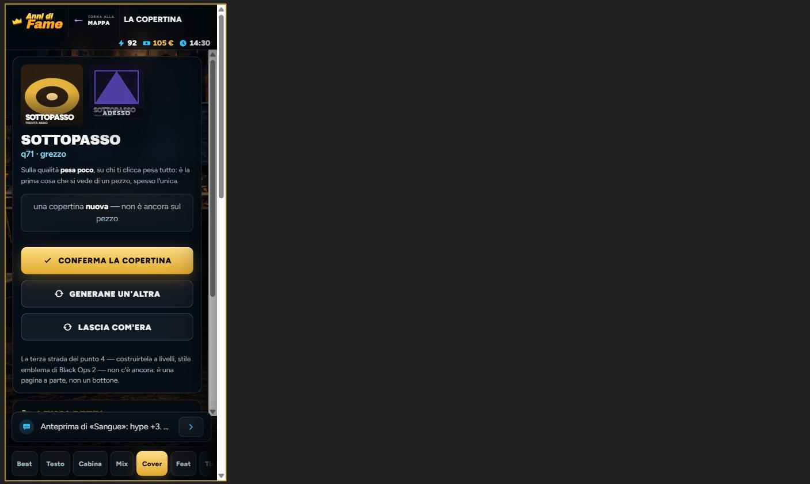
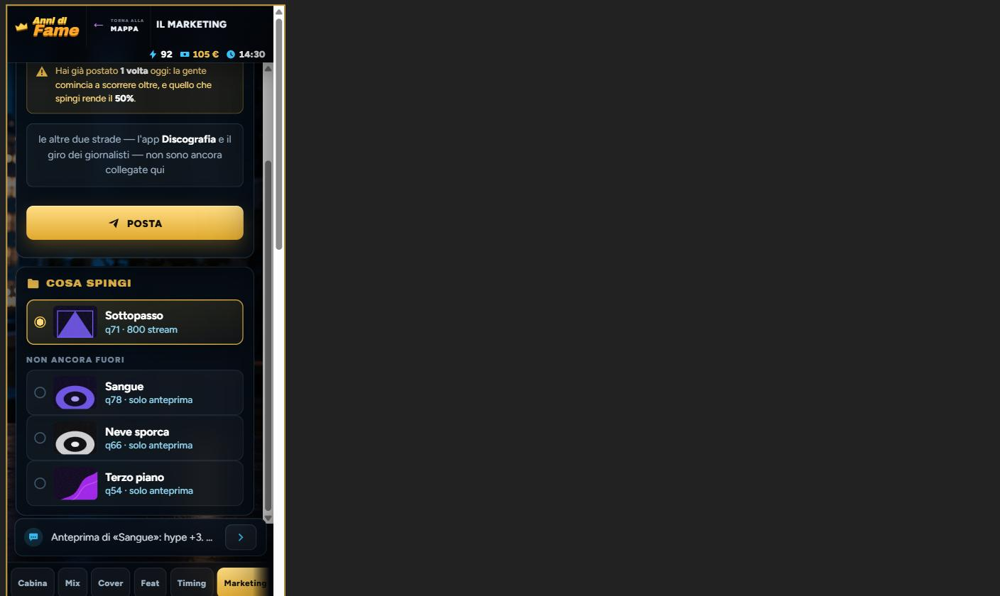
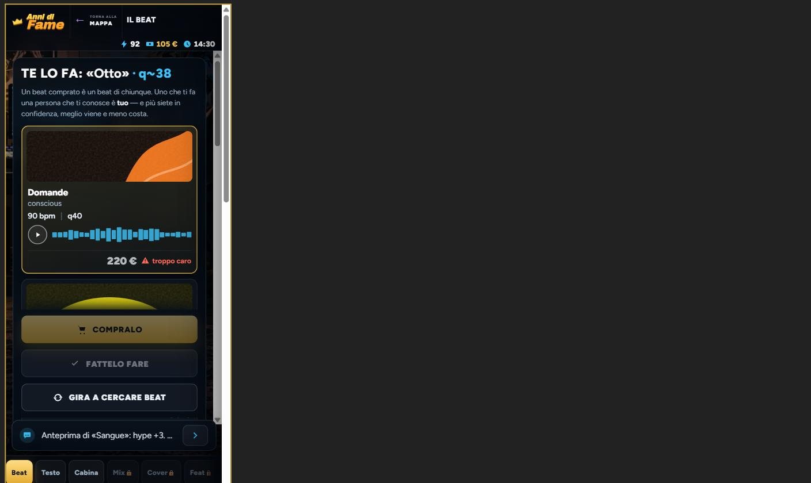

**RISOLTO (14/09/2026)** — `.toast` in `css/effects.css` ha `width:max-content` (col
tetto `max-width` che c'era già): `left:50%` da solo gli lasciava mezzo schermo. Vale per
tutti gli avvisi del gioco, non solo per questo.

### L'avviso «Prima il pezzo…» sul telefono è una colonnina di quattro righe

- **dove** — `frontend/css/effects.css:14-17` (`.toast{position:fixed;left:50%;...
  max-width:min(92vw,460px)}`), chiamato da `frontend/js/game/studio.js:1373`.
- **cosa succede** — il toast è `position:fixed` con `left:50%` e nessuna larghezza: la
  larghezza «a misura del contenuto» si ferma allo spazio che resta a destra della metà
  dello schermo. A 390 il riquadro viene largo 188 px e alto 109 (quattro righe di testo),
  a 360 viene 172 × 122 (cinque righe). Il `max-width` non serve a niente, perché il
  vincolo vero è più stretto. Sul computer non si vede: 575 px bastano a tutto. È l'unico
  avviso che il giocatore *deve* leggere nello Studio nuovo — è quello che spiega perché
  le cinque linguette sono chiuse — e arriva così.
- **come si vede** — 390 × 844, partita senza pezzi (o `G.songs = []; renderStudio()`),
  Studio, tocca «Mix».
  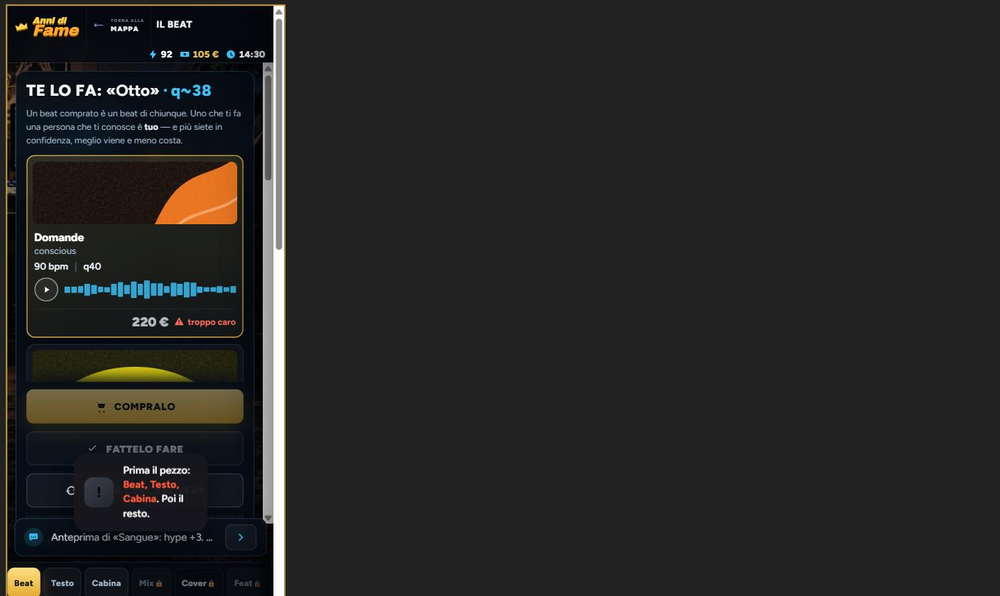
- **quanto pesa** — si legge, ma è brutto e sta sopra ai tasti del pannello. Non è di
  oggi (vale per ogni toast del gioco sul telefono), ma oggi è diventato parte del
  percorso. Da sistemare con calma.

**RISOLTO (14/09/2026)** — l'etichetta è «proposta», che ci sta.

### A 360 «da confermare» nell'elenco della Cover è tagliato: si legge «da conf…»

- **dove** — `frontend/js/game/studio.js:964` (la riga piccola
  `q71 · generata · da confermare`) con `frontend/css/studio.css:182-183`
  (`.stchi span{...white-space:nowrap;overflow:hidden;text-overflow:ellipsis}`).
- **cosa succede** — resta sulla riga piccola, come chiesto, ma non ci sta: il testo
  vuole 184 px e la riga ne ha 154 (a 360 con la barra del computer) o circa 169 (su un
  telefono vero a 360): in tutti e due i casi l'ultima parola, che è quella che dice
  qualcosa, sparisce nei puntini. A 390 ci sta (184 su 184, giusto giusto: basta una
  parola in più e salta anche lì).
- **come si vede** — 360 × 800, Cover, «Generane un'altra», scorri all'elenco «I tuoi
  pezzi».
  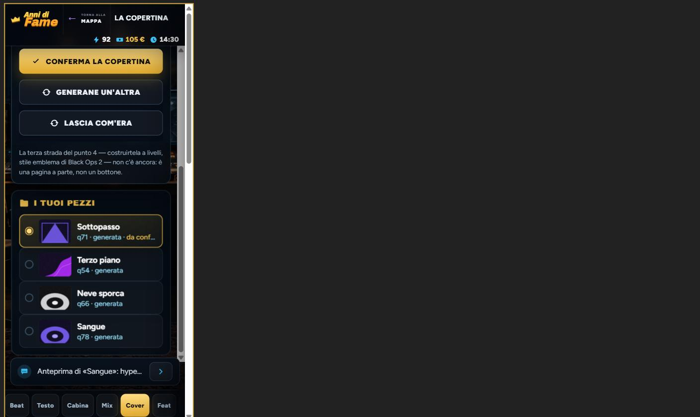
- **quanto pesa** — si vede ma si gira intorno: al centro c'è scritto la stessa cosa
  («non è ancora sul pezzo»). Da sistemare con calma.

**RISOLTO (14/09/2026)** — in `css/stretto.css` la copertina «di adesso» scende a 72 punti
(la proposta resta a 110): si vede subito quale è quale, e la fascia «ADESSO» copre meno.

### Sul telefono la copertina «grande» e quella «di adesso» sono quasi uguali, e l'etichetta copre il titolo

- **dove** — `frontend/css/stretto.css:220` (`.stcopertina{width:110px;height:110px}`
  sotto i 520) contro `frontend/css/studio.css:225`
  (`.stcopertina.stprima{...width:96px;height:96px}`), e `studio.css:226-228` per la
  fascia «adesso».
- **cosa succede** — sul computer la proposta è 180 e quella di adesso 96: si capisce al
  volo qual è la nuova. Sotto i 520 la proposta scende a 110 ma `.stprima` resta a 96
  (ha due classi, vince sempre): 110 contro 96, si vede a malapena chi è la grande, e la
  gerarchia «al centro lei, accanto quella di adesso» si perde. In più la fascia scura con
  scritto «ADESSO» sta in fondo alla copertina piccola, esattamente dove la copertina
  generata scrive il titolo del pezzo: i due testi si sovrappongono e non si legge né
  l'uno né l'altro (questo a tutte le misure, anche sul computer).
- **come si vede** — 390 × 844 o 360 × 800, Cover, «Generane un'altra»: guarda le due
  copertine in alto.
  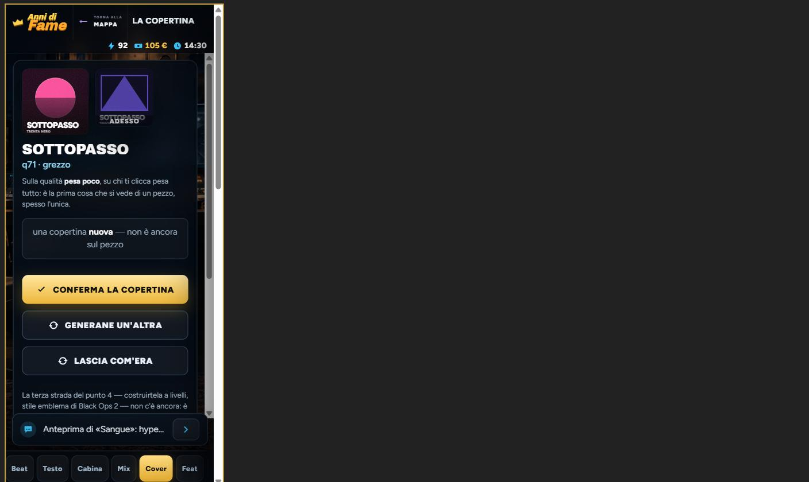
- **quanto pesa** — si vede ma si gira intorno (c'è comunque l'etichetta e c'è il
  riquadro «non è ancora sul pezzo»). Da sistemare con calma.

**APERTO, di proposito** — non è di oggi: è come sono impilate le colonne sotto i 980 punti
(`stretto.css`, il centro prima di tutto) e vale per ogni sezione con un elenco a sinistra
(Cabina, Mix, Timing). Scorrere in cima a ogni tocco sarebbe una scelta di navigazione per
tutto lo Studio, e va decisa una volta, non da dentro questa task.

### Nel Marketing tocchi un pezzo in fondo e la risposta compare in cima, fuori dallo schermo

- **dove** — `frontend/css/stretto.css:185-186` (`.stmid{order:1}` e `.stsx{order:2}`:
  sul telefono il centro sta sopra e gli elenchi sotto) con `frontend/js/game/studio.js:202-209`
  (`studioSegna` → `renderStudio()`, che ridisegna senza toccare lo scorrimento).
- **cosa succede** — per arrivare a «Non ancora fuori» devi scorrere in fondo; tocchi
  «Sangue» e il pannello che cambia («ANTEPRIMA: «Sangue» · q78» col suo testo) è quello
  sopra, che a quel punto sta sotto alla fascia alta: a 390 il titolo è tagliato (si
  vede solo «q66» che spunta), a 360 sta a −28 px, cioè del tutto fuori. Il tasto d'oro
  resta in vista in tutti e due i casi perché il pannello dell'anteprima è corto, ma
  quello che ti dice *cosa* stai per fare non lo vedi finché non risali. Con la Promo
  (pannello più lungo) resta in vista ancora meno.
- **come si vede** — 390 × 844, un pezzo fuori e tre no, Marketing, scorri in fondo e
  tocca un pezzo di «Non ancora fuori».
  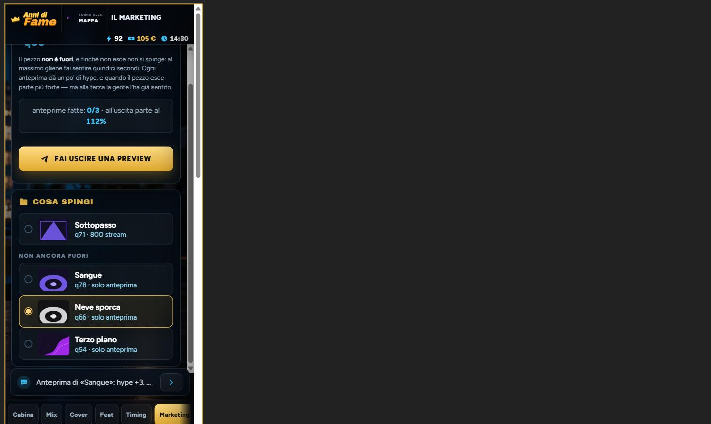
  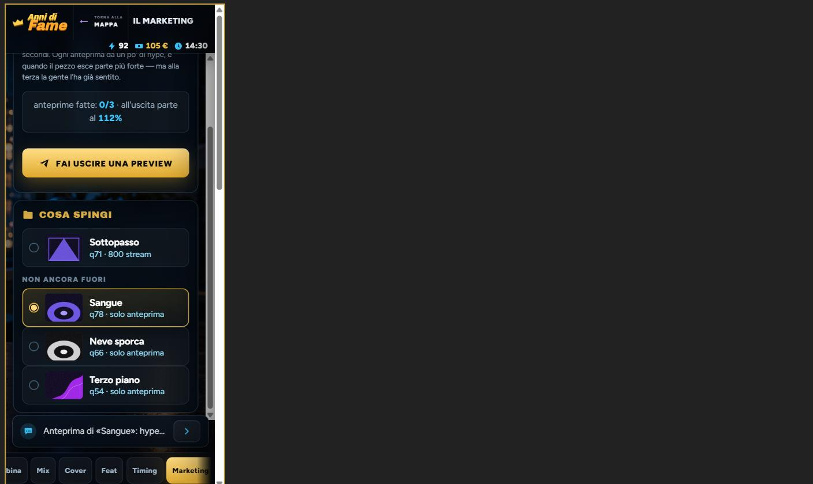
- **quanto pesa** — si vede ma si gira intorno: la riga si accende d'oro e il pollice sa
  che ha toccato. Ma è lo stesso problema per Mix, Timing e Cover (tutti gli elenchi
  che stanno sotto al centro). Da sistemare con calma.

**APERTO, di proposito** — è lo stesso `stCapo()` di tutte le sezioni («SPINGI: «Sottopasso»
· q71», «MIXI: …»): il numero va a capo da solo con qualunque titolo lungo, non solo qui.
Si sistema in `stCapo` per tutte insieme, con `white-space:nowrap` sul numero e il titolo
che si accorcia — non l'ho fatto in questa task per non toccare otto schermate all'ultimo.

### Il capo «ANTEPRIMA: «Neve sporca» · q66» va a capo lasciando «· q66» da solo

- **dove** — `frontend/js/game/studio.js:1092` (`stCapo("Anteprima", ant.t, "q" + ant.q)`)
  con `frontend/css/studio.css:198-199` (`.stcapo{font-size:22px;...word-break:break-word}`).
- **cosa succede** — a 390 la riga è larga 306 e il capo non ci sta: la seconda riga è
  solo «· q66», col puntino in testa. A 360 uguale con «Sangue». Cosmetico.
- **come si vede** — Marketing, tocca un pezzo di «Non ancora fuori», scorri in cima.
  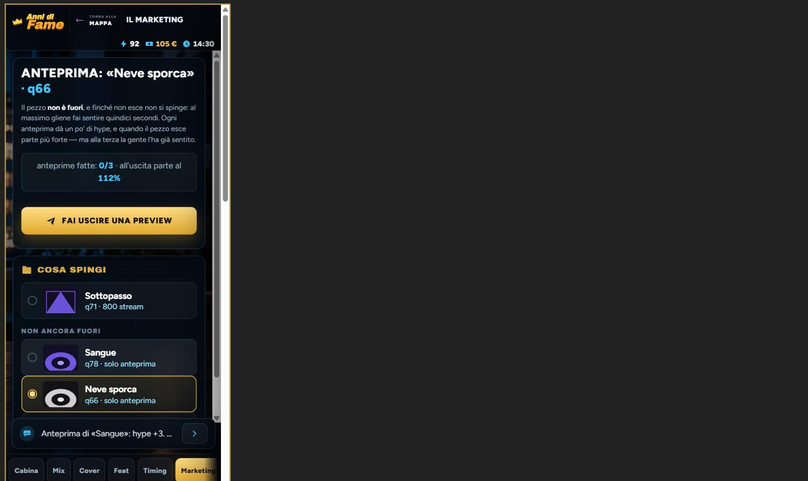
- **quanto pesa** — si vede ma si gira intorno.

**RISOLTO (14/09/2026)** — `scroll-padding-inline:12px` su `.sttabs`: `scrollIntoView`
rispetta il margine della striscia.

### La prima linguetta si apre attaccata al bordo sinistro, senza il suo margine

- **dove** — `frontend/js/game/studio.js:1305-1307`
  (`acceso.scrollIntoView({block:"nearest", inline:"nearest"})`), con il `padding` della
  striscia in `frontend/css/stretto.css:215` (`.sttabs{...padding:8px 10px ...}`).
- **cosa succede** — con le cinque chiuse la linguetta accesa è «Beat», la prima. Lo
  `scrollIntoView` la porta a filo del bordo del contenitore, cioè scorre la striscia di
  10 px e si mangia il margine sinistro: «Beat» parte a x = 0, attaccata allo schermo,
  mentre tutte le altre hanno il loro respiro. Si vede a 390 (12 px) e a 360 (10 px).
- **come si vede** — Studio con la partita senza pezzi, guarda in basso a sinistra.
  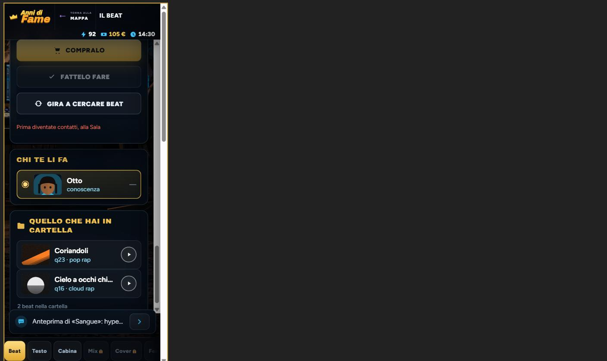
- **quanto pesa** — si vede ma si gira intorno.

## Giro del 15/09/2026 (backend-allineato, fine task `task/studio-cinque-linguette`)

La task non ha toccato `backend/`. `node scripts/controlla-backend.js` verde, `npm run
prova` 183 a posto. Le otto coppie di migrazioni SQLite/PostgreSQL dicono la stessa cosa
colonna per colonna (le sole differenze sono `AUTOINCREMENT` contro `GENERATED BY DEFAULT
AS IDENTITY` e un `ALTER TABLE` doppio in `008_diario.sql`, che è dialetto e basta):
niente che fermi il passaggio a PostgreSQL. Il conto delle «20 tabelle» in `README.md`
torna. Una sola voce, di documento.

### `README-API.md` non sa che `POST /api/account` promuove l'ospite a email

**Sistemato (15/09/2026), nello stesso giro:** §6 ha il terzo esito e la nota 3 dice il
presente (`README-API.md`, «Terzo esito, con `tipo: "email"`»).

- **dove** — `backend/README-API.md:462-464` (§6 `POST /api/account`, le risposte) e
  `backend/README-API.md:1100-1102` («Note e limiti attuali», punto 3). Il codice è
  `backend/server.js:236-246` e `frontend/js/net/online.js:176-182`.
- **cosa succede** — dal commit `cb502a7` (12/09, «collega account artista e cloud») una
  `POST /api/account` con `tipo: "email"` mandata **con** una `x-sessione` di un account
  ospite non crea un secondo account: promuove quello stesso (`archivio.collegaIdentita`)
  e risponde `200 { account, token }`, con il token che è lo stesso della sessione
  corrente. `registraConMail()` nel gioco manda apposta la sessione. Il documento invece
  elenca solo `201 { account, identita, token }` per il nuovo account e `200 { account,
  token }` per «un'identità store già registrata» — questo terzo caso non c'è — e la nota 3
  dice il contrario del vero: «`ONLINE.registraConMail()` non converte l'account ospite
  corrente. Crea un nuovo account email e sostituisce il token locale; non trasferisce
  automaticamente artista e carriera». Dal 12/09 li trasferisce, ed è proprio quello il
  senso del fix.
- **come si vede** — `backend/prova.js` ha la prova del caso (aggiunta nello stesso
  commit); il documento a fianco racconta ancora il comportamento di prima.
- **quanto pesa** — da sistemare con calma: è solo documento, ma è il caso peggiore
  della lista (rotta presente in tutti e due con una risposta che il documento non
  conosce), e nessun controllo automatico lo becca. Proposta: in §6 aggiungere il terzo
  esito (`200 { account, token }` quando la sessione corrente è un ospite senza mail,
  con token invariato) e riscrivere la nota 3 al presente, o toglierla.


**RISOLTO (15/09/2026)** — commit `43e7555`.
## Giro del 15/09/2026 (segnala-problemi, fine task `task/studio-cinque-linguette`)

Controlli automatici tutti verdi: `npm run prova` 180 a posto e 0 no, `audit-regressioni.js`
337 ok e 0 falliti, `verifica:build` 33 ok e 0 falliti. Letto per intero il diff
`main...HEAD` (quindici file) e poi, riga per riga, `studio.js` (il banco, le due porte del
feat, la Cover dentro a Fuori, `studioNumeri`, `renderStudio` e i click), `studio-elementi.js`
(`studioMandaFuori`, `studioRiprendi`, `studioUscitePronte`, la stima degli stream),
`actions.js` (`registra`, `mixa`, `pubblica`, `promo`, `anteprima`), `sim.js` (`songWeekly`,
`advanceWeek`), `covers.js` (`coverResa`), `telefono.js` (`telPromo`, `telSpingi`, il click su
`hb-tel`), `eventi-v2.js:1889`, e per i casi limite `posto.js` (`nuovaPersona`, `sistemaGente`,
`diventaOpp`), `rivals.js` (`nuovoRivale`, `faccia`), `modal.js`, `tempo.js` (`spendi`),
`hub.js` (`hubAzione`, `hubPronta`, `renderHub`) e `css/hub.css` (il telefono sotto i 1180).

I casi limite chiesti, uno per uno:

- **Salvataggi vecchi** — a posto. `studioDati()` (`studio.js:158-175`) migra `mixa`/`esce`
  al primo giro e, se nessuna delle due punta ancora a un pezzo, mette sul banco l'ultimo
  inciso e non uscito; una partita nuova parte con `banco = null`. Un pezzo senza `parti`
  mostra solo la q (`studioNumeri`), un pezzo con `feat` scritto come nome (com'era su
  `main`) si legge uguale.
- **Pezzo sul banco che sparisce** — a posto. I pezzi non si cancellano mai (nessun
  `songs.splice` in `js/`), il seed cambia solo in `studioCoverConferma` che sposta anche
  `banco` e `spingi` (`studio.js:634-637`), e le tre strade con cui un pezzo lascia il banco
  (`pubblica` in `actions.js:402`, il venerdì in `studio-elementi.js:729`, la cassaforte in
  `:672`) svuotano tutte il banco. Se il banco resta a un seed di un pezzo `tenuto`, la
  lettura torna `null` e le due linguette si chiudono: coerente.
- **Promo senza pezzi** — a posto. `telPromo()` con niente fuori e niente pronto dice «Niente
  da spingere» (`telefono.js:679`); con pezzi pronti ma niente fuori il tasto «Posta» è
  spento e la riga sotto manda all'anteprima. Il tasto «fallo sapere» dello Studio compare
  solo se c'è un pezzo uscito.
- **`G.studio.spingi` su un pezzo uscito nel frattempo** — a posto, e anzi è la strada
  giusta: `studioDaAnticipare` non lo trova più fra i pronti, `studioDaSpingere` lo trova fra
  gli usciti, e la promo parte su quello senza toccare niente. Se invece finisce in
  cassaforte, si ripiega sull'ultimo uscito senza righe accese — come già scritto nel giro
  del 14/09.
- **Rivale con lo stesso nome di uno in `G.gente`** — qui c'è un problema vero, vedi la
  terza voce.

Sei voci, nessuna blocca la partita. Le prime due sono quelle che contano.

### Nel riquadro dei numeri di Fuori il feat non compare mai: la sua parte è sempre zero

**Sistemato (15/09/2026), nello stesso giro:** `registra` legge `featBonus()` e `studioBonus()` in due costanti **prima** di `studioConsumaFeat()` e le scrive in `parti`; l'audit controlla l'ordine.

- **dove** — `frontend/js/game/actions.js:353` (`studioConsumaFeat()`, che stacca il feat e
  mette `G.studio.feat = null`) e subito dopo `actions.js:360` (`parti:{..., feat:featBonus(),
  ...}`), letto da `studioNumeri` in `frontend/js/game/studio.js:1235`.
- **cosa succede** — la qualità del pezzo il feat la conta giusta (`actions.js:349`, calcolata
  prima di staccarlo), ma la riga «QUALITÀ = Beat · Testo · Fonico · con X · Mix» che il
  documento promette non dirà mai «con X»: quando si scrive `parti.feat` il feat è già stato
  consumato, `featBonus()` non trova più nessuno e scrive 0, e `studioNumeri` mostra la voce
  solo se è diversa da zero. Chi paga 120 € un rapper della classifica vede in Fuori una riga
  di numeri che non lo nomina, e sotto «ASCOLTI» compare «La gente di X» (quella legge
  `featFama`, che è a posto): la seconda riga dice che c'è, la prima no. Letto nel codice, non
  riprodotto in partita: il test di `prova.js:1434` usa un pezzo scritto a mano con `feat:0`.
- **come si vede** — Cabina, scegli un feat (chi conosci va bene), tieni la take, vai
  nell'Uscita: la riga «Qualità» non ha la voce del feat.
- **quanto pesa** — da sistemare con calma.


**RISOLTO (15/09/2026)** — commit `c4aa9e6`: `registra` legge le due costanti del feat **prima**
che `studioConsumaFeat()` lo liberi, e l'audit controlla l'ordine.
### Sul telefono la promo non si sceglie e l'anteprima non si raggiunge più

- **dove** — `frontend/js/game/studio.js:407-408` (`studioFalloSapere`: senza `telPC()`
  lancia `studioAzione("promo")` e basta), `frontend/css/hub.css:1273-1287` (sotto i 1180 px
  `body.in-hub .ptel{display:none}`), `frontend/js/game/telefono.js:55-88` (`HUB_APP_VECCHIO`,
  la griglia compatta, che LaFamegram non ce l'ha), `frontend/js/game/actions.js:474`
  (`need` dell'anteprima: «un pezzo scelto su LaFamegram»).
- **cosa succede** — «Che post fai?» vive solo nel telefono della plancia, e quel telefono
  sotto i 1180 px non c'è. Su un telefono vero quindi: il tasto «fallo sapere» spinge
  **sempre l'ultimo pezzo uscito**, senza la scelta del pezzo che il giro del 14/09 aveva
  appena aggiunto; e la mossa «Anteprima del pezzo» non ha più nessuna strada, perché l'unico
  posto in cui si sceglie il pezzo non uscito è LaFamegram. Ieri sul telefono a 390 la
  linguetta Marketing con i due elenchi funzionava (prova del 14/09, qui sopra): oggi quel
  pezzo di gioco sul telefono è sparito. Il documento della task lo sa e lo dice
  (`implementazioni/02-interfaccia-e-telefono.md`, «Una cosa da sapere, non risolta qui»):
  lo scrivo lo stesso perché il gioco esce sugli store del telefono ed è lì che conta.
- **come si vede** — finestra più stretta di 1180 px, un pezzo fuori e uno no: Studio,
  Uscita o Cabina, «fallo sapere» → parte la promo sull'ultimo uscito. Nessun posto dove
  fare l'anteprima.
- **quanto pesa** — si vede ma si gira intorno (la promo parte comunque); per l'anteprima
  non c'è un giro.


**RISOLTO (15/09/2026)** — branch `task/telefono-sul-telefono`: sotto i 1180 il telefono si alza a
schermo pieno da un tasto nella barra, e «fallo sapere» ci passa sempre. «Il telefono quando
lo schermo è un telefono» in `implementazioni/02-interfaccia-e-telefono.md`.
### Un rapper della classifica con lo stesso nome di uno della Sala non si può chiamare

- **dove** — `frontend/js/game/studio.js:279-280` (`studioRivaliChiamabili` scarta i rivali
  il cui **nome** sta già in `G.gente`), contro `frontend/js/game/posto.js:395-396` (i rapper
  della Sala pescano i nomi dagli stessi trenta di `RIV_NOMI`, guardando solo `G.gente` e
  mai `G.rivals`) e `rivals.js:46` (i rivali guardano solo `G.rivals`).
- **cosa succede** — i due elenchi si passano lo stesso mazzo di nomi senza parlarsi, quindi
  è normale che alla Sala giri un «Lupo» da fama 20 e in classifica ci sia un «Lupo» da tre
  milioni di ascolti: due persone diverse. Il filtro per nome li prende per la stessa
  persona e il Lupo della classifica sparisce da «Dalla classifica» senza dirlo; con tre
  rapper alla Sala e nove-undici in classifica succede quasi in ogni partita. Stessa radice,
  caso raro ma brutto: chiami un rivale, accetta, entra fra i contatti (`studio.js:303`), poi
  ci litighi alla Sala fino a `diventaOpp` (`posto.js:780`, rapporto a zero e tre punti
  sotto) — che crea un **secondo** rivale col suo nome in classifica, perché quello di
  partenza non è mai stato tolto. Il legame giusto sarebbe una cosa che non cambia (il
  `seed` del rivale, o un `rivale:true` con il suo nome), non il nome da solo.
- **come si vede** — partita dove alla Sala c'è un rapper con un nome che sta anche in
  classifica: in Cabina, sotto «Dalla classifica», quel nome manca.
- **quanto pesa** — da sistemare con calma.

### «Dalla classifica» mostra solo i sei più grossi, cioè quelli che dicono di no

**Sistemato (15/09/2026), nello stesso giro:** la lista è tutta la classifica, dal più grosso in giù — quelli della tua misura stanno in fondo e la colonna scorre.

- **dove** — `frontend/js/game/studio.js:1161` (`studioRivaliChiamabili().slice(0, 6)`), con
  l'ordine per ascolti calanti in `studio.js:281`.
- **cosa succede** — la classifica ha nove-undici nomi; in Cabina se ne vedono sei, i più
  grossi. Ma la probabilità che uno dica sì è il rapporto fra la tua misura e la sua
  (`studioFeatProbabilita`, `studio.js:270-276`): i sei più grossi sono esattamente quelli che
  a un giocatore piccolo rispondono «sì al 8%» e costano di più; quelli della sua misura, che
  direbbero sì e costerebbero una serata, stanno fuori dall'elenco e non c'è modo di
  arrivarci. Nel primo anno di gioco la porta della classifica è quasi solo una vetrina.
- **come si vede** — partita nuova, un paio di settimane, Cabina: sei righe con «sì al 8%»
  e prezzi da 200 € in su, e in classifica altri quattro nomi che non ci sono.
- **quanto pesa** — da sistemare con calma.


**RISOLTO (15/09/2026)** — commit `c4aa9e6`: «Dalla classifica» non si ferma più ai sei più
grossi, tutta la classifica in «Con chi».
### Chi accetta dalla classifica occupa un posto della Sala, e alla Sala arriva meno gente

- **dove** — `frontend/js/game/studio.js:303` (`G.gente.push(p)`) contro
  `frontend/js/game/posto.js:423-432` (`sistemaGente`: si aggiunge gente finché
  `G.gente.length < quante`, tetto 8, e il videomaker e il giornalista prendono il loro
  posto solo quando quel giro parte).
- **cosa succede** — ogni rivale che dice sì entra in `G.gente` e conta nel tetto. Con due
  feat comprati dalla classifica la Sala smette di far arrivare due persone: un beatmaker,
  un fonico, o proprio il videomaker (che serve al video del pezzo) e il giornalista, che
  arrivano solo se il giro di `sistemaGente` ha ancora posti liberi. Non si rompe niente,
  ma è un costo nascosto che il gioco non dice e che probabilmente nessuno ha scelto.
- **come si vede** — fai accettare due rivali nelle prime settimane, poi conta chi arriva
  alla Sala nelle settimane dopo: un posto in meno per ognuno.
- **quanto pesa** — da sistemare con calma.

### «Sì al 8%» e «Dice sì al 8%»: davanti alla vocale ci va «all'»

**Sistemato (15/09/2026), nello stesso giro:** `studioPercento()` mette «al» o «all'» secondo il numero (8, 11, 80–89).

- **dove** — `frontend/js/game/studio.js:1184` (la riga della classifica in Cabina) e
  `studio.js:340` (la finestra di conferma).
- **cosa succede** — con probabilità 8, 11, 80 e simili si legge «sì al 8%», che in
  italiano non si dice. Sono proprio i numeri che un giocatore piccolo vede di più.
- **come si vede** — Cabina, «Dalla classifica», partita giovane.
- **quanto pesa** — da sistemare con calma.

**RISOLTO (15/09/2026)** — commit `c4aa9e6`: «all'8%».

**Nota, non è un errore**: un rivale che dice no si può richiamare subito, all'infinito. Il no
costa 5 di energia e un'ora (`studio.js:327-331`), la probabilità non scende mai sotto l'8%
(`studio.js:274`), non c'è un «oggi no» né un ricordo del rifiuto: a forza di chiamare, prima
o poi dice sì, e dodici chiamate sono sessanta di energia. In più il sì non costa tempo, e il
no a fine giornata (dopo le tre) costa l'energia ma non l'ora, perché `GAME_TIME.spend` si
ferma prima delle 04:00 e non c'è un `canSpend` a monte come per il beat. È bilanciamento, e
sta tutto in `studioChiamaRivale`; se la porta della classifica sembrerà troppo facile, la
manopola è lì (un rifiuto che vale per la settimana basterebbe).

**Nota, non è un errore**: due cose piccole che non valgono una voce. I commenti di
`studio.js:653` («tutte e otto») e `studio.js:1454` («Otto linguette non ci stanno in riga»)
parlano ancora delle otto linguette: sono cinque, il codice sotto è giusto. E in
`telefono.js:674` e `:716` il titolo del pezzo entra nell'HTML senza passare da uno
`studioEsc`: nello Studio i titoli passano tutti di lì, sul telefono no — ma sul telefono era
già così prima di oggi (`telefono.js:492`, la discografia), e i titoli li scrive il giocatore
in una casella che il gioco controlla.

Due voci del 14/09 cambiano forma con questa task, senza essere risolte: «Nel Marketing
tocchi un pezzo in fondo e la risposta compare in cima» non riguarda più il Marketing (che
nello Studio non c'è) ma vale tale e quale per gli elenchi di Cabina, Mix e Uscita; «Il capo
ANTEPRIMA … va a capo» non esiste più come schermata, ma lo `stCapo` che va a capo è lo
stesso di «MIXI: «…» · q78» e resta aperto come scritto lì.

## Giro del 15/09/2026 (backend-allineato, task `task/app-post-e-take-senza-energia`, «c'è un secondo database?»)

La task (`e89eea7`) non ha toccato `backend/`. `node scripts/controlla-backend.js` verde,
`npm run prova` 183 a posto, 0 no. Le otto coppie di migrazioni SQLite/PostgreSQL sono
state confrontate colonna per colonna (tipo, `NOT NULL`, `DEFAULT`, `CHECK`, `REFERENCES`,
indici e vincoli): dicono la stessa cosa, le sole differenze sono dialetto (`INTEGER`
contro `BIGINT`/`DOUBLE PRECISION` come scritto in `schema.md` § 7, `AUTOINCREMENT` contro
`GENERATED BY DEFAULT AS IDENTITY`, `strftime` contro `EXTRACT(EPOCH)` nell'`UPDATE` della
004, l'`ALTER TABLE` doppio in una riga nella 008 PostgreSQL). **Niente che fermi il
passaggio a PostgreSQL.**

**Alla domanda «c'è un secondo database?»: no, non nel senso di un secondo strato dati.**
Dal `b2ea221` (01/09, «sotto il server ci puo' stare PostgreSQL») ci sono **due motori**
dietro a **uno strato dati solo**:

- `backend/database/db.js:30-38` (`scegliMotore`) legge `cfg.pg` oppure `process.env.ADF_PG`:
  se c'è un URL carica `postgres.js` e applica `migrazioni-pg/`, se no carica `sqlite.js`
  e applica `migrazioni/`. È l'unico punto di scelta, e si sceglie **all'avvio**, non per
  richiesta: **uno rimpiazza l'altro, non convivono** nello stesso processo.
- `backend/database/sqlite.js` (`node:sqlite`, `DatabaseSync`, un file:
  `ADF_DATI`, di suo `backend/database/dati/classifica.db`, `server.js:54`) e
  `backend/database/postgres.js` (libreria `pg`, pool, `?`→`$n`, transazioni con
  `AsyncLocalStorage`) espongono la stessa faccia: `esegui`, `uno`, `tutti`, `fai`,
  `insieme`, `chiudi`, `nome`.
- `backend/database/archivio.js` è l'unico file che parla col database e **non sa quale ha
  sotto** (`archivio.js:25`, `let A = null`); `server.js` sa solo il nome per il log
  (`server.js:601`). `copia.js:30-33` si tira indietro con `ADF_PG` (rimanda a `pg_dump`);
  `prova.js:34-43` accende PostgreSQL **solo** con `--pg` esplicito (`npm run prova-pg`),
  non basta la variabile nell'ambiente.
- `ADF_PG` si può mettere in `backend/.env.local` (fuori da git, `.gitignore:13`), letto
  da `backend/ambiente.js:27-46`; l'ambiente vero vince sul file. Oggi sul disco **non c'è**
  né `.env.local` né un secondo file `.db`: in `dati/` c'è solo `classifica.db` (con
  `-wal`/`-shm`) e la cartella `copie/`.
- Nessuna traccia di un terzo motore o di un ORM: `package.json` ha `pg`, `jose`, `zod`,
  e nel codice si `require` solo `pg` (`postgres.js:46`) e `node:sqlite`.

La documentazione descrive entrambi i motori e come si scelgono: `backend/README.md:15-23`
e `:131-133`, `backend/database/README.md:19` e `:514-632` («I due motori»),
`backend/database/schema.md:23-34` e § 7-8, `backend/README-API.md:1084-1085`,
`documentazione/dipendenze.md:73`. Sono a posto. Quello che è rimasto indietro è sotto.

### `README-API.md` non conosce tre cose entrate con la difficoltà (03/09)

- **dove** — `backend/README-API.md:553-583` (§11 `POST /api/artista`, corpo e regole),
  `backend/README-API.md:662-669` (§15 `GET /api/classifica`, tabella delle query) e
  `backend/README-API.md:748-749` (§22 `PUT /api/carriera/:slot`, gli errori). Il codice è
  `backend/server.js:351` (`difficolta: b.difficolta` all'iscrizione),
  `backend/server.js:409-413` (il filtro `?difficolta=` sulla classifica, fra i tre valori
  di `archivio.DIFFICOLTA`) e `backend/server.js:465-468` (`403 non-e-tuo` se
  `artistaId` nel corpo non è un artista dell'account).
- **cosa succede** — il commit `42f10ae` (03/09, «la difficolta accanto all'artista, e
  tre buchi tappati») ha toccato `server.js` ma non `README-API.md`, scritto il giorno
  prima (`442a676`). Risultato: il corpo di `POST /api/artista` nel documento non ha
  `difficolta` (mentre `POST /api/punteggio` a riga 621 ce l'ha); la tabella delle query di
  `GET /api/classifica` elenca `da`, `quanti`, `io`, `citta`, `genere` e non `difficolta`;
  `PUT /api/carriera/:slot` dice «Altri errori: `400 stato-mancante`, `413
  carriera-troppo-grande`» e non il `403 non-e-tuo`, che è proprio uno dei «tre buchi
  tappati».
- **come si vede** — `backend/prova.js` prova tutte e tre le cose (cerca `difficolta` e
  `non-e-tuo`); il documento a fianco non le racconta. `controlla-backend.js` confronta
  solo i nomi delle rotte, quindi non lo becca.
- **quanto pesa** — da sistemare con calma. Proposta: aggiungere `"difficolta"` al corpo
  di §11 con la regola (uno dei tre valori, se no `anni-di-fame`), una riga `difficolta`
  alla tabella di §15, e `403 non-e-tuo` agli errori di §22.


**RISOLTO (15/09/2026)** — branch `task/documenti-backend-in-pari`: `difficolta` nel corpo e
nelle regole di §11 (i tre valori, il ripiego su `anni-di-fame`), una riga `difficolta` nella
tabella di §15 con la frase «la graduatoria resta una sola per tutti», e `403 non-e-tuo` fra
gli errori di §22 con il perché.
### La tabella «Variabili d'ambiente» di `README-API.md` è a metà, e ne cita una che non esiste

- **dove** — `backend/README-API.md:1079-1098`. Il confronto è con `backend/README.md:125-160`
  (la tabella completa, difesa da `scripts/controlla-backend.js:99-113`) e col codice.
- **cosa succede** — mancano sette manopole che il codice legge: `ADF_BOT_MINIMO`
  (`server.js:55`), `ADF_PG_CONNESSIONI` (`postgres.js:88`), `ADF_APPLE_JWKS`,
  `ADF_GOOGLE_JWKS`, `ADF_STEAM_URL` (`accessi.js:29-31`), `ADF_COPIE` (`copia.js:24`),
  `ADF_TIENI` (`prova.js:961`). In più a riga 969 compare `ADF_CATALOG_URL` come se fosse
  una variabile del server: è una costante del **frontend**
  (`frontend/js/game/eventi-v2.js:16`), non una manopola d'ambiente. Il controllo
  automatico difende solo `backend/README.md`, quindi le due tabelle possono divergere
  senza che nessuno se ne accorga — ed è successo.
- **come si vede** — `grep -o "ADF_[A-Z_]*" backend/README-API.md | sort -u` contro lo
  stesso su `backend/README.md`.
- **quanto pesa** — da sistemare con calma. Proposta: o si completa la tabella, o (meglio)
  si toglie e si rimanda a quella di `backend/README.md`, che è l'unica difesa da un
  controllo; e a riga 969 si dice che `ADF_CATALOG_URL` è del gioco.


**RISOLTO (15/09/2026)** — presa la strada «meglio»: la tabella è **tolta**, al suo posto il
rimando a «Le manopole» di `backend/README.md`, l'unica difesa da `controlla-backend.js`, con
scritto perché non ce ne sono due; restano nominate `ADF_PG` e `ADF_ADMIN`, che servono a
leggere le rotte. Alla seconda `fetch()` c'è scritto che `ADF_CATALOG_URL` è una costante del
gioco, non una manopola del server.
### `backend/database/README.md` dice ancora che `schema.md` «non sta in git»

- **dove** — `backend/database/README.md:8-10` («**Non sta in git** (come `backend.md`): è
  il foglio su cui si lavora, non il riferimento») e `backend/database/README.md:641`
  («schema.md — il foglio di disegno, commentato (fuori da git)»). Lo stesso in
  `.claude/agents/backend-allineato.md:11` («`backend/database/schema.md`, fuori da git»).
- **cosa succede** — dal commit `cdd86d9` (13/09, «schema.md entra in git, allineato alle
  migrazioni vere») il file è tracciato (`git ls-files backend/database/schema.md` lo
  trova) e `controlla-backend.js` lo confronta con le migrazioni. Chi legge il README dei
  dati pensa il contrario, e può non cercarlo in git o non committarne le modifiche.
- **come si vede** — `git ls-files backend/database/schema.md`.
- **quanto pesa** — da sistemare con calma: due righe di README e una del prompt
  dell'agente.


**RISOLTO (15/09/2026)** — le due righe del README dei dati e quella del prompt di
`backend-allineato` dicono «in git dal 13/09/2026», e il README spiega anche perché ci è
entrato (si era allontanato dalle migrazioni senza che nessuno lo rileggesse).
### Il README di radice dice «una dipendenza sola (`pg`)», il backend ne ha tre

- **dove** — `README.md:9` («Node + SQLite, una dipendenza sola (`pg`)»). Il vero è in
  `backend/package.json:22-26`: `jose`, `pg`, `zod`.
- **cosa succede** — `eef9588` e `d879f75` (10/09) hanno aggiunto `jose` e `zod` al
  `package.json` senza che nessun file le importi (`grep require jose|zod` nel backend non
  trova niente; `accessi.js:72` verifica ancora le firme a mano con `crypto.verify`).
  `documentazione/dipendenze.md:92-93` lo dice onestamente («`accessi.js` non la importa»,
  «nessuna rotta la importa»), il README di radice no. Non è un problema di codice; è che
  «una dipendenza sola» era l'argomento della regola vecchia, e non è più vero.
- **come si vede** — `README.md:9` contro `backend/package.json`.
- **quanto pesa** — da sistemare con calma: una riga. Resta aperta la scelta scritta in
  `dipendenze.md:201` (usare `jose` in `accessi.js`, `zod` nelle rotte), che è un lavoro
  vero e non di documento.


**RISOLTO (15/09/2026)** — la riga dice «tre dipendenze: `pg`, `jose`, `zod` — le ultime due
installate e ancora da usare», col rimando a `dipendenze.md`. Usarle resta il lavoro vero, che
non è di documento.
**Nota, non è un errore**: due commenti di testa parlano di un mondo prima di
PostgreSQL. `backend/server.js:12-13` dice «Sotto c'è SQLite (`database/`), senza niente da
installare» (mentre `server.js:32-33` elenca `ADF_PG`), e `backend/database/archivio.js:3-7`
dice «Il giorno che sotto ci sarà PostgreSQL, si riscrive questo file e basta — è il motivo
per cui esiste»: è il contrario di quello che è successo, e che `db.js:13-15` spiega
(l'asincrono su SQLite «è il prezzo, piccolo, perché `archivio.js` sia uno solo invece che
due»). Il codice sotto è giusto; sono le premesse che sono invecchiate.


## Giro del 15/09/2026 (segnala-problemi, fine task `task/app-post-e-take-senza-energia`, commit `e89eea7`)

Controlli automatici tutti verdi: `npm run prova` 180 a posto e 0 no, `audit-regressioni.js`
340 ok e 0 falliti, `verifica:build` 33 ok e 0 falliti. Letti per intero il diff del commit
(quattordici file) e `sputa.js` riga per riga; poi, per quello che Sputa e la Cabina chiamano,
`telefono.js` (`schermataApp`, `renderTelefono`, il click su `hb-tel`), `actions.js`
(`registra`, `adfOggi`, `daIncidere`), `studio-elementi.js` (`studioTake`, `studioTakeAncora`,
`studioTakePresa`, `studioStrofa`, `studioBeatSuCui`), `studio.js` (`studioSezCabina`,
`studioAzione`), `ui.js` (`avviaAzioneDiretta`, la tile in `renderGioco`), `hub.js`
(`hubPronta`, `renderHub`), `rivals.js` (`nuovoRivale`, `vitaRivali`), `phases.js`
(`hypeCap`), `css/telefono.css` e `css/hub.css` (il telefono sotto i 1180). Tutte le
funzioni che `sputa.js` usa esistono e stanno in file caricati prima; nessun errore in
console.

Provato nel gioco vero con Playwright a 1400 e a 390: Sputa si apre, la barra esce, il
contatore conta, i 140 sono un tetto vero, il feed con i rivali è lo stesso riaprendo l'app,
«Rispondi» mette «@Nome», il fuoco si accende e resta; in Cabina 100 → 55 alla prima take,
43 alla seconda, «Tieni questa e chiudi» a 0 di energia arriva alla finestra del titolo e il
pezzo esce con la take scelta; dalla plancia «Registra il pezzo» senza take dice «SERVE una
take, in cabina».

Sei voci, nessuna blocca la partita. La prima è quella che conta: è un buco che il commit
ha aperto senza volerlo.

### La take pagata 45 sparisce se in Cabina tocchi un'altra strofa o un altro beat

- **dove** — `frontend/js/game/studio-elementi.js:314-322` (`studioTake`: se la chiave
  strofa+beat non è quella della take in corso, la take si rifà **vuota**), i tocchi che
  cambiano la chiave in `studio-elementi.js:806-808` (`data-strofa`, `data-incide`) e le
  righe che li disegnano nella stessa Cabina, `frontend/js/game/studio.js:1088-1095`.
- **cosa succede** — paghi 45 per la prima take, magari ti esce +5, poi tocchi un'altra
  strofa o un altro beat nella colonna «Che cosa incidi» (che sta nella stessa schermata):
  la take sparisce, il tasto torna «Registra la take · 45 energia», e se torni sul beat di
  prima la take **non torna** (provato: energia 55, take `[5]`, cambio beat → take `[]`,
  ricambio → ancora `[]`). Nessun avviso. Succede anche da solo: se compri un beat migliore
  in Beat o scrivi una strofa migliore, la scelta di default cambia e la take pagata se ne
  va. Prima di questo commit la prima take era gratis e il ripristino non costava niente:
  ora costa la sessione intera.
- **come si vede** — Studio, Cabina, con due beat o due strofe in mano: «Registra la take»,
  poi tocca l'altro beat.
- **quanto pesa** — si vede ma si gira intorno (basta non toccare niente dopo la take, ma
  nessuno lo dice).


**RISOLTO (15/09/2026)** — sullo stesso branch, prima del push. `studioTake()` non butta più la
take quando la targhetta cambia: la mette da parte in `d.takeAltre` con la sua chiave, e se
torni su quella coppia strofa+beat la ritrovi. Le take da parte finiscono quando chiudi un
pezzo (`studioTakePresa`), che è la fine della sessione. La nota vuota della Cabina lo dice
(«se cambi, le ritrovi tornando qui»). Un controllo nell'audit.
### La plancia e l'Agenda dicono che «Registra il pezzo» è gratis

- **dove** — `frontend/js/game/ui.js:295` (la tile: con `e:0` scrive «gratis») e
  `frontend/js/game/telefono.js:630` (l'Agenda del telefono: «Registra il pezzo · 0⚡»).
- **cosa succede** — la mossa costa zero sulla carta perché i 45 li chiede la take in
  Cabina, ma la tile sulla mappa e la riga dell'Agenda leggono `a.e` e dicono al giocatore
  che registrare è gratis / vale 0 energia. È falso: in tutto costa 45 come prima. Chi
  pianifica la giornata dalla plancia fa i conti sbagliati.
- **come si vede** — plancia, tile «Registra il pezzo» con strofa e beat in mano;
  telefono → Agenda → «Le tue mosse».
- **quanto pesa** — da sistemare con calma.


**RISOLTO (15/09/2026)** — `registra` ha `costoScritto()`, solo da mostrare: 45 finché non c'è
una take, poi «gratis» che a quel punto è vero. La tile (`ui.js`) e l'Agenda (`telefono.js`)
leggono quello; il costo che si scala resta `e:0`. Un controllo nell'audit.
### Dopo la prima barra del giorno l'hype in alto resta quello di prima

- **dove** — `frontend/js/game/sputa.js:199-200` (`sputaScrivi` chiama `save()` e
  `renderGioco()`, non `renderHub()`); la fascia con l'hype la ridisegna solo `renderHub`,
  `frontend/js/game/hub.js:743-747`.
- **cosa succede** — il fumetto dice «Il nome gira: +1 hype», `G.hype` sale di uno, ma il
  numero «Hype» nella fascia in alto non si muove finché qualcos'altro non ridisegna la
  plancia (provato: hype 5 → 6, la fascia dice ancora 5). Uno legge il fumetto, guarda in
  alto e pensa che non sia successo niente.
- **come si vede** — Sputa, prima barra del giorno, guarda «Hype» in alto.
- **quanto pesa** — da sistemare con calma.


**RISOLTO (15/09/2026)** — `sputaScrivi` chiama `renderHub()` (che ridisegna anche il telefono)
oltre a `renderGioco()`.
### Al tetto dell'hype Sputa promette «+1 hype» che non arriva

- **dove** — `frontend/js/game/sputa.js:193-197` (il fumetto esce sempre alla prima barra,
  l'`if(G.hype < tetto)` copre solo il numero) e `sputa.js:241-242` (il riquadro «La prima
  barra del giorno fa girare il nome: +1 hype»).
- **cosa succede** — in fase «Sconosciuto» il tetto dell'hype è 20 (`phases.js:15`): a 20 la
  prima barra del giorno non dà niente, giustamente, ma il fumetto dice lo stesso «+1 hype»
  e il riquadro sopra al foglio lo promette prima di scrivere (provato: hype 20, barra,
  fumetto «+1 hype», hype 20). Letto nel codice il perché, visto in partita l'effetto.
- **come si vede** — hype al tetto della fase, Sputa, scrivi una barra.
- **quanto pesa** — da sistemare con calma.


**RISOLTO (15/09/2026)** — al tetto il fumetto dice «il nome gira, ma qui sei già al tetto:
serve il passo dopo», e il riquadro sopra al foglio lo dice prima di scrivere.
### Il «dado fermo» dei rivali si sblocca quando un rivale esce con un pezzo

- **dove** — `frontend/js/game/sputa.js:134` (il seme è `r.seed + settimana`) e `:158`
  (l'id della barra, a cui è attaccato il fuoco), contro `frontend/js/game/rivals.js:78`,
  che a ogni pezzo nuovo del rivale gli **cambia il seed**.
- **cosa succede** — il documento e il commento in cima al file promettono che riaprendo
  l'app trovi le stesse barre: vale finché nessun rivale pubblica. Quando uno esce con un
  pezzo (succede ogni settimana a qualcuno) tutte le sue barre si rifanno da capo, comprese
  quelle della settimana scorsa, che adesso parlano del pezzo di questa settimana; e il fuoco
  che avevi messo resta segnato su un id che non esiste più (provato: due barre su «Fumo Blu»
  → tre barre diverse, una su «Pezzo nuovo», fuoco rimasto in `G.sputaFuoco` a vuoto). Non è
  grave, ma è il contrario di quello che la voce promette, e un giocatore attento se ne accorge.
- **come si vede** — Sputa, segna una barra di un rivale, aspetta che quel rivale esca con un
  pezzo (log «X è uscito con …»), riapri Sputa.
- **quanto pesa** — da sistemare con calma.


**RISOLTO (15/09/2026)** — il dado e l'id delle barre partono da `sputaSemeRivale(r)`, un
numero fisso tirato dal **nome** del rivale, non da `r.seed` (che è il seme della copertina e
`rivals.js` rifà a ogni pezzo nuovo). Le barre e il fuoco restano dove stavano. Resta una cosa
piccola, voluta: la barra della settimana scorsa che parlava del pezzo nuovo di allora adesso
nomina quello di oggi (`{ult}` si legge al ridisegno) — non si salva il testo per una riga.
### Sputa sul telefono vero non c'è

- **dove** — `frontend/css/hub.css:1273-1287` (`body.in-hub .ptel{display:none}` sotto i
  1180 px) e `frontend/js/game/sputa.js:255-260` (si registra solo nel telefono della
  plancia, in `HUB_APP` e `HUB_APP_VECCHIO`).
- **cosa succede** — è lo stesso buco della voce «Sul telefono la promo non si sceglie e
  l'anteprima non si raggiunge più» del giro precedente: il telefono della plancia sotto i
  1180 px è nascosto, e Sputa vive solo lì. A 390 px `hb-tel` è largo zero e l'app non si
  apre da nessuna parte (provato). Il commit ha aggiunto una seconda app a un telefono che
  sul telefono non si vede; la scrivo perché il gioco esce sugli store ed è la seconda volta
  in due giorni che una cosa nuova finisce dietro a quella tenda.
- **come si vede** — finestra più stretta di 1180 px: non c'è un tasto per Sputa.
- **quanto pesa** — da sistemare con calma (l'hype che dà è uno al giorno, la partita va
  avanti senza).


**APERTO, di proposito** — non si sistema qui: è lo stesso buco della promo e dell'anteprima
sotto i 1180 px, e va chiuso in una task sola che decida dove sta il telefono quando lo
schermo è un telefono. È il primo punto di «Da fare adesso» in
`implementazioni/implementazioni.md`.

**RISOLTO (15/09/2026)** — stesso branch, stessa cosa: il telefono alzato ha tutte le app,
Sputa compresa; la griglia compatta in cui le app si dovevano iscrivere una seconda volta
non c'è più.
**Nota, non è un errore**: cose piccole che non valgono una voce. `sputa.js:259` scrive «1
barre tue» nella griglia vecchia del telefono (manca il singolare). I due tasti sotto le barre
dei rivali — il fuoco e «Rispondi» — sono alti 21 px (`css/telefono.css`, `.tspfuoco` e
`.tsprisp`, misurati in partita): sotto i 44 di `tocco.css`, ma quel telefono si vede solo
dai 1180 px in su, quindi quasi sempre col mouse; se un giorno il telefono torna sul
telefono, ci vorrà la presa. Il documento in `04-musica-e-suoni.md` dice che «i salvataggi
con una take vecchia in corso la trovano come l'avevano lasciata»: vero, e quella take era
gratis, quindi chi carica una partita salvata in Cabina prima di questo commit registra un
pezzo senza spendere i 45, una volta sola — è una scelta, non un bug. Infine `registra`
chiama `studioTakeManca()` dal suo `need`, che viene letto a ogni ridisegno della plancia e
dell'Agenda: `studioTake()` scrive in `G.studio` anche da lì, ma scrive sempre la stessa cosa
che scriverebbe la Cabina, quindi non fa danni; lo segno perché un `need` che scrive nel
salvataggio è una cosa da sapere.

## Giro del 15/09/2026 (controllo mirato sul commit ac64bc4)

Controlli automatici tutti verdi: `npm run prova` 180 a posto e 0 no, `audit-regressioni.js`
343 ok e 0 falliti, `verifica:build` 33 ok e 0 falliti. Letto il diff del commit per intero e,
attorno a quello che tocca, `studio-elementi.js` (`studioTake`, `studioTakeElenco`,
`studioTakeAncora`, `studioTakeManca`, `studioTakePresa`, `studioStrofa`, `studioBeatSuCui`,
`studioTakeChiave`), `actions.js` (`registra` tutta, `daIncidere`, `adfDailyCounts`),
`ui.js` (la tile in `renderGioco`, `avviaAzioneDiretta`), `telefono.js` (`schermataAgenda`,
`renderTelefono`, `telVaiApp`), `hub.js` (`renderHub`), `sputa.js` riga per riga,
`rivals.js` (`nuovoRivale`, `vitaRivali`), `copertine.js` (`chiediTitolo`), `fx.js` (`toast`).

Provato nel gioco vero con Playwright a 1400 px, col server di sviluppo. Le sei correzioni
fanno quello che le note RISOLTO dicono:
- la take pagata si mette da parte e torna (energia 200 → 155 alla prima take, cambio beat →
  la take sta in `takeAltre` con la sua targhetta, ricambio → è di nuovo lì, identica);
- la tile dice «45 energia» + «SERVE una take, in cabina» senza take e «gratis» con una take;
  l'Agenda «45⚡» e poi «0⚡»; `costoScritto` è letto solo da quelle due righe,
  `avviaAzioneDiretta` scala ancora `en2` (l'energia non si muove al «Registra»);
- dopo la prima barra del giorno la fascia in alto passa da 5 a 6 con il numero, e l'app
  resta aperta su Sputa (`renderHub` ridisegna il telefono tenendo `TEL_APP`); Sputa si
  scrive solo dal telefono della plancia, quindi `renderHub` trova sempre i suoi pezzi;
- al tetto (20 in «Sconosciuto») il riquadro e il fumetto dicono tutti e due «sei già al
  tetto», l'hype resta 20;
- cambiando `r.seed` e `r.ult` a un rivale, le barre della settimana scorsa restano con lo
  stesso id e lo stesso testo.

Due voci, nessuna blocca la partita. La prima è la più grossa che ho trovato in questi giri
sulla Cabina, e **non l'ha aperta questo commit**: c'è da quando `studioTakePresa` guarda la
targhetta (08/09/2026). La scrivo qui perché il commit tocca proprio quella funzione, e
perché il giro precedente aveva scritto «il pezzo esce con la take scelta» — non era vero,
avevo guardato che il pezzo uscisse, non con quale numero.

### La take che scegli in Cabina non finisce mai sul pezzo: esce sempre col dado nuovo

- **dove** — `frontend/js/game/actions.js:350-351` (`registra.run`: la strofa e il beat si
  tolgono dalla lista **prima** di leggere la take, che sta alla riga `:359`) contro
  `frontend/js/game/studio-elementi.js:427-435` (`studioTakePresa` confronta la targhetta
  della take con `studioTakeChiave()`, che dopo quel `splice` è di un'altra coppia — o
  vuota — e allora butta la take e tira `rnd(-5,6)`).
- **cosa succede** — paghi 45 per la prima take e 12 per le altre, scegli la buona, la Cabina
  scrive «esce con q76» e il pezzo esce con q69: il numero della take non conta niente, si
  tira sempre un dado nuovo. Provato tre volte di fila con una strofa e un beat soli: take
  scelte 4, 5 e 6 (q73, q75, q76 in Cabina), sul pezzo `parti.take` 4,99, 3,07 e −2,70 —
  numeri con la virgola, cioè il dado, non una take (le take sono interi). Prima del commit
  era uguale. In pratica tutta l'energia spesa in Cabina oltre alla prima take è buttata, e
  la prima serve solo a sbloccare il tasto.
- **come si vede** — Studio → Cabina, tre take, tieni la migliore e guarda il «q» che ti
  promette; «Tieni questa e chiudi», titolo; in Uscita il pezzo ha un altro q.
- **quanto pesa** — si vede ma si gira intorno (il pezzo esce lo stesso, ma la Cabina è una
  presa in giro finché sta così: il giocatore paga per un numero che non arriva).


**RISOLTO (15/09/2026)** — sullo stesso branch, prima del push. `registra` legge
`studioTakePresa()` **prima** di sfilare strofa e beat dalla lista, così la targhetta combacia.
Provato nel gioco vero tre volte con la take a +5 scelta in Cabina: il pezzo esce con
`parti.take` 5 e la qualità uguale a quella promessa (74/75/75). Un controllo nell'audit
guarda l'ordine delle due righe.
### La barra della settimana scorsa di un rivale cambia frase quando lui esce con un pezzo

- **dove** — `frontend/js/game/sputa.js:155` (`if(r.hot > 0 && i === 0) pool = "nuovo"`) e
  `:168` (il fuoco ×1,6 se `hot`): le barre si rifanno da `sputaSemeRivale` a ogni apertura,
  ma la scelta del **mazzo** legge `r.hot` di adesso, non di quella settimana.
- **cosa succede** — è quello che resta della voce «Il dado fermo dei rivali si sblocca»: gli
  id e il dado adesso tengono, ma quando un rivale passa da `hot` 0 a 3 (esce con un pezzo,
  `rivals.js:78`) la sua prima barra della settimana scorsa cambia frase per intero, non solo
  il nome del pezzo (provato su «Zeta»: «Da Roma con niente in tasca e tutto nella testa» →
  «Pezzo nuovo. Tre giorni e già la cantano sotto casa mia»), e il fuoco che ci avevi messo
  resta su una frase che non è più quella. La nota RISOLTO dice che «{ult}» può cambiare: qui
  cambia tutta la barra. Vale anche al contrario, quando `hot` torna a zero tre settimane
  dopo, e quando cominci a essere nominato (`sputaTiNominano` cambia i mazzi).
- **come si vede** — Sputa, leggi una barra «flex» o «città» di un rivale, aspetta il log «X è
  uscito con …», riapri Sputa.
- **quanto pesa** — da sistemare con calma.


**LASCIATO (15/09/2026)** — è la cosa piccola già scritta sotto alla voce del dado fermo:
per tenerla ferma andrebbe salvato il testo della barra, e per una riga di un rivale non vale
un campo nel salvataggio.
**Nota, non è un errore**: cose viste che sono scelte o inezie. `studioTakePresa` cancella
`takeAltre` quando un pezzo si chiude, come dice la nota RISOLTO: chi ha pagato take su due
coppie e ne registra una perde l'altra, e la frase nella Cabina («se cambi, le ritrovi
tornando qui») non dice che finiscono con il pezzo — è la scelta scritta nel commento, la
segno perché il giocatore non la legge. Con una take in mano la plancia scrive «gratis» e
l'Agenda «0⚡» per la stessa mossa: stessa cosa detta in due modi, come già per le altre
mosse a zero. `studioTake()` adesso scrive anche `takeAltre` nel salvataggio quando lo chiama
`costoScritto` a ogni ridisegno della plancia — sempre la stessa cosa, non fa danni, è la
stessa nota del giro precedente su `need`.


## Giro del 15/09/2026 (backend-allineato, task `task/documenti-backend-in-pari`)

Il commit `1d59615` è solo documenti. `node scripts/controlla-backend.js` verde, `npm run
prova` 183 a posto, 0 no. Migrazioni e `server.js` non toccati dal `cb502a7` (12/09): le
otto coppie SQLite/PostgreSQL restano quelle già confrontate colonna per colonna nel giro
precedente — **niente che fermi il passaggio a PostgreSQL**. Verificato contro il codice
tutto quello che il commit scrive: `difficolta` in `POST /api/artista` (`server.js:353`,
`archivio.js:310-315` con `difficoltaBuona`, i tre valori e il ripiego su `anni-di-fame`
di `archivio.js:39-41`); il filtro `?difficolta=` di `GET /api/classifica` (`server.js:409-413`,
`archivio.js:213`), una graduatoria sola; `403 non-e-tuo` in `PUT /api/carriera/:slot`
(`server.js:465-468`); le manopole sono ventiquattro in «Le manopole» (23 righe, una ne
tiene due) ed è quella tabella che `controlla-backend.js:107-113` confronta col codice;
`ADF_CATALOG_URL` è una costante di `frontend/js/game/eventi-v2.js:16`; `schema.md` è in
git dal `cdd86d9` (13/09); le dipendenze del backend sono `jose`, `pg`, `zod`. I rimandi
tengono: l'indice (`README-API.md:25`) punta a `#variabili-dambiente` e il titolo «## Variabili
d'ambiente» c'è ancora (riga 1090); `README.md#le-manopole` trova «## Le manopole»
(`backend/README.md:126`). Una sola voce, di documento, nata nel commit stesso.

### §11 di `README-API.md` dice che la difficoltà «si sceglie una volta», ma `POST /api/punteggio` la riscrive a ogni invio

- **dove** — `backend/README-API.md:578-581` («Si sceglie una volta, alla nascita
  dell'artista, e da lì resta scritta accanto a lui (la legge `GET /api/artista/:id` e la
  ripete `POST /api/punteggio`)») e §14 (`README-API.md:626`, `difficolta` nel corpo di
  esempio senza una riga che dica cosa ne fa il server). Il vero è in
  `backend/database/archivio.js:353-360` e in `backend/README.md:201` e `:209-210`.
- **cosa succede** — il server la scrive **a ogni punteggio**, non una volta: l'`UPDATE` di
  `segnaPunteggio` mette `difficolta = ?` con quello che arriva nel corpo (passato per
  `difficoltaBuona`, quindi un valore sconosciuto ricasca su `anni-di-fame`), e solo se il
  campo non arriva (`null`, client vecchio) resta quello che c'era. Il commento in
  `archivio.js:357-359` lo dice apposta: «una carriera può essere ricominciata in un altro
  modo dentro allo stesso slot». `backend/README.md:201` lo racconta giusto («all'iscrizione
  e a ogni punteggio»); §11 di `README-API.md` no, e §14 tace: un giocatore che ricomincia
  in «niente sconti» nello stesso slot cambia difficoltà in classifica al primo invio, e chi
  legge README-API crede che non possa.
- **come si vede** — `POST /api/artista` con `difficolta: "strada-aperta"`, poi
  `POST /api/punteggio` sullo stesso id con `difficolta: "niente-sconti"`: `GET
  /api/artista/:id` risponde `niente-sconti`.
- **quanto pesa** — da sistemare con calma: una frase in §11 («la scrive l'iscrizione e la
  riscrive ogni `POST /api/punteggio`; se non arriva resta quella che c'era») e una riga
  ai limiti di §14. Non tocca il codice, che fa la cosa scritta in `backend/README.md`.


**RISOLTO (15/09/2026)** — nello stesso branch, prima del push: §11 dice «la scrive
l'iscrizione e la riscrive ogni `POST /api/punteggio`; se un invio non la manda resta quella
che c'era», e §14 lo ripete fra i limiti («sostituisce quella scritta accanto all'artista»).
## Giro del 15/09/2026 (segnala-problemi, controllo mirato sul commit 1d59615)

Controllati solo i cinque documenti del commit, non il gioco (i controlli automatici erano
già verdi). Verificato che i rimandi puntino a titoli veri e che le frasi nuove tornino col
resto del repo: `README.md#le-manopole` esiste (`backend/README.md:126`) e la tabella elenca
davvero **ventiquattro** `ADF_` (23 righe, una doppia per Steam); `#variabili-dambiente`
dell'indice di `README-API.md:25` punta ancora al titolo di riga 1090; `scripts/controlla-backend.js`
esiste, è acceso da `.claude/settings.json` e oggi passa; `schema.md` è entrato in git il
13/09/2026 (commit `cdd86d9`); `backend/package.json` ha proprio `pg`, `jose`, `zod`;
`ADF_CATALOG_URL` è una costante di `frontend/js/game/eventi-v2.js:16`; i tre valori della
difficoltà e il ripiego su `anni-di-fame` sono gli stessi di `backend/README.md:196-210`;
`403 non-e-tuo` su `PUT /api/carriera/:slot` c'è in `backend/server.js:484`. Una cosa sola
non torna, e non è nei cinque file ma in quelli che adesso li contraddicono:

### Il README di radice dice «tre dipendenze», le due roadmap dicono ancora «una sola»

- **dove** — `documentazione/roadmap.md:63` («Node, una dipendenza sola (`pg`). SQLite dentro
  a Node con 18 tabelle») e `ROADMAP.md:133` («una dipendenza sola (`pg`, per PostgreSQL)»).
  Il vero è in `README.md:9` (corretto da questo commit), `backend/package.json` e
  `documentazione/dipendenze.md:92-93`.
- **cosa succede** — il commit ha messo a posto la riga del README di radice, ma la stessa
  frase vecchia sta anche nelle due roadmap, che non sono state toccate: chi le legge trova
  «una dipendenza sola» e «18 tabelle», mentre il README di radice dice tre dipendenze e
  20 tabelle (e le migrazioni ne creano davvero 20). Stessa cosa, detta in due modi.
- **come si vede** — apri `README.md` e `documentazione/roadmap.md` uno accanto all'altro,
  riga 9 e riga 63.
- **quanto pesa** — da sistemare con calma: due righe di documento.

**RISOLTO (15/09/2026)** — nello stesso branch, prima del push: `documentazione/roadmap.md`
e `ROADMAP.md` dicono «tre dipendenze» e «20 tabelle» come il README di radice (le tabelle
sono venti: contate nei `CREATE TABLE` delle otto migrazioni).

**Nota, non è un errore**: `documentazione/dipendenze.md:400` dice «il backend una
dipendenza ce l'ha, `pg`» nel racconto di com'era il 07/09, quando `jose` e `zod` non c'erano
ancora; è storia, e lo stesso file le elenca poche righe sopra. Va bene così.

## Giro del 15/09/2026 (mentre si faceva «il telefono quando lo schermo è un telefono»)

### Fra i 980 e i 1180 punti la barra della plancia trabocca, e il Menu esce a destra

- **dove** — `frontend/css/hub.css` (`.pbarra`, `.plogo` 132, `.pcitta` 170, `.pstat`
  467, `.pmenu` 107) e il widget del tempo che `tempo-controlli.js` monta nella barra
  (`#adf-time-dock`, 224 di larghezza, sopra allo stat). Sotto i 980 `stretto.css` fa
  andare a capo la barra; fra 980 e 1180 nessuno se ne occupa.
- **cosa succede** — a 1000 di larghezza il contenuto della barra è 1100 (misurato: il
  Menu comincia a 956 e finisce a 1063, la barra ha `scrollWidth` 1144). Non è di questa
  task: c'era già, e il tasto nuovo del telefono (44) lo peggiora di 44 — a 1000 il Menu
  è tutto fuori.
- **come si vede** — finestra a 1000 × 700, plancia: il Menu non c'è, a destra c'è il
  telefono e basta.
- **quanto pesa** — si vede ma si gira intorno (il menu di sistema si apre anche con ESC).
  La soglia di `stretto.css` a 980 e quella del telefono a 1180 non si parlano: o la barra
  va a capo già sotto i 1180, o il logo e la città si stringono lì.

## Prova sul telefono del 15/09/2026 (il telefono che si alza)

Misure: **390 × 844**, **360 × 800** e **844 × 390** (orizzontale). Branch
`task/telefono-sul-telefono`, commit `d97e8de`. Partita di prova di `gioco.html` (giorno 1,
nessun pezzo), e per «Che post fai?» con l'elenco e il tasto «Posta» una partita con tre
pezzi usciti («Sottopasso», «Terzo piano», «Neve sporca sul marciapiede di casa») e uno
registrato non uscito («Sangue»). Console senza errori in tutti i giri. Gli screenshot stanno
in `documentazione/prove-telefono/2026-09-15/`.

**Come l'ho provato, per riprovarlo.** L'estensione Chrome non era collegata: ho usato
Playwright da `frontend/node_modules`, con una finestra **davvero** di quella misura
(`viewport` 390 × 844, `isMobile`, `hasTouch`, scala 2): niente iframe e niente barra di
scorrimento del computer, quindi le misure qui sotto sono quelle di un telefono vero. I
tocchi sono `page.tap` (eventi touch), non click; ESC da tastiera. Le app le ho aperte con
`telVaiApp(...)` dopo aver alzato il telefono col tasto della barra. Il server era già acceso
su `localhost:8000`, non l'ho spento.

**Quello che funziona.** Il tasto nella barra è 44 × 44 a tutte e tre le misure, con la
pallina «9+»; toccato, `.ptel` prende `.on` e copre lo schermo (390 × 844 → guscio 366 × 741,
schermo 332 × 707; 360 × 800 → guscio 336 × 680). **Nessuno scorrimento orizzontale** in
nessuna delle tre misure, né della pagina (`scrollWidth` = `innerWidth`) né dello schermo
del telefono in verticale. La griglia: 11 icone da 65 (59 a 360), etichette non tagliate,
nessuna fuori; il dock 4 icone da 60 (55). «Metti giù» è 138 × 44, sta sotto al guscio e
dentro allo schermo (a 390 finisce a 820 su 844; a 360 a 767 su 800; in orizzontale a 378
su 390), e mette giù; il tocco fuori dal guscio (touch, sul fondale) mette giù; ESC con
un'app aperta torna alla home, il secondo ESC mette giù e il menu di sistema **non** si apre.
La pastiglia del tempo sparisce col telefono alzato (`visibility:hidden`). LaFamegram: «Che
post fai?» in cima, l'elenco dei pezzi con «scelto», il tocco su un pezzo lo sceglie
(`G.studio.spingi`), «Posta · 12⚡» (295 × 38) fa l'azione (hype 0 → 7,4, scena «Promo sui
social» sopra al telefono, che sotto resta alzato su LaFamegram dopo «Continua»); la
casella «A cosa stai pensando?» e «Pubblica» ci sono. Sputa: casella, contatore (24/140 mentre
scrivo) e tasto «Sputa» che pubblica (il post «Tu · oggi» compare in cima, con l'avviso «Prima
barra del giorno»). Chat: due righe da 52 di altezza, la chat si apre, il tasto indietro
c'è. Dallo Studio (Fuori) «fallo sapere: «Sottopasso» è fuori…» (388 × 44) alza il telefono
su LaFamegram e chiude lo Studio; «Metti giù» da lì riporta alla plancia.

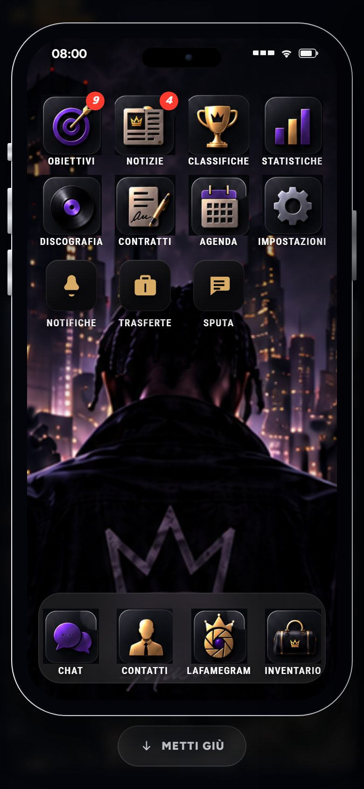
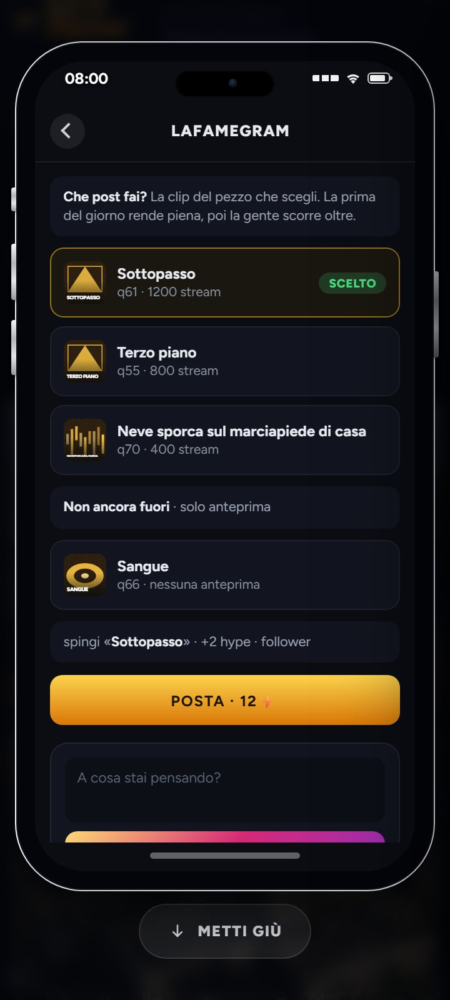
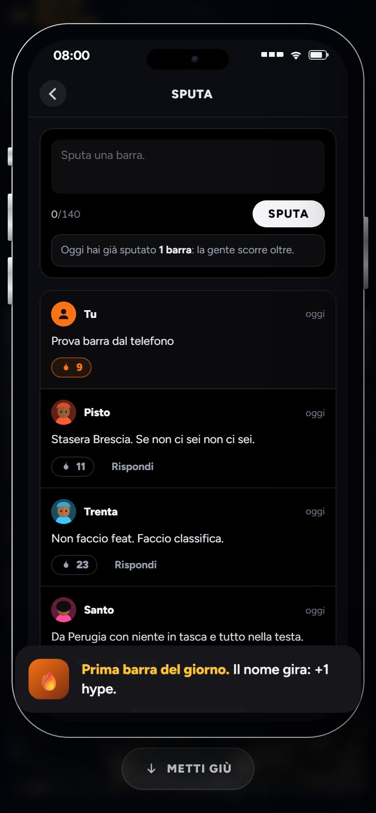

### In orizzontale (844 × 390) il telefono alzato è un francobollo: 154 di larghezza, icone da 27, etichette che si accavallano

- **dove** — `frontend/css/telefono-stretto.css:56-71`:
  `--telalto:calc(100dvh - 24px - 54px …)` e `--tellargo:min(100vw - 24px, var(--telalto) * .494)`,
  con `.ptelframe{aspect-ratio:676/1369}`. Il guscio è alto quanto lo schermo e largo di
  conseguenza: con 390 di altezza viene **154 × 312**, schermo interno 138 × 296.
- **cosa succede** — dentro a 138 punti le misure in `cqw` scendono al minimo dei `clamp`
  (icone 27 × 27, etichette a 7 px: `telefono.css:176-178`) e quelle fisse in px no: le
  etichette «CLASSIFICHE» e «STATISTICHE», «DISCOGRAFIA CONTRATTI AGENDA IMPOSTAZIONI»,
  «NOTIFICHE TRASFERTE» si scrivono una sopra all'altra (`white-space:nowrap;overflow:visible`);
  il titolo dell'app si legge «LAFAMEGRAN»; il tasto «Sputa» (75 × 28, `telefono.css:362`) sta
  in una colonna da 90 e tocca il bordo; lo schermo del telefono ha 5 punti di roba fuori
  (`#hb-tel` `scrollWidth` 143 su 138: etichette, «Rispondi», «Settimana 3»), tagliati da
  `overflow-x:hidden`. Il guscio **sta dentro allo schermo** (era la cosa da verificare: sì,
  non esce) e «Metti giù» si raggiunge — ma non si usa niente di quello che c'è dentro:
  nessuna icona arriva a 44, la home è 131 px di griglia e Sputa mostra tre righe e mezzo.
- **come si vede** — 844 × 390, plancia, tocca il telefono in barra; poi Sputa.
  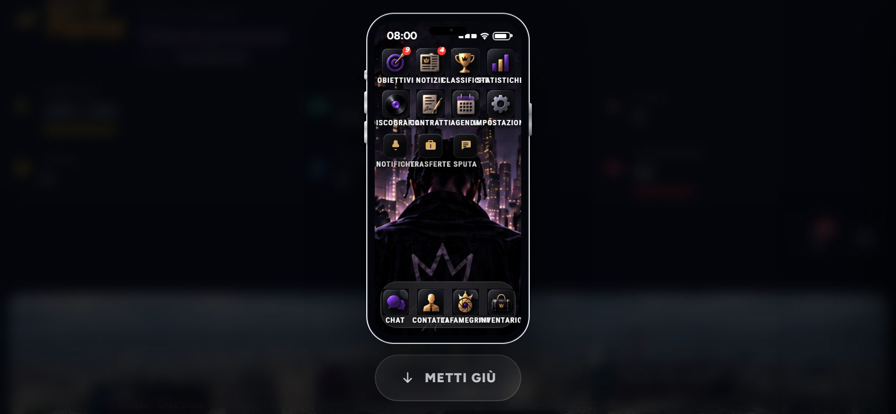
  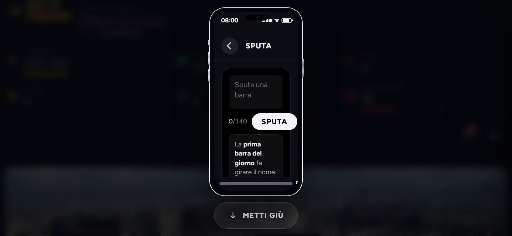
- **quanto pesa** — in orizzontale il telefono **non serve**: si apre, si chiude, ma non ci
  si fa niente. Se il gioco sugli store gira solo in verticale (da decidere: nel repo non c'è nessun
  manifest né un `orientation` dichiarato), è un problema che non c'è; se gira anche in orizzontale, il
  guscio con le proporzioni dell'iPhone non ci sta, e lì il telefono va disegnato senza
  cornice (schermo largo quanto serve, senza `aspect-ratio`) o non va offerto.


**RISOLTO in parte (15/09/2026)** — sullo stesso branch, prima del push. Sotto i 560 di altezza il guscio lascia le
proporzioni dell'iPhone: largo fino a 560, alto quanto c'è, la home scorre (`telefono-stretto.css`,
l'ultima media query). A 844 × 390 viene 560 × 312, icone da 99, i tasti dentro da 44: si usa.
**Resta la decisione** se il gioco sugli store gira anche di traverso: finché non c'è, di traverso
si usa così.
### Dentro al telefono alzato i bersagli e i caratteri sono quelli della colonna da computer

- **dove** — `frontend/css/telefono.css`: `.tback` 28 × 28 (:199), `.tspbtn` padding 7 e
  font 12 (:362), `.tsprisp` padding 3 (:392), `.tspfuoco` padding 3 (:385), `.tbtn` padding 12
  e font 11 (:233-235), `.tlitx i` 10.5 (:227), `.tigw` 10 (:312), `.ttag` 9.5 (:240).
  `telefono-stretto.css` non tocca niente di questo: sotto i 1180 il guscio cambia misura, il
  contenuto no.
- **cosa succede** — misurato a 390 × 844 (a 360 uguale, un punto in meno): il tasto
  **indietro** in cima a ogni app è 28 × 28; **«Sputa»** 75 × 28; **«Rispondi»** 60 × 19;
  il **fuoco** 44 × 21; **«Pubblica»** 284 × 37 e **«Posta · 12⚡»** 295 × 38. Sotto ai 44
  tutti tranne le righe (chat 52, pezzi 54). I caratteri sono 10–12 px: l'11 di «Che post
  fai?» e del tasto «Posta», il 10.5 di «q55 · 800 stream», il 9.5 di «scelto». Erano giusti
  per una colonna da 300 sul computer, dove si clicca col mouse e si sta a mezzo metro; sul
  telefono in mano sono i bersagli e i caratteri più piccoli di tutto il gioco (la plancia
  intorno ha tasti da 44-48 e testi da 13-16). I tocchi arrivano — li ho fatti tutti — ma con
  la punta, non col pollice.
- **come si vede** — 390 × 844, telefono, Sputa: la casella, il tasto bianco «Sputa» e i
  «Rispondi» sotto ai post; poi il tasto indietro in alto a sinistra.
  
  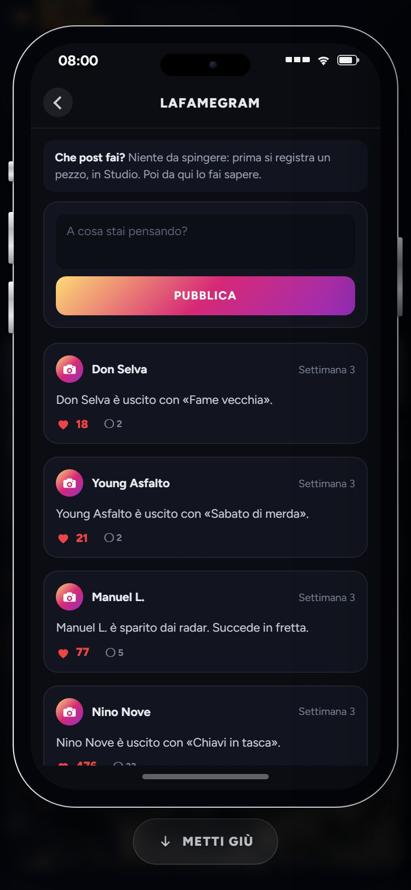
- **quanto pesa** — si usa ma si gira intorno. È la cosa da fare dopo questa task, non
  dentro: sotto i 1180 `.ptel.on` può alzare i minimi (`.tback` e `.tspbtn` a 44, `.tbtn` con
  padding 14, i font a 13-14), senza toccare la colonna dai 1180 in su.


**RISOLTO (15/09/2026)** — sullo stesso branch, prima del push. Solo da alzato (`body.in-hub .ptel.on …` in
`telefono-stretto.css`): indietro 44 × 44, «Sputa» 94 × 44, «Rispondi» e il fuoco 36 di altezza,
`.tbtn` 48, la casella di Sputa 72 con caratteri da 15, il resto a 12-13. La colonna dai 1180 in
su non cambia. Misurato a 390 e 360.
### In orizzontale, dopo «Posta», la scena «Promo sui social» non ha il «Continua» sullo schermo

- **dove** — `frontend/css/effects.css:62-66` (`.scenapiena{position:fixed;inset:0;
  display:grid;place-items:center;padding:20px}` senza `overflow`, `.scwrap{max-width:560px}`),
  la scena la apre `frontend/js/game/ui.js:60-67` (`#scena` di `gioco.html:584`), la chiude
  `uscita.js:50` con ESC: è la scena delle azioni, non il telefono. Non è codice di questa task: ci si arriva da qui perché adesso «Posta»
  sul telefono alzato la lancia.
- **cosa succede** — a 844 × 390 la card della scena è alta 598 in uno schermo da 390:
  centrata, parte a −104 e il tasto **«Continua» sta a 419–468, fuori** (misurato). La
  scena non scorre (`overflow-y:visible`, `scrollHeight` 494 su 390, la rotella non muove
  niente). La chiudono ESC e **il tocco fuori dalla card** (provato: sì, sul fondale scuro
  a sinistra) — ma nessuno lo dice, e il testo del risultato («Hype +2, 5 nuovi follower…»)
  è tagliato a metà in fondo: il giocatore vede una card senza tasto e senza fine.
- **come si vede** — 844 × 390, partita con un pezzo uscito, telefono, LaFamegram, tocca
  «Posta».
  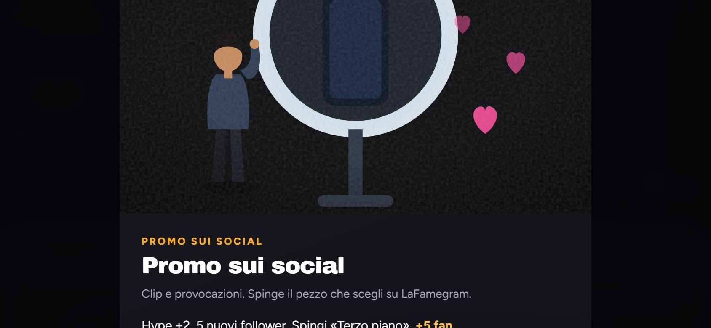
- **quanto pesa** — si vede ma si gira intorno (toccando fuori), in orizzontale; in verticale
  a 390 e 360 «Continua» è 282 × 49 e sta dentro. Vale per ogni scena delle azioni, non solo
  per questa: `.scenapiena` vuole un `overflow-y:auto` (e `align-content:start` quando la
  card non ci sta), oppure il gioco si blocca in verticale e la cosa non si pone.


**RISOLTO (15/09/2026)** — sullo stesso branch, prima del push. `.scenapiena` ha `overflow-y:auto` e
`place-items:safe center` (`effects.css`): la card più alta dello schermo parte dall'alto e
scorre, il «Continua» si raggiunge. Vale per tutte le scene delle azioni.
### Accanto al tasto del telefono (44 × 44) il Menu è alto 22

- **dove** — `frontend/css/hub.css:156-167` (`.pmenu{padding:0 20px}` senza `min-height`),
  di fianco a `.ptelbtn{min-width:44px;min-height:44px}` in `telefono-stretto.css:23-32`.
- **cosa succede** — nella barra a 390 il Menu misura 47 × 22 e il telefono 44 × 44: a
  vederli sono due icone uguali una accanto all'altra, ma uno si prende col pollice e
  l'altro no (22 di altezza è la metà del minimo). C'era già; adesso che ha un vicino da 44
  si nota.
- **come si vede** — 390 × 844, plancia, in fondo alla barra a destra.
  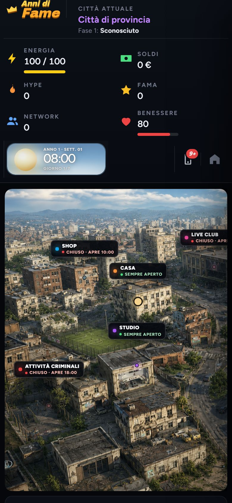
- **quanto pesa** — si vede ma si gira intorno (la casa si prende lo stesso, mirando).
  Una riga: `.pmenu{min-height:44px}` sotto i 980, nello stesso file dell'altro.


**RISOLTO (15/09/2026)** — sullo stesso branch, prima del push. `.pmenu{min-height:44px}` sotto i 980, in `stretto.css`.
**Nota, non di questa task**: a 390 la barra della plancia (logo, città, sei statistiche in
due colonne, la pastiglia del tempo, i due tasti) è alta **307 px** su 844 — più di un
terzo dello schermo prima della città; in orizzontale 266 su 390, e della città resta una
striscia. Lo si vede in `plancia-390x844.jpg` e `plancia-844x390.jpg`. È il punto aperto
della barra sotto i 980 (`stretto.css`), non il telefono; lo segno perché col telefono che
si alza da lì è la prima cosa che si vede.

## Giro del 15/09/2026 (segnala-problemi, fine task `task/telefono-sul-telefono`, commit `d97e8de`)

Controlli automatici tutti verdi: `npm run prova` 180 a posto, `audit-regressioni.js` 343 ok,
`verifica:build` 33 ok. Nessun errore in console a nessuna misura. Cercati in tutto
`frontend/` i nomi tolti (`.pvecchio`, `.papp`, `.pap`, `HUB_APP_VECCHIO`,
`renderTelefonoVecchio`, `telAgendaDisponibili`): nessuno li chiama più. Provato nel gioco
vero (server già acceso sulla 8000, Playwright) a 390 × 844, 1000 × 700, 1400 × 900 e
844 × 390: il tasto nella barra c'è solo sotto i 1181 e sparisce a 1400; la pallina somma
quelle delle app (9+ a inizio partita: 9 obiettivi + 4 notizie) e si azzera quando le hai
viste; il telefono si alza, LaFamegram con «Che post fai?», Sputa, Notifiche, Trasferte e
Impostazioni si aprono dentro; un evento (`showEvent`) esce sopra al telefono e si tocca; la
Strada esce sopra; il salto di tempo col telefono su funziona, la pastiglia del tempo si
nasconde e torna appena metti giù; il tocco fuori dal guscio mette giù anche col dito; «fallo
sapere» dallo Studio a 390 chiude lo Studio e alza il telefono su LaFamegram; allargando la
finestra a 1400 col telefono su e un'app aperta il telefono torna colonna e l'app si chiude,
stringendo di nuovo torna il tasto; ESC col telefono su chiude prima l'app, poi mette giù, e
il menu di sistema si apre solo al terzo. Il telefono girato di traverso (844 × 390: guscio
da 154, icone da 27, nomi uno sull’altro, «LAFAMEGRAN») l’ho visto anch’io con gli stessi
numeri: è già scritto nella «Prova sul telefono del 15/09/2026» qui sopra, non lo ripeto.
Quello che segue è quello che non torna.

### ESC col telefono alzato mette giù il telefono anche quando sopra c'è un'altra finestra

- **dove** — `frontend/js/game/telefono-stretto.js:107-119` (l'ascolto di ESC «in cattura»,
  che passa per primo e ferma il tasto), `frontend/js/game/trasferte.js:1657-1662` (l'ESC di
  Trasferte, che arriva dopo), `frontend/js/game/uscita.js:66-72` (l'ESC della modale).
- **cosa succede** — il tasto ESC nuovo guarda solo se il telefono è su e se dentro c'è
  un'app: non guarda se sopra al telefono c'è già qualcos'altro. Così, con un evento
  annullabile aperto sopra al telefono alla home, ESC mette giù il telefono e l'evento resta
  lì (provato: modale ancora aperta, telefono giù). Peggio con Trasferte: si apre a schermo
  pieno sopra al telefono e non segna nessuna app aperta (`TEL_APP` resta vuoto), quindi ESC
  fa sparire il telefono dietro alle Trasferte, che restano aperte; le chiudi con la freccia e
  ti ritrovi sulla plancia col telefono giù, da rialzare.
- **come si vede** — finestra a 390: alza il telefono, tocca Trasferte, premi ESC, poi la
  freccia in alto a sinistra.
- **quanto pesa** — si vede ma si gira intorno (si rialza dal tasto).


**RISOLTO (15/09/2026)** — sullo stesso branch, prima del push. `telStrettoQualcosaSopra()` guarda `overlayAperto()` di
`uscita.js` e la lista delle finestre di eventi-v2, Trasferte, orologio, menu di sistema e
impostazioni: se c'è qualcosa sopra, ESC non è del telefono. Provato con la modale sopra: resta
tutto com'è.
### «APRI» sulla fascia di LaFamegram non alza il telefono

- **dove** — `frontend/js/game/eventi-v2.js:1840-1848` (`adfSocialOpenLatest`: scrive
  `TEL_APP="lafamegram"` e ridisegna, senza passare da `telVaiApp`).
- **cosa succede** — quando qualcuno posta su di te esce la fascia in alto con APRI e CHIUDI.
  Sotto i 1181 APRI apre LaFamegram dentro a un telefono che è giù: sullo schermo non cambia
  niente (provato a 390: telefono giù, `TEL_APP` = lafamegram). Il post lo vedi solo se poi
  alzi il telefono dal tasto, e lì ti trovi dritto su LaFamegram senza sapere perché. Il
  documento della task dice il contrario: «aprire un'app da fuori — “fallo sapere” dallo
  Studio, una notifica — alza il telefono da solo» (`implementazioni/02-interfaccia-e-telefono.md`,
  «Il telefono quando lo schermo è un telefono»): vale per lo Studio, non per la fascia.
- **come si vede** — finestra a 390, aspetta un post su di te (o fai comparire la fascia),
  tocca APRI.
- **quanto pesa** — si vede ma si gira intorno.


**RISOLTO (15/09/2026)** — sullo stesso branch, prima del push. `adfSocialOpenLatest` passa da `telVaiApp`, che sullo
schermo stretto alza il telefono. Provato a 390: APRI → telefono su, LaFamegram aperta.
### Fra i 980 e i 1110 punti il tasto del telefono è fuori dallo schermo: iPad di traverso compreso

- **dove** — `frontend/css/telefono-stretto.css:23-31` (il tasto, `order:2` in coda alla
  barra) e la barra che trabocca già di suo (`frontend/css/hub.css`, voce «Fra i 980 e i 1180
  punti la barra della plancia trabocca» qui sopra).
- **cosa succede** — la voce di prima dice che a 1000 «a destra c'è il telefono e basta»:
  misurato, non è così. Il tasto del telefono sta a 993–1037 con una finestra da 980 a 1000
  (se ne vedono 7 punti), e a 1110–1154 con una finestra da 1024 a 1110: cioè **tutto fuori**.
  Un iPad tenuto di traverso è largo 1024: lì il telefono non si alza da nessuna parte, e
  senza tastiera non c'è nemmeno ESC o Tab. Sputa, Notifiche, Chat, la Discografia tornano
  irraggiungibili proprio come prima di questa task; «fallo sapere» dallo Studio invece
  funziona, perché alza il telefono senza il tasto. Segnalo anche che fra 1181 e 1240 la
  barra trabocca ancora di qualche punto (`scrollWidth` 1237 a 1181): è da prima, ma la voce
  precedente dice «fra 980 e 1180».
- **come si vede** — finestra a 1024 × 768: nella barra il tasto del telefono non c'è.
- **quanto pesa** — si vede ma si gira intorno (da tastiera: Tab fino al tasto e Invio; su
  tablet no).


**RISOLTO (15/09/2026)** — sullo stesso branch, prima del push. Fra i 981 e i 1180 il tasto **galleggia** in basso a
destra (56 × 56, `position:fixed`), dove c'è sempre: misurato a 1000 e a 1024. Ho provato prima a
far andare a capo la barra come sotto i 980: la prima riga si tagliava e il logo finiva in
seconda riga — quella barra vuole un disegno suo, e resta la voce «Fra i 980 e i 1180 punti la
barra della plancia trabocca».
### La pallina sul tasto della barra non si accorge di una notifica appena arrivata

- **dove** — `frontend/js/game/eventi-v2.js:564-573` e `3081` (`adfNotificationBadgeRefresh`
  aggiorna solo la pallina dell'icona dentro al telefono), `frontend/js/game/telefono-stretto.js:59-66`
  (la pallina del tasto si rifà solo a ogni ridisegno del telefono).
- **cosa succede** — con il telefono giù e tutto visto (pallina spenta), arriva una notifica
  nuova: dentro al telefono la campanella segna 1, sul tasto della barra resta niente finché
  qualcosa non ridisegna il telefono. Provato: subito dopo `addNotification` il tasto dice
  0/nascosta e Notifiche dice 1; dopo un ridisegno torna giusto. Il salto +1 ridisegna da
  sé, quindi lì non si vede; si vede con le notifiche dell'agenda e degli eventi a minuti
  che arrivano fra un'azione e l'altra.
- **come si vede** — a 390, telefono giù e pallina spenta, aspetta un avviso dell'agenda:
  il tasto resta senza numero.
- **quanto pesa** — da sistemare con calma.


**RISOLTO (15/09/2026)** — sullo stesso branch, prima del push. `adfNotificationBadgeRefresh` chiama anche
`telStrettoAggiorna`. Provato: telefono giù, pallina spenta, arriva una notifica → «1».
### Da tastiera il fuoco resta dietro al telefono, e dopo «Metti giù» si perde

- **dove** — `frontend/js/game/telefono-stretto.js:80-93` (il tasto nella barra e «Metti
  giù»: nessuno sposta il fuoco).
- **cosa succede** — Invio sul tasto della barra alza il telefono, ma il fuoco resta sul
  tasto, sotto alla sovrapposizione; il Tab dopo va sul Menu (sempre dietro), non dentro al
  telefono: da tastiera bisogna passare tutta la plancia nascosta prima di arrivare alle
  app. Invio su «Metti giù» funziona, ma il tasto sparisce e il fuoco finisce sul `body`:
  il Tab dopo riparte dall'inizio della pagina. Il tasto non ha un `:focus-visible` suo come
  il Menu (`hub.css:168`): resta il bordo del browser, si vede, ma è diverso dal vicino.
- **come si vede** — a 390, Tab fino al tasto del telefono, Invio, Tab.
- **quanto pesa** — da sistemare con calma.


**RISOLTO (15/09/2026)** — sullo stesso branch, prima del push. Alzato, il fuoco va sulla prima icona; messo giù, torna
sul tasto della barra. Il tasto ha il suo `:focus-visible`, uguale al Menu.
### Due ESC di fila in fretta: il telefono resta su

- **dove** — `frontend/js/game/telefono.js:710-716` (`telHome` svuota `TEL_APP` solo dopo
  i 160 ms dell'animazione), `frontend/js/game/telefono-stretto.js:107-109` (ESC guarda
  `TEL_APP` sul momento).
- **cosa succede** — con un'app aperta, il primo ESC avvia l'animazione di chiusura; se il
  secondo arriva prima che siano passati 160 ms, `TEL_APP` è ancora pieno, il tasto nuovo
  lascia passare e `telefono.js` richiama `telHome` un'altra volta: il telefono resta su e
  ci vuole un terzo ESC. Provato: due ESC senza pausa dopo Sputa → app chiusa, telefono
  ancora su.
- **come si vede** — a 390, apri Sputa, ESC ESC veloci.
- **quanto pesa** — da sistemare con calma.


**RISOLTO (15/09/2026)** — sullo stesso branch, prima del push. Se l'app sta già andando via (`.tscreen.tout`, i 160 ms
dell'animazione) il secondo ESC è del telefono e lo mette giù. Provato con ESC ESC senza pausa.
**Nota, non è un errore**: tre cose viste e lasciate lì. In `telefono.js:721-739` restano i
rami per `data-telapp`, `data-news` e `data-diario` dentro al telefono, ma dopo questo commit
nessun pezzo del telefono produce più quegli attributi (cercato in tutto `frontend/js`): sono
rami morti, non fanno danni. Lo Studio sta a z 55 e il telefono alzato a 58: se un giorno
qualcosa dentro al telefono aprirà lo Studio, lo Studio si aprirà **dietro** (provato con
`apriStudio` a mano); oggi lo Studio si apre solo dal segnaposto della città, che sotto al
telefono non si tocca, quindi non c'è una strada per vederlo. `body.tel-aperto{overflow:hidden}`
(`telefono-stretto.css:83`) ferma lo scorrimento della plancia dietro al telefono: su Safari
di iPhone quel trucco spesso non basta e la pagina sotto scorre lo stesso — non l'ho provato
su un telefono vero, va guardato lì.

---

## Giro del 15/09/2026 (segnala-problemi, fine task `task/sistema-il-foglio-dei-punti-nuovi`, commit `167e22d`)

La task ha toccato un file solo, `implementazioni/implementazioni.md` (359 righe cambiate,
`git diff --stat main...HEAD`): il codice del gioco è identico a `main`. Controlli
automatici tutti verdi: `npm run prova` 180 a posto, `audit-regressioni.js` 343 ok,
`verifica:build` 33 ok. Sul JavaScript: ogni `<script>` e ogni foglio di stile citati
dalle tre pagine esistono; ogni `onclick` scritto in `gioco.html` e ogni `onclick`
costruito dal codice chiama una funzione che esiste (0 nomi orfani); i cinque nomi guardati
con `typeof` e non definiti nel gioco (`aggiornaMuteLanding`, `renderMenu`, `onDone`,
`onArrive`, `onContinue`) sono o funzioni della landing, che carica gli stessi file, o
parametri locali: niente come il vecchio `renderNegozio`. Collegamenti e telefono non li
ho riprovati a schermo: il codice è quello del giro precedente (`d97e8de`), che li ha
già guardati uno per uno. Il grosso del giro è stato il confronto fra i due fogli degli
aperti, come chiesto: sotto le due cose che non tornano.

### «Cosa resta aperto» dice che il suo ordine è lo stesso di «Da fare adesso», e non lo è

- **dove** — `documentazione/problemi-riscontrati.md:3-5` (la premessa dell'elenco in
  testa) contro `implementazioni/implementazioni.md:49-158` («Da fare adesso, in ordine»).
- **cosa succede** — le dieci voci di «Cosa resta aperto al 15/09/2026» compaiono **tutte**
  in «Da fare adesso» (contate una per una: avvio rapido → 6, Shop → 13, hover → 4, code
  dello Studio → 15, Marketing → 3, `jose`/`zod` → 7, barra della plancia → 2, di traverso
  → 25, uscita di venerdì → dentro a 14, «aperti di proposito» → nel capoverso «Restano
  fuori dall'ordine»). Ma la premessa qui dice «in ordine d'importanza — l'ordine è lo
  stesso di «Da fare adesso»», e l'altro foglio le ordina in un altro modo (prima il
  telefono, poi il pacchetto, poi le piccole, poi le lunghe, in fondo le decisioni): qui
  l'avvio rapido è al primo posto e la barra al settimo, di là la barra è seconda e l'avvio
  sesto; lo Shop qui è secondo, di là tredicesimo. Chi legge questo foglio e va a cercare la
  stessa sequenza nell'altro non la trova. Due dettagli piccoli nello stesso confronto: di
  là la voce 7 nomina solo `jose` (qui è «`jose` e `zod`», e `zod` sta ancora fra le
  `dependencies` di `backend/package.json:23` senza che nessuno la usi), e la dice «dal
  registro delle dipendenze» invece che da questo foglio.
- **come si vede** — leggi i numeri 1-10 in testa a questo file e cerca la stessa sequenza
  in «Da fare adesso».
- **quanto pesa** — da sistemare con calma. Va deciso da che parte si aggiusta: o la
  premessa qui smette di promettere lo stesso ordine (basta dire «tutte stanno in "Da fare
  adesso", che le mette in fila con le altre»), o le dieci voci qui si riordinano come di
  là. Non ho toccato né l'una né l'altra.

### L'hover al tocco è chiuso dall'08/09, ma tre elenchi lo danno ancora da fare

- **dove** — `documentazione/problemi-riscontrati.md:10-11` (voce 3 di «Cosa resta aperto»),
  `implementazioni/implementazioni.md:74-76` (voce 4 di «Da fare adesso»: «nessun foglio
  di stile distingue mouse e dito … un giro solo su tutti i CSS»),
  `implementazioni/08-uscita-sugli-store.md:157` («**Niente hover**: da fare. Gli effetti
  `:hover` ci sono ancora tutti»).
- **cosa succede** — il lavoro che quei tre punti chiedono è già fatto, e da una settimana.
  Nel codice tutte le 161 regole `:hover` dei 27 fogli in `frontend/css/` stanno dentro a
  `@media (hover:hover)` (contate oggi), i sei pezzi di grafica scritti dentro al JavaScript
  pure, e il controllo automatico «nessun :hover fuori da @media (hover:hover)» in
  `frontend/strumenti/audit-regressioni.js:2148` è verde e diventerebbe rosso se ne
  sfuggisse uno. Lo dicono anche i documenti, ma solo due: il secondo giro dell'08/09 in
  questo file («nessuna regola `:hover` rimasta fuori») e
  `implementazioni/02-interfaccia-e-telefono.md:1383` (**FATTO (08/09/2026)**). La voce di
  questo file (riga 423, «Sul telefono i colori del «passaggio del mouse» restano accesi»)
  era rimasta col solo **LASCIATO** della mattina e senza il RISOLTO del pomeriggio, e da lì
  è finita negli elenchi degli aperti; il RISOLTO gliel'ho messo sotto adesso. Quello che
  resta davvero aperto sull'argomento è un'altra cosa, ed è una **scelta**, non un lavoro:
  la nota dell'08/09 «adesso sul telefono toccare un tasto non fa più vedere niente» (123
  cose che si accendevano col mouse e al dito non rispondono in nessun modo).
- **come si vede** — `cd frontend && node strumenti/audit-regressioni.js | grep hover`
  → «ok nessun :hover fuori da @media (hover:hover)».
- **quanto pesa** — da sistemare con calma: se qualcuno prende la voce 4 di «Da fare
  adesso» si mette a rifare un giro già fatto. Da togliere dai tre elenchi (o da barrare
  con la data, come fa quel foglio) e, se si vuole, da sostituire con la scelta sulla
  risposta al «mentre premo». Non ho toccato nessuno dei tre.

## Giro del 16/09/2026 (segnala-problemi, fine task `task/prima-transizione-video`, prima del commit)

Controllato sul branch con le modifiche ancora da committare. I tre comandi sono verdi:
`npm run prova` 180 a posto e 0 no, `node strumenti/audit-regressioni.js` 349 ok e 0
falliti, `npm run verifica:build` 33 ok e 0 falliti; il build copia i dodici video in
`dist/media/video/Transizioni di scena/`. Nessun errore di JavaScript all'avvio della pagina
del gioco (aperta con Playwright sul Chrome installato, come dice il foglio di memoria):
`transizioni-video.js` sta prima di `hub.js`, il cartello `#hb-pins` a cui si aggancia
esiste, e il cartello dello Studio lo chiama solo al clic. Provato dal vivo: il video parte
e finisce a 5,6 s e sotto c'è lo Studio; il clic a metà lo salta; col file che non c'è lo
Studio si apre dopo un secondo (l'evento `error` arriva prima del timer); con le animazioni
spente lo Studio si apre subito senza filmato; l'audio segue l'interruttore generale e il
volume degli effetti (il video una traccia audio ce l'ha). Le cose sotto sono quelle che non
tornano.

### Esc durante il video non lo salta: apre il menu di pausa, e lo Studio si apre sotto al menu
- **dove** — `frontend/js/menu-sistema.js:491-513` (l'ascoltatore di Esc del menu di
  sistema, registrato «in cattura», cioè prima di tutti gli altri, e che ferma il tasto con
  `stopImmediatePropagation`) contro `frontend/js/game/transizioni-video.js:85` e `:108`
  (l'ascoltatore del video, normale, che così non riceve mai il tasto). La lista delle
  finestre che il menu rispetta prima di aprirsi sta in `menu-sistema.js:36-71`
  (`dialogoFlottante` e `internoDaChiuderePrima`): la copertura `.tvid` non c'è.
- **cosa succede** — premi Esc mentre il filmato dello Studio va: si apre il menu «LA FAME /
  SISTEMA» sopra al video, il video **continua** sotto (visto: da 2,7 s arriva a 5,6 s col
  menu aperto), e quando finisce lo Studio si apre sotto al menu di pausa. Chi preme
  «Riprendi» si ritrova nello Studio senza aver capito perché. Il salto con Esc quindi non
  esiste, mentre lo promettono sia il commento in testa a `transizioni-video.js:17` sia
  `implementazioni/02-interfaccia-e-telefono.md:1888` («un tocco, un clic o Esc chiudono il
  video») — e la riga «Provato» di quel foglio (`:1897`) elenca il clic ma non l'Esc, che
  infatti non è stato provato. La prova dell'audit
  `frontend/strumenti/audit-regressioni.js:2212` («si può saltare») guarda solo che nel file
  ci sia scritto `"Escape"`, quindi resta verde anche così.
- **come si vede** — dalla mappa tocca «Studio» (conferma «Vai» se non sei già lì), premi
  Esc mentre il filmato va.
- **quanto pesa** — si vede ma si gira intorno: il video finisce da solo e il menu ha
  «Riprendi». Ma è il tasto che tutti provano per saltare un filmato, e il risultato è un
  menu di pausa che non ferma niente.
- **RISOLTO (16/09/2026, stesso branch, prima del commit)** — `#tvid.on` e `#tvid.attesa`
  stanno in `dialogoFlottante()` di `menu-sistema.js`: il menu lascia passare l'Esc e lo
  prende l'ascoltatore del video. Provato: Esc a 1,2 s salta il filmato, lo Studio si apre,
  nessun menu. L'audit adesso controlla le due voci nella lista del menu, non la sola stringa
  `"Escape"`.

### Nel secondo e mezzo prima che il video parta la mappa risponde ancora, e si aprono due posti
- **dove** — `frontend/js/game/transizioni-video.js:92` (la copertura compare solo
  all'evento `playing`), `:110` (il secondo e mezzo di attesa) e `:56` (se un video è già
  in corso, il secondo tocco apre la pagina diretta).
- **cosa succede** — è una scelta giusta che la mappa non diventi nera prima che il video
  vada, ma finché non va la mappa è anche **cliccabile**. Tocchi «Studio» e, prima che il
  filmato parta, tocchi un altro cartello: quel posto si apre (provato con la Pizzeria: si
  apre la scheda «Lavapiatti»), poi il filmato copre tutto, e alla fine lo Studio si apre
  **sotto** alla scheda della Pizzeria, che resta lì sopra. Se invece tocchi due volte
  «Studio», la seconda volta lo apre subito senza video (per la guardia di riga 56), poi
  arriva il video e lo riapre. Sul monitor la finestra è di pochi decimi di secondo (il
  video a caldo parte in 10 ms); sul telefono emulato a 390 × 844 il filmato è partito a 1,6 s
  anche col precarico fatto, e due volte su tre a freddo non è partito affatto entro il
  tempo (lo Studio si è aperto senza video, come previsto): lì la finestra è tutta.
- **come si vede** — tocca «Studio» e subito un altro cartello, meglio da telefono o con la
  rete rallentata dagli strumenti del browser.
- **quanto pesa** — si vede ma si gira intorno: chiudi la scheda di sopra e sei nello
  Studio. Da guardare insieme al ritardo di partenza sul telefono vero.
- **RISOLTO (16/09/2026, stesso branch, prima del commit)** — dal clic al `playing` la
  copertura c'è ma è trasparente (`.tvid.attesa`): la mappa si vede e non risponde, e il
  tocco lì sopra salta l'attesa e apre la pagina subito. Provato con la rete rallentata e un
  video non precaricato: sotto al dito sul cartello della Pizzeria c'è la copertura, il
  tocco apre lo Studio e la Pizzeria no.

### Sul telefono l'orologio della plancia resta sopra al video, e si tocca
- **dove** — `frontend/js/game/tempo-controlli.js:286` (`#adf-time-dock` a z-index 142)
  contro `frontend/css/transizioni-video.css:8` (`.tvid` a 95).
- **cosa succede** — a 390 × 844 la pastiglia dell'orologio («ANNO 1 · SETT. 01 · 08:00 ·
  GIORNO 1/7») galleggia in mezzo al filmato, a sinistra, per tutti i 5,6 secondi (vista
  nello screenshot; sul monitor a 1280 no: lì il video la copre, perché la barra della
  plancia sta in un altro «strato»). È anche il primo elemento sotto al dito: nel telefono
  emulato un tocco lì ha chiuso il video e aperto lo Studio con sopra la scheda «Scrivi
  barre», invece del pannello delle ore. Questo secondo pezzo è da confermare su un
  telefono vero, il primo si vede e basta.
- **come si vede** — apri il gioco a 390 di larghezza, tocca «Studio», guarda a sinistra a
  metà schermo mentre il filmato va.
- **quanto pesa** — da sistemare con calma.
- **RISOLTO (16/09/2026, stesso branch, prima del commit)** — `.tvid` è salita da 95 a 150:
  sopra all'orologio (142) e al toast (130), sotto alla Strada (180) e al menu di sistema.
  Provato a 390 × 844: `elementFromPoint` al centro della pastiglia dà la copertura.

### Il video ignora «riduci le animazioni» del telefono, che il resto del gioco rispetta
- **dove** — `frontend/js/game/transizioni-video.js:55` (guarda solo l'interruttore
  «Animazioni» delle impostazioni del gioco).
- **cosa succede** — chi ha acceso «riduci movimento» nel sistema (iOS e Android ce l'hanno
  fra le opzioni di accessibilità) si becca comunque i cinque secondi di filmato. Altre
  quattro parti del gioco quella preferenza la leggono (`frontend/css/effects.css:118`,
  `frontend/css/avvio.css:104`, `frontend/js/game/tempo-controlli.js:362`,
  `frontend/js/game/strada-crimine-ui.js:63`), il video no. È una riga in più nel
  controllo di riga 55, non un lavoro.
- **come si vede** — sul telefono, con «riduci movimento» acceso e «Animazioni» del gioco
  lasciato acceso, tocca «Studio».
- **quanto pesa** — da sistemare con calma.
- **RISOLTO (16/09/2026, stesso branch, prima del commit)** — `transizioneVideo()` guarda
  anche `matchMedia("(prefers-reduced-motion: reduce)")`. Provato con la preferenza
  emulata: lo Studio si apre diretto, senza copertura.

Due note che sono **scelte**, non errori, e stanno qui solo per essere decise:

- **In verticale si vede una fetta del filmato.** Il video è 1280 × 720; a 390 × 844 con
  `object-fit:cover` (`frontend/css/transizioni-video.css:9`) sullo schermo entra circa un
  quarto della larghezza dell'inquadratura, la fascia centrale: nello screenshot a 2 secondi
  si vedono il banco e la pianta, il ragazzo che entra è fuori dal taglio. Il CSS lo dice
  apposta («quello che avanza si taglia, meglio di due bande nere») e va bene così se i
  cinque video sono pensati per il centro; se no, ai prossimi quattro conviene chiederlo a
  chi li fa, o prevedere una versione verticale.
- **A freddo, sul telefono, il video spesso non parte in tempo e non si vede.** È il
  comportamento voluto (meglio niente che uno schermo nero), ma vuol dire che il primo
  «Studio» di una partita nuova su un telefono lento può non avere il filmato. Sugli store
  i file stanno sul telefono, non in rete, quindi probabilmente basta: va provato lì, non
  qui.

Documenti: le quattro scritture (`implementazioni/implementazioni.md` in due punti,
`implementazioni/02-interfaccia-e-telefono.md`, `implementazioni/README.md`,
`documentazione/roadmap.md`) dicono tutte la stessa cosa — FATTO in parte, uno su cinque,
gli altri quattro allo stesso modo, sette video senza un punto — e tornano fra loro. L'unica
frase smentita dal codice è quella sull'Esc, già nella prima voce.
