# Problemi riscontrati

Qui stanno solo le cose **ancora aperte**, trovate dai giri di controllo (gli agenti
`segnala-problemi`, `backend-allineato`, `prova-sul-telefono`) o giocando. Quando una voce
si chiude, sotto le si scrive `**RISOLTO (gg/mm/aaaa)** — in una frase` e la voce passa in
[`problemi-risolti.md`](problemi-risolti.md), insieme al suo numero se ce l'ha nell'indice.
Le voci chiuse fino al 29/09/2026 sono tutte lì, coi giri che le hanno trovate: un rimando
scritto prima del 29/09 a «un giro di problemi-riscontrati» (nei fogli dei punti, nella
roadmap, nei commenti del codice) quel giro lo trova in `problemi-risolti.md`, con la stessa data.

## Cosa resta aperto al 29/09/2026

I numeri sono quelli di sempre, e restano: altri documenti citano «la voce 65». La prossima
voce nuova è la 68. Le voci 7, 9 e 10 stanno anche in «Da fare adesso» di
[`implementazioni/implementazioni.md`](../implementazioni/implementazioni.md) (la 7 con «Via la
lucidità», la 9 fra «Le decisioni tue», la 10 fra quelle fuori dall'ordine); la 61 e la 65
sono decisioni di bilanciamento e per ora stanno solo qui.

**7.** **L'uscita di venerdì non costa niente, quella a mano sì** (08/09): risolto in parte per
scelta — il vantaggio di venerdì è quello di aspettare, non uno sconto. Sparisce del tutto
con «togli il parametro lucidità» (CARLO), che nell'altro foglio è fra i lavori lunghi.

**9.** **Di traverso** (844 × 390) il telefono alzato si usa, ma resta da **decidere se il gioco
sugli store gira anche in orizzontale**: nel repo non c'è un manifest né un
`orientation`. Nell'altro foglio sta fra «le decisioni tue».

**10.** Aperti di proposito (14/09, prova sul telefono): la copertina «grande» e quella «di
adesso» quasi uguali; nel Marketing la risposta compare in cima. Nell'altro foglio
restano fuori dall'ordine.

**61.** Da decidere (27/09): **RISOLTO in parte (27/09/2026)** — branch `task/carcere-spese-e-lavoro`:
il costo in più del carcere resta ma il diario lo dice, e il lavoro perso in carcere lo
diceva già l'avviso «Non ti sei presentato». **Restano da decidere** i numeri del
bilanciamento dopo un anno: lucidità sempre fra 96 e 99 (la lucidità resta, decisione di
Carlo del 21/09: è da far mordere, non da togliere), scrittura al tetto entro l'anno,
niente game over coi debiti, 2 € di spese a settimana per ogni pezzo mai registrato.

**65.** Da decidere (29/09), dal simulatore di bilanciamento su sei carriere da un anno: **il
crimine non paga** (−1.129 €, 300 giorni su 364 in carcere), **lavorare non rende** (chi fa
il turno ogni giorno chiude con 346 €, chi sta fermo con 897), **la giornata rallenta da
0,7 a 3,3 secondi** per chi lavora, **l'hype al tetto** per il musicista, **nessun
contratto** in nessuna strategia. Le abilità al tetto sono la stessa cosa della voce 61.
Una carriera per strategia: sono indizi, da riprovare su un centinaio. Il dettaglio nel
giro del 29/09 in fondo, «Il simulatore di bilanciamento».

**66.** Da decidere (29/09): **«Via la lucidità» è ancora fra i lavori da fare** (voce 3 di «Da
fare adesso», CARLO 8), ma Carlo il 21/09 ha detto che la lucidità resta (voce 61). O esce dalla
lista, o si scrive che è sospesa; e la voce 7 non sparirà «con la lucidità». Il dettaglio nel giro
del 29/09 in fondo.

**67.** Da decidere (29/09): **CARLO 12 (il recap giornaliero) e CARLO 13 (le trasferte dalla
prima città)** sono aperti ma non stanno in «Da fare adesso» né fra quelli fuori dall'ordine.

---

## Giro del 08/09/2026

Giro di fine task sul lavoro degli **elementi HTML delle otto sezioni dello Studio**
(branch `task/studio-elementi-html`, commit `83ab4c5`, nel frattempo già finito in
`main` col merge `1196778`).

Prima le cose che ho fatto girare e che sono **a posto**: `npm run prova` (79 su 79),
`node strumenti/audit-regressioni.js` (280 su 280) e `npm run verifica:build` (33 su 33) passano tutti e tre. Poi ho provato a mano, fuori dal browser, le cose nuove:
i tre cursori del banco lasciati al centro valgono **esattamente zero** (il mix resta
quello di prima, 6 punti su una partita nuova) e in tutte le 125 posizioni non danno
mai più di tre punti in su o in giù; un pezzo messo in cassaforte **non esce** né da
solo né dalla plancia; un pezzo messo in coda per venerdì esce **una volta sola**, il
giorno giusto, e poi il segno della coda sparisce; comprare un beat funziona uguale
dalla Sala e dallo Studio; una partita vecchia senza le voci nuove nel salvataggio non
fa esplodere nessuna delle otto sezioni. Gli attributi `data-` nuovi dello Studio non
si pestano i piedi con nessun altro pezzo del gioco: ho guardato tutti e quindici, uno
per uno, e anche i quattro ascoltatori che stanno su tutto il documento.

Quello che non va è qui sotto.

### L'uscita di venerdì non costa niente, quella a mano sì

- **dove** — `frontend/js/game/studio-elementi.js:608` (`studioUscitePronte`) contro
  `frontend/js/game/actions.js:356` (la mossa «Pubblica il pezzo»)
- **cosa succede** — se mandi fuori un pezzo a mano spendi una mossa della giornata e
  un punto di lucidità; se lo metti in coda per venerdì esce **da solo** e non paghi
  né l'una né l'altro, più i 4 punti di hype in più. Il commento nel codice dice che
  l'hype «lo paghi aspettando», ma nel conto vero l'attesa ti fa anche risparmiare:
  così aspettare non è mai una scelta, è sempre la scelta giusta. Non è rotto, è un
  bilanciamento da guardare: o venerdì costa anche lui, o il vantaggio è doppio.
- **come si vede** — metti un pezzo in coda per venerdì e guarda la lucidità prima e
  dopo che esce.
- **quanto pesa** — da sistemare con calma.

**RISOLTO in parte (08/09/2026)** — l'uscita in coda adesso costa il punto di lucidità
come quella a mano. La **mossa della giornata** no, e quella resta com'era: il pezzo
esce di notte mentre dormi, e far pagare una mossa a chi non è sveglio non si può
scrivere in modo onesto. Quindi un piccolo vantaggio venerdì ce l'ha ancora — ma
adesso è il vantaggio di aspettare, non uno sconto.

---

## Prova sul telefono del 14/09/2026 (Studio: Cover, Marketing, linguette)

Misure: **390 × 844** e **360 × 800**. Branch `task/studio-marketing-scegli-il-pezzo`,
partita salvata con quattro pezzi («Sottopasso», «Terzo piano», «Neve sporca», «Sangue»),
nessuno uscito. Guardato solo lo Studio, nei tre punti cambiati oggi: la proposta di
copertina (Cover), «Cosa spingi» / «Non ancora fuori» con l'anteprima (Marketing), e le
cinque linguette chiuse col lucchetto. Console senza errori per tutto il giro. Gli
screenshot stanno in `documentazione/prove-telefono/2026-09-14/`.

**Come l'ho provato, per riprovarlo.** Chrome ha ignorato tre volte il ridimensionamento
della finestra (restava a 1150 × 687: è massimizzata). Ho messo il gioco dentro a un
`<iframe>` della stessa origine largo esattamente 390 (poi 360) e alto 844 (poi 800), in
una scheda a parte: dentro all'iframe le media query e il layout vedono quella misura, i
tocchi arrivano ai bottoni veri e la console è quella del gioco. Due cose da tenere a mente
leggendo le figure: (1) c'è la barra di scorrimento del computer, 15 px, che sul telefono
non c'è — quindi la colonna utile era 375 e 345, non 390 e 360; (2) la rotella del mouse
non scorreva la colonna, l'ho scorsa da console (`.stwrap.scrollTop`): che *scorra* l'ho
verificato dalle misure (`scrollHeight` > `clientHeight`, `overflow-y:auto`), non col dito.

**Quello che funziona.** Cover: «Generane un'altra» mette la proposta al centro con
quella di adesso accanto, i tre tasti sono uno sotto l'altro larghi tutta la colonna e
alti 48 px, niente esce dallo schermo (nessuno scorrimento orizzontale a nessuna delle due
misure), «Lascia com'era» risponde al tocco e rimette la copertina sola. Marketing: i due
elenchi stanno uno sotto l'altro nella colonna che scorre, non si coprono, l'ultima riga
resta sopra alla banda del diario, il tocco su un pezzo di «Non ancora fuori» fa
comparire «ANTEPRIMA: «…»» e il tasto d'oro «Fai uscire una preview» (48 px) si raggiunge.
Linguette: le cinque chiuse hanno il lucchetto, restano su una riga (44 px di altezza,
la striscia scorre: 568 px su 345), toccandone una si resta sul Beat ed esce l'avviso
«Prima il pezzo: Beat, Testo, Cabina. Poi il resto.»

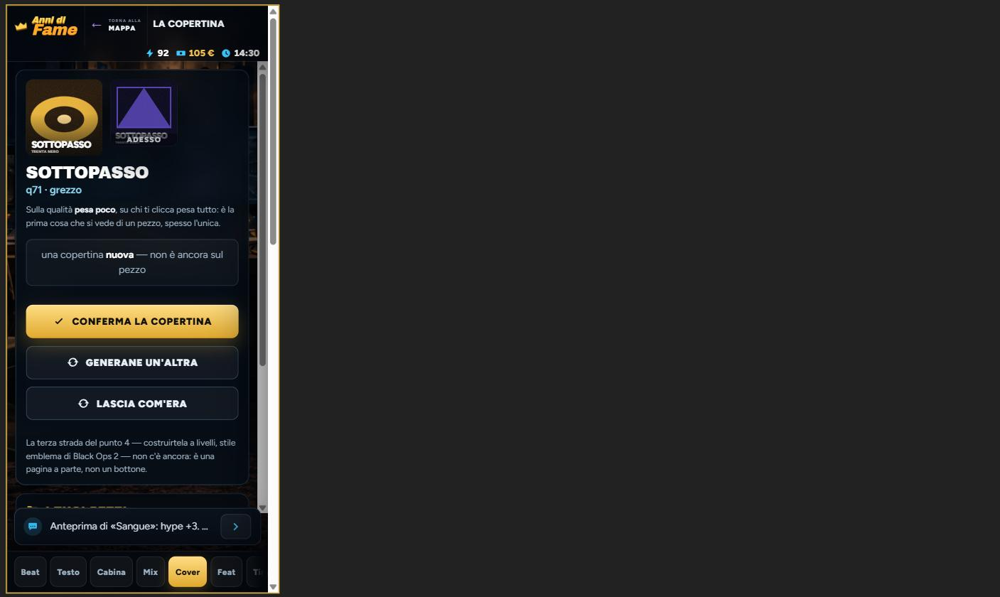
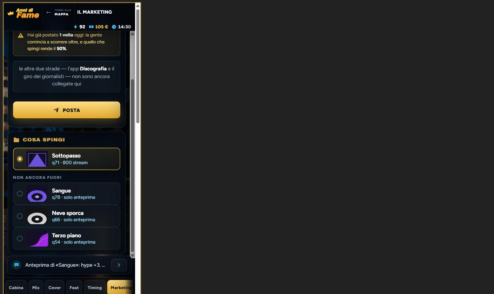
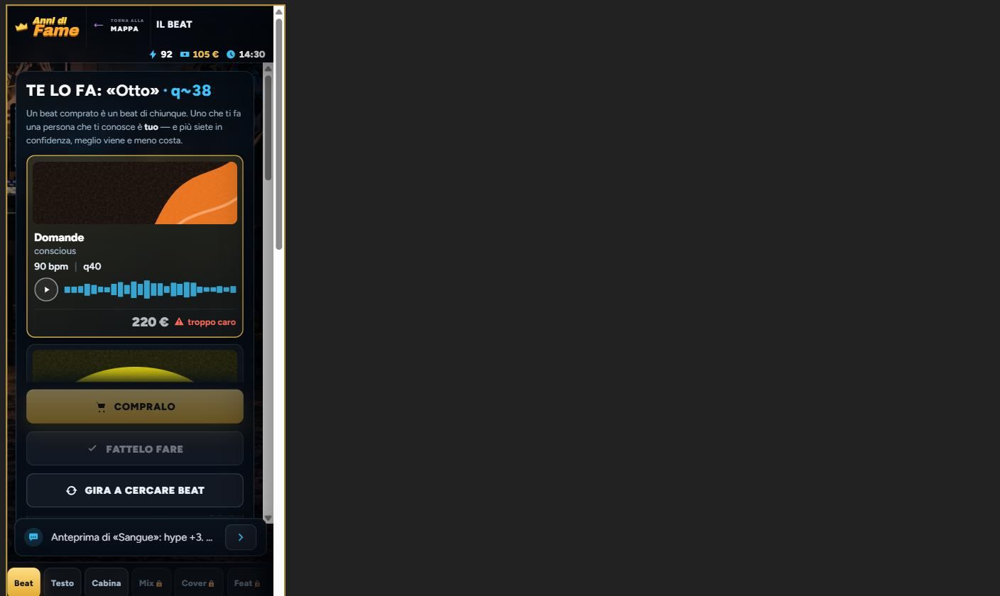

**RISOLTO (14/09/2026)** — `.toast` in `css/effects.css` ha `width:max-content` (col
tetto `max-width` che c'era già): `left:50%` da solo gli lasciava mezzo schermo. Vale per
tutti gli avvisi del gioco, non solo per questo.

### Sul telefono la copertina «grande» e quella «di adesso» sono quasi uguali, e l'etichetta copre il titolo

- **dove** — `frontend/css/stretto.css:220` (`.stcopertina{width:110px;height:110px}`
  sotto i 520) contro `frontend/css/studio.css:225`
  (`.stcopertina.stprima{...width:96px;height:96px}`), e `studio.css:226-228` per la
  fascia «adesso».
- **cosa succede** — sul computer la proposta è 180 e quella di adesso 96: si capisce al
  volo qual è la nuova. Sotto i 520 la proposta scende a 110 ma `.stprima` resta a 96
  (ha due classi, vince sempre): 110 contro 96, si vede a malapena chi è la grande, e la
  gerarchia «al centro lei, accanto quella di adesso» si perde. In più la fascia scura con
  scritto «ADESSO» sta in fondo alla copertina piccola, esattamente dove la copertina
  generata scrive il titolo del pezzo: i due testi si sovrappongono e non si legge né
  l'uno né l'altro (questo a tutte le misure, anche sul computer).
- **come si vede** — 390 × 844 o 360 × 800, Cover, «Generane un'altra»: guarda le due
  copertine in alto.
  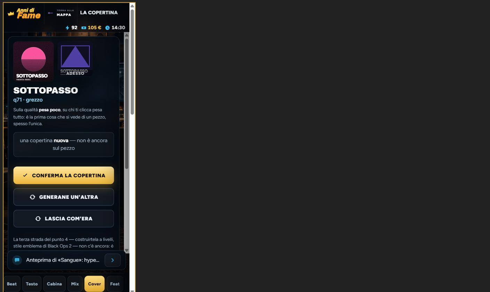
- **quanto pesa** — si vede ma si gira intorno (c'è comunque l'etichetta e c'è il
  riquadro «non è ancora sul pezzo»). Da sistemare con calma.

**APERTO, di proposito** — non è di oggi: è come sono impilate le colonne sotto i 980 punti
(`stretto.css`, il centro prima di tutto) e vale per ogni sezione con un elenco a sinistra
(Cabina, Mix, Timing). Scorrere in cima a ogni tocco sarebbe una scelta di navigazione per
tutto lo Studio, e va decisa una volta, non da dentro questa task.

### Nel Marketing tocchi un pezzo in fondo e la risposta compare in cima, fuori dallo schermo

- **dove** — `frontend/css/stretto.css:185-186` (`.stmid{order:1}` e `.stsx{order:2}`:
  sul telefono il centro sta sopra e gli elenchi sotto) con `frontend/js/game/studio.js:202-209`
  (`studioSegna` → `renderStudio()`, che ridisegna senza toccare lo scorrimento).
- **cosa succede** — per arrivare a «Non ancora fuori» devi scorrere in fondo; tocchi
  «Sangue» e il pannello che cambia («ANTEPRIMA: «Sangue» · q78» col suo testo) è quello
  sopra, che a quel punto sta sotto alla fascia alta: a 390 il titolo è tagliato (si
  vede solo «q66» che spunta), a 360 sta a −28 px, cioè del tutto fuori. Il tasto d'oro
  resta in vista in tutti e due i casi perché il pannello dell'anteprima è corto, ma
  quello che ti dice *cosa* stai per fare non lo vedi finché non risali. Con la Promo
  (pannello più lungo) resta in vista ancora meno.
- **come si vede** — 390 × 844, un pezzo fuori e tre no, Marketing, scorri in fondo e
  tocca un pezzo di «Non ancora fuori».
  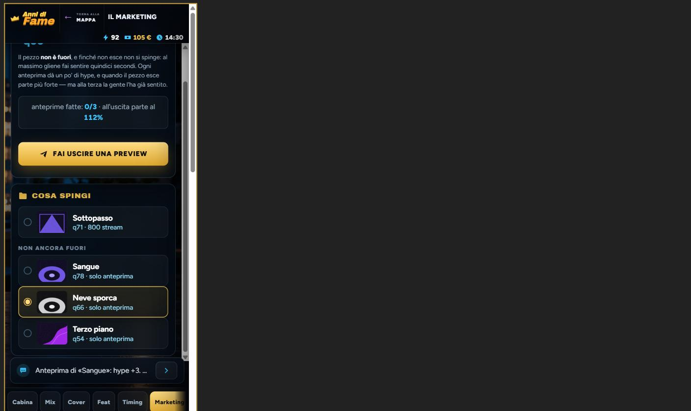
  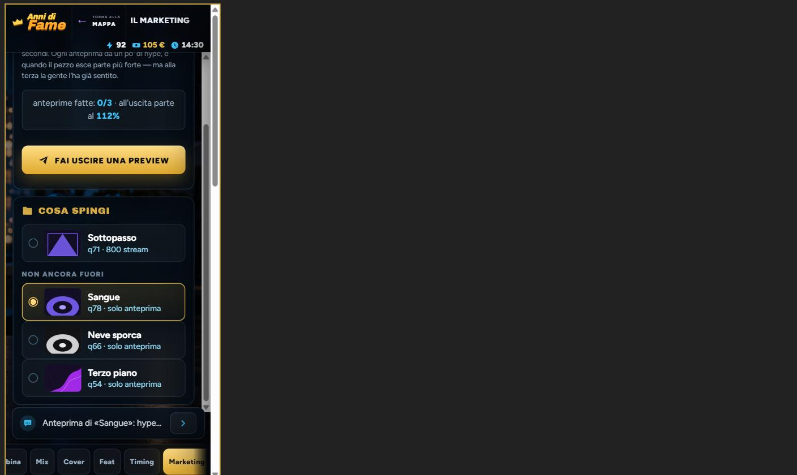
- **quanto pesa** — si vede ma si gira intorno: la riga si accende d'oro e il pollice sa
  che ha toccato. Ma è lo stesso problema per Mix, Timing e Cover (tutti gli elenchi
  che stanno sotto al centro). Da sistemare con calma.

**APERTO, di proposito** — è lo stesso `stCapo()` di tutte le sezioni («SPINGI: «Sottopasso»
· q71», «MIXI: …»): il numero va a capo da solo con qualunque titolo lungo, non solo qui.
Si sistema in `stCapo` per tutte insieme, con `white-space:nowrap` sul numero e il titolo
che si accorcia — non l'ho fatto in questa task per non toccare otto schermate all'ultimo.

---

## Prova sul telefono del 15/09/2026 (il telefono che si alza)

Misure: **390 × 844**, **360 × 800** e **844 × 390** (orizzontale). Branch
`task/telefono-sul-telefono`, commit `d97e8de`. Partita di prova di `gioco.html` (giorno 1,
nessun pezzo), e per «Che post fai?» con l'elenco e il tasto «Posta» una partita con tre
pezzi usciti («Sottopasso», «Terzo piano», «Neve sporca sul marciapiede di casa») e uno
registrato non uscito («Sangue»). Console senza errori in tutti i giri. Gli screenshot stanno
in `documentazione/prove-telefono/2026-09-15/`.

**Come l'ho provato, per riprovarlo.** L'estensione Chrome non era collegata: ho usato
Playwright da `frontend/node_modules`, con una finestra **davvero** di quella misura
(`viewport` 390 × 844, `isMobile`, `hasTouch`, scala 2): niente iframe e niente barra di
scorrimento del computer, quindi le misure qui sotto sono quelle di un telefono vero. I
tocchi sono `page.tap` (eventi touch), non click; ESC da tastiera. Le app le ho aperte con
`telVaiApp(...)` dopo aver alzato il telefono col tasto della barra. Il server era già acceso
su `localhost:8000`, non l'ho spento.

**Quello che funziona.** Il tasto nella barra è 44 × 44 a tutte e tre le misure, con la
pallina «9+»; toccato, `.ptel` prende `.on` e copre lo schermo (390 × 844 → guscio 366 × 741,
schermo 332 × 707; 360 × 800 → guscio 336 × 680). **Nessuno scorrimento orizzontale** in
nessuna delle tre misure, né della pagina (`scrollWidth` = `innerWidth`) né dello schermo
del telefono in verticale. La griglia: 11 icone da 65 (59 a 360), etichette non tagliate,
nessuna fuori; il dock 4 icone da 60 (55). «Metti giù» è 138 × 44, sta sotto al guscio e
dentro allo schermo (a 390 finisce a 820 su 844; a 360 a 767 su 800; in orizzontale a 378
su 390), e mette giù; il tocco fuori dal guscio (touch, sul fondale) mette giù; ESC con
un'app aperta torna alla home, il secondo ESC mette giù e il menu di sistema **non** si apre.
La pastiglia del tempo sparisce col telefono alzato (`visibility:hidden`). LaFamegram: «Che
post fai?» in cima, l'elenco dei pezzi con «scelto», il tocco su un pezzo lo sceglie
(`G.studio.spingi`), «Posta · 12⚡» (295 × 38) fa l'azione (hype 0 → 7,4, scena «Promo sui
social» sopra al telefono, che sotto resta alzato su LaFamegram dopo «Continua»); la
casella «A cosa stai pensando?» e «Pubblica» ci sono. Sputa: casella, contatore (24/140 mentre
scrivo) e tasto «Sputa» che pubblica (il post «Tu · oggi» compare in cima, con l'avviso «Prima
barra del giorno»). Chat: due righe da 52 di altezza, la chat si apre, il tasto indietro
c'è. Dallo Studio (Fuori) «fallo sapere: «Sottopasso» è fuori…» (388 × 44) alza il telefono
su LaFamegram e chiude lo Studio; «Metti giù» da lì riporta alla plancia.

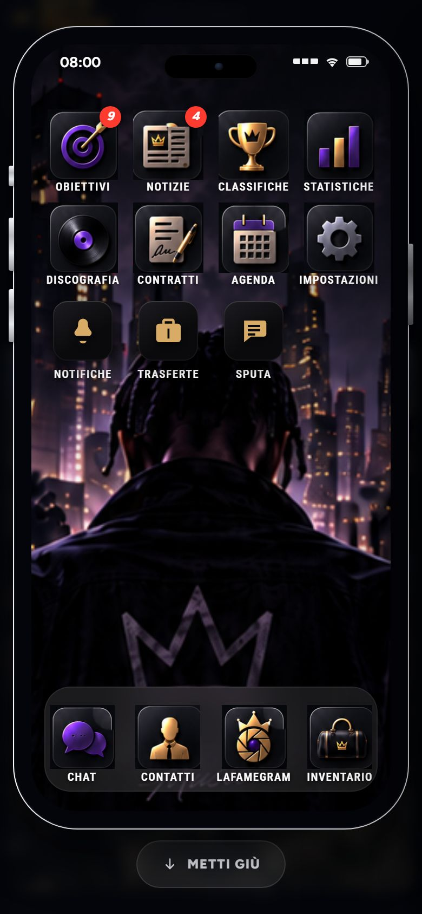
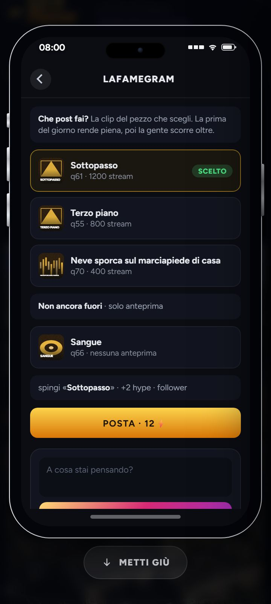
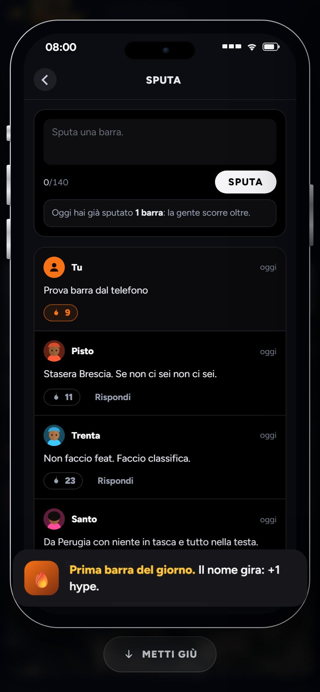

### In orizzontale (844 × 390) il telefono alzato è un francobollo: 154 di larghezza, icone da 27, etichette che si accavallano

- **dove** — `frontend/css/telefono-stretto.css:56-71`:
  `--telalto:calc(100dvh - 24px - 54px …)` e `--tellargo:min(100vw - 24px, var(--telalto) * .494)`,
  con `.ptelframe{aspect-ratio:676/1369}`. Il guscio è alto quanto lo schermo e largo di
  conseguenza: con 390 di altezza viene **154 × 312**, schermo interno 138 × 296.
- **cosa succede** — dentro a 138 punti le misure in `cqw` scendono al minimo dei `clamp`
  (icone 27 × 27, etichette a 7 px: `telefono.css:176-178`) e quelle fisse in px no: le
  etichette «CLASSIFICHE» e «STATISTICHE», «DISCOGRAFIA CONTRATTI AGENDA IMPOSTAZIONI»,
  «NOTIFICHE TRASFERTE» si scrivono una sopra all'altra (`white-space:nowrap;overflow:visible`);
  il titolo dell'app si legge «LAFAMEGRAN»; il tasto «Sputa» (75 × 28, `telefono.css:362`) sta
  in una colonna da 90 e tocca il bordo; lo schermo del telefono ha 5 punti di roba fuori
  (`#hb-tel` `scrollWidth` 143 su 138: etichette, «Rispondi», «Settimana 3»), tagliati da
  `overflow-x:hidden`. Il guscio **sta dentro allo schermo** (era la cosa da verificare: sì,
  non esce) e «Metti giù» si raggiunge — ma non si usa niente di quello che c'è dentro:
  nessuna icona arriva a 44, la home è 131 px di griglia e Sputa mostra tre righe e mezzo.
- **come si vede** — 844 × 390, plancia, tocca il telefono in barra; poi Sputa.
  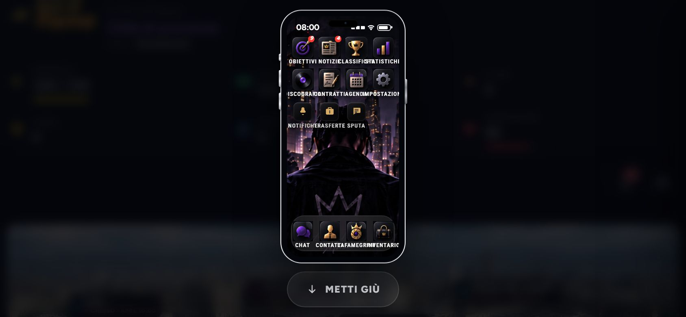
  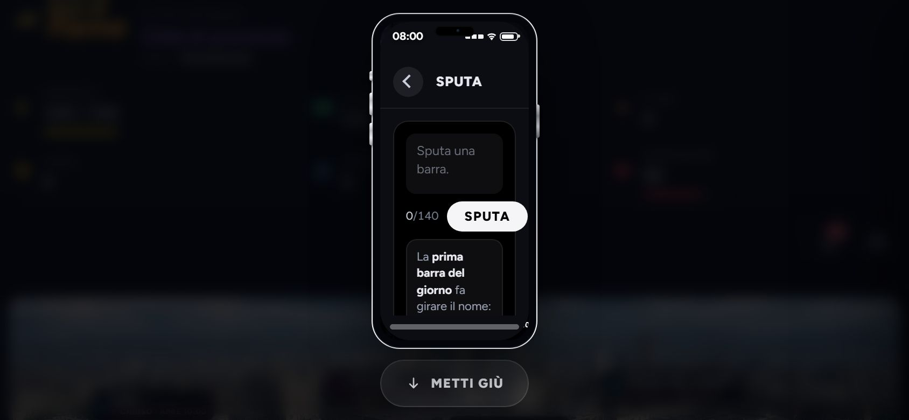
- **quanto pesa** — in orizzontale il telefono **non serve**: si apre, si chiude, ma non ci
  si fa niente. Se il gioco sugli store gira solo in verticale (da decidere: nel repo non c'è nessun
  manifest né un `orientation` dichiarato), è un problema che non c'è; se gira anche in orizzontale, il
  guscio con le proporzioni dell'iPhone non ci sta, e lì il telefono va disegnato senza
  cornice (schermo largo quanto serve, senza `aspect-ratio`) o non va offerto.

**RISOLTO in parte (15/09/2026)** — sullo stesso branch, prima del push. Sotto i 560 di altezza il guscio lascia le
proporzioni dell'iPhone: largo fino a 560, alto quanto c'è, la home scorre (`telefono-stretto.css`,
l'ultima media query). A 844 × 390 viene 560 × 312, icone da 99, i tasti dentro da 44: si usa.
**Resta la decisione** se il gioco sugli store gira anche di traverso: finché non c'è, di traverso
si usa così.

---

## Giro del 20/09/2026 (prova-sul-telefono, fine task `task/barra-plancia-980-1180`, commit `c4d9f77`)

Misure: **390 × 844** (telefono verticale), **844 × 390** (di traverso), **1024 × 768**,
**1100 × 800**, **1280 × 800**, **1366 × 768**; in più **360 × 640** (il piccolo vero) e
i quattro confini della fascia, **979/981** e **1240/1241**. Branch
`task/barra-plancia-980-1180`, commit `c4d9f77`. Partita di prova di `gioco.html` (giorno 1,
nessun pezzo). Gli screenshot stanno in `documentazione/prove-telefono/2026-09-20/`.

**Come l'ho provato, per riprovarlo.** L'estensione Chrome non era collegata: ho usato
Playwright da `frontend/node_modules` con una finestra di quella misura (`viewport`,
`hasTouch` sotto i 900), su ognuna la plancia e poi Sala (`apriPosto()`), Shop
(`HUB_LUOGHI` → `shop`), Piazza (`apriPiazza()`) e Studio (`apriStudio("cabina")`), con
la console registrata. Per ogni schermata ho misurato `scrollWidth` contro `clientWidth`
della pagina, la fascia e i suoi figli (chi esce dallo schermo, chi si sovrappone, chi ha
il testo più largo della casella), e la misura di Menu, tasto del telefono e marchio. Il
**Negozio non si può aprire**: `#negozio` non esiste in `gioco.html` (`negozio.js` è
dormiente, «ADF_ABBIGLIAMENTO_HIBERNATE_V2»), quindi le regole nuove per `.nghead`
(`stretto.css:783-806`) non toccano niente e la testata del Negozio non l'ho potuta
guardare. Il server l'ho acceso io su `localhost:8000` e l'ho spento alla fine.

**Quello che funziona.** **Nessuna delle 31 schermate scorre di lato** (`scrollWidth` =
`clientWidth` a tutte le misure, plancia e quattro luoghi compresi). A 390 e a 360 la
fascia è tre righe da 159: marchio 96 × 44, pastiglia ai sette decimi, telefono 44 × 44,
Menu 43 × 44, la città e la fase su una riga, le sei risorse su tre colonne e due righe,
niente che si accavalla. A 981 la fascia sta su una riga (72) con tutto dentro, a 979 va a
capo (148) con le risorse sotto; a 1240 il Menu è la sola casetta (51), a 1241 torna la
parola (107). Sala, Shop e Piazza sotto i 620 hanno la sola corona (44 × 58) con il titolo
subito dopo, MAPPA se n'è andato e la X resta; a 844 × 390 e sopra il marchio pieno e TORNA
ALLA MAPPA ci stanno. Lo Studio a 390 tiene marchio, TORNA ALLA MAPPA e «LA CABINA» su una
riga, con le risorse sotto. Le card degli eventi a 1024–1366 stanno su due righe e due
colonne con la settimana a destra. Console pulita sulla plancia, in Sala, Shop e Studio.

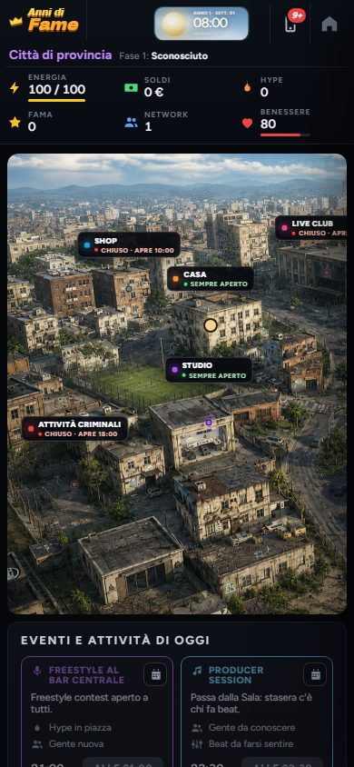
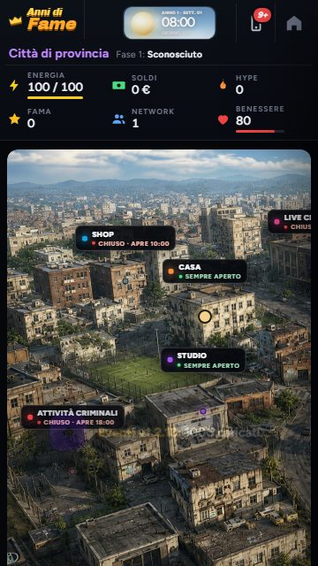
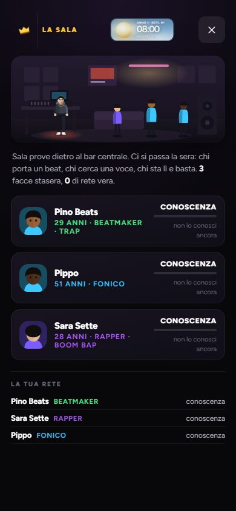
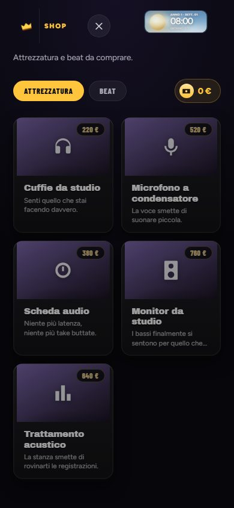
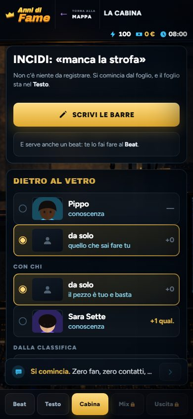

### Di traverso la fascia si prende 144 punti su 390: la città resta in 246

- **dove** — `frontend/css/stretto.css:399-478` (`@media (max-width:980px)`, la fascia su
  due righe): 844 × 390 ricade nella fascia del tablet stretto, non in quella del
  telefono, e le righe sono da 72 e 55.
- **cosa succede** — la fascia è il 37% dello schermo; della mappa si vede la prima
  fila di cartelli (Shop, Live Club, Centro per l'impiego, La Sala, Casa) e lo Studio è
  tagliato a metà sul bordo. Si scorre, ma la prima schermata è quasi tutta fascia.
- **come si vede** — plancia a 844 × 390.
- **quanto pesa** — basso: l'orizzontale è un punto ancora aperto (memoria
  «Responsività da finire»), lo segno perché la task ha rifatto proprio la fascia.
- **Aperta di proposito** — è la voce 9: prima si decide se il gioco sugli store gira di
  traverso, poi la fascia orizzontale avrà il suo disegno.

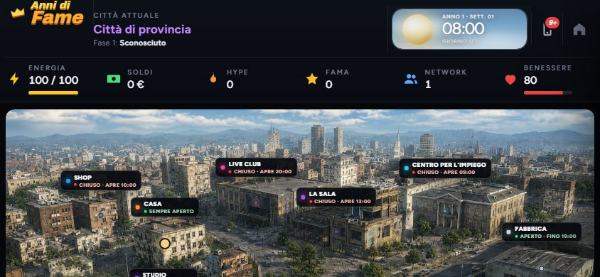

---

## Giro del 27/09/2026 (tutto il repository, più un anno di gioco simulato)

Branch `task/giro-controllo-un-anno`, base `origin/main` a `a9e3233`. Prima tutte le prove
che ci sono, poi un bot che gioca un anno intero nel browser come farebbe un giocatore: si
cerca un lavoro e ci va, scrive due strofe al giorno, cerca e compra i beat, fa la take in
cabina, registra, mixa, pubblica, fa promo, serate, freestyle, palestra e «stacca la
spina» quando il benessere scende; agli eventi risponde a caso, e chiude la giornata con
`ADF_TIME_SKIP(1)`, cioè la stessa strada del «+1». A ogni giorno controlla che i numeri
della partita siano numeri e stiano nei loro limiti, e segna ogni errore JavaScript, ogni
messaggio d'errore in console e ogni volta che il calendario non si muove.

**Le prove che ci sono**

| cosa | esito |
|---|---|
| `npm run verifica` sulla base | **rosso**: `npm run prova` passa, `audit-regressioni.js` fa 443 ok e 1 fallito (voce 56 qui sotto). La catena si ferma lì |
| `npm run test:unit` (lanciato a parte) | 39 su 39 |
| `npm run test:e2e` (lanciato a parte) | 3 su 3 |
| `npm run verifica:build` | a posto; resta l'avviso già noto dei caratteri da Google Fonts |
| `npm run verifica:dipendenze` | 0 vulnerabilità, frontend e backend |
| `backend`: `npm run prova` | 192 a posto, 0 no |
| `npx eslint js` | non gira: manca `eslint.config.js`, già scritto in `documentazione/dipendenze.md` |

**L'anno simulato**

Due partite complete da 364 giorni (semi 1 e 7), più tre da 150 giorni per cercare di far
tornare il blocco della voce 54, più le prove mirate su quello che la lettura del codice
faceva sospettare (carcere, contratto, salto di sette giorni, fine anno, debiti,
salvataggio vecchio). In tutto circa 1.200 giorni di gioco.

| a fine anno | seme 1 | seme 7 |
|---|---|---|
| fan | 25.729 | 70.791 |
| fase | 2, Rapper emergente | 3, Rapper |
| pezzi usciti | 61 | 102 |
| stream nell'ultima settimana | 47.932 | 294.604 |
| migliore posizione | #2 | #1 |
| soldi | 112 € | 1.581 € |
| hype / benessere / lucidità | 45 / 61 / 99 | 61 / 49 / 96 |
| scrittura / flow / presenza / rete | 75 / 48 / 70 / 50 | 88 / 59 / 67 / 59 |
| salvataggio | 217 KB | 244 KB |
| errori JavaScript | 0 | 0 |
| numeri rotti (NaN, fuori limite) | 0 | 0 |
| giorni in cui il «+1» non andava | 1 | 21 |

Il salvataggio si rilegge dopo un ricaricamento, e il passaggio all'anno 2 (settimana 52 →
anno 2, età 20) è giusto. Nessun errore in console nelle partite normali: gli errori veri
sono usciti tutti dai casi che la partita normale tocca di rado.

Il bot non tiene conto degli orari quanto un giocatore (prova il turno da lavapiatti di
mattina, il live club prima che apra): i rifiuti per «arrival-closed» e «energia» nei suoi
conti sono suoi, non del gioco, e qui non sono segnati.

### Da decidere (non sono bug)

- **In carcere le spese si pagano 1,6 volte**: `advanceWeek()` toglie le spese intere, poi
  `stradaSettimana()` (`strada-crimine.js:724`) toglie un altro 60%; il resoconto mostra
  solo le prime. Se è voluto va scritto nel resoconto, se no è un doppio conto.
- **Tre settimane dentro e perdi il lavoro**: in carcere il turno non si può fare e
  `advanceWeek()` conta le settimane saltate come assenze. Col barista e tre settimane di
  pena si esce disoccupati. Può essere giusto; oggi non lo dice nessuno.
- **I numeri dopo un anno**, da tenere presenti quando si bilancia:
  - la lucidità resta fra 96 e 99 tutto l'anno con una routine normale (scrivere, la
    palestra): non morde mai. Non è una proposta di toglierla (vedi la decisione di
    Carlo del 21/09), è un dato;
  - la scrittura arriva a 87,8 su 88 entro l'anno col seme 7: il tetto delle abilità si
    tocca nel primo anno;
  - i soldi restano fra 100 e 600 € per tutto l'anno anche con 294.000 stream a
    settimana: il lavoro non diventa mai facoltativo senza contratto;
  - non c'è una fine: 5.000 € di debito per due mesi abbassano solo il benessere, e
    `G.ended` non viene mai messo a `true` in tutto il codice;
  - le spese crescono di 2 € a settimana per ogni pezzo mai registrato
    (`weeklyCosts()`): con 102 pezzi sono 204 € fissi.

---

## Giro del 29/09/2026 (il simulatore di bilanciamento, sei carriere da un anno)

Branch `task/simulatore-bilanciamento`. `npm run bilanciamento -- --carriere 6`: sei carriere
da 364 giorni **una dopo l'altra**, una per strategia, col bot del giro del 27/09 dentro al
browser vero. 35 minuti in tutto, **nessun errore JS, nessuna invariante saltata, nessun
giorno che non si chiude**. Il rapporto intero è in
`frontend/test-results/bilanciamento-sei/rapporto.md` (non va su git: si rifà col comando,
con `--uscita test-results/bilanciamento-sei`).

| a fine anno | musicista | lavoratore | promo | criminale | fermo | caso |
|---|---|---|---|---|---|---|
| fan | 28.321 | 7.654 | 56.210 | 98 | 1.066 | 113 |
| soldi | 537 € | 346 € | 564 € | −1.129 € | 897 € | 194 € |
| fase | 2 | 1 | 2 | 0 | 0 | 0 |
| pezzi usciti | 81 | 26 | 103 | 3 | 0 | 0 |
| minuti per l'anno | 8 | 13 | 6 | 2,5 | 3 | 2,5 |

È **una carriera per strategia**: le voci sotto sono indizi da riprovare su un centinaio
(una notte di `npm run bilanciamento`), non verdetti. Nessuna blocca la partita.

### Il crimine non paga mai
- **cosa succede** — il criminale chiude a −1.129 € e passa **300 giorni su 364 in carcere**:
  18 colpi, 9 arresti. Per 47 volte il colpo non parte perché «troppo caldo». Anche la
  strategia a caso, che ogni tanto ruba, sta dentro 256 giorni. Un arresto ogni due colpi.
- **quanto pesa** — da decidere: la Strada oggi è solo un modo di perdere soldi e tempo.

### Lavorare non rende
- **cosa succede** — chi fa il turno ogni giorno arriva a circa 3.800 € a metà anno e poi
  scende a **346 €** a fine anno; chi sta fermo chiude con **897 €**. Il lavoratore finisce
  anche con la lucidità a 1 (gli altri fra 74 e 99).
- **quanto pesa** — da decidere: guardare dove vanno i soldi nella seconda metà (beat
  comprati, spese dei pezzi della voce 61).

### La giornata rallenta per chi lavora e chi spinge la promo
- **cosa succede** — una giornata del bot (le sue mosse, le attese e il «+1») passa da 0,7 a
  **3,3 secondi** per il lavoratore e da 0,7 a 2 per la promo; le altre strategie restano
  ferme sotto il secondo. Il lavoratore è anche quello che aspetta di più (726 attese), quindi
  può essere il bot e non il gioco: il «+1» da solo ora si misura a parte (giro sotto).
- **quanto pesa** — da guardare col «+1» da solo: se cresce lui, è la pista per i giorni che
  in parallelo non tornavano più.

### L'hype sta al tetto
- **cosa succede** — il musicista ha l'hype al tetto della sua fase nel **63% delle
  settimane**: la curva non conta, conta il tetto.
- **quanto pesa** — da decidere.

### Nessun contratto in un anno
- **cosa succede** — nessuna delle sei firma un contratto, neanche la promo con 56.210 fan
  e un primo posto in classifica.
- **quanto pesa** — da decidere se è voluto per il primo anno.

### Le abilità al tetto in un anno
- **cosa succede** — scrittura 86,7 (lavoratore) e 88 (promo), presenza 85 (promo): il tetto
  è 88. È la stessa cosa della voce 61, qui misurata su più strategie.

### Nota, non è un errore: la strategia a caso non pubblica mai
- **cosa succede** — il rapporto dice «azioni che non partono mai» per live, anteprima,
  pubblica, mixa e registra della strategia a caso. È il bot: prova a pubblicare senza
  tracce, e il gioco giustamente dice di no («manca 1 traccia»). Da togliere dai sospetti del
  rapporto quando il perché è un requisito che manca.

---

## Giro del 29/09/2026 (segnala-problemi, fine task `task/simulatore-bilanciamento`, commit `47eae1d`)

Giro stretto sul simulatore: runner, bot, rapporto, test, i controlli nuovi dell'audit e
quello che dicono di lui questo file e la roadmap. `npm run verifica` era già verde e non
l'ho rilanciata; il simulatore non l'ho fatto girare (dura ore). Ho letto il bot riga per
riga contro il gioco: **tutte le funzioni che chiama esistono, coi nomi e gli argomenti
giusti** (azioni, spostamenti, orari, Strada, Studio, fine giornata), e anche le finestre
che chiude esistono. I numeri scritti nel giro del 29/09 qui sopra combaciano con
`test-results/bilanciamento-sei/rapporto.md`. Le opzioni in testa al runner combaciano col
codice (`--lavoratori` 1, `--uscita` dentro `frontend/`, che git ignora). Nessuna delle voci
sotto blocca la partita: sono tutte sullo strumento e su come si leggono i suoi numeri.

### «Lavorare non rende» è in buona parte il modo in cui gioca il bot
- **dove** — `frontend/strumenti/bilanciamento/bot.js:203`, confrontato da
  `frontend/strumenti/bilanciamento/rapporto.js:119`
- **cosa succede** — il lavoratore fa il turno ogni giorno e poi, quando arriva in studio, è
  troppo tardi: registra 100 pezzi (50 € di sala l'uno, più 99 beat comprati) ma ne pubblica
  26, e si vede rifiutare «pubblica» per 152 volte perché la giornata è finita. I pezzi mai
  usciti restano e costano ogni settimana (è la voce 61). Il confronto è con `fermo`, che non
  spende niente in musica: così il sospetto misura la strategia che spreca, non il lavoro che
  rende poco. È lo stesso tipo di falso sospetto della «strategia a caso che non pubblica
  mai», già segnata.
- **come si vede** — nel rapporto dei sei, le azioni e i rifiuti del lavoratore.
- **quanto pesa** — da sistemare con calma.
- **RISOLTO in parte (29/09/2026)** — stesso branch: il lavoratore del bot mixa e pubblica
  prima del turno, non dopo. Il sospetto nel rapporto resta: se anche così chi lavora chiude
  sotto chi sta fermo, allora è il gioco. Il numero rifatto è nel giro dei sei.

---

## Giro del 29/09/2026 (segnala-problemi, giro stretto sul commit `81104f5`, i chiusi in `problemi-risolti.md`)

Solo documentazione, nessun file del gioco toccato; la verifica era già verde e non l'ho
rilanciata. **Il passaggio non ha perso testo**: ho messo a confronto, parola per parola, il
foglio com'era prima (`git show HEAD~1:…`) con la somma dei due fogli nuovi. Mancano solo la
riga «Tutto il resto, da qui in giù, è chiuso» e i numeri dell'indice scritti `1.` invece
di `**1.**`, cioè cambi voluti. **Nessuna voce aperta è finita fra le risolte**: le cinque
dell'indice (7, 9, 10, 61, 65) e i 14 dettagli dei loro giri stanno in questo foglio. Ogni
voce `###` passata di là ha il suo RISOLTO, una RISPOSTA, è una nota oppure è chiusa
dall'indice o da un blocco di chiusura del suo giro, con due eccezioni (la prima voce qui
sotto). Anche in `implementazioni.md` ogni punto rimasto è ancora da fare o fatto in parte,
e in `fatte.md` non c'è niente di aperto. Le cose che non tornano sono sei, tutte nei
documenti.

### «Via la lucidità» è ancora fra i lavori da fare, anche se Carlo ha deciso che la lucidità resta
- **dove** — `implementazioni/implementazioni.md:97-101` (voce 3 di «Da fare adesso») e
  `:343` (CARLO 8), `documentazione/problemi-riscontrati.md:15-17` (voce 7), contro
  `documentazione/problemi-riscontrati.md:30` (voce 61: «la lucidità resta, decisione di
  Carlo del 21/09»)
- **cosa succede** — i due fogli ripuliti adesso sono corti e si leggono tutti d'un fiato,
  e proprio per questo si nota che si contraddicono. La voce 61 dice che la lucidità resta
  e va resa più incisiva, non tolta. La voce 3 dell'ordine dice «Via la lucidità», e la
  voce 7 di questo foglio dice che l'uscita di venerdì «sparisce del tutto» con quel
  lavoro. Chi prende la prossima voce dell'elenco si mette a togliere una cosa che Carlo
  vuole tenere. **È una scelta, non un errore**: va deciso se il punto CARLO 8 si chiude
  con una RISPOSTA, e allora la voce 3 esce dall'ordine e la 7 va riscritta.
- **come si vede** — leggi le tre righe una dopo l'altra.
- **quanto pesa** — da sistemare con calma.

### Due voci passate fra le risolte senza un RISOLTO sotto, e due punti nuovi di CARLO fuori dall'ordine
- **dove** — `documentazione/problemi-risolti.md:3336` e `:3360` (giro del 15/09 su
  `task/sistema-il-foglio-dei-punti-nuovi`); `implementazioni/implementazioni.md:358` e `:360`
  (CARLO 12, il recap giornaliero, e CARLO 13, le trasferte fin dalla prima città)
- **cosa succede** — le due voci del 15/09 («"Cosa resta aperto" dice che il suo ordine è
  lo stesso…» e «L'hover al tocco è chiuso dall'08/09, ma tre elenchi…») nei fatti sono
  chiuse: la premessa dell'indice è stata riscritta, e l'hover è la voce 3 barrata. Però
  sotto non hanno la loro riga RISOLTO, e sono le uniche del file. I due punti di CARLO
  aggiunti il 29/09 (commit `36ab184`) sono giustamente fra gli aperti, ma non stanno né
  nell'elenco di «Da fare adesso» né in «Restano fuori dall'ordine». Non è colpa di
  questo commit.
- **come si vede** — leggi le due voci fino al giro successivo; cerca «recap» in «Da fare
  adesso».
- **quanto pesa** — da sistemare con calma.
- **RISOLTO in parte (29/09/2026)** — stesso branch: le due voci del 15/09 in `problemi-risolti.md` hanno la loro riga RISOLTO. Resta dove mettere CARLO 12 e 13 nell'ordine di «Da fare adesso»: è una scelta di priorità (voce 67).
